# 摘要

终于是把learn-claude-code学完了，整体了解一个agent的构建过程。根据这个教程的观点，agent=agency+harness。如何理解这两个内容？agency是agent的感知、推理、行动的能力，源自大模型LLM的训练，harness则是代码编排，为模型提供一个可操作的环境。所以，当我们说自己是agent工程师的时候，一般来说，都是在说我们是harness工程师。~~另外一个会自己叫大模型工程师。~~

那什么是harness呢，harness是agent在特定领域工作所需要的一切内容，为模型提供一个可直接运转的环境，作为agency的副作用。以claude code为例：

```
claude code = agent loop + 工具系统 + 渐进式披露的skill + 上下文压缩机制 + 子agent派生机制 + 带图依赖的任务系统 + 异步邮箱的团队协调 + worktree隔离的并行执行 + 权限治理。
```

这就是claude code的全部~~缩减版~~架构。每一个组件都是 harness 机制 -- 为 agent 构建的与世界交互的一部分。Agent 本身呢？是 Claude。一个模型。由 Anthropic 在人类推理和代码的全部广度上训练而成。Harness 没有让 Claude 变聪明。Claude 本来就聪明。Harness 给了 Claude 双手、双眼和一个工作空间。下面，我们来拆解每一个组件。

# 目录

- [数据结构](#数据结构)
- [agent loop (ReAct)](#agent-loop-react)
- [工具系统](#工具系统)
- [渐进式披露的 skill 加载机制](#渐进式披露的-skill-加载机制)
- [上下文压缩](#上下文压缩)
- [规划：让模型不跑偏](#规划让模型不跑偏)
  - [TodoManager](#todomanager)
  - [任务系统](#任务系统)
- [拆分层](#拆分层)
  - [subagent](#subagent)
  - [后台任务](#后台任务)
- [协作层：多agent](#协作层多agent)
  - [agent团队](#agent团队)
  - [团队协议](#团队协议)
  - [自主agent](#自主agent)
  - [工作空间隔离](#工作空间隔离)
- [架构总览](#架构总览)

# 数据结构

在拆解组件前，我们对模型一次调用的数据结构做一个分析，这样有利于我们对后续代码的理解。我们主要要理解这几种数据结构：messages、response、block、results。

速查：
```
messages格式：[{"role":"user","content":string},
              {"role":"assistant","content":list(TextBlock|ToolUseBlock)},
              {"role":"user","content":list(toolResult)}]
response格式：{"id":,"type":,"role","model":,"usage":,"content":,"stop_reason":}
block格式：TextBlock(type,text)
          ToolUseBlock(type,id,name,input)
use_result格式：{"type":,"tool_use_id":,"content":}
```

## messages

messages 是一个数组，是 LLM 的完整对话历史。每次调用 client.messages.create() 都把整个数组传进去。每个元素结构固定：

```
{"role": "user" | "assistant", "content": ...}
```

content 的三种形态：

① user + 字符串（普通用户输入）
```
{"role": "user", "content": "帮我列出文件"}
```

② assistant + block 列表（模型输出）：content 是 **SDK 返回**的 Python 对象列表，有两种 block：
```
{
  "role": "assistant",
  "content": [
    TextBlock(type="text", text="好的，我来查看。"),
    ToolUseBlock(type="tool_use", id="toolu_abc", name="bash", input={"command": "ls"})
  ]
}
```
两种 block 可以同时存在，也可以只有其中一种。

③ user + tool_result 列表（工具执行结果）：这是 harness 构造的，不是用户输入。用 role: "user" 是 API 的规定：
```
{
  "role": "user",
  "content": [
    {
      "type": "tool_result",
      "tool_use_id": "toolu_abc",   # 对应 ToolUseBlock.id
      "content": "file1.txt\nfile2.txt"
    }
  ]
}
```

一轮对话后 messages 的完整状态：

1. 用户原始输入：
```
{"role": "user", "content": "帮我列出文件"}
```

2. 模型决定调用工具：
```
{"role": "assistant", "content": [
  TextBlock(text="好的，我来查看。"),
  ToolUseBlock(type="tool_use", id="toolu_abc", name="bash", input={"command": "ls"})
]}
```

3. harness 把工具结果返还给模型：
```
{"role": "user", "content": [
  {"type": "tool_result", "tool_use_id": "toolu_abc", "content": "file1.txt\nfile2.txt"}
]}
```

4. 模型看到结果后给出最终回答（下一轮对话了）：
```
{"role": "assistant", "content": [
  TextBlock(text="当前目录有两个文件：file1.txt 和 file2.txt。")
]}
```

## response

response 是 client.messages.create() 的返回值，代表模型的一次完整输出。常用字段只有两个：

```python
response.stop_reason   # 本次停止的原因
response.content       # 模型输出的 block 列表
```

stop_reason 的两个值：

```python
"tool_use"   # 模型要调工具，agent loop 继续循环
"end_turn"   # 模型认为任务完成，agent loop 退出
```

这是整个 agent loop 的判断核心：

```python
if response.stop_reason != "tool_use":
    return   # 退出循环
```

## block

block 是 response.content 里的单个元素，有两种类型：

```
TextBlock — 模型的文字输出：
block.type  # "text"
block.text  # "好的，我来帮你查看..."

ToolUseBlock — 模型发出的工具调用请求：
block.type   # "tool_use"
block.id     # "toolu_abc123"   ← 唯一标识，用于和结果配对
block.name   # "bash"           ← 工具名，对应 TOOL_HANDLERS 的 key
block.input  # {"command": "ls"}  ← 传给工具的参数
```

遍历 block 是 agent loop 的核心处理逻辑：

```python
for block in response.content:
    if block.type == "tool_use":
        output = TOOL_HANDLERS[block.name](**block.input)
```

## results

results 是 harness 执行工具后构造的列表，格式由 Anthropic API 规定，必须严格遵守：

```python
results = []
for block in response.content:
    if block.type == "tool_use":
        output = TOOL_HANDLERS[block.name](**block.input)
        results.append({
            "type": "tool_result",
            "tool_use_id": block.id,   # 必须与 ToolUseBlock.id 一致
            "content": str(output)
        })
```

配对关系：

```
ToolUseBlock.id  ←──── 同一个 id ────→  tool_result.tool_use_id
  "toolu_abc"                              "toolu_abc"
```

模型通过 id 知道哪个结果对应哪次工具调用。一次响应里可以有多个 tool_use，harness 全部执行完，打包成一个 results 列表一起还回去。

```python
messages.append({"role": "user", "content": results})
```

把这四个结构在一轮里的流转串起来，就是 agency（LLM 决策）和 harness（执行）一次交接：

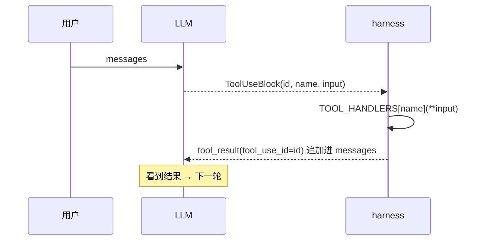

# agent loop (ReAct)

agent loop 是模型最简单的一个处理机制。其核心在于通过循环将模型的推理结果进行后处理，直到模型认为任务已经完成。

## 流程

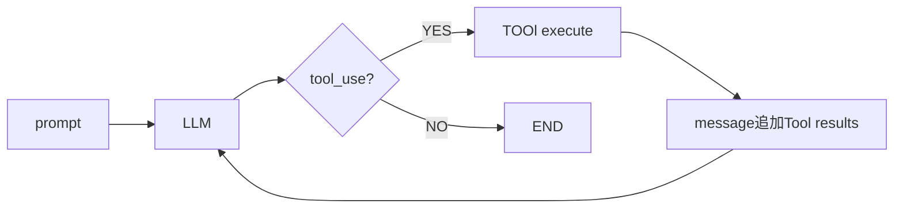

## 核心代码

```python
def agent_loop(messages: list):
    while True:
        response = client.messages.create(
            model=MODEL, system=SYSTEM, messages=messages,
            tools=TOOLS, max_tokens=8000,
        )
        messages.append({"role": "assistant", "content": response.content})
        if response.stop_reason != "tool_use":
            return
        results = []
        for block in response.content:
            if block.type == "tool_use":
                tool = TOOL_HANDLERS.get(block.name)
                result = tool(**block.input) if tool else f"未知工具：{block.name}"
                results.append({"type": "tool_result", "tool_use_id": block.id, "content": str(result)})
        messages.append({"role": "user", "content": results})
```

从代码里可以看到，模型只负责接收输入的信息，然后输出它判断的结果，harness 根据其是否需要工具调用，实现对工具的调用，然后将结果封装好给模型继续思考。对外看，agent 是拥有工具调用的能力。拆解开，其实是 LLM 决策 + harness 执行的结果。

# 工具系统

harness 的一大核心组件就是工具调用系统。在我们的输入中，我们可以提供 tools 列表给模型参考，提供其思考的语境，在其返回结果的 block.name 中，可以得到其想要调用的工具，最后通过 dispatch map 实现工具调用，并封装工具调用结果。

工具调用是非常方便的，是 agent 具备各种能力的工程基础之一。其关键优势在于非侵入式扩展：核心 loop 的代码始终不变，新增能力只需注册一个新函数到 TOOL_HANDLERS，并在 TOOLS 列表里补充对应的描述。这使得 agent 的能力可以横向无限叠加，而不需要修改任何已有逻辑。

## TOOLS

tools 是字典列表，提供工具的名称、描述、所需参数信息内容，这是提供给**模型思考**的：

```python
TOOLS = [
    {"name": "bash", "description": "Run a shell command.",
     "input_schema": {"type": "object", "properties": {"command": {"type": "string"}}, "required": ["command"]}},
    {"name": "read_file", "description": "Read file contents.",
     "input_schema": {"type": "object", "properties": {"path": {"type": "string"}, "limit": {"type": "integer"}}, "required": ["path"]}},
]
```

## TOOL_HANDLERS

dispatch map 是工具分发表，根据模型的响应快速找到对应工具执行。这是提供给 harness 使用的：

```python
TOOL_HANDLERS = {
    "bash":       lambda **kw: run_bash(kw["command"]),
    "read_file":  lambda **kw: run_read(kw["path"], kw.get("limit")),
}
```

在工具调用循环中，通过分发表获得工具快速执行，并包装结果：

```python
for block in response.content:
    if block.type == "tool_use":
        handler = TOOL_HANDLERS.get(block.name)
        output = handler(**block.input) if handler else f"Unknown tool: {block.name}"
        results.append({"type": "tool_result", "tool_use_id": block.id, "content": output})
messages.append({"role": "user", "content": results})
```

## 在 ReAct 架构中的位置

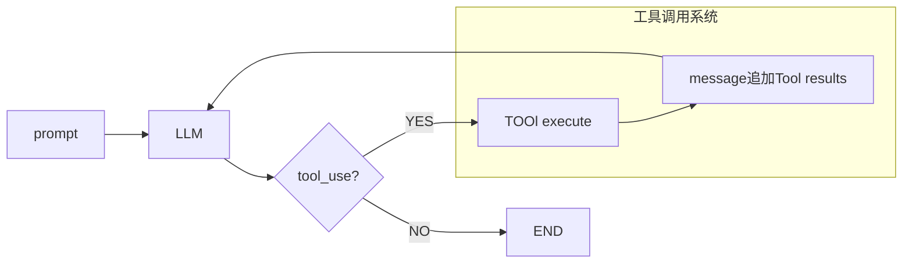

# 渐进式披露的 skill 加载机制

skill 是 claude code 的一个核心机制，通过将领域知识打包成文件的一种组织方法，提供模型一段专业知识、规范、模式。模型本身是具备通用能力的，但是缺乏特定领域的上下文，通过注入 skill，可以快速让模型掌握某个领域的规则。

skill 的前身是，我们可以将知识放在 system prompt 中，让模型可以直接读取这部分知识。但是，这里会有两个问题：一、过多的 skill 会导致 token 的大量浪费，system prompt 每次调用都会计入 token，即使没用到的技能，也会占用上下文消耗 token。二、上下文窗口变得拥挤。模型的上下文窗口是有限的，如果将大量的 skill 全量塞入，留给实际对话和工具调用结果的空间就会被压缩。因此，渐进式披露的思路是：告诉模型"有什么技能"，而不提前告诉模型"技能的内容是什么"。内容在需要使用的时候按需加载就好。

另外，skill 机制没有改变 agent loop 的任何一行代码，也没有改变工具分发的逻辑——它只是把"知识"也当成工具的返回值来处理。这就是非侵入式的体现：扩展知识和扩展工具用的是同一套机制。

## 两层设计

- **Layer 1 — 技能目录（system prompt 注入）**：在 system 中告诉模型"Available skills：python-patterns，golang-testing，..."。LLM 启动的时候就知道哪些技能可用，但不知道内容。
- **Layer 2 — 技能正文（tool_result 中）**：LLM 判断需要某个 skill 后，调用 load_skill(name)，harness 读取 skills/skill_name/SKILL.md 的正文，通过 tool_result 注入上下文，LLM 获得专业知识后继续工作。

## 目录结构

```
skills/
  ├── skill-name-1/
  │     └── SKILL.md
  └── skill-name-2/
        └── SKILL.md
```

单个 SKILL.md 内部由 meta 区域 + body 区域组成，用 `---` 分隔：

```
---
name:
description:
tags:（可选）
---
（正文内容）
---
```

## 加载流程
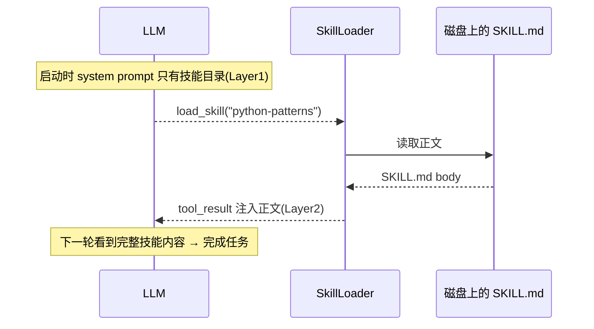


## SkillLoader 实现

SkillLoader 是连接两层结构的实现组件，skill 通过 `---` 分割 SKILL.md 的 meta 区域和 body 区域。

**初始化时**：扫描 skills/**/SKILL.md → 读取每个文件的元信息 → 建立内存索引 `{name: {meta, body, path}}`

**get_descriptions()**：返回所有技能的名称 + 一句话描述，注入 system prompt，形成 Layer 1（目录）

**get_content(name)**：从索引找到对应路径 → 读取完整 SKILL.md 正文，通过 tool_result 返回，形成 Layer 2（内容）

system prompt 中的 skill list 格式：
```
- python_patterns：Python 编码风格与常用模式
- sql_optimize：SQL 查询优化技巧
- git_workflow：Git 分支与提交规范
```

按需加载的代码实现：
```python
def load_skill(name: str) -> str:
    skill_path = SKILLS_DIR / name / "SKILL.md"
    if not skill_path.exists():
        return f"技能 {name} 不存在"
    return skill_path.read_text()

TOOL_HANDLERS = {
    "load_skill": lambda **kw: load_skill(kw["name"]),
    ...
}
```

## 两种方案对比

|          | 预加载（system prompt）| 渐进式披露 |
|----------|----------------------|-----------|
| token 消耗 | 每次调用全量计入 | 只在加载时计入 |
| 技能数量上限 | 受上下文窗口限制 | 理论上无限 |
| 模型获取时机 | 始终可见 | 主动调用时可见 |
| 扩展方式 | 修改 system prompt | 新增 SKILL.md 文件 |

# 上下文压缩

agent 在工作的过程中，每一轮的工具调用结果（tool_result）都会追加进 messages。随着对话加长，messages 积累越多，但上下文的窗口是有限的，不做处理的话，不断增长的 messages，最终会撑爆上下文。同时，多轮前的部分无意义内容，可能在不断的消耗 token。因此，上下文如果不进行管理，最终只有两个结果，要么触发 API 报错，要么模型因为噪声出现大量的幻觉。因此，设计一套合理的上下文管理（压缩）机制是很有必要的。

## 三层策略

一种简单的三层策略压缩机制，设计上由轻到重依次触发：

| 层级 | 触发时机 | 做什么 | 代价 |
|------|---------|--------|------|
| Layer 1 micro_compact | 每轮会话前开始执行 | 把旧的工具调用结果替换为占位符 `[Previous: used bash]` | 无 API 调用，极轻 |
| Layer 2 auto_compact | 估算 token 超过阈值 | 调用 LLM 生成摘要，整个 messages 替换为一条摘要信息 | 一次 API 调用 |
| Layer 3 manual_compact | 模型主动调用 compact 工具 | 使用 Layer 2 的 auto_compact，只是由模型推断触发，而不是 harness 判断 | 一次 API 调用 |

三层策略的一个思想是：日常通过 Layer 1 维持窗口大小，窗口快满时通过 Layer 2 兜底压缩，同时通过 Layer 3 让模型也有权力进行压缩。

### Layer 1：轻压缩

每轮 agent_loop 开始的时候自动运行。遍历 messages，只保留最近 N 条完整的 tool_result，更早的全部替换为占位符。但也有一部分需要保留的工具调用结果，我们用 `PRESERVE_RESULT_TOOLS = {"read_file"}` 标记保留，因为文件内容在后续可能仍然有意义。

```python
def micro_compact(messages: list) -> list:
    # 收集所有 tool_result 的位置
    tool_results = []
    for msg_idx, msg in enumerate(messages):
        if msg["role"] == "user" and isinstance(msg.get("content"), list):
            for part_idx, part in enumerate(msg["content"]):
                if isinstance(part, dict) and part.get("type") == "tool_result":
                    tool_results.append((msg_idx, part_idx, part))

    if len(tool_results) <= KEEP_RECENT:
        return messages

    # 把最近 KEEP_RECENT 条之前的结果替换为占位符
    to_clear = tool_results[:-KEEP_RECENT]
    for _, _, result in to_clear:
        tool_name = tool_name_map.get(result.get("tool_use_id"), "unknown")
        if tool_name in PRESERVE_RESULT_TOOLS:
            continue
        result["content"] = f"[Previous: used {tool_name}]"  # 原地替换
    return messages
```

轻压缩只针对工具调用的结果，不压缩对话正文，适合频繁调用小工具的场景。

### Layer 2：重压缩

虽然轻压缩能压缩一部分工具调用内容，但在长对话过程中，依然会出现上下文窗口拥挤的情况。重压缩在 token 估算超过阈值时触发，分三步：1. 保存完整的对话历史到本地；2. 取最后一大段字符让 LLM 生成摘要；3. 用摘要消息代替整个 messages。

```python
def auto_compact(messages: list) -> list:
    # 1. 保存原始记录
    transcript_path = TRANSCRIPT_DIR / f"transcript_{int(time.time())}.jsonl"
    with open(transcript_path, "w") as f:
        for msg in messages:
            f.write(json.dumps(msg, default=str) + "\n")

    # 2. 调 LLM 生成摘要（不传 tools，确保只输出文本）
    conversation_text = json.dumps(messages, default=str)[-80000:]
    response = client.messages.create(
        model=MODEL,
        messages=[{"role": "user", "content": "总结本次对话...\n\n" + conversation_text}],
        max_tokens=2000,
    )
    summary = next((block.text for block in response.content if hasattr(block, "text")), "")

    # 3. 返回单条摘要消息，替换整个 messages
    return [{"role": "user", "content": f"[Conversation compressed. Transcript: {transcript_path}]\n\n{summary}"}]
```

### Layer 3：手动压缩

轻压缩和重压缩都是 harness 自动进行的压缩。我们给模型一个 compact 工具，当模型判断上下文快要满了的时候，可以主动调用它。harness 检测到调用后，先把本轮所有其它工具的结果收集完，再触发重压缩，然后立刻返回。

```python
# agent_loop 内部
manual_compact = False
for block in response.content:
    if block.type == "tool_use":
        if block.name == "compact":
            manual_compact = True
            output = "压缩中..."
        else:
            output = TOOL_HANDLERS[block.name](**block.input)
        results.append({"type": "tool_result", "tool_use_id": block.id, "content": str(output)})

messages.append({"role": "user", "content": results})

if manual_compact:
    messages[:] = auto_compact(messages)
    return  # 退出本轮，下次对话从摘要开始
```

一个关键细节是切片赋值 `[:]`：

```python
messages[:] = auto_compact(messages)  # 原地修改列表内容，外部的 history 引用依然有效
messages = auto_compact(messages)     # 只重新绑定局部变量，外部的 history 不受影响，压缩没有真正生效
```

## 流程

Layer 1 和 Layer 2 都在 LLM 调用之前，是防御性的；Layer 3 在工具执行之后，是模型主动发起的，执行完直接 return；Layer 2 和 Layer 3 最终都走 auto_compact，逻辑复用。

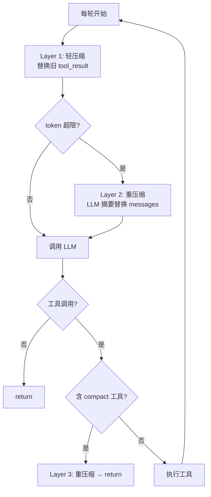


从设计上看，三层策略只是简单的上下文压缩的实现，提供了一种思路：由轻到重分级压缩，同时提供自主压缩机制。在业界，还有像滑动窗口、LLM 摘要、RAG 外存、分层记忆等压缩设计，相比与我们简单的设计更加完善，但内核还是一样的，关注点都是在**上下文资源有限，必须主动管理**。
# 规划：让模型不跑偏
我们前面讲了几个模型的机制，让模型在长上下文环境中能运行起来，但长任务会带来压缩，压缩过程中会带来信息损失，模型可能在最新的行动中忘记了任务的目标以及已经完成的内容，导致模型偏航。因此，这里使用了规划层，解决模型“知道要做什么，做到哪里了，按什么顺序做”的问题。这里有两个机制：todo机制和任务系统。todo用于解决短期注意力的，任务系统管理长期、可持久化的规划。

## TodoManager
TodoManager可以理解为待办维护，也是任务系统的一种。通过维护一个“状态板“，模型每完成一步就更新这个状态板，然后将结果返回messages中，作为上下文提供给模型，这样模型就具有了最新的任务规划。

TodoManager有两种触发机制，一种是主动调用，模型自己判断任务要拆分后，调用todo工具写和更新状态板。第二种是被动触发，我们通过harness监测模型在几轮对话中是否有触发Todo机制，如果没有，则强制注入提醒，让模型在下一轮去更新进度（Nag Reminder机制）。
### 实现核心-全量替换
通过全量替换，避免模型只改一条任务状态导致整体任务状态不一致，模型根据任务实现情况，自己判断要更新的任务状态，将完整的列表给harness，harness只负责存储。
```python
def update(self, items: list) -> str:
    # 校验：最多 20 条，同一时刻只能有一个 in_progress
    # ...
    self.items = validated   # 全量覆盖，状态完全由模型本次传入决定
    return self.render()     # 渲染成字符串返回给模型作为 tool_result
```
### Nag Reminder机制
Nag reminder机制其实是一个harness钩子，其核心代码就是记录有多少轮对话没有触发更新了，强制要求模型在下一轮调用工具更新状态。
```python
rounds_since_todo = 0
# 每轮结束时：
rounds_since_todo = 0 if used_todo else rounds_since_todo + 1
if rounds_since_todo >= 3:
    results.append({"type": "text", "text": "<reminder>Update your todos.</reminder>"})
```
这里有一个关键的认知：外部的约束往往比模型内部的自觉更可靠。harness不指望模型主动去更新，而是等计数器达到阈值时，主动提醒模型，下一轮模型必然能看到这个消息。

不过，todo状态只能在message(内存)中传递，一旦会话结束，或者经历我们之前提到的上下文压缩，todo状态可能消失，所以，todo状态板，我们认为是短期的注意力，只是让本轮对话不跑偏。
## 任务系统
我们刚刚提到了，todo状态板有缺陷，它只存在于内存中，只存在于当前轮次对话的任务管理机制。如果我们要实现，跨对话，跨压缩机制的任务管理，我们就需要一个新的机制-任务机制。任务机制将任务状态持久化到磁盘上，将任务保存为独立JSON文件（.tasks/task_N.json），同时，通过为任务添加依赖关系，实现图依赖的任务系统。

TaskManager在实现上，将每个任务存为一个JSON文件，重启、压缩后，任务信息依然存在，JSON不支持原地修改字段，所以每次更新都是”读 → 改 → 内存 → 全量写回”的操作。文件格式如下：
```json
.tasks/task_1.json:
{
  "id": 1,
  "subject": "实现登录功能",
  "status": "pending",        # 任务状态 Enum(pending / in_progress / completed)
  "blockedBy": [2, 3],        # 依赖的任务 ID，未完成则不能开始
  "owner": ""
}
```

`blockedBy` 是这个任务依赖的其他任务 ID 列表。把它类比成拓扑排序里的"入度".通过blockBy可以实现任务拓扑图，每完成一个任务，就将其它任务的blockBy字段，去掉刚完成任务的id。当一个任务的 `blockedBy` 变成空列表，它就从"被阻塞"变成"可执行"。这套依赖机制是后续自动认领任务的前提——只有无依赖的任务才能被领走。
```python
def update(self, task_id, status=...):
    if status == "completed":
        self._clear_dependency(task_id)   # 完成时，从所有别的任务的 blockedBy 里删掉自己

def _clear_dependency(self, completed_id):
    # 扫描所有任务文件，移除对 completed_id 的依赖
    # 相当于"删掉入度为 0 的节点后，更新其他节点的入度"
    for f in self.dir.glob("task_*.json"):
        task = json.loads(f.read_text())
        if completed_id in task.get("blockedBy", []):
            task["blockedBy"].remove(completed_id)
            self._save(task)
```

总的来说，Todo机制我们用来管理短期的注意力（内存-messages），任务系统用来管理长期持久化规划（磁盘-file），两者是任务管理的分工，不是替代关系。

# 拆分层
规划层让模型知道要做什么，但又一些活**一个上下文做不了或者等不起**。拆分层把任务分出去执行。这里有两个机制，一个是subagent分给子agent，后台任务拆给线程。
## subagent
随着agent干活，messages会越来越长，上下文污染会越来越严重。比如一个场景，我们要分析整个项目，找出某个关键字，如果是单一agent，他会一直读文件，写messages，最后上下文充斥着许多无关紧要的内容，agent想要的只是具体的内容，其余的都是噪音，占了上下文还影响后续推理。

subagent就是用来解决这个问题的。通过把子任务交给一个**全新的、独立的agent**去做。它有自己的空白messages，和父agent完全隔离。干完活，只需要将摘要回传给父agent就可以了，中间所有的读文件、试错、工作调用都留在自己的上下文中。

### 上下文隔离
上下文隔离是subagent实现的一个关键技术。
```python
def run_subagent(prompt: str) -> str:
    sub_message = [{"role": "user", "content": prompt}]  # 全新列表，与 parent 完全隔离
    for _ in range(30):   # range(30) 而非 while True，设上限防失控
        response = client.messages.create(
            system=SUBAGENT_SYSTEM, messages=sub_message, tools=CHILD_TOOLS, ...)
        # ... 标准 loop ...
    # 只返回最后一轮的文本摘要，中间过程全部丢弃
    return "".join(b.text for b in response.content if hasattr(b, "text"))
```
在实现上，关键的点在子agent的sub_messages结构。父agent的messages从头到尾只多了一条tool_result的子agent摘要。**对于父agent来说，它只是执行了一个工具调用，获得了一个工具调用的结果**。子agent的全部执行细节都在sub_agent中，函数返回时被回收。所以这里实现了隔离。同时注意，子agent没有给无限循环的权限，而是有一个执行上限，防止它失控无限消耗token。

### 工具分层防止递归
另外一个实现的技术细节就是，只有父agent有调用子agent的权限，子agent的工具中没有这个工具。这是一个简单的设计，为了防止无限递归的风险。
```python
CHILD_TOOLS  = [bash, read_file, write_file, edit_file]   # 子只能干活
PARENT_TOOLS = CHILD_TOOLS + [task]                       # 父才能派任务
```
## 后台任务
后台任务的出现是为了解决一个问题的，agent在调用某些阻塞工具时，需要干等命令跑完才能进行其它的工作，这里就有大问题了，如果agent要install某些内容，那就需要等待长时间的io响应和安装耗时，这段时间模型只能等待。后台任务的目的就是将这种任务变成异步的。模型调用background_run工具，将命令丢到一个后台线程中去跑，模型记录一个task_id然后去干别的工作，结果通过通知队列通知模型。

### 非阻塞+通知队列
```python
def run(self, command):
    task_id = str(uuid.uuid4())[:8]
    thread = threading.Thread(target=self._execute, args=(task_id, command), daemon=True)
    thread.start()
    return f"后台任务 {task_id} 已启动"   # 立刻返回，不等命令完成

def _execute(self, task_id, command):
    # 子线程里跑命令，完成后推入通知队列
    with self._lock:   # 加锁：主线程读、子线程写，防竞态
        self._notification_queue.append({...})
```
通过实现一个run函数，在内部起一个daemon（守护线程）就立刻返回，不等待结果。真正的命令在子线程中执行，跑完将结果添加到通知队列。队列这里要加锁——主线程在读、子线程在写，不加锁会有竞态。`daemon=True` 的意思是主程序退出时这些后台线程自动结束，不会卡住程序。
### 每轮注入通知
在agent的每轮对话开头，通过读取消息队列，将完成的通知注入到user消息中传给模型(harness的工作)。
```python
def agent_loop(messages):
    while True:
        notifs = BG.drain_notifications()   # 取出并清空队列
        if notifs and messages:
            messages.append({"role": "user",
                "content": f"<background-results>\n{notif_text}\n</background-results>"})
        # ... 正常 loop ...
```
注意这里的设计选择：通知是在**下一轮 LLM 调用之前**才注入的，而不是命令一完成就打断模型。也就是说后台任务不会实时中断当前这轮，模型总是在做完手头这步、进入下一轮时才看到通知——批量处理，反而更高效。drain（读完即清空）保证同一条通知不会被重复注入。

把这件事放到时间轴上看：主循环始终是单线程的，真正的并行只发生在守护线程里，结果靠队列在"下一轮开头"才回流给模型。

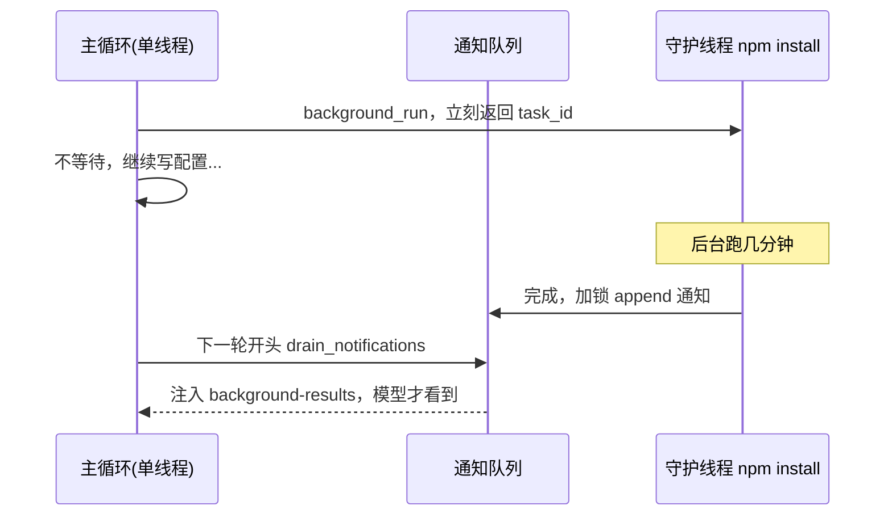

# 协作层：多agent
后台任务实现的是异步，但是它没有第二个agency。当面对复杂项目，一个agent忙不过来的时候，需要多个**独立**循环各自思考、并行干活的agent一起工作。这也是多agent的基础实现。

从四个环节考虑：团队（怎么通信）→ 协议（怎么有规矩的通信）→ 自主（怎么自己去找活干）→ 隔离（怎么并行不互相影响）

## agent团队
面对复杂任务的时候，我们之前提到用单个subagent去帮忙实现任务，但是subagent不是持久的，实现完工作会立刻退出。为了实现更加复杂的任务可以设置几个独立的agent，我们称为teammate，让他们自己有自己的判断，并行的干活。
团队的第一个问题，是每个agent有自己的上下文，没法共享上下文。为了解决这一问题，采取文件当信箱的形式。

先看团队的静态结构：lead 和每个 teammate 都跑在各自独立的线程里、各有各的 messages，它们之间不直接调用，全靠磁盘上的一堆文件中转。
```
              lead(主线程)
                 │ spawn
      ┌──────────┼──────────┐
      ▼          ▼          ▼
  teammate A  teammate B  teammate C   ← 各自独立线程 + 各自 messages
      │          │          │
      └── 读写 ───┼─── 读写 ──┘
                 ▼
   MessageBus  .team/inbox/
      ├── lead.jsonl
      ├── A.jsonl   ← 每人一个收件箱(JSONL)
      ├── B.jsonl
      └── C.jsonl
   .team/config.json  ← 成员状态 working / idle / shutdown
```

### 文件即信箱
通过文件的信箱实现消息的传递，核心思路就是一读一写。
```python
class MessageBus:
    def send(self, sender, to, content, msg_type="message"):
        # 发消息 = append 一行 JSON 到对方的 .jsonl
        with open(self.dir / f"{to}.jsonl", "a") as f:
            f.write(json.dumps(msg) + "\n")

    def read_inbox(self, name):
        # 收消息 = 读自己的 .jsonl，然后清空（drain）
        messages = [json.loads(l) for l in path.read_text().splitlines() if l]
        path.write_text("")   # drain，避免重复处理
        return messages
```
通过json格式存储消息，发消息时，只要在对方的.jsonl文件追加一行，收消息的时候就是读出自己的信箱内容，然后清空。这里不适用内存队列和管道是为了**持久**（重启了消息也不会丢）、**异步**（发的时候对方不需要在线）、**好调试**（出问题可以直接打开文件看都传了什么内容）。
### 持久线程+角色分工
我们在团队中实现的teammate与subagent不同，subagent是用完即毁的，但是我们在团队中创建的teammate是一直活着的，干完手头上的活就进入空闲等消息，来了新消息就继续接着干。每个teammate在自己的react循环中都是先读信箱，再调LLM，读信箱是它感知外部世界的唯一通道。

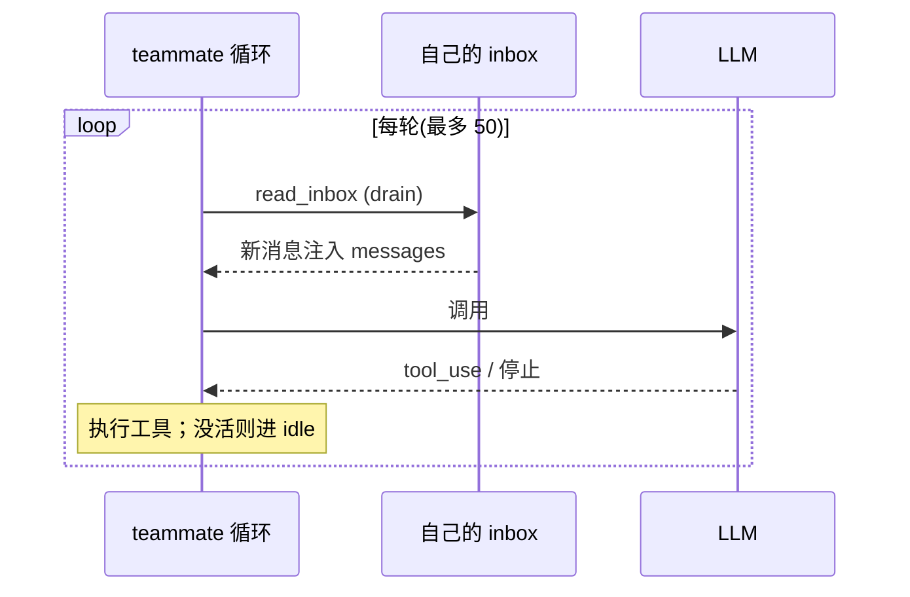

工具也按角色分了层，lead(主管)有【创建teammate】和【广播消息】等管理工具，teammate只有读写邮箱这些功能，不能随意拉新人。

注意：顺带一提：teammate 的工具分发是用 if/else 写的，没用前面那种字典 lambda。因为发消息、读信箱都要知道"我是谁"来路由，而这个 sender 是每个 teammate 各自动态传入的，字典 lambda 在定义时捕获不到它。
## 团队协议
在一个合理的团队分工中，多个agent一起干活，需要对消息的传递建立规则。比如，lead不能想关闭某个teammate的时候就直接杀死它的线程，要考虑他正在进行的任务。teammate也不能随意执行任务，遇到高风险任务的时候，要像lead审批。在团队协议中，只需要往消息中添加一个type字段，构成请求和响应的状态机。两个协议的方向正好是相反的。

|     | shutdown(关闭teammate) | plan_approval(计划审批) |
| --- | -------------------- | ------------------- |
| 发起方 | lead                 | teammate            |
| 审批方 | teammate             | lead                |
| 目的  | 安全关闭，不打断工作           | 防止擅自工作              |
| 结果  | teammate关闭           | 收到approve/reject决定  |

在实现上，通过一个内存里的状态追踪表，按req_id精确记录每个请求的状态（加锁保护），并且配合文件信箱做消息中转。
```python 
shutdown_requests = {}   # {req_id: {target, status}}
plan_requests = {}       # {req_id: {from, plan, status}}
_tracker_lock = threading.Lock()
```
一次发起的流程是：请求方造一个唯一的请求id，连着请求一起发进对方的信箱，等待对方处理完，把结果带上同一个请求id发回来。请求方拿着请求id在自己的状态表上匹配，这样就知道了这个请求被同意还是拒绝了。本质上是一次分布式的请求-响应的握手。

shutdown（lead 发起，关键是不打断 teammate 手头的活）：
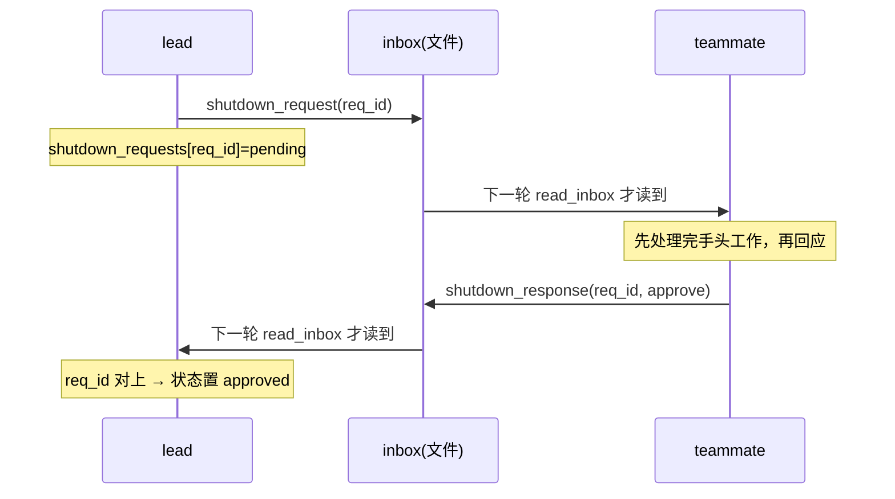
plan_approval（teammate 发起，关键是拿到批准前不擅自执行）
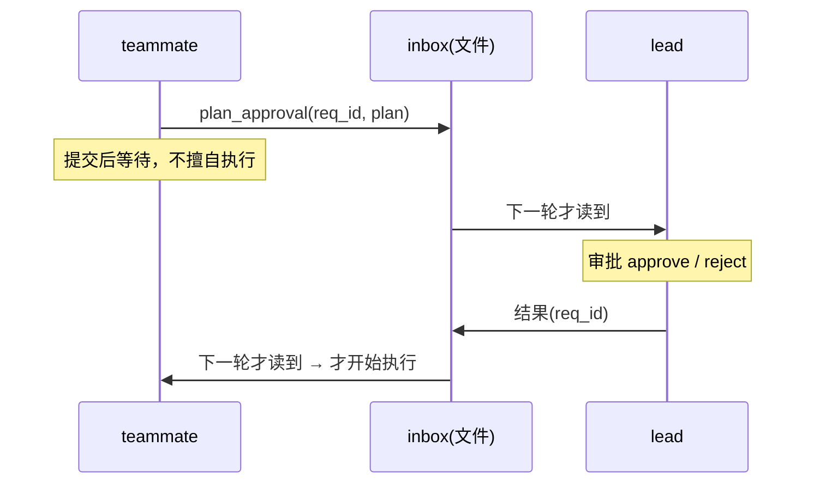

## 自主agent
团队的teammate在执行任务的时候，任务是lead一个个派给teammate的，teammate一多，lead自己又成了瓶颈。所以，一个思路是将teammate变得自主一些，当teammate出于空闲状态的时候，自己去任务板上找没人认领的任务，lead只管把任务发布到板上，不用盯着每个teammate分配。
### WORK/IDLE两阶段循环
为了实现自主的teammate，将teammate的循环切成两个阶段轮流跑：
```
spawn → ┌─ WORK PHASE（最多 50 轮）──┐
        │  读 inbox → 调 LLM → 执行工具 │
        │  LLM 停止 或 调 idle → 跳出   │
        └──────────────┬───────────────┘
                       ▼
        ┌─ IDLE PHASE（最多 60 秒）────┐
        │  每 5 秒轮询：               │
        │   ① inbox 有消息 → resume    │
        │   ② 任务板有无主任务 → claim  │
        │   ③ 都没有 → 继续等          │
        └──────────────┬───────────────┘
              resume? ──否──→ shutdown（线程退出）
                       └─是→ 回 WORK PHASE
```
在这两个循环中，WORK阶段就是标准的react循环，进行工作，完成任务。IDLE阶段则是每隔一段时间轮询一次，有人发消息则优先处理，每消息的时候则取任务版认领任务。如果一段时间都保持空闲状态，则真正的退出。
### 认领任务要原子
多个teammate共同工作时，就需要考虑并发的问题了，在同一个无主任务上，如果多个teammate同时认领，要保证只有一个teammate领取到任务。
```python
_claim_lock = threading.Lock()
def claim_task(task_id, owner):
    with _claim_lock:        # 加锁保证原子性
        task = json.loads(path.read_text())
        if task.get("owner"):           # 已被别人领走
            return "Error: already claimed"
        if task.get("blockedBy"):       # 有依赖，还不能领（呼应 s07）
            return "Error: blocked"
        task["owner"] = owner
        task["status"] = "in_progress"
        path.write_text(json.dumps(task))
```
如果不加锁，两个线程可能都读到 owner 是空，都以为自己抢到了，结果一个任务被两个人做。加锁后只有一个线程能进去把 owner 写上，另一个进来一看已经有主了，就放弃。（里面还顺手检查了 blockedBy，有依赖没清的任务，是不允许被认领的。）
锁把"同时发现"变成了"依次进入"，A、B 抢同一个 task_3 的过程是这样的：

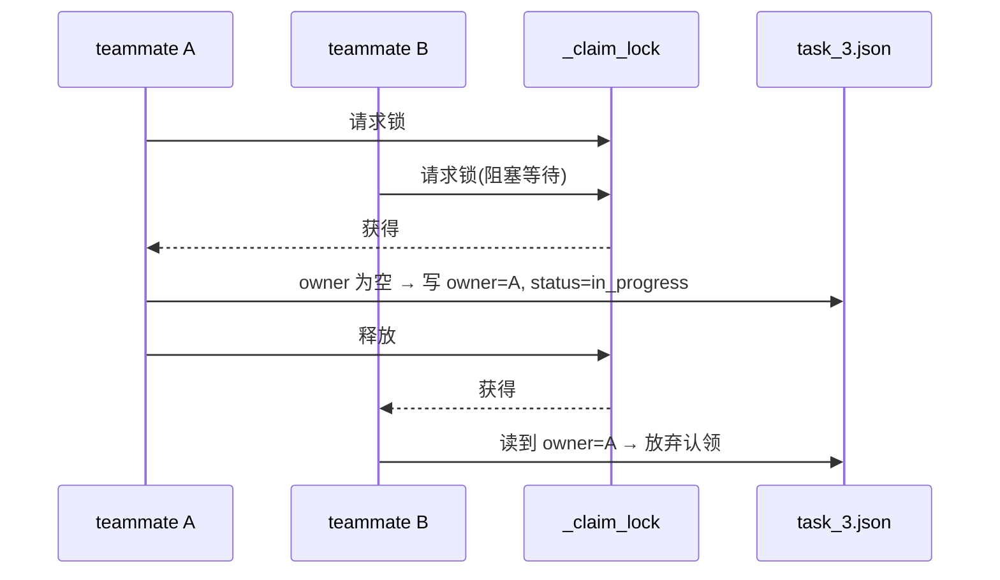

### 身份重注入
teammate有了自主性后，可能会长时间的运行，运行久了，上下文可能会被压缩，这个时候，teammate可能会忘记自己的身份，所以，这里添加一个身份补偿，当messages短到一定程度的时候，就在开头插入一段身份说明。
```python
if len(messages) <= 3:
    messages.insert(0, make_identity_block(name, role, team_name))
    messages.insert(1, {"role": "assistant", "content": f"I am {name}. Continuing."})
```
要同时插 user 和 assistant 两条，是为了不破坏 user/assistant 交替的格式。这其实是压缩机制带来的副作用，在这种长跑场景下不得不专门补一手。

## 工作空间隔离
多个teammate同时工作的时候，如果全部对同一工作目录进行操作，可能会出现冲突的情况。因此，需要设计一种机制取实现多个teammate的工作空间隔离。这里采用git的思路，设置多个git worktree，它有自己独立的目录和分支，每个teammate自己写自己的目录下的内容，物理上就隔离了。
整体的架构设计，三个管理器互相配合
```python
    TaskManager          WorktreeManager         EventBus
    .tasks/*.json   ←→  .worktrees/index.json   .worktrees/events.jsonl
         │                      │                       │
         │  bind_worktree()     │  create/remove        │  emit()
         └──────────────────────┘                       │
                                                        │
                       所有操作都向 EventBus 写入事件日志 ─┘

```
目录的结构：
```python
  repo/
  ├── .tasks/
  │   ├── task_12.json      ← 任务元信息（含 worktree 字段）
  │   └── task_7.json
  ├── .worktrees/
  │   ├── index.json        ← 所有 worktree 的元信息汇总
  │   ├── events.jsonl      ← 生命周期事件日志（JSONL 格式）
  │   ├── auth-refactor/    ← 任务12 的独立工作目录
  │   └── payment-fix/      ← 任务7  的独立工作目录
  └── main 分支代码

  git 分支：
    main              ← 主分支
    wt/auth-refactor  ← 任务12 的专属分支（在 auth-refactor/ 目录 checkout）
    wt/payment-fix    ← 任务7  的专属分支
```
### 任务和worktree互相指认
```
task_12.json                  index.json（一条 worktree 记录）
{                             {
  "id": 12,                     "name": "auth-refactor",
  "status": "in_progress",      "branch": "wt/auth-refactor",
  "worktree": "auth-refactor",←→ "task_id": 12,
}                               "status": "active"
                              }
```
任务文件里记着自己用的是哪个 worktree，worktree 记录里记着自己属于哪个 task_id，两边靠字段对应起来。创建时调一次 `git worktree add` 开出目录和分支，同时把 worktree 名字写回任务文件，绑定关系就建立了。
### 生命周期事件
```python
class EventBus:
    def emit(self, event, task=None, worktree=None, error=None):
        # 每个关键操作追加一行到 events.jsonl
        # 事件名约定：<对象>.<动作>.<阶段>，如 worktree.create.before
```
每一次 create / remove / keep 操作，都会往 `.worktrees/events.jsonl` 追加一行事件。这是前面并行机制都没有的东西——并行系统一旦出错，事后想知道"到底发生了什么"，这份事件日志往往是唯一能还原现场的依据。
整个流程串起来是：建任务 → 给它开设一个独立的worktree 空间 → 在独立空间中跑命令（测试、构建）→ 收尾时选择删掉目录、或保留分支等着合并。

# 架构总览
总的来说，目前实现的整个agent的架构可以用下图表示：
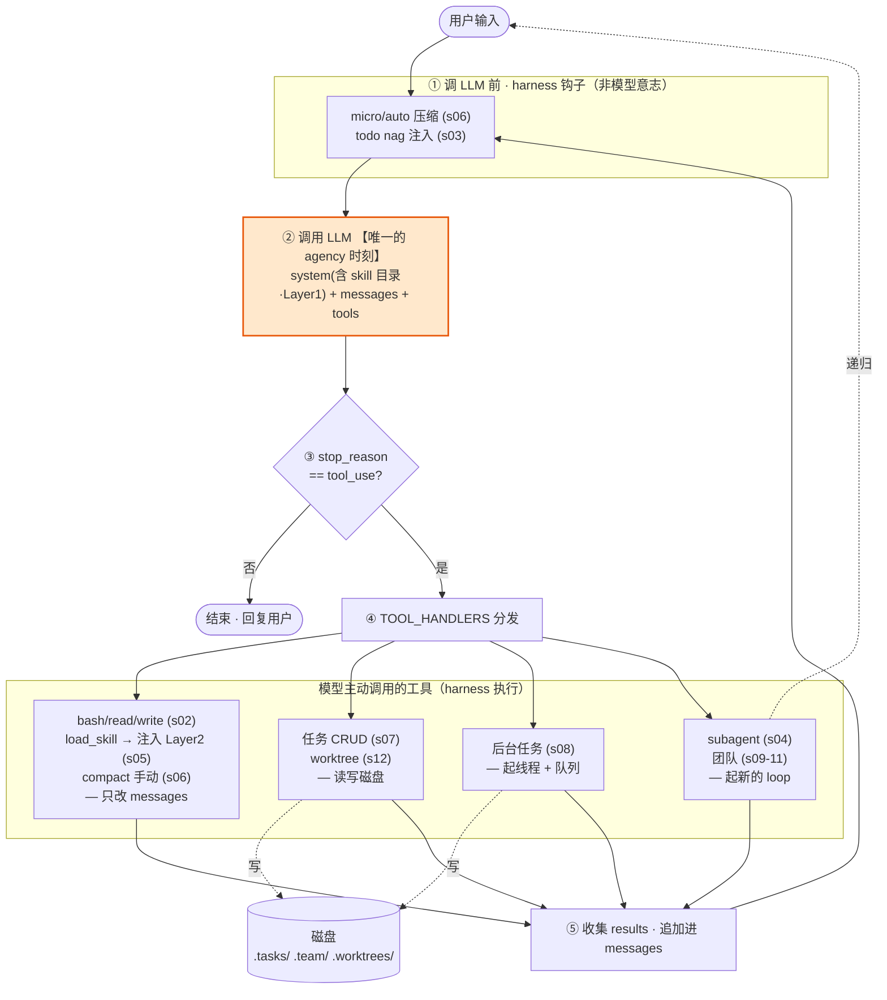
整体的架构其实就一条主环路：
```
prompt → Hook → LLM → Check → Dispatch → Collect → Hook
```
橙色的LLM调用是整张图唯一的agency的内容，只有这里进行了模型的调用，其它部分全是harness。
第①步的 subgraph是仅有的两个 harness 强加的钩子——压缩和 todo nag，模型管不着。
第④步的工具分发是其它内容实现的全部，区别只在三件事：改不改磁盘、起不起线程、起不起新循环。
那根 `T4 -.递归.-> prompt` 是题眼：subagent 和团队不是新机制，是**循环自己调用自己**。团队就是好几条这样的环并行跑，靠磁盘那个框通信。

这套 `hook → agency → dispatch → tool → append → loop` 的结构，在真实的复杂 agent 系统里同样成立。复杂度不长在循环本身，而是长在每个节点里：hook 里要做记忆检索和权限校验，agency 可能按任务类型路由到不同模型，dispatch 可能同时执行几百个工具。多个 agent 并行，也不过是好几条这样的环同时跑，靠消息队列通信。

唯一真正不同的地方在 hook：工业级系统会把重要信息持久化到向量数据库，每轮按需召回相关片段注入上下文。课程里的压缩机制是"丢掉旧的"，工业方案是"存到外面、按需取回"——解决的是同一个问题，思路从丢弃变成了外存。这也是后续学习 RAG、向量记忆、长期记忆系统的入口。