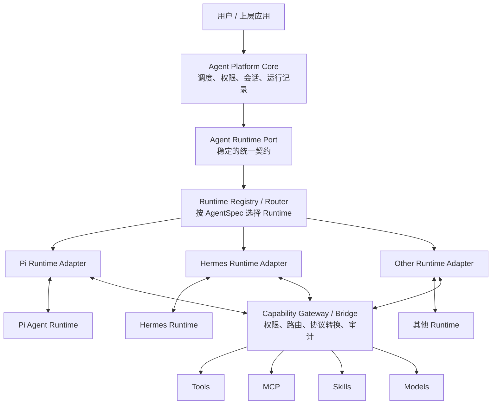
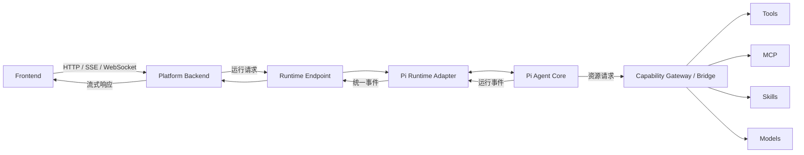
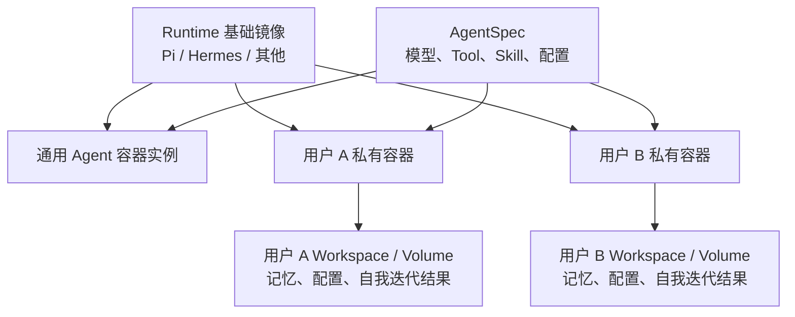

# Agent Runtime 平台架构学习笔记

> 目标：理解一种可插拔的 Agent Runtime 平台架构，并形成以后做应用架构时可以复用的思考方式。

## 目录

| # | 章节 | 说明 |
|---|---|---|
| 一 | [一句话理解](#一一句话理解) | 核心思想 |
| 二 | [抽象逻辑架构](#二抽象逻辑架构) | 稳定点与变化点 |
| 三 | [具体调用链](#三具体调用链) | 实际系统中的组件 |
| 四 | [两张图的对应关系](#四两张图的对应关系) | 抽象如何落地 |
| 五 | [Adapter 与 Bridge](#五adapter-与-bridge) | 两种适配方向 |
| 六 | [哪些层应该真实存在](#六哪些层应该真实存在) | 避免过度设计 |
| 七 | [Agent 的容器与状态](#七agent-的容器与状态) | Image、Container、Volume |
| 八 | [如何逐步演进](#八如何逐步演进) | 从一个 Runtime 到平台化 |
| 九 | [如何复用这种思考方式](#九如何复用这种思考方式) | 日常架构方法 |

---

# 一、一句话理解

这套架构可以概括为：

> **平台保持稳定，通过 Adapter 接入不同 Agent Runtime，通过 Gateway/Bridge 向 Runtime 提供统一资源，再通过容器和持久化空间隔离运行环境与用户状态。**

最值得记住的不是某个架构名，而是下面这条关系：

```text
稳定业务
   ↓
稳定契约
   ↓
可变 Adapter
   ↓
具体 Agent Runtime
```

再从 Runtime 反向接入平台能力：

```text
Agent Runtime
   ↓
Capability Gateway / Bridge
   ↓
Tool / MCP / Skill / Model
```

记忆口诀：

> **核心管业务，接口定契约，Adapter 接 Runtime，Gateway 接资源，Container 做隔离，Volume 存状态。**

---

# 二、抽象逻辑架构

抽象图用来回答两个问题：

1. 哪些部分应该保持稳定？
2. 将来增加新的 Runtime 时，变化应该被限制在哪里？



图中的几个概念：

| 概念 | 含义 |
|---|---|
| Platform Core | 平台稳定的业务逻辑 |
| Runtime Port | 平台对 Runtime 的最小统一契约 |
| Runtime Registry/Router | 根据配置找到对应的 Runtime 实现 |
| Runtime Adapter | 吸收 Pi、Hermes 等 Runtime 的协议差异 |
| Agent Runtime | 真正执行 Agent Loop 的引擎 |
| Capability Gateway | 将平台资源安全、统一地提供给 Runtime |

这里的 `Core`、`Port` 不一定各自对应一个服务。它们首先是**职责和代码边界**。

---

# 三、具体调用链

具体图用来回答：一次真实请求究竟经过哪些组件？



实际存在三条流：

## 1. 主执行链

```text
Frontend
→ Platform Backend
→ Runtime Endpoint
→ Runtime Adapter
→ Agent Core
```

## 2. 资源调用链

```text
Agent Core
→ Capability Gateway / Bridge
→ Tool / MCP / Skill / Model
→ Agent Core
```

## 3. 事件返回链

```text
Agent Core
→ Runtime Adapter
→ Runtime Endpoint
→ Platform Backend
→ Frontend
```

`Gateway/Bridge` 不是主链路末尾的固定步骤。只有 Agent 需要模型、工具、MCP 或 Skill 时，才会进入这条资源支线。

---

# 四、两张图的对应关系

| 抽象逻辑概念 | 具体实现 |
|---|---|
| 用户 / 上层应用 | Frontend 或其他 API 调用方 |
| Agent Platform Core | Platform Backend 中的 AgentService、权限、调度、运行记录 |
| Agent Runtime Port | Java/TypeScript Interface，或者稳定协议 |
| Runtime Registry/Router | 一个 Map、Registry 或 Factory |
| Runtime Endpoint | HTTP、gRPC 等远程服务入口 |
| Pi Runtime Adapter | Pi 的参数、事件和生命周期转换代码 |
| Pi Agent Runtime | Pi Agent Core |
| Capability Gateway | Tool、MCP、Skill、Model 的统一接入层 |
| Resources | 具体工具、MCP Server、Skill 和模型供应商 |

两张图并不矛盾：

> **抽象图回答“职责如何划分、以后如何扩展”，具体图回答“一次请求实际经过哪些组件”。**

---

# 五、Adapter 与 Bridge

它们都是“胶水”，但是适配方向不同。

## Adapter：平台调用 Runtime

```text
平台统一请求
→ Pi Runtime Adapter
→ Pi Agent Runtime
```

Adapter 主要负责：

- 请求参数转换；
- 会话和运行生命周期；
- 流式事件转换；
- 取消和超时；
- Runtime 错误转换。

判断一段代码是否属于 Adapter，可以问：

> 如果把 Pi 换成 Hermes，这段代码是否会变化？

如果会，它大概率应该位于 Runtime Adapter。

## Bridge：Runtime 调用平台资源

```text
Pi Tool Call
→ Bridge 转换
→ 平台权限检查与资源路由
→ 执行 Tool
→ 转换结果
→ 返回 Pi
```

Bridge/Gateway 可以负责：

- Tool 注册和调用；
- MCP 连接与生命周期；
- Skill 加载；
- Model 路由；
- 权限校验；
- 审计、限流和计量。

一句话区分：

> **Adapter 解决“平台怎样运行 Agent”，Bridge 解决“Agent 怎样使用平台能力”。**

如果 Bridge 只做几个字段转换，不需要单独成层，直接作为 Adapter 的内部代码即可。多个 Runtime 出现重复的资源接入逻辑后，再提取公共 Gateway。

---

# 六、哪些层应该真实存在

不要机械地实现：

```text
Core → Port → Router → Endpoint → Adapter
```

每个方框都做成一个类或服务，会变成过度设计。

## Port 只是接口

```ts
interface AgentRuntime {
  run(request: RunRequest): AsyncIterable<AgentEvent>
  cancel(runId: string): Promise<void>
}
```

`Port` 是它在架构中的名称，不是额外的转发服务。

## Router 通常只是选择逻辑

```ts
const runtime = runtimes.get(agent.runtimeType)
return runtime.run(request)
```

它可能只是一个 `Map` 或 Registry，不需要独立部署。

## Endpoint 只在存在网络边界时需要

Runtime 与平台在同一个进程：

```text
Platform Backend → Pi Adapter → Pi Agent Core
```

Runtime 独立部署：

```text
Platform Backend
→ HTTP/gRPC Runtime Endpoint
→ Pi Adapter
→ Pi Agent Core
```

因此：

> **Port 解决代码依赖，Endpoint 解决网络通信，Adapter 解决实现差异。**

---

# 七、Agent 的容器与状态

需要分清三个概念：

| 概念 | 作用 |
|---|---|
| Image | 不可变的软件和依赖模板 |
| Container | 基于 Image 创建的运行实例 |
| Workspace/Volume | 需要长期保存的用户状态 |

推荐的部署模型：



更合理的原则是：

> **镜像按 Runtime 和依赖环境划分，Agent 按配置划分，用户状态按 Workspace/Volume 隔离。**

不建议无条件为每个 Agent、每个用户构建完整镜像，否则容易产生镜像数量膨胀、升级困难和不可复现的问题。

Hermes 一类可自我迭代的 Agent，可以将变化保存到用户独立的：

- AgentSpec；
- Workspace；
- Skill 目录；
- 记忆库；
- 持久化 Volume；
- 版本化派生镜像。

基础镜像尽量保持不可变，方便升级、回滚、审计和复现。

---

# 八、如何逐步演进

## 阶段一：只有 Pi Runtime

```text
Frontend
→ Platform Backend
→ Pi Adapter
→ Pi Agent Core
```

Tool、MCP 等资源转换先放在 Pi Adapter 内，不急着建设 Gateway。

## 阶段二：接入第二个 Runtime

```text
Platform Backend
→ AgentRuntime 接口
→ Pi Adapter / Hermes Adapter
```

这时统一 Runtime 请求、事件、取消和错误语义。

## 阶段三：资源逻辑开始重复

```text
Pi Adapter ──────┐
                 ├→ Capability Gateway → Resources
Hermes Adapter ──┘
```

此时再提取权限、路由、审计和资源生命周期等公共能力。

## 阶段四：Runtime 需要独立扩缩容

```text
Platform Backend
→ Runtime Endpoint
→ Runtime Service
→ Runtime Adapter
→ Agent Core
```

Endpoint 是部署和网络需求出现后的产物，而不是为了图看起来完整而提前增加的一层。

---

# 九、如何复用这种思考方式

平时设计系统时，依次问：

1. 什么是稳定的核心业务？
2. 什么实现以后可能被替换？
3. 替换它时，希望哪些代码保持不变？
4. 能否在两者之间定义一个最小业务接口？
5. 外部实现的差异由谁吸收？
6. 状态属于谁，生命周期多长？
7. 故障和数据需要隔离到什么程度？
8. 这一层解决了真实问题，还是只做转发？

通用结构是：

```text
稳定业务
→ 稳定接口
→ 可变 Adapter
→ 外部实现
```

例如支付系统：

```text
订单业务
→ PaymentPort
→ WeChatPayAdapter / AlipayAdapter
→ 微信支付 / 支付宝
```

例如文件存储：

```text
业务系统
→ StoragePort
→ LocalAdapter / OSSAdapter / S3Adapter
→ 本地磁盘 / OSS / S3
```

Agent Runtime 平台只是同一种思想在 Agent 场景中的应用。

最后记住：

> **架构不是不断增加层，而是识别变化和风险，把变化限制在明确边界内。**

可以遵循一个朴素的节奏：

> **第一次完成实现，第二次识别差异，第三次沉淀稳定抽象。**
