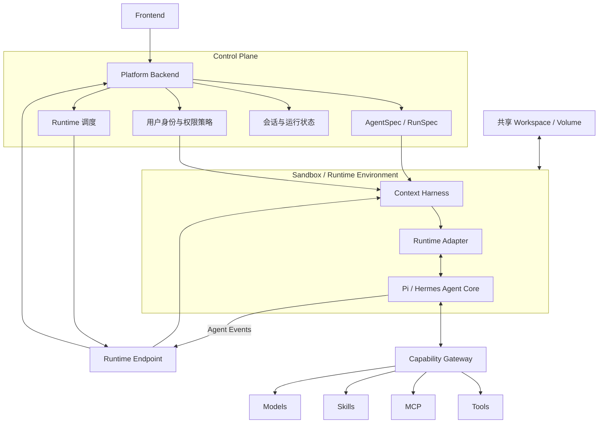

# Agent Runtime 的存储、隔离与上下文管理

> 目标：理解 Agent Runtime 在多用户、多节点环境中，如何管理文件、状态、权限和上下文。

> 相关笔记：[Agent Runtime 平台架构](./agent-runtime-architecture.md)

## 目录

| # | 章节 | 说明 |
|---|---|---|
| 一 | [一句话理解](#一一句话理解) | 核心结论 |
| 二 | [它解决的是什么问题](#二它解决的是什么问题) | 与 Runtime Adapter 的区别 |
| 三 | [分布式文件与用户隔离](#三分布式文件与用户隔离) | Workspace、Volume、共享存储 |
| 四 | [Sandbox](#四sandbox) | Agent 能做什么 |
| 五 | [Context Harness](#五context-harness) | Agent 能看到什么 |
| 六 | [AgentSpec 与 RunSpec](#六agentspec-与-runspec) | 声明一次运行需要的一切 |
| 七 | [跨节点会话稳定性](#七跨节点会话稳定性) | 状态外置与恢复 |
| 八 | [完整运行架构](#八完整运行架构) | 各组件如何组合 |
| 九 | [实际设计原则](#九实际设计原则) | 开发时如何判断 |

---

# 一、一句话理解

Agent Runtime 平台不只要解决“接入哪个 Agent Core”，还要解决：

```text
Agent 能访问哪些文件？
Agent 能执行哪些操作？
Agent 能看到哪些上下文？
Agent 换一台机器运行后，状态能否恢复？
```

可以概括为：

> **Storage 保存文件和状态，Sandbox 限制 Agent 能做什么，Harness 决定 Agent 能看到什么，AgentSpec 统一描述这些规则。**

对应关系：

| 组件 | 核心问题 |
|---|---|
| Storage / Workspace | Agent 的文件和状态放在哪里？ |
| Sandbox | Agent 被允许做什么？ |
| Context Harness | Agent 本次运行能看到什么？ |
| AgentSpec / RunSpec | 上述规则如何统一配置？ |
| Runtime Adapter | 平台如何接入不同 Agent Core？ |

---

# 二、它解决的是什么问题

Runtime Adapter 架构主要解决：

```text
平台如何统一接入 Pi、Hermes 和其他 Agent Runtime？
```

而这一层解决：

```text
接入以后，Agent 如何在多用户、多节点环境中安全运行？
```

两者属于不同方向：

```text
Runtime Adapter
└─ 屏蔽不同 Agent Core 的实现差异

Runtime Infrastructure
├─ 文件和状态持久化
├─ 用户数据隔离
├─ 进程和容器隔离
├─ 上下文装配
└─ 跨节点恢复
```

因此，完整平台不能只有 Adapter，还需要一套 Runtime Infrastructure。

---

# 三、分布式文件与用户隔离

Agent 与普通无状态服务不同。它经常需要读写：

- 用户上传的文件；
- 项目代码；
- Skill 文件；
- Agent 生成的内容；
- 会话临时文件；
- 记忆和自我迭代结果。

## 1. 为什么本地目录不够

如果 Runtime 只在一台机器上运行：

```text
C:/agents/user-a/workspace
```

就可以保存用户文件。

但多节点调度后：

```text
第一次运行 → 节点 A
第二次运行 → 节点 B
```

如果文件只在节点 A 的本地磁盘，节点 B 就无法继续同一个会话。

因此需要共享存储，例如：

- NAS；
- NFS；
- 分布式文件系统；
- 对象存储；
- 数据库与文件存储的组合。

## 2. 共享存储不等于用户隔离

NAS/DFS 只解决：

> 不同节点能否访问同一份文件？

它不会自动解决：

> 用户 A 是否有权访问用户 B 的文件？

还需要：

- 用户身份；
- 租户命名空间；
- ACL；
- 容器挂载策略；
- 只读/可写权限；
- 加密与审计；
- 文件生命周期管理。

## 3. 建议的目录分类

```text
/system/skills          平台公共 Skill，只读
/system/runtime         Runtime 公共文件，只读
/users/A/workspace      用户 A 长期工作区，可读写
/sessions/123           当前会话或任务目录，可读写
/tmp                    临时目录，运行结束后清理
```

| 目录 | 所有者 | 权限 | 生命周期 |
|---|---|---|---|
| Runtime 文件 | 平台 | 只读 | 随镜像版本 |
| 公共 Skill | 平台 | 只读 | 长期、版本化 |
| 用户 Workspace | 用户 | 私有读写 | 长期 |
| Session Workspace | 当前任务 | 私有读写 | 会话级 |
| Temp | 当前进程 | 私有读写 | 运行级 |

关键原则：

> **不要只依赖目录名称判断权限，访问控制必须由平台身份和挂载策略保证。**

---

# 四、Sandbox

Sandbox 回答的是：

> **Agent 被允许做什么？**

它主要控制操作系统和运行环境能力。

## 1. 文件权限

```text
可以读取哪些目录？
可以写入哪些目录？
能否访问宿主机文件？
能否修改公共 Skill？
```

## 2. 网络权限

```text
是否允许访问公网？
可以访问哪些域名？
能否访问公司内网？
能否连接数据库？
```

## 3. 执行权限

```text
可以执行哪些命令？
能否安装依赖？
能否启动子进程？
能否使用 Docker？
```

## 4. 资源限制

```text
CPU
内存
磁盘
运行时长
并发进程数
网络流量
```

一个简化的策略示例：

```yaml
filesystem:
  read:
    - /system/skills
    - /users/user-a/workspace
  write:
    - /users/user-a/workspace
    - /sessions/run-123

network:
  allow:
    - api.openai.com

limits:
  cpu: 2
  memory: 4Gi
  timeout: 30m
```

Sandbox 的原则是最小权限：

> **默认不可访问，只开放完成当前任务必需的能力。**

---

# 五、Context Harness

Context Harness 回答的是：

> **Agent 本次运行能看到什么？**

它是包裹 Agent Core 的运行外壳，通常负责准备：

- System Prompt；
- 对话历史；
- 用户身份；
- Agent 配置；
- Tool 定义；
- Skill 内容；
- 项目和文件上下文；
- 记忆；
- 权限说明；
- 上下文压缩；
- 运行、流式输出和取消生命周期。

## Sandbox 与 Harness 的区别

| 问题 | Sandbox | Context Harness |
|---|---|---|
| 关注点 | 系统权限 | 模型上下文 |
| 核心问题 | Agent 能做什么？ | Agent 能看到什么？ |
| 文件 | 是否允许读取 | 是否主动注入或提示其位置 |
| Tool | 是否允许调用 | 是否注册给模型 |
| 网络 | 是否允许连接 | 通常不直接负责 |
| 对话 | 通常不关心 | 决定保留和压缩哪些历史 |

一个重要区别：

```text
有权读取某文件
≠
应该把文件全文放进模型上下文
```

Context Harness 还需要决定：

- 哪些上下文自动注入；
- 哪些内容按需搜索；
- Skill 加载元信息还是全文；
- 对话历史保留多少；
- 什么内容需要压缩；
- 用户信息、部门信息和公共信息如何组合；
- 敏感信息是否可以进入模型上下文。

因此上下文管理同时受三个因素约束：

```text
安全性：能不能看
相关性：需不需要看
成本：应该看多少
```

---

# 六、AgentSpec 与 RunSpec

文件、权限、Runtime、资源和上下文不能散落在代码中，需要由统一配置描述。

可以分成两类：

## AgentSpec：Agent 的长期定义

```yaml
name: code-agent
runtime: pi
runtimeVersion: v1

model: gpt-x

skills:
  - code-review

tools:
  - filesystem
  - terminal

context:
  skillLoading: on-demand
  historyPolicy: summarized
```

## RunSpec：某一次运行的具体配置

```yaml
runId: run-123
agent: code-agent
user: user-a

workspace:
  source: users/user-a/workspace
  mountPath: /workspace

permissions:
  filesystem: workspace-only
  network: restricted

resources:
  cpu: 2
  memory: 4Gi
  timeout: 30m
```

两者的关系：

```text
AgentSpec
+ 用户权限
+ 本次请求
+ 平台默认策略
      ↓
    RunSpec
      ↓
启动一次确定、可审计的 Agent Runtime
```

这就是“配置管理是核心”的真正含义：

> **将 Runtime、资源、权限、目录和上下文变成集中管理、可版本化、可审计的声明。**

---

# 七、跨节点会话稳定性

相同会话可能在不同节点继续执行：

```text
节点 A：处理第一轮消息
节点 B：继续第二轮消息
```

节点 B 需要恢复：

- 对话历史；
- 用户 Workspace；
- AgentSpec 版本；
- Skill 版本；
- Tool 权限；
- 模型配置；
- 运行结果和检查点。

因此，关键状态不能只放在容器本地。

## 建议的状态归属

| 状态 | 推荐位置 |
|---|---|
| Agent 定义与版本 | 配置中心或数据库 |
| 会话消息 | 数据库 |
| 用户 Workspace | 共享文件系统或对象存储 |
| 大文件和快照 | 对象存储 |
| 运行状态 | 数据库、缓存或事件系统 |
| 临时文件 | 容器本地临时目录 |
| 密钥 | Secret Manager |

核心原则：

> **容器应该能够被销毁和重建，长期状态必须外置。**

对于执行中的任务，可以选择：

- 使用粘性调度，让同一次运行尽量停留在同一节点；
- 定期保存检查点，故障后从检查点恢复；
- 无法恢复的操作明确标记为失败并重新执行；
- 对有副作用的 Tool Call 使用幂等键，避免重复执行。

---

# 八、完整运行架构



这张图中：

```text
Control Plane 决定应该怎样运行
Runtime Endpoint 接收远程运行请求
Sandbox 限制运行环境权限
Harness 组装本次运行上下文
Adapter 接入具体 Agent Core
Gateway 提供平台资源
Storage 保存用户文件和长期状态
```

---

# 九、实际设计原则

## 1. 不要把用户状态写进基础镜像

推荐：

```text
共享、不可变的 Runtime Image
+ 用户独立 Container
+ 用户独立 Workspace/Volume
```

不推荐持续修改正在运行的基础镜像，否则难以升级、回滚、审计和复现。

## 2. 权限与上下文分开管理

```text
Sandbox：允许读取某目录
Harness：是否把目录内容放进上下文
```

不要因为“有权限读取”，就自动把全部内容注入模型。

## 3. 持久状态与临时状态分开

```text
长期状态 → 数据库、Workspace、对象存储
临时状态 → 容器本地目录
```

这样容器才能安全销毁和重新调度。

## 4. 统一配置必须版本化

至少需要记录：

- Runtime 和镜像版本；
- AgentSpec 版本；
- Skill 版本；
- Model；
- Tool 权限；
- 文件挂载；
-网络策略；
-资源限制；
-上下文策略。

否则出现问题时无法回答：

> 这次 Agent 究竟在什么环境、使用什么能力运行的？

## 5. 不要把成熟分布式能力重新实现一遍

调度、负载均衡、容器编排、数据库和共享存储已经有成熟方案。平台更应该聚焦 Agent 特有的问题：

- Workspace 语义；
- Tool 权限；
- Context Harness；
- AgentSpec；
- 自我迭代状态；
- Agent 运行的可审计性。

最终记忆口诀：

> **Adapter 管接入，Storage 管状态，Sandbox 管行为，Harness 管上下文，Spec 管规则。**
