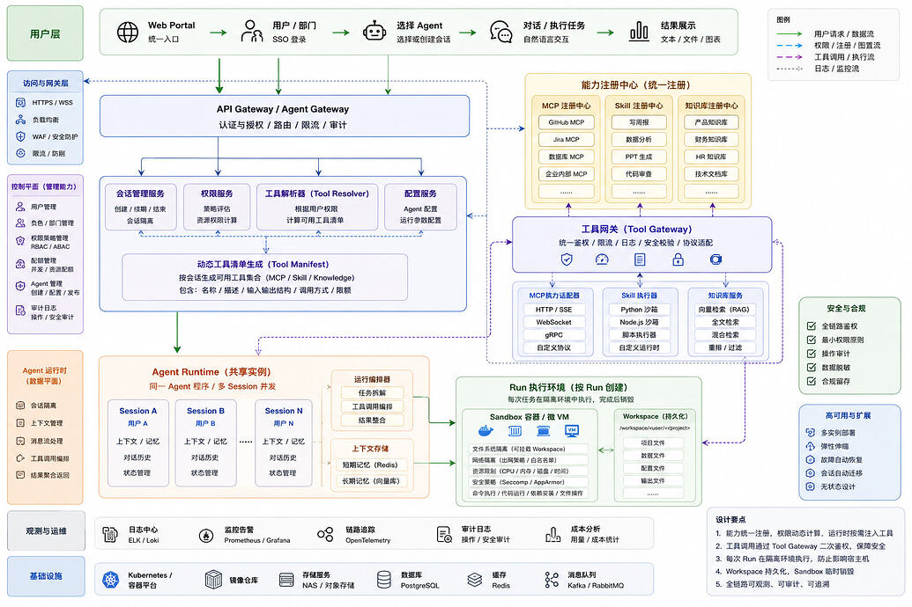
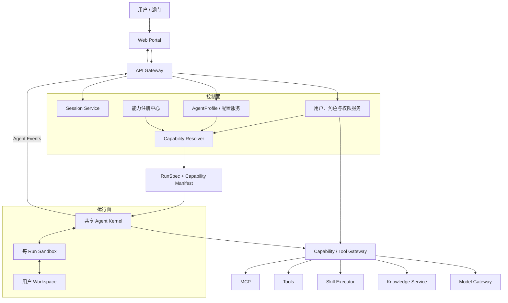

# 策略驱动的单 Agent 平台架构

> 目标：理解如何只维护一套 Agent Kernel，通过用户、角色和任务策略，为每次运行动态装配不同的 Tool、MCP、Skill、知识库和模型能力。

> 相关笔记：
>
> - [Agent Runtime 平台架构](./agent-runtime-architecture.md)
> - [Agent Runtime 的存储、隔离与上下文管理](./agent-runtime-isolation-and-context.md)

## 原始参考架构图

下面是这套思路最初参考的网友架构图。后文是在保留其核心思想的基础上，对概念、边界和风险做的重新整理。



## 目录

| # | 章节 | 说明 |
|---|---|---|
| 一 | [一句话理解](#一一句话理解) | 核心思想 |
| 二 | [“单 Agent”到底是什么](#二单-agent到底是什么) | Kernel、Profile、Session、Run |
| 三 | [整体架构](#三整体架构) | 控制面、运行面、能力面 |
| 四 | [动态能力装配](#四动态能力装配) | Capability Manifest |
| 五 | [两阶段权限控制](#五两阶段权限控制) | 可见性与执行权限 |
| 六 | [不同资源不能完全混为一谈](#六不同资源不能完全混为一谈) | Tool、MCP、Skill、知识库、Model |
| 七 | [多租户隔离](#七多租户隔离) | 不只是 Session 隔离 |
| 八 | [共享 Runtime 与每 Run Sandbox](#八共享-runtime-与每-run-sandbox) | 信任边界 |
| 九 | [状态与记忆](#九状态与记忆) | 权威数据和检索索引 |
| 十 | [与前两种架构的关系](#十与前两种架构的关系) | 三个正交维度 |
| 十一 | [实施演进](#十一实施演进) | 避免一次建完所有基础设施 |
| 十二 | [最终心智模型](#十二最终心智模型) | 记忆口诀 |

---

# 一、一句话理解

这套架构可以概括为：

> **平台只维护一套稳定的 Agent Kernel，但根据用户身份、角色、Agent 配置和任务场景，为每次 Run 动态生成一份最小能力清单。**

例如平台总共有：

```text
10 个 MCP
20 个 Skill
30 个知识库
多个模型和 Tool
```

实习生运行 Agent 时，模型可能只看到：

```text
1 个公共知识库
2 个只读 Tool
1 个低成本模型
```

管理员运行同一套 Agent Kernel 时，则可能得到更完整的能力集合。

因此差异不在 Agent 程序本身，而在每次运行装配出来的：

```text
身份
+ 配置
+ 权限
+ 上下文
+ 能力清单
```

---

# 二、“单 Agent”到底是什么

“只维护一个 Agent”容易产生误解。

它通常不是指整个系统只有一个 Agent 实例，而是指：

> **只维护一套 Agent Kernel / Agent Loop 实现。**

需要区分四个概念。

## 1. Agent Kernel

负责所有 Agent 共用的机制：

- 对话循环；
- 模型调用；
- Tool Call；
- 流式事件；
- 上下文处理；
- 取消和错误处理。

## 2. AgentProfile

描述 Agent 的用途和默认策略：

- System Prompt；
- 默认模型；
- 可申请的 Skill；
- 可申请的 Tool；
- 知识库策略；
- 上下文策略。

## 3. Session

表示一个持续会话：

- 对话历史；
- 用户身份；
- 会话状态；
- 记忆引用。

## 4. Run

表示一次具体执行：

- Run ID；
- 本次输入；
- 本次能力清单；
- 本次 Sandbox；
- 本次 Workspace；
- 本次资源限制。

因此更准确的表达是：

```text
一个 Agent Kernel
+ 多个 AgentProfile
+ 多个用户 Session
+ 大量相互隔离的 Run
```

---

# 三、整体架构



这张图分为三个部分：

```text
控制面：决定用户本次可以获得什么能力
运行面：真正执行 Agent，并隔离每个 Run
能力面：统一注册、授权和调用平台资源
```

---

# 四、动态能力装配

平台能力目录只是“系统拥有什么”，不代表每个用户都能使用。

本次有效能力可以理解为：

```text
EffectiveCapabilities
=
GlobalCatalog
∩ TenantPolicy
∩ AgentProfilePolicy
∩ UserRolePolicy
∩ RuntimeCapabilities
∩ RunContext
```

含义分别是：

| 条件 | 回答的问题 |
|---|---|
| GlobalCatalog | 平台是否注册了这个能力？ |
| TenantPolicy | 当前租户是否购买或启用了它？ |
| AgentProfilePolicy | 这个 Agent 类型是否允许使用？ |
| UserRolePolicy | 当前用户、角色、部门是否有权使用？ |
| RuntimeCapabilities | 当前 Runtime 是否支持这种能力？ |
| RunContext | 本次任务是否需要且允许使用？ |

计算结果生成 `Capability Manifest`：

```yaml
manifestId: manifest-123
runId: run-123
tenantId: tenant-a
userId: user-a

capabilities:
  - id: kb-product-public
    type: knowledge
    version: 3
    actions:
      - search
    scope:
      department: public

  - id: tool-file-read
    type: tool
    version: 2
    actions:
      - read

expiresAt: 2026-09-04T12:00:00Z
policyVersion: 18
```

Manifest 中应该保存：

- 能力 ID 和版本；
- 类型；
- 描述与 Schema；
- 允许的动作；
- 数据范围；
- 使用限制；
- 策略版本；
- 有效期；
- 审计上下文。

Manifest 不应该直接保存用户密钥和 OAuth Token，只保存凭证引用。

---

# 五、两阶段权限控制

动态 Tool 注册不能替代真正的权限校验。

正确设计需要两道门。

## 第一道：Resolver 控制可见性

```text
用户身份 + 策略 + AgentProfile
            ↓
     Capability Resolver
            ↓
只把允许发现的能力告诉 Agent
```

它控制：

> Agent 知道自己拥有哪些能力。

## 第二道：Gateway 控制实际执行

```text
Agent 发起 Tool Call
        ↓
Capability Gateway
        ↓
重新检查用户、能力、动作和资源范围
```

它控制：

> Agent 实际上能不能执行这次调用。

为什么需要二次校验：

- 模型可能伪造 Tool Call；
- 客户端可能绕过正常流程；
- 用户权限可能已被撤销；
- Manifest 可能过期；
- 同一个 Tool 的不同数据范围权限不同。

因此：

> **Manifest 控制“看得见什么”，Gateway 控制“实际上能做什么”。**

---

# 六、不同资源不能完全混为一谈

Tool、MCP、Skill、知识库和 Model 都可以被称为平台能力，但它们的执行语义不同。

| 资源 | 本质 | 常见使用方式 |
|---|---|---|
| Tool | 可调用函数 | Agent 主动发起 Tool Call |
| MCP | 能力来源协议 | 提供 Tool、Resource、Prompt |
| Skill | Agent 说明、流程或能力包 | 注入说明、加载脚本或注册工具 |
| Knowledge Base | 带权限的数据检索源 | RAG、全文检索、混合检索 |
| Model | 推理服务 | 对话、Embedding、重排、多模态 |

它们可以共享：

- 注册中心；
- 权限模型；
- 审计系统；
- 配额系统；
- 版本管理。

但不应该强迫它们使用完全相同的执行接口。

推荐结构：

```text
Capability Catalog
├─ Tool Definitions
├─ MCP Connections
├─ Skill Packages
├─ Knowledge Sources
└─ Model Definitions

Capability Gateway
├─ Tool Gateway
├─ MCP Bridge
├─ Skill Loader / Executor
├─ Knowledge Service
└─ Model Gateway
```

---

# 七、多租户隔离

“每个用户一个 Session”不等于已经完成多租户隔离。

至少需要隔离：

- Session；
- Workspace；
- 长期记忆；
- 知识库范围；
- Tool 凭证；
- MCP OAuth Token；
- Cache Key；
- 日志和审计记录；
- 消息队列任务；
- Sandbox；
- 成本和配额。

每次访问最好携带完整身份链：

```text
tenantId
userId
sessionId
runId
manifestId
```

不能只依赖一个客户端传入的 `sessionId` 判断数据归属。

## 知识库权限

知识库权限必须在检索时生效：

```text
用户查询
→ 根据 tenantId/userId 生成过滤条件
→ 只检索有权访问的文档
→ 返回结果
```

不能先从全库检索，再在结果返回前过滤，因为未授权数据可能已经参与向量召回、重排或日志记录。

## 凭证管理

用户的 API Key、OAuth Token 和数据库密码：

- 不直接放进模型上下文；
- 不写进 Capability Manifest；
- 不明文写日志；
- 由 Gateway 根据凭证引用按需获取；
- 每次调用限制作用域和有效期。

---

# 八、共享 Runtime 与每 Run Sandbox

可以共享的是可信的调度和 Agent Loop 代码：

```text
共享 Agent Orchestrator / Kernel
├─ 会话调度
├─ Agent Loop
├─ 上下文编排
├─ 模型调用
└─ Tool Call 调度
```

应该进入每 Run Sandbox 的通常是：

```text
Shell 命令
Python / Node 脚本
用户代码
文件转换
不可信 Skill
高风险工具
```

推荐边界：

```text
共享可信服务
    ↓
为每次 Run 创建 RunContext
    ↓
在独立 Sandbox 中执行有风险的动作
    ↓
结果经 Gateway 和审计系统返回
```

共享 Runtime 中不能使用用户级全局变量：

```ts
// 危险：并发时可能串用户
let currentUser
let currentWorkspace
```

每次运行应该显式携带独立上下文：

```ts
interface RunContext {
  tenantId: string
  userId: string
  sessionId: string
  runId: string
  manifestId: string
  workspaceId: string
}
```

---

# 九、状态与记忆

常见的简单表达是：

```text
短期记忆 → Redis
长期记忆 → 向量库
```

但向量库更适合作为检索索引，不适合作为唯一事实来源。

更稳妥的结构是：

```text
数据库 / 对象存储
└─ 权威原始数据

向量库 / 全文索引
└─ 可重新生成的检索索引

Redis
└─ 缓存、锁、临时运行状态
```

| 状态 | 推荐位置 |
|---|---|
| 原始对话消息 | 数据库 |
| 上下文摘要 | 数据库，带版本 |
| 用户文件 | Workspace / 对象存储 |
| 长期记忆原文 | 数据库或对象存储 |
| Embedding | 向量库 |
| Session 缓存 | Redis |
| Run 状态 | 数据库或事件系统 |

核心原则：

> **索引可以重建，原始事实必须有权威存储。**

---

# 十、与前两种架构的关系

三篇笔记讨论的是三个正交维度。

## 1. Runtime 可插拔

```text
解决：不同 Agent Core 如何接入？

AgentRuntime Port
→ Pi Adapter / Hermes Adapter
→ Pi / Hermes Runtime
```

## 2. Runtime 隔离与上下文

```text
解决：Agent 如何安全、稳定地运行？

Storage
+ Sandbox
+ Context Harness
+ AgentSpec
```

## 3. 策略驱动的动态能力

```text
解决：同一套 Agent Kernel 如何服务不同用户？

Capability Catalog
+ Permission Policy
+ Capability Resolver
+ Capability Manifest
+ Gateway Enforcement
```

组合后：

```text
Frontend
→ Platform Backend
→ IAM + AgentProfile + Capability Resolver
→ RunSpec + Capability Manifest
→ AgentRuntime Port
→ Runtime Adapter
→ Agent Kernel
→ Per-Run Sandbox
→ Capability Gateway
→ Tool / MCP / Skill / Knowledge / Model
```

三者互不替代：

```text
Adapter 管 Runtime 差异
Sandbox/Harness 管运行边界
Policy/Manifest 管用户能力差异
```

---

# 十一、实施演进

完整架构图可以作为方向，但不应该一次全部实现。

## 阶段一：最小可用

```text
Frontend
→ Platform Backend
→ Session + Permission
→ 单 Agent Kernel
→ Tool Gateway
→ 少量 Tool / MCP / Knowledge
```

## 阶段二：能力动态装配

增加：

- Capability Catalog；
- AgentProfile；
- Capability Resolver；
- Capability Manifest；
- Gateway 二次鉴权。

## 阶段三：安全执行与持久化

增加：

- 每 Run Sandbox；
- 用户 Workspace；
- Secret Manager；
- 资源限制；
- 完整审计。

## 阶段四：规模化

真正出现规模需求后，再增加：

- Kubernetes；
- 消息队列；
- 多实例调度；
- 自动扩缩容；
- 故障恢复；
- OpenTelemetry；
- 计费与成本分析。

原则是：

> **先验证权限驱动的能力装配，再建设规模化基础设施。**

---

# 十二、最终心智模型

这套架构最值得记住的是：

```text
一个稳定 Agent Kernel
        ↓
每个用户拥有独立 Session 和身份
        ↓
Resolver 计算本次可见能力
        ↓
生成不可变的 Capability Manifest
        ↓
Agent 在运行时看到最小能力集合
        ↓
Gateway 对每次真实调用再次鉴权
        ↓
高风险操作进入每 Run Sandbox
```

记忆口诀：

> **Catalog 管全局有什么，Policy 管谁能用，Resolver 算本次给什么，Manifest 告诉 Agent 有什么，Gateway 决定实际上能不能用。**

最后的设计原则：

> **Agent Kernel 可以共享，但用户身份、会话、状态、能力、凭证和执行环境必须隔离。**
