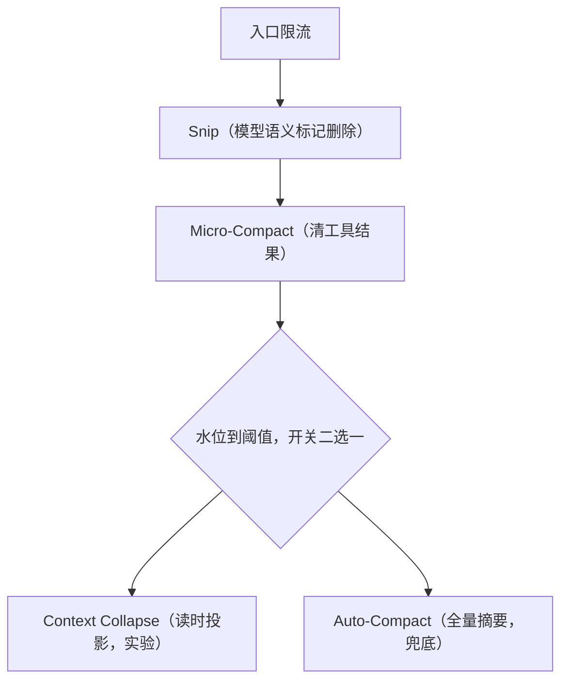

# 简介

压缩机制是属于 agent 上下文管理的一部分内容，因此，在介绍前，我会将常见的压缩机制先介绍一下，然后再介绍 claude code 的压缩机制。

# 常见的压缩机制

## 滑动窗口

滑动窗口的思路比较简单，超过 N 轮，或者 token 超过 n K，就开始砍掉之前的内容，从最老的消息开始砍，保留最新的若干条。

![[Pasted image 20260706194742.png]]

进阶一些的滑动窗口，会在砍掉老对话的时候，对老对话做一次摘要，然后将摘要与新对话的内容一起作为模型的输入，由此补充历史的信息。

## 每N轮做摘要

每 N 轮做摘要的思路是，每过 N 轮或者上下文超过 N K token，就触发一次摘要，对以往的对话生成总结，然后将总结替换原来的消息。

![[Pasted image 20260706202315.png]]

## 向量召回历史

部分系统会有思路通过向量来找回历史片段，这个说实话，见得少，问题也挺多的，比如，向量找回其实是无序的，工具调用对会被切散，还有就是，找回的内容仅是与问题有关，一些关键的背景知识是没有召回的。

![[Pasted image 20260706214200.png|697]]

## 通用方案不好的原因

- **滑动窗口**（砍最老的消息）：agent 的任务目标和约束都在对话开头，砍开头 = 忘了自己在干什么。聊天可以容忍，agent 不行。
- **定期摘要**：机械触发 + "摘要的摘要"逐层衰减，且不区分"对话"和"工具输出"这两种价值密度完全不同的内容。
- **向量召回**：把上下文变成外部记忆，检索回来的是碎片；编码 agent 需要的是连贯的工作状态，碎片拼不出状态。
- 提炼三个评价维度，后面反复用：**触发时机**（机械阈值 vs 任务边界）、**压缩粒度**（整段砍 / 摘要 / 只动工具输出）、**信息损失**（丢的是什么，怎么兜底）。

# claude code的压缩

Claude Code 的"压缩"不是一个机制，而是**一条多级流水线**。逆向分析发现，每次调用模型前会依次跑过多个"上下文整形器"（compaction shapers）：




整体的设计哲学是**递进升级**：能用便宜的方法就绝对不用贵的，前面几级不调用 llm、不破坏缓存，只有到最后一级 auto-compact 才付出一次调用模型做全量摘要的代价。

## 上下文内容

在讲解上下文前，需要知道上下文里面装了什么内容：

1. 组成：system prompt、工具定义、claude.md/memory、已加载的 skill、对话历史、工具输出（读文件内容、命令结果、搜索结果）。工具输出通常是大头，且时效性短，一次失败的构建日志，修完就没价值了。
2. claude code 中 `/context` 可以看到各部分的实际占用，包括一块显式的 autocompact buffer。
3. 记账方式：不是每轮重新精确数 token，而是基于上一次 api 响应返回的 usage 做增量估算（headroom accounting），预留输出预算 + 警告缓冲 + 错误缓冲，多级水位线。

## 阈值计算

```
effectiveContextWindow = contextWindow - min(modelMaxTokens, 20_000)   // 扣掉输出预留
autoCompactThreshold   = effectiveContextWindow - 13_000               // 自动压缩水位线
warningThreshold       = effectiveContextWindow - 20_000               // 警告水位线
```

以 200K 窗口为例：**约 160K 时开始警告（statusline 显示 "context left until auto-compact"），约 167K 时触发自动压缩**。

两个缓冲数字都有讲究：20K 的输出预留不是拍脑袋——源码分析显示它基于摘要输出长度的 **p99.99 实测值 17,387 token** 定的（要保证压缩摘要本身写得下）；加上 13K 的触发缓冲，距原始窗口共约 33K 余量。

可配置项：

- 环境变量 `CLAUDE_AUTOCOMPACT_PCT_OVERRIDE`——改触发百分比（设 60 表示用到 60% 就压）；
- `/config` 里可整体关闭 auto-compact；
- CLAUDE.md 里写一节 "Compact Instructions"，每次压缩都会遵守（官方支持）。

## 流水线拆解

先看一张总表：五层的触发范式各不相同——**事件、语义、时间、水位**四种正交信号，各自盯着不同的浪费来源，这比"一个阈值管所有"精细得多：

| 层 | 触发范式 | 条件 |
| ---- | ---- | ---- |
| 大结果存磁盘 | 事件驱动 | 单条结果 >50KB 或单消息内合计 >200KB，产生时就地检查 |
| Snip | 模型驱动 | 模型语义判断，调 snip 工具按消息 id 标记无用消息 |
| Micro-Compact | 时间驱动 | 距上次 API 调用 >60 分钟（cached 变体随需） |
| Context Collapse | 水位驱动 | 约 90%，与 Auto-Compact 互斥（开关选路） |
| Auto-Compact | 水位驱动 + 手动 | 超过 `autoCompactThreshold` 或 `/compact` |

### 1. 入口限流

压缩的最好方式是过滤信息密度低的信息。工具输出在产生时就被限流：

- **Read 工具**：默认最多读 2000 行，超长行截断——大文件从源头上进不来全文。
- **Bash 输出**：超过 30000 字符截断。
- **大结果存磁盘**：单个工具结果超过 **50KB**、或一条消息里所有工具结果合计超过 **200KB**，直接写入磁盘，上下文里只保留 **2KB 预览 + 路径引用**——需要时 agent 可以再去读全文（源码分析，小林笔记）。逆向分析称之为 "**hot tail / cold storage**" 分层：最近的输出保持完整可见（热尾部），旧的大输出降级为引用（冷存储）。
- **MCP 工具输出**：有独立的 token 上限（可用 `MAX_MCP_OUTPUT_TOKENS` 调整）；MCP 工具定义本身也默认延迟加载（tool search），不用不进上下文。
- 同类思路的还有 **subagent**：探索性工作丢给子代理，子代理在独立上下文里烧 token，只把一份总结带回主上下文——相当于"预防性压缩"。

入口限流和实际"压缩"操作无关，但它决定了压缩的频率。入口限得越好，后面的贵手段用的越少。

### 2. Snip——模型语义标记删除无用消息

不少二手文章把 snip 和 microcompact 混为一谈。实际上，他们是独立的两个层：snip 砍的是消息，micro-compact 清的是工具结果的内容。

snip 不是自动阈值触发的：模型在正常回答时调用一个专门的 **snip 工具**，**按消息 id 把没用的消息标记出来**，被标记的消息删除，并在删除处插入一条清理边界标记，让模型知道这之前还有内容，但已经被清理。也就是说砍什么、什么时候砍由模型的**语义判断**决定，没有机械阈值。

效果上类似滑动窗口，但机制聪明得多：滑动窗口按**位置**砍（最老的先死），snip 按**价值**砍（没用的先死）——任务开头的目标和约束只要还有用就不会被标记，所以滑动窗口"丢任务意图"的致命伤在这里不成立；即便误删，信息最终还有 auto-compact 的全量摘要兜底。

### 3. Micro-Compact——清工具结果，不动对话

核心观察：**工具输出和对话消息的价值密度完全不同**。工具输出体积大、时效短、而且**可再生**——文件可以重读、命令可以重跑。丢它的风险远小于丢对话。

- **可以被压缩的工具**：Read、Bash、Grep、Glob、WebSearch、WebFetch、Edit、Write，全是"可再生"型输出。
- **操作**：把老的工具结果内容替换成占位符（如 `[Old tool result content cleared]`），原文已在磁盘上（会话 JSONL / 落盘文件），对话消息本身一条不动。
- **保留规则**：保留最近 5 个工具结果 + 不可剪辑的结果（**子 agent 输出和任务状态**不清）。
- **硬性不变量**：API 要求 `tool_use` 和 `tool_result` 必须成对出现，所以清除只能替换内容、不能删消息，否则请求直接报错——这是实现里必须维护的约束。

![[Pasted image 20260706235842.png]]

两个变体（逆向分析，部分为内部灰度功能）：

1. **Time-based microcompact**：距上次请求超过 **60 分钟**（prompt cache TTL 早已过期）时触发。既然缓存反正没了，清理旧工具结果重建一个更小的前缀是**零成本操作**——不用调 LLM，也没有缓存损失。触发条件选 60 分钟，本质是"挑缓存已死的时机做打扫"。
2. **Cached microcompact**：通过 Anthropic API 的 **`cache_edits`** 指令，让服务器直接从已缓存的前缀里删除指定块——本地消息不动，缓存前缀不失效。逆向分析称重复轮次上可省约 76% 成本。对应 API 公开的 context editing 能力。

> microcompact 的一切设计都围着 **prompt cache** 转。压缩省的是窗口空间，但搞不好会赔上缓存命中率（缓存前缀一变全部失效），这两者的权衡贯穿整条流水线。

### 4. Context Collapse——读时投影（实验特性）

- 触发：上下文达到约 **90%** 时启用（源码分析）。
- 思路与前几级根本不同：**不修改存储的消息历史**，而是在每次调用模型前**动态计算一个压缩后的视图**（读时投影）——维护提交式的摘要日志，把历史的多个片段投影成"摘要 + 保留的部分原文"。
- 类比：前几级是"改数据"，这一级是"改查询"——存储层保持全量，展示层按需折叠。数据库里物化视图 vs 查询时聚合的区别。
- 与 Auto-Compact 是**二选一**关系：由开关控制，同一时刻只有一个生效——它是 auto-compact 的实验性替代品，不是它前面的一个层级。
- 目前是实验特性，公开资料仍是各级中最少的。

![[Pasted image 20260707000750.png]]

### 5. Auto-Compact——全量结构化摘要（最终兜底）

前面手段都不够时的最终手段，也就是用户感知到的 "compacting..."。

#### 触发方式

- 自动：token 估算超过 `autoCompactThreshold`（见公式）。
- 手动：`/compact`，可带焦点指令（`/compact focus on the API changes`）。逆向分析提到较新版本还支持选择压缩范围："从此处总结"（保住缓存前缀）vs "总结至此处"（缓存失效）——又是缓存权衡。
- Hook 时机：压缩前会触发 **PreCompact** hook（matcher 可区分 `manual`/`auto`），压缩完成后重建上下文时触发 **SessionStart** hook（source 为 `compact`）——想在压缩前自动备份状态可以挂在这里。

手动与自动不只是入口不同，行为上有三处差异：

|                             | 手动 `/compact`      | 自动触发           |
| --------------------------- | ------------------ | -------------- |
| 自定义指令（customInstructions）   | 支持，焦点指令拼进摘要 prompt | 不支持            |
| `suppressFollowUpQuestions` | 关——允许摘要过程提出确认问题    | 开——静默完成，不打断任务流 |
| 断路器                         | 不适用（用户自己负责）        | 连续 3 次失败熔断     |

注意，这里 `suppressFollowUpQuestions` 是禁止生成后续提问。

#### 全量重写

1. **先跑一遍 microcompact 预处理**：把可清的老工具结果换成占位符，用瘦身后的消息链再送进摘要器——不让海量过期工具输出污染摘要、浪费摘要模型的注意力。
2. **分叉一个 subagent 来做摘要**，而不是在主对话里做——子进程与父进程共享 prompt cache 前缀，摘要调用本身的成本大幅降低（逆向分析称此项缓存共享全网每天省约 380 亿 token）。摘要用的是**同一个主模型**而非便宜的小模型：既保证摘要质量，也正是为了能复用缓存前缀。
3. 摘要 prompt 要求先在 `<analysis>` 标签里写分析草稿（最终被剥离丢弃），再在 `<summary>` 标签里按固定 9 节输出：
	1. 主要请求与意图（Primary Request and Intent）
	2. 关键技术概念（Key Technical Concepts）
	3. 涉及的文件与代码段（Files and Code Sections）
	4. 错误与修复（Errors and Fixes）
	5. 问题解决过程（Problem Solving）
	6. 所有用户消息（All User Messages）——prompt 明确要求**逐条枚举，不许概括**
	7. 待办任务（Pending Tasks）
	8. 当前工作（Current Work）——要求细颗粒度到**具体函数名**
	9. 下一步（Next Step，可选）
4. 用摘要**替换**整个对话历史，作为新上下文的开头。

源码里几个防御性细节（小林笔记），很能体现"prompt 也是工程"：

- `<analysis>` 草稿区先自由梳理再落笔，草稿最终剥离——用显式的思考空间换摘要质量；
- prompt 开头结尾**双重强调** "CRITICAL: Respond with TEXT ONLY"，并威胁 *"Tool calls will be REJECTED and will waste your only turn"*——防止摘要模型手痒去调工具；
- **递归守卫**：`querySource` 为 `'compact'` 或 `'session_memory'` 的请求直接禁止再触发压缩——防止"压缩请求自己把窗口撑爆又触发压缩"的自递归。

另外较新版本还有一条**免 LLM 的优化路径（session-memory compaction，逆向分析）**：平时就增量维护一份约 9 节的"工作状态文档"（当前状态、任务规范、修改过的文件等），压缩触发时直接拿它当摘要，省掉摘要调用；据称压缩后恢复工作状态约 2-3 轮（全量摘要路径约 4-5 轮）。相当于把摘要从一次性批处理改成流式增量维护——类似数据库里 WAL/checkpoint 的关系。

**9 节小节清单值得逐项琢磨——它就是"什么值得保留"的显式定义**：

- "所有用户消息"单独成节：用户说的每句话都是需求信号，宁可全留( 不包括**tool result**)；
- "错误与修复"单独成节：防止压缩后把踩过的坑再踩一遍；
- "当前工作 + 下一步"收尾：这份摘要是**面向继续干活的**（continuation-oriented），不是面向存档的——这是它和普通"对话摘要"的根本区别。

#### 压缩后的状态重建（rehydrate）

只留摘要不够——摘要说"正在改 foo.py"，但 foo.py 的内容已随原对话消失。摘要生成后的接续是一条**五步流水线**：

1. 拿到摘要文本；
2. **清空三个缓存**：`readFileState`（文件读取状态）、`loadedNestedMemoryPaths`（已加载的嵌套 memory）、`getUserContext`（CLAUDE.md）；
3. **并发生成附件**；
4. `buildPostCompactMessages` 把新消息链组装成**四段**：**边界标记 → 摘要消息 → 附件 → hook 结果**；
5. 新消息链整体替换旧消息。

第 2 步的三个缓存都是进程内存里的"记账本"，记录的是**"哪些东西已经注入过上下文"**，作用是防止重复注入浪费 token。压缩把上下文整个换掉了，账本记的事实全部作废，所以必须清零——缓存描述的对象没了，缓存自己还活着，就是假账：

- **`readFileState`（文件读取状态表）**：记录哪些文件已 Read 进上下文、读的是哪个版本。平时负责 Edit 前置检查（改文件前必须先 Read 过）、外部修改后的重读提醒、防止重复注入文件内容。不清空的后果：模型明明看不见文件，账本却说看得见，前置检查和重读提醒全部失灵。清零后附件段重附文件时重新登记，账实相符。
- **`loadedNestedMemoryPaths`（嵌套 memory 已加载路径表）**：子目录的 CLAUDE.md（如 `src/api/CLAUDE.md`）是惰性加载的——agent 摸到该目录才注入，这张表防止重复注入。不清空的后果：注入过的规则随旧对话消失，表里却记着"已加载"，子目录规则**静默丢失**。清零后 agent 再碰该目录会自动重新注入。
- **`getUserContext`（CLAUDE.md 组装缓存）**：每轮拼 prompt 用的全局 + 项目 CLAUDE.md 内容缓存，避免每轮读盘重拼。清掉它，下一轮强制全量重载——"CLAUDE.md 免疫压缩损失"就是靠这一下实现的，没有任何额外机制。

清缓存和四段消息是配合关系：清缓存管"**以后**每轮自动重载的东西"（CLAUDE.md、嵌套 memory、文件状态），附件段管"**现在立刻**塞回去的东西"（文件、todo、skill）——一个恢复机制，一个恢复数据。

四段逐一拆开看：

1. **边界标记（compact boundary）**：一条很短的结构性标记，内容基本是元数据——这里发生过一次压缩、手动还是自动触发、压缩前用了多少 token。对 UI，它是界面上"对话已压缩"的那条分割线（旧对话仍可翻，但模型已看不见）；对模型，它声明"你的上下文从这里开始是重建的"。
2. **摘要消息（summary message）**：四段里**唯一经过 LLM 有损压缩**的部分，三明治结构——最外层一句包装声明（大意是"本会话是从之前一次因上下文耗尽而中断的对话延续过来的"，引导模型接力而非从头开始）；中间是 `<summary>` 里的 9 节摘要正文（`<analysis>` 草稿已剥离）；末尾是 continuation 指令（*"continue the conversation from where we left it off without asking the user any further questions"*——不许压完反问用户"我们刚才聊到哪了"）和**底牌通道**：附上 transcript 文件路径，摘要毕竟有损，agent 真需要某个历史细节时可以自己去读完整记录，给有损压缩留一个无损兜底。JSONL 里这条消息带 `isCompactSummary` 类标记。
3. **附件段（attachments）**：**不经摘要、从磁盘原样重取**的工作状态，即五步流水线里"并发生成附件"的产物。清单：最近 Read 过的文件按活跃度排序重附——`POST_COMPACT_MAX_FILES_TO_RESTORE = 5`、单文件 `POST_COMPACT_MAX_TOKENS_PER_FILE = 5_000`、总预算 `POST_COMPACT_TOKEN_BUDGET = 50_000`；另有当前计划文件、激活的 skill（预算约 25K）、todo、**异步子 agent 的任务状态**（保证主 agent 压缩后仍感知子任务进度）。它和摘要的本质区别：摘要说"正在改 foo.py"是**转述**，附件里是 foo.py 的**原文**——语义走有损通道，状态走无损通道。
4. **hook 结果段**：留给用户的扩展槽。压缩后重建上下文时触发 SessionStart hook（source=`compact`），你配置的命令输出注入到这里——比如挂个脚本，每次压缩后自动塞回"当前分支、未提交改动"，弥补摘要可能丢掉的环境信息。没配 hook 则这段为空。

还有一条不在四段消息里、但同属重建过程的旁路：

- **CLAUDE.md 不走摘要**：靠第 2 步清掉 `getUserContext` 缓存，下一轮组装 prompt 时自动重新加载全量 CLAUDE.md——写进 CLAUDE.md 的规则天然免疫压缩损失；system prompt 则完全不参与压缩，压缩后由 `buildEffectiveSystemPrompt` 重新构造。

类比：这四段相当于一台机器重启后的恢复过程——边界标记是重启日志里那行"系统于某时重启"，摘要是"你之前在干什么"的叙述，附件是自动重新打开的文件和工作区，hook 是你自己写的开机自启脚本。顺序从抽象到具体：先声明发生了什么，再给叙事，再给精确的工作材料，最后跑用户自定义逻辑。

> 设计哲学：**不同信息走不同通道**——语义信息进摘要、状态信息走附件、永久指令靠缓存清理后重载、操作配置每轮重建。压缩不是"一锅摘要"，而是按信息类型分流。

#### 压缩失败时的兜底

压缩本身也会失败，这里的工程处理很见功力：

- **Reactive compaction**：如果估算失误、请求打出去收到 `prompt_too_long` 错误，退化为反应式处理——从最早的消息开始截断重试，同时保护 tool_use/tool_result 配对不被拆散。
- **断路器（circuit breaker）**：自动触发路径上**连续 3 次压缩失败就熔断、不再重试**（手动 `/compact` 不受限）。典型场景：某个文件太大，压完摘要 + 重附文件后窗口立刻又满，压缩陷入死循环（thrashing）。此时停止自动压缩、直接报错让用户处理（官方文档也记载了这个 thrashing 错误）。这条是生产事故换来的：源码分析提到曾有 1000+ 会话因反复失败的压缩空烧 token。
- **最终手段（session reset）**：只保留 system prompt 和用户意图，其余全弃。
- 另外会话本身的 JSONL 在**每次 API 调用前就已落盘**，进程被杀也能 `--resume` 恢复——压缩再失败，数据也不丢。


## 总结：回到三个维度

| 维度   | 滑动窗口      | 定期摘要  | 向量召回  | Claude Code                           |
| ---- | --------- | ----- | ----- | ------------------------------------- |
| 触发时机 | 机械阈值      | 机械阈值  | 每次检索  | 多级水位线 + 缓存 TTL 时机 + 用户可控任务边界          |
| 压缩粒度 | 整条消息截断    | 对话→摘要 | 对话→碎片 | 递进：入口限流→砍远古消息→清工具结果→读时投影→全量摘要         |
| 信息损失 | 丢任务开头（致命） | 逐层衰减  | 丢连贯状态 | 优先丢"可再生"内容；摘要结构显式定义保留清单；文件/skill 重附兜底 |

三条设计洞察：

1. **区分"可再生"与"不可再生"信息**是整个体系的支点：工具输出可以重新执行拿回来，所以最先牺牲；用户消息不可再生，所以摘要 prompt 里"所有用户消息"单独成节。
2. **压缩与 prompt cache 是一对矛盾**：压缩动了前缀就毁缓存。所以有了 cache_edits 服务端删除、60 分钟 TTL 时机选择、fork subagent 共享缓存做摘要——一半的工程复杂度在伺候缓存。
3. **压缩是有损的，所以要有损失预算**：先丢最便宜的（老工具输出），再丢次便宜的（对话细节，靠结构化摘要控制损失），配额式重建（文件 50K、skill 25K），最后还有断路器防止压缩本身失控。
