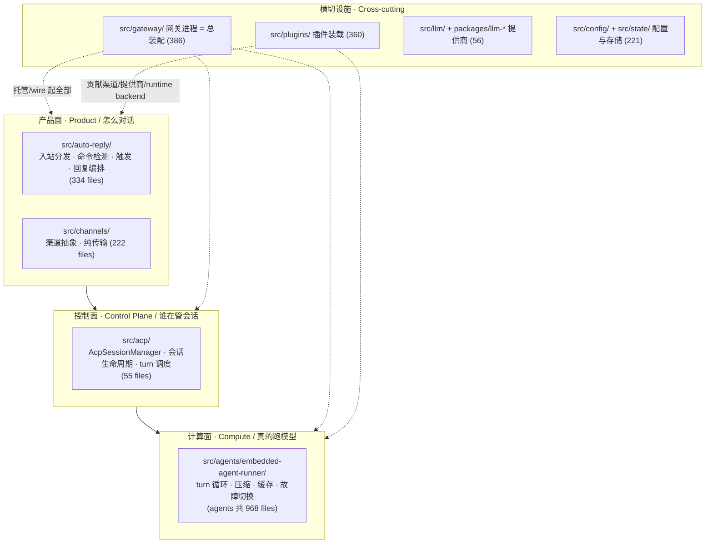
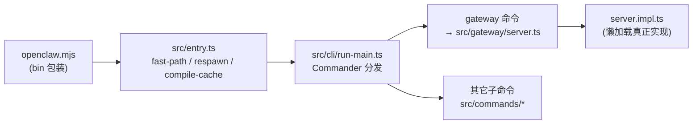
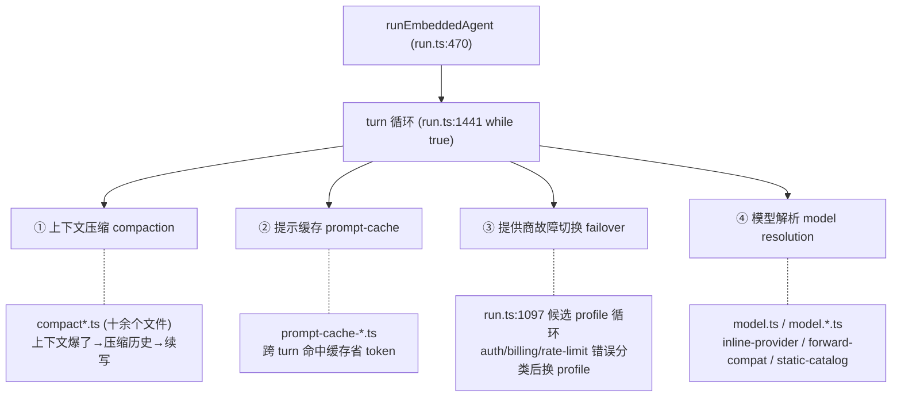
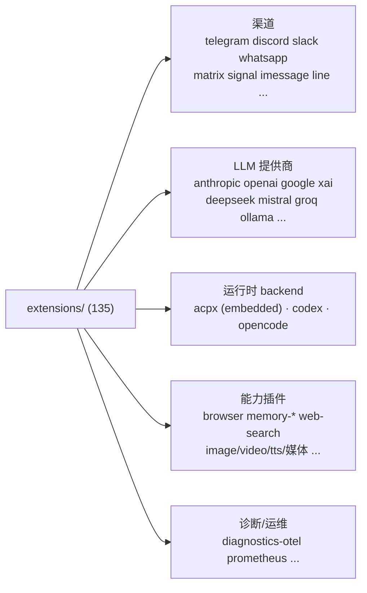
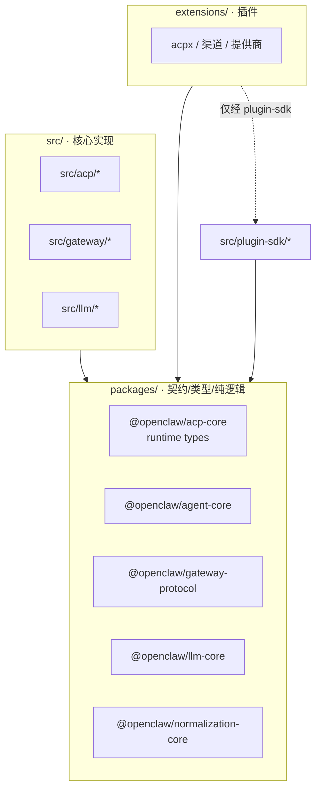
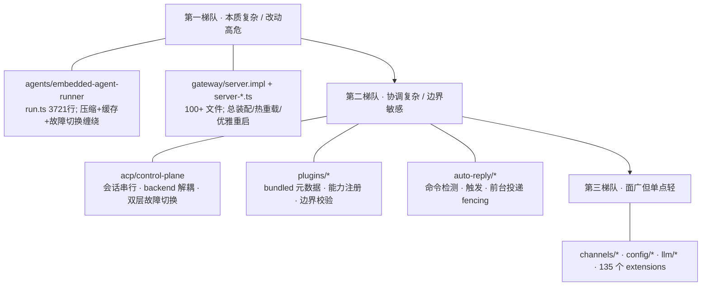

# OpenClaw 架构全景地图（第 0 遍 · 浅而广）

> 版本基准：`package.json` version `2026.6.2`，分支 `main`。
> 文档性质：**全项目地图**，不是任何单一子系统的逐函数走读。
> 阅读深度：架构原理为主，配关键代码节选与图解。

---

## 目录

0. [怎么读这份文档](#0-怎么读这份文档)
1. [OpenClaw 是什么 · 全局心智模型](#1-openclaw-是什么--全局心智模型)
2. [进程入口与启动链](#2-进程入口与启动链)
3. [子系统全景图](#3-子系统全景图)
4. [一条入站消息的一生](#4-一条入站消息的一生)
5. [控制面：ACP](#5-控制面acp)
6. [计算面：embedded-agent-runner](#6-计算面embedded-agent-runner)
7. [插件 / 扩展体系](#7-插件--扩展体系)
8. [Channels：纯传输层](#8-channels纯传输层)
9. [LLM / Provider / Model-catalog](#9-llm--provider--model-catalog)
10. [存储与配置](#10-存储与配置)
11. [`packages/` 契约层 vs `src/` 实现层](#11-packages-契约层-vs-src-实现层)
12. [贯穿性架构主题](#12-贯穿性架构主题)
13. [复杂度地图与深挖建议](#13-复杂度地图与深挖建议)
14. [附录：关键文件速查表](#14-附录关键文件速查表)

---

## 0. 怎么读这份文档

这是一张**地图**，不是说明书。目标是让你在动手改任何一处之前，先有一张「子系统怎么切、彼此怎么说话、复杂度堆在哪」的整图。它**故意不深入**任何一片——`src/agents/` 一个目录就有 968 个非测试源文件，想一遍啃完只会写成泛泛而谈。真正要精读时，对单个子系统再单独跑一次本技能（见第 13 章）。

三条约定：

- **以当前代码为准。** 文中每个论断都落到我实际读过的 `文件:行号`。当 `README.md` / `CLAUDE.md` / `docs/` 与代码不一致时，以代码为准并明确指出。
- **敢下判断。** 哪个文件其实过大、哪个设计是经验调出来的、哪里是故意做简单——宁可有观点，不写面面俱到的流水账。
- **引用用仓库根相对路径**（项目 `AGENTS.md:9` 的硬要求），交叉引用写「见第 X 章」而非超链接，方便打印。

一个**先要破除的误解**：`src/gateway/boot.ts` 听名字像是「网关启动」，其实它是跑每个 workspace 根目录 `BOOT.md` 检查脚本的 runner（`src/gateway/boot.ts:1` 的文件头注释、`:45` `BOOT_FILENAME = "BOOT.md"`）。真正的网关服务器启动在 `src/gateway/server.impl.ts`。**别看文件名下结论**——这个仓库里这类命名陷阱不止一处。

---

## 1. OpenClaw 是什么 · 全局心智模型

一句话：**OpenClaw 是一个「个人 AI 网关」**——把 Telegram / Discord / Slack / WhatsApp 等聊天渠道接进来，背后挂一个能跑工具、能多轮、能换模型的 AI 助手，由一个常驻的 **Gateway 进程**做控制面。`package.json:4` 的自我描述是 "Multi-channel AI gateway with extensible messaging integrations"。

理解整个仓库，先装下这张**三层心智模型**。所有 5144 个源文件都可以挂到这三层之一，或挂到「支撑三层的横切设施」上：



为什么这么切？因为这三层的**变化原因完全不同**：

- **产品面**关心「一条消息进来该不该回、回什么、怎么分块发回去」——这是业务逻辑，频繁变。
- **控制面**关心「这条消息属于哪个会话、这个会话现在能不能开新 turn、turn 超时了怎么清理」——这是协调逻辑，相对稳定。
- **计算面**关心「把上下文喂给模型、循环跑工具直到出最终答案、上下文爆了怎么压缩、这家提供商挂了切哪家」——这是最脏最复杂的一层。

把它们隔开的最大好处，是计算面可以被**替换**：核心并不绑定「用哪个 agent 引擎跑」，这正是第 5 章要讲的 ACP backend 解耦。

---

## 2. 进程入口与启动链

CLI 可执行文件在 `package.json:16-18`：`"openclaw": "openclaw.mjs"`。从命令行敲 `openclaw` 到真正干活，链路是：



几个**入口层的设计意图**，光看代码能读出来：

- **`src/entry.ts` 做的全是「还没进 Commander 就要决定的事」**：根 `--version` 快路径（`src/entry.ts:17` `tryHandleRootVersionFastPath`）、Windows argv 规范化（`:10`）、编译缓存开关与必要时不带缓存重启自己（`:12-15` `enableOpenClawCompileCache` / `respawnWithoutOpenClawCompileCacheIfNeeded`）、`--profile` 环境注入（`:8`）。这些都是为了让 `openclaw --version`、`openclaw --help` 这种高频轻量调用**不去付完整依赖图的加载成本**。
- **`src/index.ts` 不是主入口，是个双面文件。** 它顶部注释自称「Legacy direct file entrypoint」（`src/index.ts:50`），`isMain` 为真时走 CLI（`:120` `runLegacyCliEntry` → 动态 `import("./cli/run-main.js")`），为假时把一堆 `loadConfig` / `loadSessionStore` 等导出绑给库消费者（`:63-86`）。换句话说：**当库用就导出 API，当命令跑就转发 CLI**。读代码时别被它顶部那串 `export let` 误导成「这是公共 API 中心」。
- **网关 `server.ts` 是个纯懒加载门面**（`src/gateway/server.ts:1-8` 注释明说）：`startGatewayServer`（`:31`）先 `await import("./server.impl.js")` 再调用，目的是「让只想 import 类型/helper 的轻量调用方，不用付完整启动依赖图」。`server.impl.ts:1` 才是真正建运行时状态、HTTP/WS、配置热重载、优雅重启的地方。

**判断**：这一层的复杂度（fast-path、respawn、compile-cache、profile）几乎全是为**冷启动延迟**服务的。一个聊天网关的体感很大程度由「敲命令到响应」决定，所以团队在入口处花了不成比例的功夫做懒加载和快路径。后面你会看到同一套「lazy import」思路反复出现（见第 12 章）。

---

## 3. 子系统全景图

`src/` 下 **66 个子目录**，下表只列承重的那些（文件数为非测试 `.ts`，由 `find` 统计）。复杂度 ★ 是我读完入口后的主观评级，不是行数除一除。

| 子系统 | 入口/代表文件 | 一句话职责 | 文件数 | 复杂度 |
|---|---|---|---|---|
| `src/agents/` | `embedded-agent-runner/run.ts` | 跑模型 turn 循环、工具、压缩、故障切换 | 968 | ★★★ |
| `src/gateway/` | `server.impl.ts` | 网关进程：HTTP/WS、控制 UI、总装配 | 386 | ★★★ |
| `src/plugins/` | `runtime.ts` / `cli.ts` | 插件装载、能力注册、bundled 元数据 | 360 | ★★★ |
| `src/auto-reply/` | `dispatch.ts` / `reply.ts` | 入站→回复的产品逻辑管线 | 334 | ★★☆ |
| `src/channels/` | `registry.ts` / `session.ts` | 渠道抽象（传输层），会话信封/分块/打字态 | 222 | ★★☆ |
| `src/config/` | `types.openclaw.ts` / `io.ts` | 配置 schema、读写、会话存储 | 221 | ★★☆ |
| `src/llm/` | (provider 注册/目录) | 提供商注册表、模型目录、传输 helper | 56 | ★★☆ |
| `src/acp/` | `control-plane/manager.core.ts` | 控制面：会话管理、turn 调度、backend 注册 | 55 | ★★☆ |
| `src/mcp/` | — | MCP（Model Context Protocol）工具桥接 | — | ★★ |
| `src/context-engine/` | `registry.ts` | 上下文引擎（压缩/检索）可插拔注册 | 7 | ★★ |
| `src/sessions/` | `session-key-utils.ts` | 会话 key 规范（注意：会话**存储**在 `config/sessions/`） | 14 | ★☆ |
| `src/tools/` | — | 工具定义/schema/policy | 8 | ★☆ |

旁边还有两个**不在 `src/` 但同等重要**的顶层：

- `packages/`：**21 个共享包**（`agent-core`、`acp-core`、`gateway-protocol`、`llm-core`、`plugin-sdk` 等）。这是「契约层」——core 和插件都依赖它，详见第 11 章。
- `extensions/`：**135 个 bundled 插件**（渠道：telegram/discord/slack/whatsapp…；提供商：anthropic/openai/google…；以及 acpx 这个关键 runtime 插件）。详见第 7 章。

**怎么用这张表**：你接到一个需求，先在这里定位它落在哪一层。「消息回复格式不对」→ `auto-reply`；「某渠道发不出图」→ 对应 `extensions/<channel>` + `channels`；「换模型后崩了」→ `agents/embedded-agent-runner` + `llm`；「会话串了/turn 卡住」→ `acp/control-plane`。

---

## 4. 一条入站消息的一生

这是整张地图的**主动脉**。一条用户消息从渠道进来、到 AI 回复发回去，跨越全部三层。下面是端到端时序（省略了鉴权、去重等支线）：

```mermaid
sequenceDiagram
    participant U as 用户(Telegram等)
    participant EXT as extensions/<channel><br/>(传输适配)
    participant DISP as auto-reply/dispatch.ts<br/>(产品逻辑)
    participant ACP as acp/AcpSessionManager<br/>(控制面)
    participant Q as SessionActorQueue<br/>(按会话串行)
    participant BK as acpx backend<br/>(插件注册)
    participant RUN as embedded-agent-runner<br/>runEmbeddedAgent
    participant M as LLM Provider

    U->>EXT: 原生消息事件
    EXT->>DISP: 规范化 inbound envelope
    Note over DISP: 命令检测 / 群激活 / 去抖 / 触发判定<br/>(dispatch.ts, reply.ts)
    DISP->>ACP: 解析 sessionKey, 请求开一个 turn
    ACP->>Q: actorQueue.run(sessionKey, op)
    Note over Q: 同一会话的操作排队串行
    Q->>ACP: runManagerTurn (manager.turn-runner.ts:52)
    ACP->>BK: 选 backend (requireAcpRuntimeBackend)
    BK->>RUN: 驱动一次 turn
    loop turn 循环 (run.ts:1441 while(true))
        RUN->>M: 发提示(含工具定义/缓存)
        M-->>RUN: 文本 / 工具调用
        Note over RUN: 跑工具 → 回灌结果 → 再问<br/>上下文爆了→压缩; 出错→换提供商
    end
    RUN-->>ACP: 终态 + ReplyPayload
    ACP-->>DISP: turn 结果流
    DISP-->>EXT: 回复分块/打字态/媒体
    EXT-->>U: 原生回复
```

读这张图要抓住的**三个交接点**，每个都是一处架构边界：

1. **`extensions/<channel>` → `auto-reply`**：渠道只负责把原生事件**翻译**成可移植的 inbound envelope，不掺业务。这条边界由 `AGENTS.md:94`「Message/channel plugins stay transport-only」硬性约束。
2. **`auto-reply` → `AcpSessionManager`**：产品逻辑算完「该回」之后，把活交给控制面。`dispatch.ts` 顶部（`src/auto-reply/dispatch.ts:1`）自述是 "dispatch orchestration, hook composition, and foreground delivery fencing"——注意那个 *fencing*（`:52` `foregroundReplyFenceByKey`），是为了防止同一会话多条回复抢着发、串行化前台投递。
3. **`AcpSessionManager` → backend → runner**：控制面**不自己跑模型**，它选一个已注册的 backend（第 5 章）。backend 再去驱动真正的 runner（第 6 章）。

---

## 5. 控制面：ACP

ACP = Agent Communication Protocol，是 OpenClaw 的控制平面。核心是一个类：`AcpSessionManager`（`src/acp/control-plane/manager.core.ts:64`）。它自述职责是「coordinates ACP session metadata, runtime handles, per-session queues, and turn execution」（`:63`）。

它持有的四样东西，就是控制面的全部状态（`manager.core.ts:65-74`）：

```ts
private readonly actorQueue = new SessionActorQueue();              // 按会话串行
private readonly runtimeHandles = new ManagerRuntimeHandleCache();  // 运行时句柄缓存
private readonly activeTurnBySession = new Map<...>();              // 每会话当前 turn
private readonly turnLatencyStats / errorCountsByCode;             // 可观测性
```

### 5.1 按会话串行：SessionActorQueue

这是控制面最该理解的一个不变量。`SessionActorQueue.run(actorKey, op)`（`src/acp/control-plane/session-actor-queue.ts:25`）把同一个 `actorKey`（会话）下的所有操作丢进一个 `KeyedAsyncQueue` 串行执行。**同一会话永远不会有两个 turn 并发**——这避免了 transcript 写竞争、模型上下文错乱。它还顺手维护每会话的 pending 计数（`:27-38`），并特意在 `onSettle` 注释里写明「即使操作 reject 也要保持计数对称」（`:31`）——这种「队列深度记账对称性」正是 `AGENTS.md:103` 点名要求加注释的那类不变量。

### 5.2 关键解耦：backend 由插件贡献，核心里没有

这是整个仓库**最值得记住的一个设计**。控制面知道「要跑一个 turn」，但**它不知道也不关心用什么引擎跑**。引擎（backend）是从一个进程级注册表里取的：`src/acp/runtime/registry.ts`。

`requireAcpRuntimeBackend()`（`registry.ts:94`）在没有任何 backend 时直接抛错：

```ts
throw new AcpRuntimeError(
  "ACP_BACKEND_MISSING",
  "ACP runtime backend is not configured. Install and enable the acpx runtime plugin.",
);  // registry.ts:97-100
```

也就是说，**纯核心装好后是跑不了任何 turn 的**——必须有插件来注册 backend。这把 `AGENTS.md:56`「Core stays plugin-agnostic」从一句口号变成了机制：核心连「怎么跑 agent」都不内置。

谁来注册？`extensions/acpx` 这个 bundled 插件。它的 service（`extensions/acpx/register.runtime.ts:90`）调用 `registerAcpRuntimeBackend({ id: "acpx", runtime: createDeferredRuntime(state) })`。而且注册的是个**懒代理**（`:64-67` `createLazyAcpRuntimeProxy`）：插件启动时立刻登记一个占位 backend，真正那套重型 service 直到第一个会话需要时才 `import("./src/service.js")` 加载（`:31-34`、`:43-54`）。还留了个逃生阀 `OPENCLAW_SKIP_ACPX_RUNTIME=1`（`:84`）。

注册表本身用了一个**跨上下文 global singleton 技巧**（`registry.ts:20-37`）：把状态挂在 `process[Symbol.for("openclaw.acpRuntimeRegistryState")]` 上，注释解释原因是「Vitest 和 Jiti 下，注册方与读取方可能跑在不同的 `globalThis` 上下文里，却共享一个 Node 进程」（`:32-34`）。这是测试基建逼出来的现实妥协，不是洁癖设计——值得知道但别模仿。

### 5.3 turn 执行与故障切换

真正执行一个 turn 的是 `runManagerTurn`（`src/acp/control-plane/manager.turn-runner.ts:52`），文件头自述管「turns, failover, timeout cleanup, and detached-task progress mirroring」（`:1`）。注意它在控制面这一层就已经有 **backend 级故障切换**（`:6-11` 引入 `resolveBackendCandidatePlan` / `shouldAttemptBackendFailover`）和**超时清理**（`:24-28` `awaitTurnWithTimeout` / `cleanupTimedOutTurn`，宽限 `ACP_TURN_TIMEOUT_GRACE_MS = 1_000` `:42`）。

**这里有个容易踩的认知坑**：故障切换有**两层**。控制面切的是 *backend*（这套引擎挂了换那套）；计算面切的是 *provider/auth profile*（这家模型 API 挂了换那家，第 6 章）。两层各管各的，别混。`AGENTS.md:97` 还专门规定终态合并只能走 `src/agents/agent-run-terminal-outcome.ts`，不许在投影里重新推导超时/取消优先级——说明历史上这里出过「同一个 turn 终态在不同地方算出不同结果」的 bug。

---

## 6. 计算面：embedded-agent-runner

**这是全项目最复杂的一片，没有之一。** 给个量化：`embedded-agent-runner/` 目录的编排入口 `run.ts` 单文件 **3721 行**（`wc -l` 实测）。而 `AGENTS.md:209` 白纸黑字写着「Split files around ~700 LOC」——这个文件是该上限的 **5 倍多**。这不是黑它，是要你有心理准备：进这片之前先扎好上下文，别指望随手扫一眼。

主入口是 `runEmbeddedAgent`（`src/agents/embedded-agent-runner/run.ts:470`），turn 循环是 `:1441` 的 `while (true)`。围绕这个循环，整个目录（100+ 文件）解决四类硬问题：



为什么这一片这么重？因为它要同时对付**三件互相纠缠的烂事**：

1. **上下文会爆。** 长对话迟早超出模型窗口。`compact.ts` / `compaction-*.ts`（目录里十几个 `compact*` 文件）负责在爆之前把历史压成摘要再续写，还要处理「压缩后续转写」「压缩循环守卫」（`post-compaction-loop-guard.ts`）这些边角——压缩本身可能触发新一轮压缩，得防死循环。
2. **token 很贵。** `prompt-cache-*.ts` 一组文件做提示缓存的命中与可观测性。`AGENTS.md:108` 专门要求「map/set/registry/plugin 列表等在喂给模型前要确定性排序」——就是为了让缓存稳定命中，顺序一抖缓存就失效。
3. **提供商会挂。** `run.ts:1097` 那个 `while (nextIndex < profileCandidates.length)` 是在一组 auth profile 候选里轮换：某个 API key 限流/欠费/认证失败，分类后（`embedded-agent-helpers.ts` 里 `isAuthAssistantError` / `isBillingAssistantError` / `isRateLimitAssistantError` 等一票分类器，`run.ts:56-70` 引入）切下一个候选。

**判断**：这片代码的复杂度是**本质复杂度**，不是写糟了。它在用一个「能跑工具的循环」对抗真实世界的三个不确定性（窗口、成本、可用性）。`run.ts` 之所以 3721 行而没拆开，多半是因为这四类逻辑在循环体里高度耦合、状态互相穿插，硬拆反而要在文件间传一大坨状态——这是一个**有意识承担的技术债**，不是疏忽。真要改它，建议先单独对这一片跑一次本技能。

---

## 7. 插件 / 扩展体系

OpenClaw 的可扩展性全压在一套**子路径导出契约**上。打开 `package.json` 会看到它有 1960 行，其中绝大部分是 `exports` 字段里 **数百个** `./plugin-sdk/*` 子路径（`package.json:150-` 起，一直铺到一千多行）。每一个子路径就是一个**被显式承诺的 SDK 接缝**：

```jsonc
"./plugin-sdk/acp-runtime-backend": { ... },   // acpx 靠它注册 backend
"./plugin-sdk/channel-runtime": { ... },        // 渠道插件靠它
"./plugin-sdk/reply-payload": { ... },          // 回复负载
"./plugin-sdk/approval-runtime": { ... },       // 审批流
// …数百个
```

### 边界规则（硬策略）

`AGENTS.md:56-64` 把插件与核心的关系钉死：

- 插件**只能**经 `openclaw/plugin-sdk/*`、manifest 元数据、注入的 runtime helper、或文档化的 `api.ts`/`runtime-api.ts` 进入核心（`:57`）。
- 插件生产代码**不许** import 核心 `src/**`、别的插件 `src/**`、或包外相对路径（`:58`）。
- 反过来，核心与测试**不许**碰插件内部（`extensions/*/src/**`）（`:59`）。

这套边界不是君子协定——仓库里有专门的脚本去机器校验（`CLAUDE.md` 列的 `scripts/check-src-extension-import-boundary.mjs`、`scripts/check-sdk-package-extension-import-boundary.mjs`）。

### 135 个 extensions 怎么分类



**判断**：把渠道和提供商都做成插件、连「跑 agent 的 runtime」都做成插件（acpx），意味着核心的定位非常克制——它只是个**装配与协调骨架**。`AGENTS.md:63` 甚至区分了「内部 bundled 插件随核心 dist 发布」和「外部官方插件自带依赖、被排除出核心 dist」。这种克制是这个仓库能挂住 135 个扩展还不塌的根本原因。

---

## 8. Channels：纯传输层

`src/channels/`（222 文件）是渠道**抽象层**，注意它和 `extensions/<channel>` 的分工：

- `extensions/telegram/` 等：**具体某个渠道**的传输适配（连 Telegram Bot API、映射原生回调）。
- `src/channels/`：**所有渠道共享**的抽象——会话信封（`session-envelope.ts`）、目标解析（`targets.ts`）、回复分块、打字态生命周期（`typing-lifecycle.ts`）、状态反应（`status-reactions.ts`）、草稿流式编排（`draft-stream-loop.ts`）。还有个 `src/channels/plugins/` 子层做已加载渠道插件的注册表（`server.impl.ts:8-10` 引用 `registry-loaded.js`）。

**铁律**（`AGENTS.md:94-96`）：渠道**只搬运、不决策**。它们渲染「可移植的呈现/动作」、强制传输限制（比如消息长度）、映射原生回调信封；但**不拥有**产品命令树、不拥有提供商策略、不做功能菜单。`AGENTS.md:95` 还特别禁止渠道去「猜」一个以 `/` 开头的字符串是不是命令——命令必须由核心/owner 插件用**带类型的呈现动作**声明，渠道只做映射。

**为什么这么严**：因为有 15+ 个渠道。任何「在某个渠道里特判某个产品字符串」的口子，都会在另外 14 个渠道里制造不一致。把决策上提、让渠道变薄，是维持多渠道一致性的唯一可扩展方式。这条边界和「消息的一生」第 1 个交接点（见第 4 章）是同一回事。

---

## 9. LLM / Provider / Model-catalog

模型这一侧由 `src/llm/`（56 文件）加 `packages/` 里的 `llm-core`、`llm-runtime`、`model-catalog-core` 共同构成。分工大致是：

- **提供商注册表 / 模型目录**：哪些 provider 可用、每个 provider 有哪些 model、各自能力（上下文窗口、是否支持工具/视觉/缓存）。
- **传输 helper**：把统一的「发一轮」请求翻译成各家 API 的具体 HTTP 形态。
- **provider 由插件拥有 auth/catalog/runtime hook**（`AGENTS.md:93`「Providers own auth/catalog/runtime hooks; core owns generic loop」）。

这里有一条**已经发生的历史合并**值得知道：`AGENTS.md:66` 写明「OpenAI Codex is folded into `openai`」——不再有独立的 `openai-codex` provider/auth/model 路线，运行时只认 `openai` + `openai/*`，旧的 `openai-codex/*` 只在 `doctor`/迁移里被修。**读到任何 `openai-codex` 字样，先怀疑它是遗留输入处理，不是活路径。** 这正是本技能要求标注的那类「文档/旧资料 vs 当前代码」的偏差。

模型 id 在测试里的约定样例是 `sonnet-4.6` / `gpt-5.5`（`AGENTS.md:215`、`CLAUDE.md`）——看到这些不要当成真实线上默认。

---

## 10. 存储与配置

### 存储：只有 SQLite

`AGENTS.md:76` 一句话定调：「Storage default: SQLite only.」——OpenClaw 自己的运行时状态、缓存、队列、注册表、索引、游标、插件 scratch 数据，**一律不许**落 JSON/JSONL/TXT/sidecar 文件。访问只走 Kysely helper，不写裸 SQL 字符串（DDL/迁移除外）（`AGENTS.md:77`）。

两个标准库（`AGENTS.md:78`）：

- **共享状态库** `~/.openclaw/state/openclaw.sqlite`：全局运行时状态 + 插件 KV。由 `src/state/openclaw-state-db.ts` 打开并设 WAL 模式（`docs/refactor/database-first.md:287` 实录）。
- **每 agent 库** `~/.openclaw/agents/<agentId>/agent/openclaw-agent.sqlite`：agent 作用域的状态/缓存，包括 auth profile（`docs/concepts/model-failover.md:111`）。

迁移哲学是**数据库优先**（`AGENTS.md:75、83`）：运行时只读写当前规范库；老文件库/sidecar/别名/回退读取器**只能**待在 `openclaw doctor --fix` 迁移代码里，绝不进稳态运行时。换句话说——**没有「先试 SQLite，失败回退 JSON」这种分支**，那是被明令禁止的（`:83`）。

### 配置：只读当前形态

`AGENTS.md:67、74` 把配置规则定得同样硬：运行时**只**读规范化的当前配置形态，对老的/畸形的配置键**没有静默兼容**。如果一次配置变更让旧文件失效，必须配一个对应的 `openclaw doctor --fix` 迁移。配置/环境变量的新增门槛被刻意抬高（`:67`），因为 `openclaw.json` 和环境变量面已经很大——加新选项前要先证明「现有产品行为/提供商选择/默认值/doctor 迁移解决不了」。

配置类型中心在 `src/config/types.openclaw.ts`（`OpenClawConfig`，被几乎所有子系统 import，如 `manager.core.ts:8`、`dispatch.ts:3`）。读写在 `src/config/io.ts`（`server.impl.ts:14-21` 引用其热重载相关导出）。

**判断**：这套「单一规范形态 + doctor 集中迁移 + 禁回退」的纪律，是这个仓库敢于频繁重构而不爆兼容地狱的底气。代价是每次破坏性变更都要写迁移——团队选择把兼容成本**集中**在 doctor 里，而不是**弥散**到运行时各处的 `if (老形态)` 分支。这是个很值得学的取舍。

---

## 11. `packages/` 契约层 vs `src/` 实现层

为什么一个项目要拆 **21 个 `packages/`**，而 `src/` 里又有对应名字的目录（比如 `packages/llm-core` 和 `src/llm`、`packages/acp-core` 和 `src/acp`）？

观察导入方向就懂了。以 ACP 为例：控制面实现 `src/acp/control-plane/manager.core.ts:2-7` import 的是 `@openclaw/acp-core/runtime/types` 里的**类型**（`AcpRuntime`、`AcpRuntimeHandle`…）；插件 `extensions/acpx` 注册 backend 时 import 的也是同一套类型（经 `openclaw/plugin-sdk/acp-runtime-backend`）。



**规律**：`packages/*` 是**谁都能依赖的最底层契约与纯逻辑**（类型、协议、规范化、不带副作用的核心算法）。`src/*` 是**核心运行时实现**，依赖 `packages/*` 但插件碰不到。`extensions/*` 是插件，只能依赖 `packages/*` 和 `src/plugin-sdk/*` 这两个公开面。把契约抽到独立包，才能让核心和插件「共享同一套类型」而不互相 import 实现——这是整个插件边界（第 7 章）能成立的物理基础。

`AGENTS.md:61` 还补了条依赖归属规则：「依赖归属跟随运行时归属」——插件独有的依赖留在插件本地，根依赖只给核心或被有意内化的 bundled 插件运行时。

---

## 12. 贯穿性架构主题

跨子系统反复出现的几个手法，掌握了它们，读任何一片都更快：

1. **懒加载即性能策略。** 网关 `server.ts:31` 懒加载 `server.impl`；acpx `register.runtime.ts:31` 懒加载重型 service；`index.ts:120` 懒加载 CLI；入口层一堆 fast-path。`AGENTS.md:206` 甚至规定「同一生产模块不许同时静态+动态 import，用 `*.runtime.ts` 懒边界」，并要 build 后查 `[INEFFECTIVE_DYNAMIC_IMPORT]`。**看到 `*.runtime.ts` 后缀，就知道这是个有意的懒加载/可注入边界。**

2. **进程级 global singleton 跨上下文。** ACP backend 注册表（`registry.ts:20-37`）把状态挂 `process[Symbol.for(...)]`，为的是 Vitest/Jiti 多 `globalThis` 但单进程的现实。这是测试基建逼出来的，不是优雅设计——`AGENTS.md:102` 允许「进程本地元数据缓存」但要求 owner 明确、有界、有测试。

3. **封闭联合 + 不可变 + 让非法状态不可表示。** `AGENTS.md:182-183` 要求运行时分支用「discriminated union / 封闭 code」而非自由字符串，跨函数状态返回「封闭的 mode/result 形状」而非一堆可空字段让调用方自己同步。`resolveSession` 返回 `{kind: "ready"|"stale"|"none"}`（`manager.core.ts:81-112`）就是范例。

4. **AGENTS.md 是分层硬策略，不是建议。** 根 `AGENTS.md` 管全局；`src/{gateway,agents,channels,plugins,plugin-sdk}/`、`extensions/`、`packages/`、`docs/` 等子树各有自己的 `AGENTS.md`（带同名 `CLAUDE.md` 软链）覆盖本子树（根 `AGENTS.md:22、46`）。**进任何子树干活前先读它本地的 `AGENTS.md`**——它会覆盖根策略。

5. **「准备好的事实往前带，别在热路径重新发现」**（`AGENTS.md:98-101`）。provider id、model ref、channel id、能力族这些，要在热路径上**复用已备好的运行时对象**，禁止在请求时反复 `stat`/重读 JSON/广搜插件目录。这解释了为什么控制面要缓存 `runtimeHandles`、为什么有那么多 `*-snapshot.ts`。

---

## 13. 复杂度地图与深挖建议

把第 3 章的表按「真实复杂度 + 改动风险」重排成梯队，给后续每个子系统单独跑本技能时的优先级参考：



**给「下一遍深挖」的具体建议（每个单开一个干净会话）：**

1. **首选 `agents/embedded-agent-runner`**——全项目复杂度顶点，且 `run.ts` 3721 行必须扎稳上下文才能读。范围卡死成「只讲 turn 循环 + 压缩 + 故障切换三条线」。
2. **`acp/control-plane`**——它是「消息的一生」的中枢，55 个文件量适中，一次能读透；重点画 backend 注册/选择/失败切换的状态机。
3. **`gateway/server.impl` 启动序列**——100+ `server-*.ts` 按启动阶段（early / post-attach / runtime-services）拆，建议只追「一次启动都装配了什么、按什么顺序」。
4. **`auto-reply` 管线**——产品逻辑最密的地方，适合配合一个真实渠道（如 telegram）端到端走读。

**反过来，不建议**为「全部 135 个 extensions」或「全部 21 个 packages」各写一份——它们大多是同构的薄适配，挑 1-2 个代表（如 `extensions/telegram` 代表渠道、`extensions/acpx` 代表 runtime backend、`extensions/anthropic` 代表提供商）讲透模式即可。

---

## 14. 附录：关键文件速查表

每个子系统的「从这里开始读」：

| 想搞懂… | 从这个文件进 |
|---|---|
| CLI 怎么起来 | `src/entry.ts` → `src/cli/run-main.ts` |
| 网关进程装配 | `src/gateway/server.impl.ts`（门面 `src/gateway/server.ts:31`） |
| 控制面/会话管理 | `src/acp/control-plane/manager.core.ts:64` |
| 会话为何串行 | `src/acp/control-plane/session-actor-queue.ts:25` |
| turn 怎么执行/切 backend | `src/acp/control-plane/manager.turn-runner.ts:52` |
| backend 注册机制 | `src/acp/runtime/registry.ts:94` + `extensions/acpx/register.runtime.ts:90` |
| 模型 turn 循环本体 | `src/agents/embedded-agent-runner/run.ts:470`（循环 `:1441`） |
| 入站→回复产品逻辑 | `src/auto-reply/dispatch.ts` / `src/auto-reply/reply.ts` |
| 渠道抽象 | `src/channels/registry.ts` / `src/channels/session.ts` |
| 插件 SDK 公开面 | `package.json` 的 `exports` + `src/plugin-sdk/*` |
| 配置类型/读写 | `src/config/types.openclaw.ts` / `src/config/io.ts` |
| SQLite 状态库 | `src/state/openclaw-state-db.ts` |
| 全局/子树硬策略 | 根 `AGENTS.md` + 各子树 `AGENTS.md` |

---

### 一句话收尾

OpenClaw 的形状可以压成一句话：**一个克制到「连怎么跑 agent 都外包给插件」的装配骨架（gateway + acp + plugins），把多渠道传输（channels/extensions）、产品对话逻辑（auto-reply）、和那一团本质复杂的模型循环（embedded-agent-runner）用清晰的导入边界和 SQLite-only 存储纪律拼在一起。** 复杂度不是均匀分布的——它高度集中在 `embedded-agent-runner` 和 `gateway`，其余大多是同构的薄层。下一步要深挖，就从这两座山开始。
