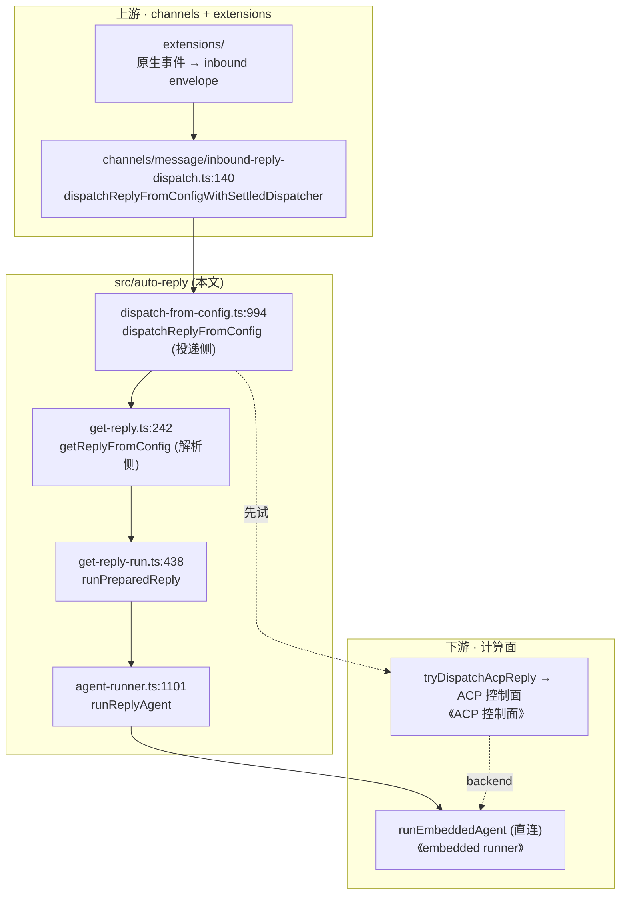
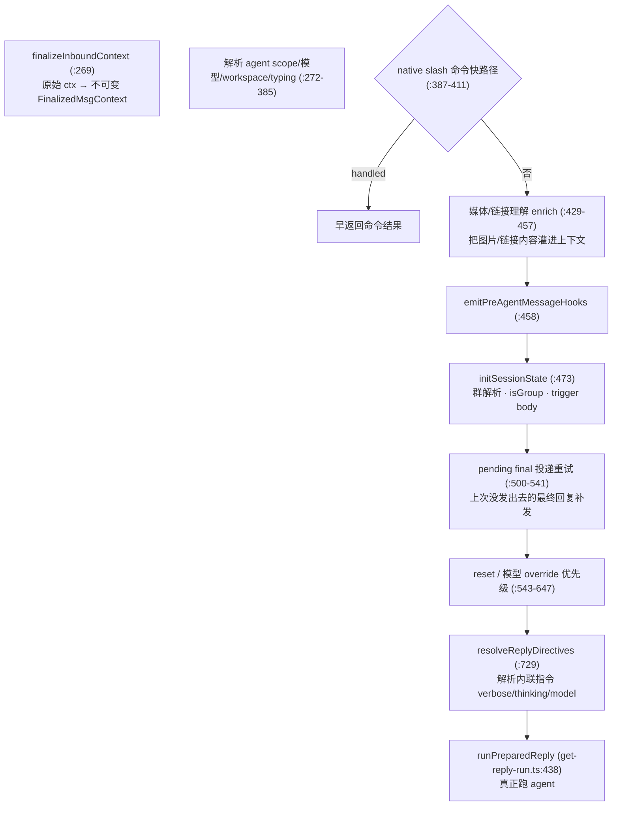
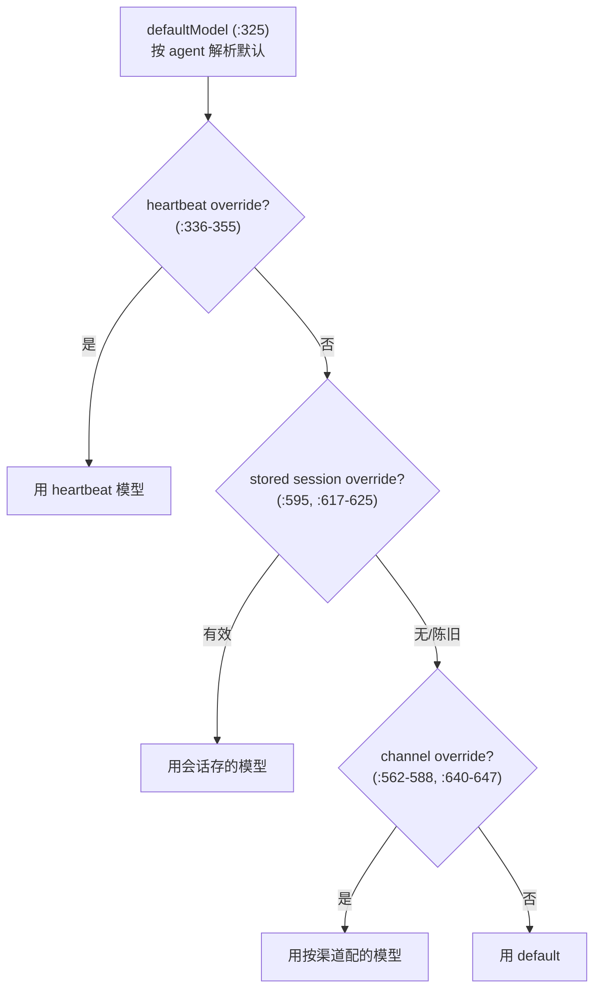

# OpenClaw 深挖 · auto-reply（产品管线）

> 系列第 3 份子系统深挖。它闭合「消息的一生」**前半段**：一条原生消息进来，怎么变成「该不该回、以谁的身份回、用哪个模型、是命令还是对话」的决策，最后交给计算面。
> 范围：`src/auto-reply/` 核心决策脊柱 + 与上下游（channels / ACP / runner）的交接。
> 深度：架构原理 + 代码走读，每个论断落到 `文件:行号`。
> 版本基准：`package.json` `2026.6.2`，分支 `main`。
> 衔接：本片下游的两条计算路径，正是前两份深挖（《ACP 控制面》《embedded runner》）。

---

## 目录

1. [auto-reply 是什么](#1-auto-reply-是什么)
2. [在主路径中的位置](#2-在主路径中的位置)
3. [两个入口：resolve 与 dispatch 分离](#3-两个入口resolve-与-dispatch-分离)
4. [getReplyFromConfig 解剖：一条消息都经过什么](#4-getreplyfromconfig-解剖一条消息都经过什么)
5. [「该不该回」：群激活与门控](#5-该不该回群激活与门控)
6. [命令 vs 对话](#6-命令-vs-对话)
7. [模型选择的优先级链](#7-模型选择的优先级链)
8. [交给计算面：两条路径](#8-交给计算面两条路径)
9. [回程：fencing、投影、分块](#9-回程fencing投影分块)
10. [一个反复出现的主题：三层按会话串行](#10-一个反复出现的主题三层按会话串行)
11. [值得记住的判断](#11-值得记住的判断)
12. [速查表](#12-速查表)

---

## 1. auto-reply 是什么

一句话：**auto-reply 是 OpenClaw 的产品大脑。** 全景地图第 4 章那张「消息的一生」里，渠道（transport）和计算面（generic turn runner）两头都刻意做哑——所有「这条消息到底该怎么处理」的产品语义，都堆在中间这一层。

体量：`src/auto-reply/` 共 **334 个非测试文件**，其中 `reply/` 子目录占了绝大部分，又分两大家族：

- `commands-*`（几十个文件）：命令树——`/compact`、`/context`、`/approve`、`/export`、`/goal`…
- `agent-runner-*`（十几个文件）：怎么把活交给 agent 跑。

**判断**：这一层是全仓**变化最频繁**的地方。渠道协议稳定、模型循环稳定，但「群里要不要回、命令怎么解析、媒体怎么入会话、模型怎么按优先级选」这些产品决策一直在加。所以它文件多但单点不算难——复杂度是**广度**（决策面多），不是深度（单个算法绕）。这和 embedded runner 的「窄而深」正好相反。

---

## 2. 在主路径中的位置



要点：

- **上游**：渠道插件把原生事件规范化成 `FinalizedMsgContext`，经 `channels/message/inbound-reply-dispatch.ts:140` 进来。渠道到此为止——它不知道「该不该回」。
- **本层**：分「解析」和「投递」两侧（第 3 章）。解析侧 `getReplyFromConfig` 算出回复，投递侧负责发回去。
- **下游**：两条计算路径（第 8 章）——直连 embedded runner，或经 ACP 控制面。注意 ACP 的 backend 往往**又是**同一个 embedded runner（全景地图第 5 章），所以两条路最终可能殊途同归，只是一条经控制面、一条不经。

---

## 3. 两个入口：resolve 与 dispatch 分离

渠道侧调的是 `dispatchReplyFromConfigWithSettledDispatcher`（`channels/message/inbound-reply-dispatch.ts:140`），它只是把 `dispatchReplyFromConfig` 包进一个 dispatcher 生命周期里（`:148-159` `withReplyDispatcher`，保证 `onSettled` 一定被调）。

真正的两侧是：

- **解析侧** `getReplyFromConfig`（`get-reply.ts:242`）：输入 `MsgContext`，输出 `ReplyPayload | ReplyPayload[] | undefined`。**纯算「回什么」，不负责发。** 返回 `undefined` 就是「不回」。
- **投递侧** `dispatchReplyFromConfig`（`dispatch-from-config.ts:994`）：拿到回复负载后，经 dispatcher 分块、打字态、媒体地发回渠道。

**判断**：这个「resolve / dispatch 分离」是干净的设计。`getReplyFromConfig` 可以被库消费者单独调用拿回复而不发送（`src/index.ts` 就导出了 `getReplyFromConfig`）；测试也能只测「算什么」不碰投递。它呼应 `AGENTS.md:195`「返回最小有用形状」——解析侧只吐 payload，投递语义留给投递侧。

---

## 4. getReplyFromConfig 解剖：一条消息都经过什么

这是本层的中枢函数，结构是典型的 **gather → enrich → decide → run** 顺序流（`AGENTS.md:186` 推崇的形状）。按它实际的执行顺序走一遍（`get-reply.ts:242` 起）：



几个**容易被低估的步骤**：

- **`finalizeInboundContext`（`:269`）**：把可变的 `MsgContext` 冻成 `FinalizedMsgContext`。之后整条管线都读这个不可变快照——呼应 `AGENTS.md` 的不可变原则，避免下游各处偷偷改上下文导致状态错乱。
- **媒体/链接理解（`:438-457`）**：如果消息带图片或链接，这里**先调一次理解模型**把内容转成文字灌进上下文，再交给主 agent。也就是说「发张图问问题」其实经历了两次模型调用。这一步只在非快测环境跑（`!isFastTestEnv`）。
- **pending final 投递重试（`:500-541`）**：上一轮如果算出了最终回复但**没发成功**（网络/渠道故障），会话里会留 `pendingFinalDelivery`。这里负责补发或（对 heartbeat）安全清理。这是个真实的可靠投递机制——模型跑完了但消息没送达，不能丢。

**判断**：`getReplyFromConfig` 自己就是个大函数（242 → 700+ 行），而且重度埋点——`resolverTiming`（`:256`）给每个子阶段套 profiler span，但**默认惰性**（`:253-255` 注释：除非诊断开启 `profiler`/`reply.profiler`，否则不付 `Date.now`/数组记账的开销）。这种「可观测但默认零成本」的埋点文化在这片随处可见，是产品层愿意为「线上能定位慢在哪一步」付出的设计税。

---

## 5. 「该不该回」：群激活与门控

私聊里默认都回，群里不是。门控的核心是**群激活模式**（`group-activation.ts:5`）：

```ts
export type GroupActivationMode = "mention" | "always";
```

- **`mention`**（默认）：只有被 @ 提及时才回。
- **`always`**：群里每条都回。

用户可以用 `/activation always|mention` 现场切换（`parseActivationCommand`，`group-activation.ts:20-41`，正则 `:35`）。提及判定本身在渠道抽象层（`src/channels/mention-gating.ts`），因为「怎么算被提及」是渠道相关的（Telegram 的 @username vs Slack 的 <@id>），但**用不用这个判定**是产品决策，在 auto-reply 这边。

还有去抖：`src/auto-reply/inbound-debounce.ts` + `channels/inbound-debounce-policy.ts`——用户连发好几条短消息时，合并成一次处理，别每条都触发一轮 agent。

**判断**：门控是「渠道提供机制、产品决定策略」边界的好例子。`AGENTS.md:94-95` 严禁渠道自己猜命令/做产品决策——所以渠道只回答「这条消息提及了谁」，而「提及了才回」这条规则留在 `group-activation.ts`。理解这条分工，就理解了为什么同样一件事（提及）要在两个目录各碰一下。

---

## 6. 命令 vs 对话

一条消息进来，第一个大分叉是「这是命令还是要喂给模型的对话」。命令有两类处理：

1. **native slash 命令快路径**（`get-reply.ts:387-411`）：`maybeResolveNativeSlashCommandFastReply`。像 `/help`、`/model` 这种能不调模型就答的命令，在**进 agent 之前**直接处理并早返回（`:408-411`）。省一次模型调用。
2. **命令树**（`reply/commands-*` 家族）：`/compact`、`/context`、`/approve`、`/export`、`/goal` 等几十个，经 directive 解析后路由到各自 handler。

**判断**：命令快路径是性能优化——大量命令根本不需要模型，提前拦截能省钱省延迟。而 `AGENTS.md:95` 那条「渠道不许猜 `/` 开头是命令」的硬规则，意味着命令识别必须在 auto-reply 这层用结构化方式做（`finalized.CommandSource` / `CommandBody` 等已规范化字段，`get-reply.ts:680`），而不是渠道用字符串瞎猜。命令的「可移植呈现动作」就是这条规则的产物。

---

## 7. 模型选择的优先级链

这是 auto-reply 里**复杂度最集中的一段**（`get-reply.ts:333-647`，约 100 行纯优先级逻辑）。「这一轮用哪个 provider/model」要在一长串来源里按优先级裁决：



真正难的不是优先级本身，是那一堆**「陈旧 override」守卫**：

- `staleHeartbeatAutoFallbackOverride`（`:605`）
- `staleLegacyAutoFallbackWithoutOrigin`（`:615-616`）
- `hasEffectiveSessionModelOverride`（`:636-639`）

每个守卫都在排除一种「历史上自动 fallback 留下的、现在不该再生效的」override。**判断**：这些守卫是典型的疤痕组织——会话里曾经因为故障切换自动改过模型，那个改动不该永久粘住，否则用户下次发消息还在用当时临时切过去的模型。和 embedded runner 里那群挂 issue 的断路器同源：都是「自动行为的副作用要被后续逻辑显式清理」。改这段要极小心，每个 `stale*` 布尔删掉都会让某种 override 错误地长期生效。

---

## 8. 交给计算面：两条路径

算完上下文、选好模型，`runPreparedReply`（`get-reply-run.ts:438`）经 `resolveReplyDirectives` 后，加载并调用 `runReplyAgent`（`:1049` 加载、`:1343` 调用 → `agent-runner.ts:1101`）。到这里有**两条下游路径**：

### 路径 A · 直连 embedded runner

`agent-runner-execution.ts:43` 直接 `import { runEmbeddedAgent }`，在 `:2284` 调用。这条路**不经 ACP 控制面**，直接在进程内跑 embedded runner（《embedded runner》深挖那一片）。

### 路径 B · 经 ACP 控制面

`tryDispatchAcpReply`（`dispatch-acp.ts:358`）——注意名字里的 **try**——经 ACP 控制面派 turn，再用 `createAcpReplyProjector`（`dispatch-acp.ts:32`）把 ACP 的事件流投影回 `ReplyPayload`。它经 `dispatch-acp.runtime.ts:8` 惰性加载（默认不付 ACP 那套依赖的加载成本）。命令会**绕过** ACP 派发（`dispatch-acp-command-bypass.ts` `shouldBypassAcpDispatchForCommand`）。

### 两条路怎么选

`try` + 命令 bypass 这两个信号说明：**ACP 是「符合条件就走」，embedded 直连是默认/兜底**。精确的路由谓词在投递层 `dispatch-from-config.ts`（本文未逐行展开该谓词，以入口函数命名为据）。

**判断**：两条路径并存，是系统**正处在向 ACP 迁移的中途**的证据。ACP 是较新的控制面路径（带会话生命周期、backend 故障切换那一整套，见《ACP 控制面》），embedded 直连是更老更直接的路。`tryDispatchAcpReply` 的「试探」语义、加上命令 bypass，是典型的「新路径 opt-in、旧路径兜底」迁移形态。读这片时别假设所有 turn 都走 ACP——很多还是直连。这也解释了为什么 embedded runner 要自带 lane 队列（《embedded runner》第 3 章）：因为它不一定有 ACP 的 SessionActorQueue 在外面罩着。

---

## 9. 回程：fencing、投影、分块

回复算出来后往渠道发，`dispatch.ts` 文件头自述管「dispatch orchestration, hook composition, and foreground delivery fencing」（`dispatch.ts:1`）。三件事：

- **前台投递 fencing**（`dispatch.ts:52` `foregroundReplyFenceByKey`）：同一会话的可见回复**串行投递**，防止多条回复抢着发、顺序错乱。fence key 由 sessionKey + channel + target 组成（`:63-70`）。
- **ACP 事件投影**（路径 B）：`createAcpReplyProjector`（`dispatch-acp.ts:32`）把 ACP 控制面吐的事件流（text_delta、tool 等）翻译成产品层的 `ReplyPayload`，让两条计算路径的回程统一。
- **分块 / 打字态 / 媒体**：投递侧按渠道传输限制分块，配合打字态指示器（typing controller，`get-reply.ts:371-385`，默认 6 秒间隔 `:375`），并处理 `SILENT_REPLY_TOKEN`（`:380`）——模型回这个 token 表示「我处理完了但不用对用户说话」。

**判断**：`SILENT_REPLY_TOKEN` 是个值得记住的小契约。boot 检查、heartbeat、纯工具操作都可能让模型「干完活但不该发消息」，用一个约定 token 表达「静默」，比让模型发空消息或让代码猜「这条要不要发」都干净。它在 boot（全景地图提到的 `gateway/boot.ts`）和 heartbeat 路径反复出现。

---

## 10. 一个反复出现的主题：三层按会话串行

读完三份深挖，一个模式浮出水面：**同一会话的操作串行化，在三个不同层各做了一遍**：

| 层 | 机制 | 位置 |
|---|---|---|
| 投递层 | foreground reply fencing | `auto-reply/dispatch.ts:52` |
| 控制面 | SessionActorQueue (KeyedAsyncQueue) | `acp/control-plane/session-actor-queue.ts:25` |
| 计算面 | session lane 队列 | `embedded-agent-runner/run.ts:485,544` |

为什么同一件事做三遍？因为这三层的「会话并发」含义不同：投递层防的是**回复顺序错乱**，控制面防的是**turn 抢同一个 backend 句柄**，计算面防的是**embedded run 抢 transcript/上下文**。而且这三层**不一定都经过**——命令可能在投递层就返回、直连路径跳过控制面——所以每层都得自己保证串行，不能依赖上层。

**判断**：这是松耦合多路径架构的必然代价。如果所有 turn 都强制走「投递 → 控制面 → 计算面」一条直线，串行做一次就够；但因为有快路径、命令 bypass、直连/ACP 双路，每层只能各自为政。这是「灵活性 vs 重复」的真实权衡——OpenClaw 选了灵活，代价是同一个不变量维护三处。

---

## 11. 值得记住的判断

1. **auto-reply 是产品大脑，复杂在广度不在深度。** 渠道哑、计算面通用，所有「该不该回/以谁回/用什么模型/是不是命令」的语义都在这。它是全仓变化最频繁的层。
2. **resolve / dispatch 分离很干净。** `getReplyFromConfig` 只算回复（可返回 undefined=不回），投递语义在 `dispatchReplyFromConfig`——可单独算、单独测。
3. **「发张图问问题」是两次模型调用。** 媒体/链接理解（`get-reply.ts:438-457`）先把图/链接转文字灌进上下文，再跑主 agent。
4. **模型优先级链是复杂度集中点。** 约 100 行优先级 + 一堆 `stale*` 守卫（`:605-647`），每个守卫清理一种「自动 fallback 的粘滞副作用」。和 runner 的断路器同源，别乱删。
5. **两条计算路径 = 迁移中途。** `tryDispatchAcpReply`（试探）+ 命令 bypass + 直连兜底 = ACP 是 opt-in 新路、embedded 直连是旧路。别假设所有 turn 都走 ACP。
6. **三层各自按会话串行。** 投递 fencing / ACP actor 队列 / runner lane——因为路径多、不一定都经过，每层只能自保串行。
7. **埋点默认零成本。** `resolverTiming` profiler span 除非诊断开启否则不记账（`:253-255`）——「可观测但不为常态付费」的设计税。
8. **`SILENT_REPLY_TOKEN` 是「干完活不说话」的契约。** 比发空消息或代码猜「要不要发」都干净。

---

## 12. 速查表

| 想搞懂… | 从这里读 |
|---|---|
| 渠道侧入口 | `channels/message/inbound-reply-dispatch.ts:140` |
| 投递侧 | `reply/dispatch-from-config.ts:994` `dispatchReplyFromConfig` |
| 解析侧（中枢） | `reply/get-reply.ts:242` `getReplyFromConfig` |
| 上下文冻结 | `get-reply.ts:269` `finalizeInboundContext` |
| native 命令快路径 | `get-reply.ts:387-411` |
| 媒体/链接理解 | `get-reply.ts:438-457` |
| 模型优先级链 | `get-reply.ts:333-647`（stale 守卫 `:605-647`） |
| directive 解析 | `get-reply.ts:729` `resolveReplyDirectives` |
| 跑 agent | `get-reply-run.ts:438` `runPreparedReply` → `agent-runner.ts:1101` `runReplyAgent` |
| 直连计算路径 | `reply/agent-runner-execution.ts:43`、`:2284` `runEmbeddedAgent` |
| ACP 计算路径 | `reply/dispatch-acp.ts:358` `tryDispatchAcpReply`（投影 `:32`） |
| 命令绕过 ACP | `reply/dispatch-acp-command-bypass.ts` |
| 群激活门控 | `group-activation.ts:5`、`:20` |
| 前台投递 fencing | `dispatch.ts:52` |
| 命令树 | `reply/commands-*` 家族 |

---

### 与前两份深挖的衔接

本片把全景地图第 4 章「消息的一生」的**前半段**填实了：channel envelope → `getReplyFromConfig` 决策 → `runReplyAgent` → 两条计算路径。其中：

- **路径 A（直连）** 落到《embedded runner》——`runEmbeddedAgent` 那个 3721 行巨型函数。
- **路径 B（ACP）** 落到《ACP 控制面》——`AcpSessionManager.runTurn` 那套会话生命周期 + backend 故障切换。
- 第 10 章「三层按会话串行」把三份深挖里各自的串行机制串成了一条主线。

至此，主数据路径（channels → auto-reply → ACP/runner → 回程）端到端打通。**后续可选深挖**：`src/plugins`（135 个扩展怎么装载、SDK 边界怎么强制）是理解「这个仓库怎么扩展」的架构基石；`src/gateway` 启动序列是第二座大山；`model-catalog`/`llm` 接住 runner 第 9 章和本文第 7 章共同留的「模型解析」尾。
