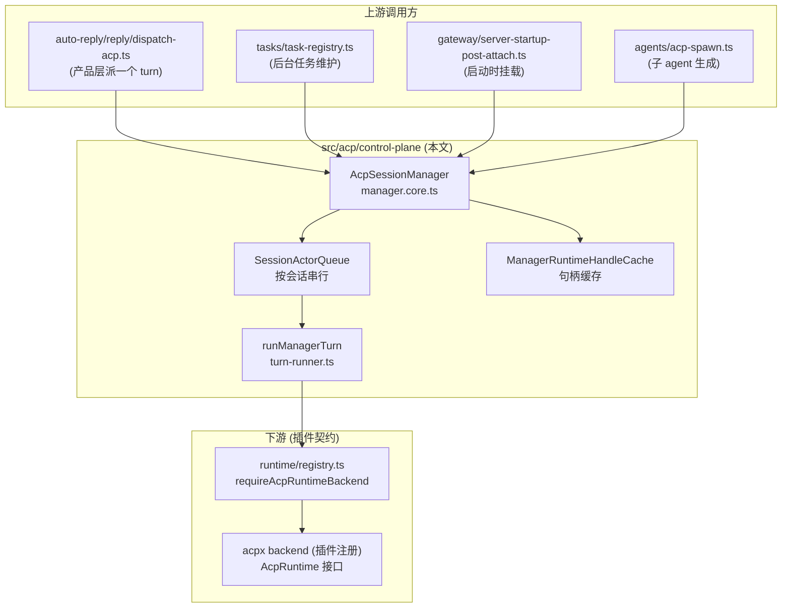
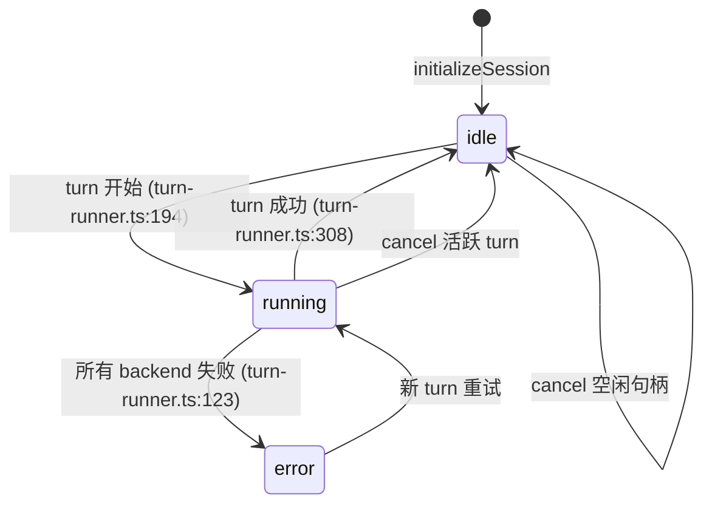
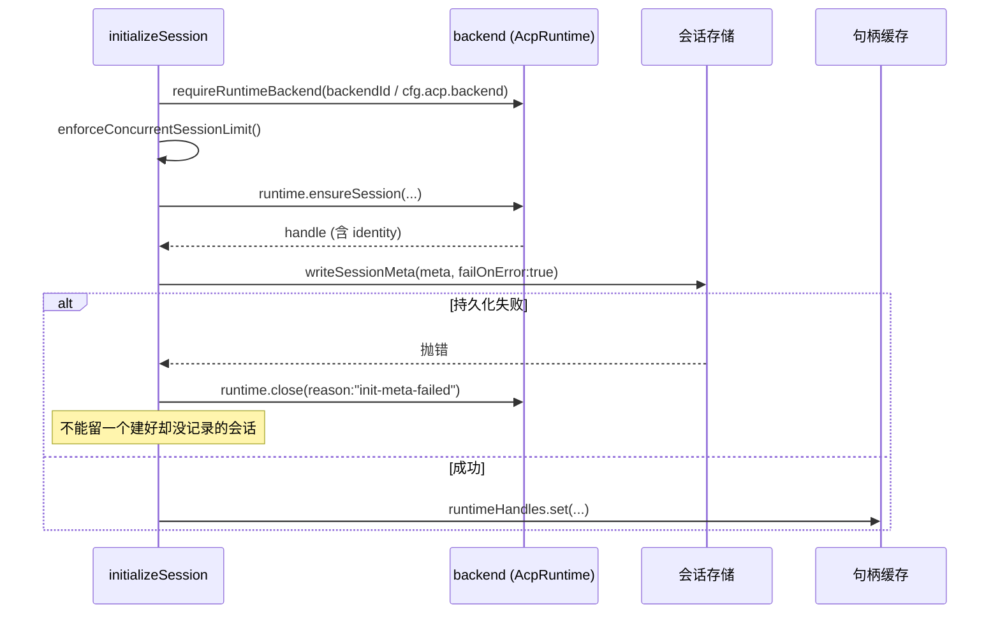
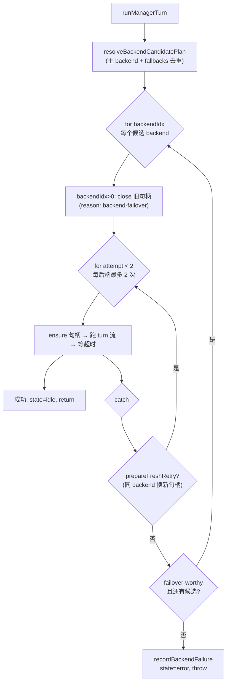
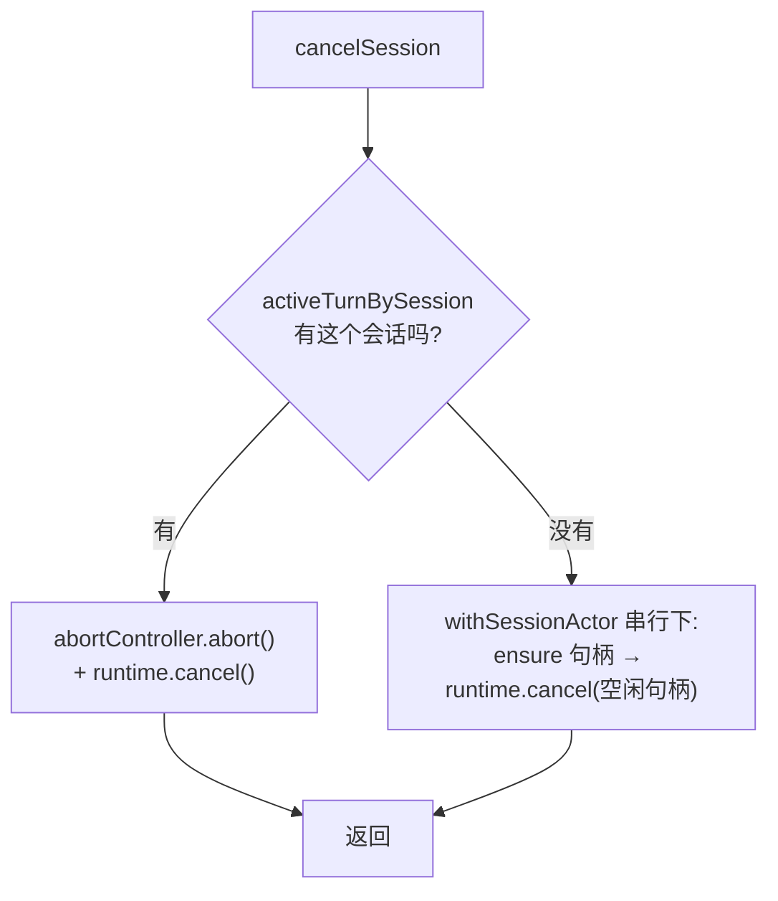

# OpenClaw 深挖 · ACP 控制面（control-plane）

> 这是全景地图（见 `study-openclaw/openclaw-architecture-zh.md` 第 5 章）之后的第 1 份子系统深挖。
> 范围**卡死**：只讲 `src/acp/control-plane/` 核心——会话生命周期 + 两大硬机制（按会话串行、backend 故障切换与句柄生命周期）。
> 深度：架构原理 + 代码走读，每个论断落到 `文件:行号`。
> 版本基准：`package.json` `2026.6.2`，分支 `main`。

---

## 目录

1. [这份文档的边界](#1-这份文档的边界)
2. [控制面在全局中的位置](#2-控制面在全局中的位置)
3. [公共面：一个单例 + 一套可注入 deps](#3-公共面一个单例--一套可注入-deps)
4. [状态模型：manager 到底拿着什么](#4-状态模型manager-到底拿着什么)
5. [硬机制一 · 按会话串行](#5-硬机制一--按会话串行)
6. [会话生命周期走读](#6-会话生命周期走读)
7. [硬机制二 · turn 执行与三层重试](#7-硬机制二--turn-执行与三层重试)
8. [超时：一个 race 背后的全部讲究](#8-超时一个-race-背后的全部讲究)
9. [取消：活跃 turn vs 空闲句柄](#9-取消活跃-turn-vs-空闲句柄)
10. [句柄缓存与空闲驱逐](#10-句柄缓存与空闲驱逐)
11. [进程级 liveness：刻意藏起来的状态](#11-进程级-liveness刻意藏起来的状态)
12. [错误模型：一组封闭 code](#12-错误模型一组封闭-code)
13. [值得记住的判断](#13-值得记住的判断)
14. [速查表](#14-速查表)

---

## 1. 这份文档的边界

`src/acp/` 共 55 个非测试文件，但它不是铁板一块，至少分三层：

- **协议层** `src/acp/translator.ts` / `server.ts` / `event-mapper.ts` / `session-mapper.ts`：把外部 ACP 协议消息翻译成内部调用。**本文不讲。**
- **控制面** `src/acp/control-plane/*`：会话管理的真正大脑。**本文只讲这里。**
- **运行时契约** `src/acp/runtime/registry.ts` / `errors.ts`：backend 注册表与错误类型。**本文按需引用。**

为什么单挑控制面？因为全景地图里它被标成「协调复杂、边界敏感」的第二梯队，而它又是「一条消息的一生」的中枢——理解了它，你就理解了 OpenClaw 怎么把「一句用户消息」变成「一次受控、可超时、可取消、可故障切换的模型运行」。而且它体量适中，一次能读透，不像 `embedded-agent-runner` 那样得分多次。

---

## 2. 控制面在全局中的位置

控制面**上承产品层，下接插件 backend**，自己不碰传输、也不跑模型：



调用方都是经 `getAcpSessionManager()` 拿到同一个单例（`manager.ts:20`），实际入口分散在 18 个文件里（`grep getAcpSessionManager()` 实测），其中产品主路径是 `src/auto-reply/reply/dispatch-acp.ts`——这正好对上全景地图第 4 章「消息的一生」里 `auto-reply → AcpSessionManager` 那个交接点。

**下游那根线最关键**：控制面调用的是抽象接口 `AcpRuntime`（`@openclaw/acp-core/runtime/types`），具体实现由插件经 `runtime/registry.ts` 注册。控制面**永远不知道**自己驱动的是 acpx 的 embedded runner 还是 codex CLI——这是全景地图第 5.2 节那个核心解耦在控制面这一侧的落点。

---

## 3. 公共面：一个单例 + 一套可注入 deps

对外，控制面只暴露一个东西：进程级单例（`manager.ts:17-25`）。

```ts
let ACP_SESSION_MANAGER_SINGLETON: AcpSessionManager | null = null;
export function getAcpSessionManager(): AcpSessionManager {
  if (!ACP_SESSION_MANAGER_SINGLETON) {
    ACP_SESSION_MANAGER_SINGLETON = new AcpSessionManager();
  }
  return ACP_SESSION_MANAGER_SINGLETON;
}  // manager.ts:17-25
```

但**单例不等于不可测**。`AcpSessionManager` 的构造函数收一个 `deps`，默认值是 `DEFAULT_DEPS`（`manager.core.ts:77-79`）。`DEFAULT_DEPS` 里把 backend 解析硬接到注册表（`manager.types.ts:204-209`）：

```ts
export const DEFAULT_DEPS: AcpSessionManagerDeps = {
  // …
  requireRuntimeBackend: requireAcpRuntimeBackend,   // ← 连到 runtime/registry.ts
};
```

**判断**：这一个字段就是「控制面 ↔ 插件 backend」的全部耦合面。测试里塞一个假的 `requireRuntimeBackend`，整个 manager 就能脱离真实 acpx 跑起来——`AGENTS.md:218` 推崇的「injection 优于 broad barrel mock」在这里是设计层面就预留好的，不是测试时硬凑的。`manager.ts:27-34` 还配了 `resetAcpSessionManagerForTests` / `setAcpSessionManagerForTests`，因为单例在测试间会串状态，必须能重置。

---

## 4. 状态模型：manager 到底拿着什么

`AcpSessionManager` 的全部内存状态就五项（`manager.core.ts:65-74`）：

| 字段 | 类型 | 作用 |
|---|---|---|
| `actorQueue` | `SessionActorQueue` | 按会话串行所有操作（第 5 章） |
| `runtimeHandles` | `ManagerRuntimeHandleCache` | 活跃 backend 句柄缓存（第 10 章） |
| `activeTurnBySession` | `Map<string, ActiveTurnState>` | 每会话当前在跑的 turn（含 abortController） |
| `turnLatencyStats` | 计数器 | 可观测性：完成/失败/总耗时/最大耗时 |
| `errorCountsByCode` | `Map` | 按错误 code 计数 |

注意：**会话的持久化元数据不在这里**。manager 内存里只放「活跃句柄」和「在跑的 turn」；会话本身（`SessionAcpMeta`：backend、agent、identity、mode、cwd、state…）持久化在会话存储里，经 deps 的 `readSessionEntry` / `writeSessionMeta` 读写（如 `manager.core.ts:89` 的 `this.deps.readSessionEntry`）。**内存缓存可丢，持久化元数据是真相**——这条区分贯穿后面所有生命周期逻辑。

会话只有两种 mode（`packages/acp-core/src/runtime/types.ts:4`）：

```ts
export type AcpRuntimeSessionMode = "persistent" | "oneshot";
```

- **persistent**：句柄留在缓存里跨 turn 复用，会话可 resume。
- **oneshot**：每个 turn 跑完就 close 句柄、清缓存（见 `turn-runner.ts:372-392`）。

这两种 mode 的收尾差异，是后面 turn-runner / timeout 里大量分支的根源。

会话的 `state` 字段是个小状态机，由 `setSessionState` 推动：



---

## 5. 硬机制一 · 按会话串行

这是控制面**最该先理解的不变量**：同一个会话，永远不会有两个操作并发。

实现极小，一个类包一个 `KeyedAsyncQueue`（`session-actor-queue.ts:5-6`）：

```ts
export class SessionActorQueue {
  private readonly queue = new KeyedAsyncQueue();
  private readonly pendingBySession = new Map<string, number>();
  async run<T>(actorKey: string, op: () => Promise<T>): Promise<T> {
    return this.queue.enqueue(actorKey, op, { onEnqueue, onSettle });
  }  // session-actor-queue.ts:25
}
```

`actorKey` 就是规范化后的 sessionKey（`normalizeActorKey`）。同一个 key 下的 `op` 排队执行，不同 key 之间并行。

**为什么必须串行**：一个会话的 transcript、模型上下文、缓存句柄都是单一可变资源。如果一条消息还在跑 turn，另一条又进来开 turn，两者会同时写 transcript、抢同一个 backend 句柄，结果就是上下文错乱。串行化把这个并发问题在控制面入口处一次性消掉。

`onEnqueue` / `onSettle` 维护每会话的 pending 计数（`session-actor-queue.ts:27-38`），用于可观测性（队列深度）。`onSettle` 那行注释点明了一个易错点：

```ts
// Keep queue-depth accounting symmetric with enqueue even when operations reject.
```

——即使 `op` 抛错，计数也要减回去，否则队列深度会虚高、永不归零。这正是 `AGENTS.md:103` 点名要求加注释的「queue/dedupe symmetry」不变量。

**一个容易忽略的细节**：连「空闲句柄驱逐」也要走这条队列（第 10 章会看到 `evictIdle` 里 `params.actorQueue.run(...)`）。原因是驱逐要 close backend 句柄，而 turn 也要用这个句柄——不串行就会「正驱逐着，turn 刚好开始用」。把驱逐塞进同一条 actor 队列，是用同一把锁解决两个本来无关的竞争。

---

## 6. 会话生命周期走读

### 6.1 resolveSession：封闭联合，不返回裸 null

入口判定用一个三态封闭联合（`manager.core.ts:81-112`）：

```ts
resolveSession(...): AcpSessionResolution {
  // … 读持久化 entry
  if (acp)               return { kind: "ready", sessionKey, meta };
  if (isAcpSessionKey()) return { kind: "stale", sessionKey, error };
  return { kind: "none", sessionKey };
}
```

`ready` = 有元数据可用；`stale` = key 看着像 ACP 会话但元数据没了（崩溃残留）；`none` = 根本不是 ACP 会话。后续所有路径都用 `requireReadySessionMeta(resolution)`（如 `turn-runner.ts:90`）把非 `ready` 直接转成 typed 错误。**这是 `AGENTS.md:182-183`「封闭 mode/result，让非法状态不可表示」的范例**——调用方拿不到「meta 可能是 null」的模糊状态，要么 ready 要么明确错。

### 6.2 initializeSession：先建后存，存不下就回滚

新会话走 `runManagerInitializeSession`（`manager.initialize-session.ts:27`），顺序很讲究：



关键是 `persistInitializedSessionMeta`（`:133-158`）：元数据写失败时**必须把刚建的 backend 会话 close 掉**（`:152` `closeRuntimeAfterInitMetaFailure`）。否则就会出现「backend 里建了个会话，但 OpenClaw 没记录它」的孤儿——下次谁都管不到它。这是个典型的「两步操作要么都成、要么回滚第一步」的资源一致性处理。

### 6.3 ensureRuntimeHandle：复用的 6 个条件 + 一次健康探针

老会话开新 turn 时，不重建句柄，走 `ensureManagerRuntimeHandle`（`manager.runtime-handle-ensure.ts:31`）。缓存命中要同时满足 **6 个匹配 + 1 个探针**（`:50-72`）：

```ts
backendMatches && agentMatches && modeMatches &&
cwdMatches && configMatches && handleMatchesMeta &&
(await isReusable({ runtime, handle }))   // 真去 getStatus 探一下活
```

任何一项不满足，就 `close({ reason: "runtime-handle-replaced" })` 然后重建（`:79-82`）。

**最硬的一段**是 persistent 会话的 resume 容错（`:122-151`）：先拿持久化的 `resumeSessionId` 去 `ensureSession`，如果失败且错误码是 `ACP_SESSION_INIT_FAILED`，就**剥掉陈旧的 `acpxSessionId` / `agentSessionId`**，标 `state: "pending"`，再不带 resume id 重试一次（`:137-150`）。注释（`:143-144`）解释得很直白：持久化的 resume 标识符已经失败了，就别再把它们 merge 回新建的命名会话句柄里。

**判断**：这段是经验调出来的容错——backend 进程重启后，旧的 session id 失效，但 OpenClaw 这边的持久化元数据还指着它。硬要 resume 必然失败，所以「试 resume → 失败 → 降级为全新会话」是唯一稳的路。这种「持久化指针可能指向已死的 backend 状态」是长生命周期会话的本质难点。

最后 meta 是否回写有个条件判断（`:193-200`）：只有 backend / runtimeSessionName / identity / agent / cwd / runtimeOptions 任一变了，或检测到遗留投影，才 `writeSessionMeta`。**没变就不写**——避免每个 turn 都打一次存储，呼应 `AGENTS.md:101`「热路径别做无谓的刷新/重写」。

---

## 7. 硬机制二 · turn 执行与三层重试

`runManagerTurn`（`manager.turn-runner.ts:52`）是控制面最复杂的一个函数，也是**三种重试/切换机制唯一交汇的地方**。先建立全局观——它是个双层嵌套循环：



### 7.1 三层重试，别混

这是读这个文件最容易晕的地方。一次 turn 失败，有**三条不同的恢复路径**，优先级从内到外：

1. **同 backend 换新句柄**（`attempt < 2`，`turn-runner.ts:156`）。`prepareFreshManagerRuntimeHandleRetry`（`:323`）判定「这个错值得用一个全新句柄再试一次吗」。值得就 `continue` 内层循环（`:334-336`）。**每个 backend 最多 2 次**——`attempt < 2` 这个魔数就是「原句柄 1 次 + 新句柄 1 次」。
2. **换下一个 backend**（外层循环，`:142`）。仅当错误是 *failover-worthy* 且还有候选时（`:345-351`）。切之前先 close 当前句柄（`:144-148`）。
3. **彻底失败**（`recordBackendFailure`，`:97-130`）。记终态、写 `state: "error"`、抛错。如果试过多个 backend，错误信息会聚合成 `All ACP backends failed (N): ...`（`:103-106`）。

**还有第四层，但不在这个文件里**：provider / auth-profile 级故障切换发生在**下游** `embedded-agent-runner`（全景地图第 6 章，`run.ts:1097`）。也就是说「某家模型 API 限流了换一家」是 runner 的事；控制面这三层只管「句柄」和「backend 引擎」。**把这四层分清，是理解整个失败恢复体系的关键**，混了就会在错的层找 bug。

### 7.2 什么叫 failover-worthy

判定在 `isFailoverWorthyBackendError`（`manager.backend-failover.ts:42-52`）：

```ts
return !attempt.sawOutput &&                    // ① 还没吐过任何输出
  (code === "ACP_TURN_FAILED" ||
   code === "ACP_SESSION_INIT_FAILED" ||
   code === "ACP_BACKEND_UNAVAILABLE") &&        // ② 是这三类
  /\b(unavailable|rate[-\s]?limit…|quota|exhausted|temporar…|overloaded)\b/i
    .test(attempt.error);                        // ③ 错误文本像瞬时故障
```

三个条件缺一不可。**`!sawOutput` 是灵魂**：一旦 backend 已经吐过 token（`sawTurnOutput` 在 `:240` 置真），就**绝不**切换——因为切了会导致用户看到半截回复后又从头来一遍。宁可失败也不重复输出，这是个明确的产品取舍。

**判断**：用正则匹配错误文本来判瞬时性（条件③）是个**脆弱但务实**的设计。它依赖 backend 把「限流/过载」这类词写进 message。这类「靠关键词猜错误性质」的代码迟早会漏判某个新措辞，但在没有统一错误分类协议的现实下，是成本最低的近似。读到这里别指望它精确——它是启发式，不是契约。

### 7.3 oneshot 与 persistent 的收尾差异

`finally` 块（`:355-393`）里，turn 跑完后：

- 先 reconcile 句柄标识符（`:362-371`），把 backend 这次可能更新的 session id 合并回来。
- 如果 `meta.mode === "oneshot"`（`:378`），主动 `runtime.close({ reason: "oneshot-complete" })` 并清缓存——oneshot 不留句柄。
- persistent 则什么都不做，句柄留在缓存等下次复用。

这就是第 4 章说的「两种 mode 的收尾分叉」的具体落点。

---

## 8. 超时：一个 race 背后的全部讲究

`awaitTurnWithTimeout`（`manager.turn-timeout.ts:34`）看着就是个 `Promise.race`，但每一行都在防一个具体的坑。

### 8.1 observed-promise：先把成败包成 tagged 值

```ts
const observedTurnPromise = params.turnPromise.then(
  (value) => ({ kind: "value", value }),
  (error) => ({ kind: "error", error }),
);  // turn-timeout.ts:50-59
```

为什么不直接 race 原 promise？因为如果 turn promise **输给了**超时（race 选了 timeout 分支），原 promise 后面才 reject，就会变成一个**无人处理的 rejection**（Node 会打 `UnhandledPromiseRejection` 警告甚至在严格模式崩进程）。先用 `.then(ok, err)` 把成败都收敛成**永不 reject 的 tagged 值**，race 的就是这个安全 promise。

### 8.2 detached late error：输了 race 也要把错误吞干净

超时胜出后（`:87`），代码**不丢弃**原 promise，而是挂个 `.then` 在它真正结束时记一条 verbose 日志（`:88-94`）：

```ts
void observedTurnPromise.then((lateOutcome) => {
  if (lateOutcome.kind === "error") logVerbose("detached late turn error after timeout …");
});
```

「turn 已经被判超时了，但它后台其实还在跑，最后失败了」——这条信息不能让用户看见（已经超时返回了），但要留痕给运维。这是 `AGENTS.md:103` 说的「fallback behavior / cleanup coupling」该加注释的典型，代码注释（`:133-135` 在 turn-runner 那侧）也确实写了。

### 8.3 unref：超时定时器不许吊住进程

```ts
timer = setTimeout(() => resolve(timeoutToken), timeoutMs);
timer.unref?.();   // turn-timeout.ts:81-82
```

`unref()` 让这个定时器**不计入 Node 事件循环的存活引用**。否则一个挂着的 turn 超时器会让进程在该退出时退不掉。两个清理 race（cancel / close）里也都 `unref`（`:178`）。

### 8.4 两个魔数

- `ACP_TURN_TIMEOUT_GRACE_MS = 1_000`（`turn-runner.ts:42`）：实际等待 = 业务超时 + 1 秒宽限（`:265`）。给 backend 一点时间自己收尾。
- `ACP_TURN_TIMEOUT_CLEANUP_GRACE_MS = 2_000`（`turn-timeout.ts:11`）：超时后做 cancel / close 清理，各自最多再等 2 秒（`awaitCleanupWithGrace`，`:152`）。等不到就**分离**（`:147-149` `void Promise.allSettled(...).then(清缓存)`）——不阻塞主流程，但后台结束时仍把缓存清掉。

**判断**：这两个宽限值（1s / 2s）是典型的「经验调出来的魔数」，没有注释解释为什么是这个数，多半是线上观察 backend 收尾耗时定的。改它们要小心：调太小会误杀正常收尾，调太大会让超时的会话占用句柄更久。

---

## 9. 取消：活跃 turn vs 空闲句柄

`runManagerCancelSession`（`manager.cancel-session.ts:19`）分两种情况，先查有没有活跃 turn：



- **有活跃 turn**（`:31`）：直接 abort 那个 turn 的 `abortController` 并 `runtime.cancel`。注意它**不进 actor 队列**——因为取消正在跑的东西必须立刻生效，排队反而要等被取消的 turn 自己让出队列，死锁。
- **无活跃 turn**（`:39`）：进 `withSessionActor` 串行，ensure 出句柄再 cancel——这是取消一个空闲但还活着的 backend 会话。

`cancelPromise` 的幂等很关键（`:80-85`、turn-timeout 里 `:120-125` 同款）：

```ts
if (!params.activeTurn.cancelPromise) {
  params.activeTurn.cancelPromise = params.activeTurn.runtime.cancel(...);
}
```

取消可能被触发多次（用户连点、超时和手动取消撞一起），但 `runtime.cancel` 只发一次——把 promise 存在 `ActiveTurnState` 上，后续都 await 同一个。这是个小而重要的去重。

---

## 10. 句柄缓存与空闲驱逐

`ManagerRuntimeHandleCache`（`manager.runtime-handle-cache.ts:21`）包了个 `RuntimeCache`，对外提供 get/set/clear/close，加三个有讲究的方法：

**`isReusable`（`:136`）**：复用前真去 `runtime.getStatus({ handle })` 探活。状态里 `details.status` 或 summary 命中 `dead` / `no-session`（`:194-205`）就判不可用、清缓存、返回 false。探针本身抛错也当不可用（`:156-162`）。这就是 6.3 节复用条件里那个「+1 探针」。

**`evictIdle`（`:86`）**：按配置的 idle TTL 关闭久未用的句柄。**全程在 actor 队列下做**（`:106`）：

```ts
await params.actorQueue.run(candidate.actorKey, async () => {
  if (params.activeTurnBySession.has(candidate.actorKey)) return;  // 有活跃 turn 就别动
  // … 二次确认 lastTouchedAt 仍超 TTL，再 close
});
```

注释（`:105`）一句话说清动机：「Evict under the same actor queue so turns cannot race with runtime close.」——驱逐和 turn 共用一把会话锁。而且进了队列还要**再查一次** active turn + **再核一次** TTL（`:107-113`），因为排队期间状态可能已变。这是「检查-然后-操作」竞争的标准防御。

**`handleMatchesMeta`（`:165`）/ `runtimeHandlesMatch`（`:181`）**：两套标识符比对。前者比 meta 投影出的期望 id 和句柄实际 id；后者比两个句柄是否同一个（sessionKey/backend/cwd/各种 sessionId 全等）。`clearIfHandleMatches`（`:77`）用后者，确保「我要清的还是我手上那个句柄」——避免清掉别人刚替换上来的新句柄。

---

## 11. 进程级 liveness：刻意藏起来的状态

`active-turns.ts` 维护一个进程级单例 `Set<string>`，记录哪些会话当前有 turn 在跑（`:18-22`）。它和 `manager.activeTurnBySession`（内存 Map）**并行存在**，看着冗余，但定位完全不同。文件头注释（`:5-10`）把理由写死了：

> kept off the SDK-exported AcpSessionManager so plugins cannot read this maintenance-only state.

- `activeTurnBySession`（manager 私有字段）：带 `abortController`、`runtime`、`handle`，是**操作用**的（要 abort/cancel）。
- `active-turns.ts` 的 Set：只有 sessionKey，是**维护查询用**的——后台任务维护（`tasks/task-registry`）要问「这个崩溃后残留的会话，现在还有 turn 在跑吗？别去回收一个活的」。

为什么要单独搞一个？因为 manager 经 SDK 暴露给插件，插件不该读到这种维护态；而 task maintenance 又确实需要一个进程级的「是否在跑」信号。注释里点明它「mirrors cron's active-jobs registry」——和 cron 的活跃任务表是同一套模式。`markAcpTurnActive` / `clearAcpTurnActive` 由 turn-runner 在 backend 循环外**成对**调用（`turn-runner.ts:136-139` 标记、`:399-402` finally 清除），注释（`:133-135`）特意强调「liveness 跨整个 task，不是单次 attempt，且要在 ready-meta 检查之后标记，这样循环前抛错不会泄漏它」。

**判断**：这是个真实的封装边界，不是过度设计。它体现了 `AGENTS.md:102`「进程本地元数据缓存要 owner 明确、有界」——owner 是 manager，生命周期和 turn 严格成对，且故意不进 SDK 面。

---

## 12. 错误模型：一组封闭 code

控制面所有错误都收敛成 `AcpRuntimeError`（`src/acp/runtime/errors.ts`），带封闭的 code。本文出现过的：

| code | 含义 | 出处 |
|---|---|---|
| `ACP_BACKEND_MISSING` | 没注册任何 backend / 指定 backend 不存在 | `registry.ts:97`、`:109` |
| `ACP_BACKEND_UNAVAILABLE` | backend 注册了但 healthy 探针为假 | `registry.ts:103` |
| `ACP_SESSION_INIT_FAILED` | 建会话失败 | `initialize-session.ts:65`、ensure 多处 |
| `ACP_TURN_FAILED` | turn 没有终态事件 / 超时 / 取消失败 | `turn-runner.ts:287`、`turn-timeout.ts:96` |

`toAcpRuntimeError` / `withAcpRuntimeErrorBoundary`（多处引用，如 `cancel-session.ts:7`）负责把下游 backend 抛的任意错误归一成这套 code。这套封闭 code 正是 7.2 节 failover 判定（按 code 过滤）和 6.3 节 resume 容错（按 code 决定是否降级）能成立的前提——**没有这层归一，上面那些按 code 分支的决策全都无从谈起**。这是 `AGENTS.md:182`「discriminated unions / closed codes over freeform strings」在错误处理上的落点。

---

## 13. 值得记住的判断

把读完这片后能下的几个判断集中放这里：

1. **控制面是「小而硬」。** 55 个文件里，真正难的就 `turn-runner.ts` 一个（四层重试交汇）+ 句柄 ensure/cache 一组。其余多是薄封装。要改这片，先把 turn-runner 读到能背。
2. **四层失败恢复别混。** 句柄重试（同 backend 换句柄）→ backend 故障切换 → 控制面终态失败，这三层在 `turn-runner.ts`；第四层 provider/auth 故障切换在下游 runner。在错的层找 bug 是这片最常见的坑。
3. **「无输出才切换」是产品取舍写进了代码。** `!sawOutput`（`backend-failover.ts:44`）——宁可失败也不让用户看到重复的半截回复。
4. **正则判错误性质是务实的脆弱。** `isFailoverWorthyBackendError` 条件③（`:48`）靠关键词猜瞬时故障，迟早漏判新措辞；它是启发式不是契约。
5. **async 卫生做得很细。** observed-promise 包装、detached late-error 日志、`unref` 定时器、`cancelPromise` 幂等——这些不是噪音，每一处都在防一个具体的 unhandled-rejection / 进程吊死 / 重复取消。新手最容易在改这片时把它们「简化」掉，然后引回 bug。
6. **内存缓存可丢，持久化元数据是真相。** manager 内存里只有活跃句柄和在跑的 turn；崩溃后靠 `stale` 解析 + resume 容错 + active-turns 维护信号把残留收拾干净。
7. **两个宽限魔数（1s/2s）无注释，是调出来的。** 改 `ACP_TURN_TIMEOUT_GRACE_MS` / `ACP_TURN_TIMEOUT_CLEANUP_GRACE_MS` 前先想清楚误杀正常收尾 vs 占用句柄过久的权衡。

---

## 14. 速查表

| 想搞懂… | 从这里读 |
|---|---|
| 对外入口/单例 | `manager.ts:20` `getAcpSessionManager` |
| manager 状态与公共方法 | `manager.core.ts:64` |
| deps 注入 / backend 连接点 | `manager.types.ts:204` `DEFAULT_DEPS` |
| 按会话串行 | `session-actor-queue.ts:25` |
| 新会话初始化 | `manager.initialize-session.ts:27` |
| 句柄复用/重建/resume 容错 | `manager.runtime-handle-ensure.ts:31`（resume 容错 `:122`） |
| turn 执行 + 三层重试 | `manager.turn-runner.ts:52`（双层循环 `:142`/`:156`） |
| failover 判定 | `manager.backend-failover.ts:42` |
| 超时机制 | `manager.turn-timeout.ts:34` |
| 取消 | `manager.cancel-session.ts:19` |
| 句柄缓存/空闲驱逐 | `manager.runtime-handle-cache.ts:86` |
| 进程级 liveness | `active-turns.ts:25` |
| backend 注册表 | `src/acp/runtime/registry.ts:94` |
| 会话 mode 类型 | `packages/acp-core/src/runtime/types.ts:4` |

---

### 与全景地图的衔接

这份深挖填实了全景地图第 5 章的「控制面」骨架：第 5.1 节的 `SessionActorQueue` → 本文第 5 章；第 5.2 节「backend 由插件贡献」→ 本文第 3 章 deps 注入 + 第 12 章 backend code；第 5.3 节「turn 执行/故障切换」→ 本文第 7、8、9 章。

**下一片建议深挖** `src/agents/embedded-agent-runner`——它是本文反复提到的「第四层 provider 故障切换」和真正的模型循环所在，也是全项目复杂度顶点。进它之前务必扎稳上下文（`run.ts` 单文件 3721 行）。
