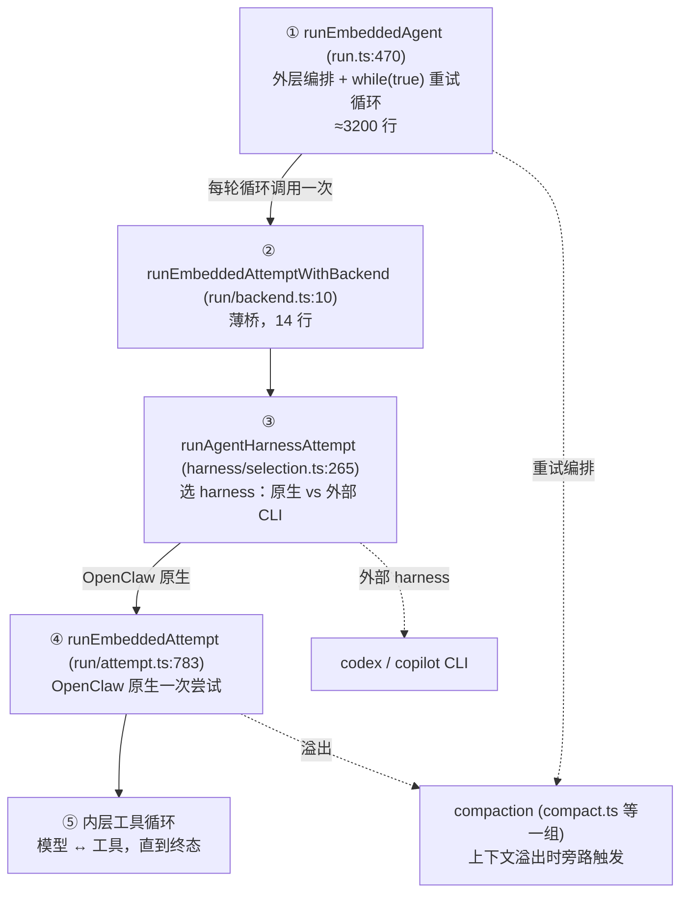
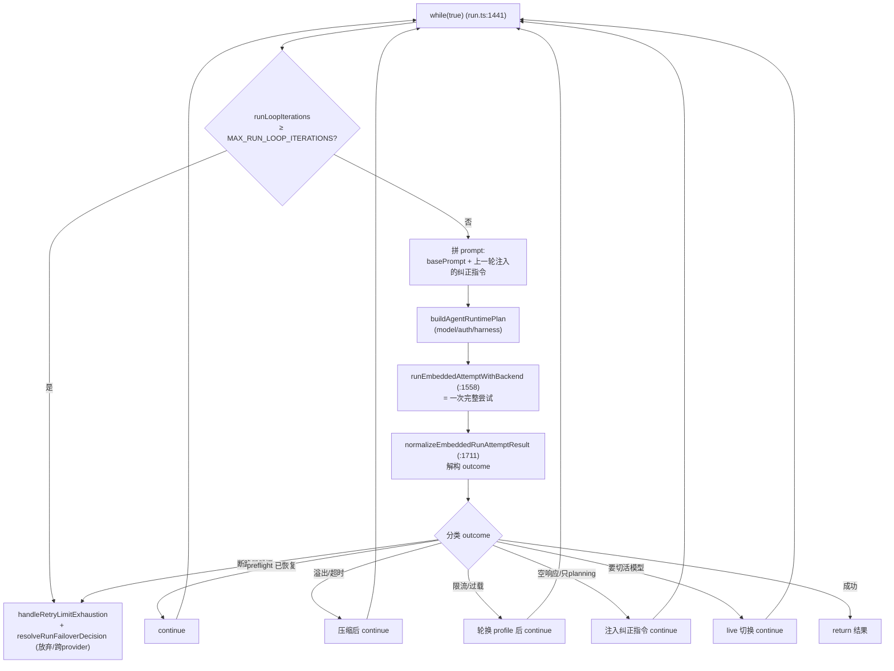
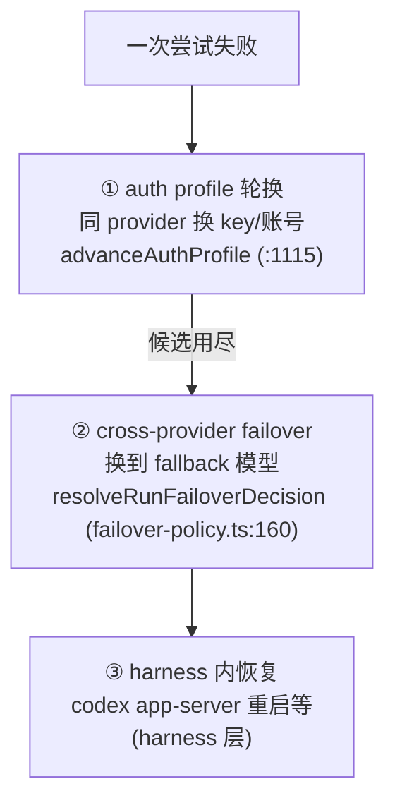

# OpenClaw 深挖 · embedded-agent-runner（计算面）

> 全景地图（`study-openclaw/openclaw-architecture-zh.md`）之后的第 2 份子系统深挖，也是全项目**复杂度顶点**。
> 范围：`src/agents/embedded-agent-runner/` 核心调用栈 + 四大硬问题。
> 深度：架构原理 + 代码走读，每个论断落到 `文件:行号`。
> 版本基准：`package.json` `2026.6.2`，分支 `main`。
> 衔接：上一份《ACP 控制面》讲到的「第四层 provider/auth 故障切换」就在这里。

---

## 目录

1. [先认清这片有多大](#1-先认清这片有多大)
2. [调用栈分层全图](#2-调用栈分层全图)
3. [并发模型：双 lane 队列](#3-并发模型双-lane-队列)
4. [运行前的准备](#4-运行前的准备)
5. [外层 while(true) 重试循环](#5-外层-whiletrue-重试循环)
6. [硬问题一 · 上下文压缩](#6-硬问题一--上下文压缩)
7. [硬问题二 · 成本与死循环断路器](#7-硬问题二--成本与死循环断路器)
8. [硬问题三 · 三处故障切换](#8-硬问题三--三处故障切换)
9. [硬问题四 · 模型解析与 live 切换](#9-硬问题四--模型解析与-live-切换)
10. [harness 选择层：原生循环 vs 外部 CLI](#10-harness-选择层原生循环-vs-外部-cli)
11. [内层 attempt：一次尝试里发生了什么](#11-内层-attempt一次尝试里发生了什么)
12. [值得记住的判断](#12-值得记住的判断)
13. [速查表](#13-速查表)

---

## 1. 先认清这片有多大

进这片之前必须有心理准备，三个数字：

- `src/agents/` 共 **968 个非测试文件**。
- `embedded-agent-runner/run.ts` 单文件 **3721 行**。
- 这 3721 行里**只有一个**导出函数：`runEmbeddedAgent`（`run.ts:470` 到 `:3696`）。上面零星几个小 helper（`:220`–`:455`），下面两个收尾函数（`:3696`、`:3709`）。

也就是说，`run.ts` 的本质是**一个 3200 行的巨型函数**，内部全是闭包变量和一个庞大的 `while(true)` 循环。`AGENTS.md:209` 自己写着「Split files around ~700 LOC」——这个函数是该上限的 **4.5 倍**，是全仓库对自家规则最极端的违反。

**但它不是写糟了。** 往下读你会看到：循环里几乎每一个计数器、每一个断路器，都挂着一个 GitHub issue 号（`#76293`、`#77474`、`#60552`、`#88538`…）。这是**线上事故一层层累积出来的疤痕组织**——每一处单独看都有正当理由，合在一起就成了没人能一眼装进脑子的庞然大物。这是个**有意识承担、且持续在还**的技术债，不是疏忽。

判断先撂这儿：**这是全仓库改动风险最高的单一文件。** 要动它，先读完本文，再扎稳上下文。

---

## 2. 调用栈分层全图

虽然 `run.ts` 巨大，但它的**接缝是清晰的**。一次嵌入式运行实际穿过五层，每层职责单一：



要抓住的分工：

- **① `run.ts`** 只管「失败了怎么重试、什么时候放弃、要不要压缩/换模型/换 profile」——**编排**。它不亲自跟模型说话。
- **② `run/backend.ts:10`** 是个 14 行的桥，直接转发给 harness 选择（`runAgentHarnessAttempt`）。它存在的唯一意义是给「一次尝试」一个稳定的调用点。
- **③ `harness/selection.ts`** 决定这次用谁的引擎跑（第 10 章）。
- **④ `run/attempt.ts:783`** 是 OpenClaw 原生的「一次尝试」：建沙箱、装工具、连 provider，然后跑内层循环。
- **⑤ 内层循环**才是真正「模型说话 → 调工具 → 回灌结果 → 再说」那一圈（第 11 章）。

**所以「3721 行巨型函数」要正确理解**：庞大的是**编排层**（①），而「一次尝试」和「选 harness」都被干净地拆了出去。文件大，但模块边界是真的。

---

## 3. 并发模型：双 lane 队列

`runEmbeddedAgent` 做的第一件实事不是跑模型，是**排队**。它把整个运行包进两层命令队列（`run.ts:544-546`）：

```ts
return enqueueSession(() => {            // 外层：会话 lane
  throwIfAborted();
  return enqueueGlobal(async () => {     // 内层：全局 lane
    throwIfAborted();
    // … 真正的运行
  });
});
```

两个 lane 各管一件事（`run.ts:485-486`）：

- **session lane**（`resolveSessionLane(sessionKey)`）：同一会话的运行串行——和 ACP 控制面的 `SessionActorQueue`（见《ACP 控制面》第 5 章）是同一思想，但在不同层各做一遍，因为这条路径不一定都经过 ACP。
- **global lane**（`resolveGlobalLane(params.lane)`）：跨会话的全局并发上限——防止 N 个会话同时开跑把机器打爆。`gateway/server.impl.ts:5` 引用的 `getActiveEmbeddedRunCount`（`run-state.ts:106`）就是数这个的活跃运行数。

`throwIfAborted()` 在每一层入口都查一次（`:542`、`:545`、`:547`）——因为排队可能等很久，等待期间用户可能已经取消，没必要等轮到了才发现。`sessionQueuePriority` 由 trigger 决定（`:487`、`resolveEmbeddedRunSessionQueuePriority`），交互消息比后台任务优先。

**判断**：「双 lane」是把两个本来独立的并发约束（每会话串行 + 全局限流）用同一套队列基建表达，干净。`withLaneTimeout`（`:493-500`）还给排队任务套了超时，配合 `laneTaskProgressAtMs` 做「有进展就续命」——避免一个慢任务把 lane 堵死又不被判超时。

---

## 4. 运行前的准备

进 `while(true)` 之前，`runEmbeddedAgent` 先把几样东西备齐，这些都是循环里反复要用的「准备好的事实」（呼应 `AGENTS.md:98`）：

1. **sessionKey 回填**（`run.ts:476-484`，`#60552`）：调用方可能不传 sessionKey，但下游 hook / 压缩 / LCM 都要非空 key，所以早早 `backfillSessionKey` 补上。
2. **auth profile 候选链**（`profileCandidates`）：一组可轮换的认证 profile。`advanceAuthProfile` / `advancePluginHarnessAuthProfile`（`:1092-1118`）负责跳到下一个未冷却的候选（`isProfileInCooldown`，`:1103`）。
3. **model 解析**：`provider` / `modelId` / `effectiveModel` / `runtimeModel`，循环里可能被 live 切换改写（第 9 章）。
4. **execution contract**（`:1147-1158`）：`strict-agentic` vs `default`，决定 planning-only 重试上限等策略（`resolvePlanningOnlyRetryLimit`）。
5. **一大票重试上限与断路器状态**（`:1164-1239`）——这是第 5、7 章的主角，先放着。

注意第 2 点的一个真实分叉（`:1115-1129`）：**插件 harness 自带 transport/auth** 时（如 codex），OpenClaw 的通用 auth bootstrap 要**跳过**，否则会把合成的 provider 标记错当成真实 vendor token 去刷新（`:1120-1122` 注释）。这是「核心通用逻辑」和「插件自治」边界上的一个具体摩擦点。

---

## 5. 外层 while(true) 重试循环

这是整片的心脏（`run.ts:1441`）。**一句话概括**：循环每一轮 = 「向模型发起一次完整尝试 + 对结果做分类，决定 continue（重试）/ 切换 / return」。



### 5.1 循环上限

`MAX_RUN_LOOP_ITERATIONS`（`:1166`）由 `resolveMaxRunRetryIterations` 按 profile 候选数 + 配置算出——候选越多允许的总轮数越大。每轮 `runLoopIterations += 1`（`:1477`）。撞上限就走 `handleRetryLimitExhaustion`（`:1456`），并由 `resolveRunFailoverDecision`（`run/failover-policy.ts:160`）决定是彻底失败还是交给跨 provider 故障切换。

### 5.2 纠正指令注入：把「重试」做成 prompt 工程

最值得玩味的设计在 `:1490-1502`。失败的尝试不是简单重发原 prompt，而是**把针对性的纠正指令拼到下一轮 prompt 后面**：

```ts
const promptAdditions = [
  ackExecutionFastPathInstruction,
  planningOnlyRetryInstruction,        // 模型只规划没执行 → 让它执行
  reasoningOnlyRetryInstruction,       // 只推理没产出 → 让它给答案
  emptyResponseRetryInstruction,       // 空响应 → 要求可见答案
  compactionContinuationRetryInstruction,
].filter(/* 非空 */);
const prompt = promptAdditions.length > 0
  ? `${basePrompt}\n\n${promptAdditions.join("\n\n")}`
  : basePrompt;
```

每个 `*RetryInstruction` 由上一轮的 outcome 分类设置。**判断**：这是一种**模型无关的纠错术**——不管哪家模型，只要它「光说要做但没做」「推理一堆没给结论」，就用自然语言指令把它掰回正轨。聪明，但也脆弱：它把 prompt 工程烤进了控制流，措辞改坏了会静默降低成功率，且很难单测覆盖全。

### 5.3 outcome 分类：一个用命令式写的状态机

`runEmbeddedAttemptWithBackend` 返回后（`:1558`），先 `normalizeEmbeddedRunAttemptResult`（`:1711`），再解构出一个**很宽的 outcome 形状**（`:1713-1727`）：`aborted` / `externalAbort` / `promptError` / `timedOut` / `idleTimedOut` / `timedOutDuringCompaction` / `preflightRecovery` / `lastAssistant` …

接下来几百行就是**按这些字段分流**：断路器（`:1757`）、压缩计数累加（`:1803`）、replay 状态（`:1837`）、错误文本格式化（`:1841`）、preflight 恢复 continue（`:1859-1870`）、live 切换（`:1871`）……

**判断**：这本质是一台状态机，但用「一堆可变计数器 + 长 if/continue 链」命令式实现，而不是声明式 FSM。`AGENTS.md:182` 推崇封闭联合/状态机，这里却是反例——原因多半是这些转移**高度互相依赖**（一个 outcome 可能同时满足多个条件，优先级微妙），硬抽成声明式 FSM 反而更难读。这是个务实的妥协，但也是这个文件难维护的根源。

---

## 6. 硬问题一 · 上下文压缩

长对话迟早超出模型窗口。压缩（compaction）= 把历史转写压成摘要、续写新会话。它的实现散在一组文件里，`compact.ts` 文件头自述「transcript compaction and runtime handoff」（`compact.ts:1-3`）。

外层循环用**两个独立的压缩预算**（`run.ts:1164-1165`）：

```ts
const MAX_TIMEOUT_COMPACTION_ATTEMPTS = 2;     // 因超时触发的压缩
const MAX_OVERFLOW_COMPACTION_ATTEMPTS = 3;    // 因上下文溢出触发的压缩
```

为什么分两种？因为触发原因不同：

- **溢出压缩**：prompt 已经超窗口，必须压才能继续（最多 3 次）。
- **超时压缩**：一次 turn 跑太久，怀疑是上下文太大拖慢，主动压一压再试（最多 2 次，更保守）。

压缩链路上几个关键件：

| 文件:行 | 作用 |
|---|---|
| `compact.queued.ts:156` `compactEmbeddedAgentSession` | 排队执行一次压缩 |
| `compaction-safety-timeout.ts:67` `compactWithSafetyTimeout` | 给压缩本身套超时（压缩也会卡） |
| `compaction-safety-timeout.ts:59` `resolveCompactionTimeoutMs` | 压缩超时时长 |
| `compaction-successor-transcript.ts:37` `rotateTranscriptAfterCompaction` | 压缩后转写文件轮转 |
| `compaction-hooks.ts:284` `runAfterCompactionHooks` | 压缩后置 hook（插件可观测） |
| `post-compaction-loop-guard.ts` | 压缩后死循环守卫（见第 7 章） |

**最反直觉的一点**：压缩本身需要调一次模型（让模型生成摘要），所以**压缩也可能超时、也可能失败、甚至触发新一轮压缩**。`compactWithSafetyTimeout`（`:67`）就是为此存在——给「压缩这个动作」也套上超时，否则一次卡住的压缩能把整个 run 吊死。这是「用模型解决模型上下文问题」固有的递归麻烦。

---

## 7. 硬问题二 · 成本与死循环断路器

模型调用要花钱，循环重试要防止「越试越亏」和「转圈不停」。外层循环里埋了一组断路器，**每一个都挂着 issue**：

### 7.1 空闲超时成本断路器（`#76293`）

`run.ts:1189-1195` 注释把动机写死了：

> Cost-runaway breaker. State lives at the run-loop level on purpose so it survives across attempt boundaries and across profile/auth retries…

逻辑抽到纯函数 `stepIdleTimeoutBreaker`（`:1757`）便于单测，run 循环只喂结果。连续 N 次「空闲超时但没有完成任何模型进展」就跳闸（`:1762`），消息直白：

> Halting further attempts to bound paid model calls. See issue #76293.

跳闸后走 retry-limit 退出路径（`:1782`），`livenessState: "blocked"`。**判断**：这个断路器看着像可删的 `if`，但删了等于**放开了无上限的付费 API 调用**——某些模型会陷入「空转-超时-重试」的烧钱循环。这是最不能动的那类代码。

### 7.2 压缩后死循环守卫（`#77474`）

`createPostCompactionLoopGuard`（`run.ts:1203-1206`）。压缩成功后，模型有时会立刻又陷入同样的工具循环，把刚压出来的空间又填满。守卫从「实时工具结果路径」观察（`observePostCompactionToolOutcome`，`:1209-1217`），判定要中止就 `abort` 当前尝试的 controller（`:1215`）。注意它和尝试的 `AbortController` 是联动的（`:1547-1548` `postCompactionAbortController = attemptAbortController`），能在「压缩后那次 prompt 还在跑」时就掐断。

### 7.3 其它一票上限

`run.ts:1160-1239` 还有一长串，每个对应一种已知的失败模式：

| 常量 | 防的是 |
|---|---|
| `MAX_EMPTY_ERROR_RETRIES = 3`（`:1237`） | 非严格模型 `stopReason="error"`+零输出的静默错误 |
| `MAX_MISSING_ASSISTANT_RETRIES = 1`（`:1239`） | 缺失 assistant 消息 |
| `maxPlanningOnlyRetryAttempts`（`:1160`） | 只规划不执行 |
| `maxReasoningOnlyRetryAttempts`（`:1161`） | 只推理不产出 |
| `overloadProfileRotations` / `rateLimitProfileRotations`（`:1182`/`:1229`） | 过载/限流时换 profile 的次数 |
| `codexAppServerRecoveryRetries`（`:1231`） | codex app-server 崩溃恢复 |

**判断**：这群计数器是这个文件「疤痕组织」的最直观体现。它们个个有 issue/注释背书，是 `AGENTS.md:89`「handle real production states」的产物。维护铁律：**别因为「看着冗余」就合并或删除任何一个**——它们防的是不同的、真实发生过的烧钱/死循环场景。

---

## 8. 硬问题三 · 三处故障切换

这是接《ACP 控制面》第 7.1 节那张「四层失败恢复」图的**第四层**，但它内部其实又分三处，别再混：



1. **auth profile 轮换**（同 provider 内）：`advanceAuthProfile` / `advancePluginHarnessAuthProfile`（`run.ts:1092-1118`）。限流/过载时跳到下一个未冷却的 profile（不同 API key 或账号），`thinkLevel` 重置、`attemptedThinking` 清空（`:1109-1110`）。
2. **cross-provider failover**（换模型/厂商）：`resolveRunFailoverDecision`（`run/failover-policy.ts:160`，是个重载函数）。它消费 `lastRetryFailoverReason`——而 reason 由 `classifyFailoverReason`（`embedded-agent-helpers/errors.ts:1566`）和 `classifyFailoverReasonFromHttpStatus`（`:651`）分类得出。`fallbackConfigured` 决定有没有备选可切。
3. **harness 内恢复**：如 codex app-server 崩溃，由 harness 层自己重启恢复，外层只数 `codexAppServerRecoveryRetries`。

**判断**：错误分类（`errors.ts:1566`）是这三层能运转的前提——和《ACP 控制面》第 12 章的封闭 error code 一样，「把杂乱的下游错误归一成可决策的类别」是所有 failover 逻辑的地基。不同的是控制面归一成 4 个 ACP code，这里归一成一组 `FailoverReason` + HTTP 状态分类，粒度更细，因为它要区分「限流 vs 过载 vs 计费 vs 上下文溢出」来决定走哪条恢复路径。

---

## 9. 硬问题四 · 模型解析与 live 切换

模型不是运行前定死就不变的。循环里有两处会改：

- **profile 轮换带动 provider/auth 变化**（第 8 章①）。
- **live 模型切换**：`shouldSwitchToLiveModel`（`run.ts:1871`）。当用户在跑的过程中改了配置/会话模型，且这次尝试**还没产生任何外发证据**（`canRestartForLiveSwitch`，`:1853-1858`：没发过消息、没工具错误、没 assistant 文本），就可以安全地切到新模型从头来。

`canRestartForLiveSwitch` 那五个条件是关键安全闸：**一旦已经吐过内容/调过工具/发过消息，就不能 live 切换**——否则用户会看到错乱。这和《ACP 控制面》第 7.2 节「`!sawOutput` 才允许 backend 切换」是完全一致的产品取舍，在两个层各实现一遍。

模型解析本身（provider/modelId/effectiveModel 的确定）在循环外的准备段，依赖 `model.ts` / `model.*.ts` 一组文件（`model.inline-provider.ts`、`model.provider-normalization.ts`、`model.static-catalog.ts`、`model.forward-compat.*`）——这组负责「把配置里的模型引用解析成可调用的 provider+model+能力」，本文不展开，留给模型目录那条线单独深挖。

---

## 10. harness 选择层：原生循环 vs 外部 CLI

第 2 章那个「意料之外的间接层」值得单列。`runEmbeddedAttemptWithBackend`（`run/backend.ts:10`）只有一句：

```ts
return runAgentHarnessAttempt(params);   // → harness/selection.ts:265
```

`selectAgentHarness`（`harness/selection.ts:121`）+ `resolveAgentHarnessPolicy`（`harness/policy.ts:19`）决定这次用哪个 harness：

- **OpenClaw 原生** → `runEmbeddedAttempt`（`run/attempt.ts:783`），跑自家的模型↔工具循环（第 11 章）。
- **外部 CLI harness** → codex / copilot 等。`run.ts:1140-1141` 那个 `harnessBuildsOpenClawTools = id === "codex" || id === "copilot"` 就是在判这次工具是不是该由 OpenClaw 构建、还是交给外部 harness 自己建。

**这把全景地图的两条线接上了**：全景地图第 5 章说「ACP backend 由 acpx 插件贡献，可驱动 embedded runner 或外部 CLI」——具体的「驱动谁」就发生在这一层。embedded runner 既能自己跑模型，也能当个壳子把活转给 codex CLI，对上层（ACP 控制面）完全透明。

**判断**：这是个真实赚到的抽象。外层 3200 行的重试编排（超时/压缩/断路器/失败恢复）对**两种 harness 通用**——不管底下是 OpenClaw 自跑还是 codex，外层那套「失败了怎么办」的逻辑都复用。这也解释了为什么外层值得做这么厚：它是所有 harness 的共享大脑。

---

## 11. 内层 attempt：一次尝试里发生了什么

`runEmbeddedAttempt`（`run/attempt.ts:783`）是 OpenClaw 原生的「一次尝试」。开头一段（`:786-872`）就能看出它负责把「一次模型对话」所需的**运行环境**搭起来：

- `configureEmbeddedAttemptHttpRuntime`（`:788`）：按超时配 HTTP runtime。
- `resolveSandboxContext`（`:839`）：解析沙箱。沙箱启用且只读时，工作区切到沙箱目录（`:844-848`）；启用时**禁止 cwd override**（`:850-854`），因为沙箱要锁死可写路径。
- `getCurrentAttemptPluginMetadataSnapshot`（`:859-870`）：惰性取插件元数据快照（用到才取，呼应 `AGENTS.md:101` 热路径别反复发现）。
- `getProviderRuntimeHandle`（`:871+`）：拿 provider runtime 句柄。

再往后（本文不逐行展开）才是真正的**内层工具循环**：把系统 prompt + 工具定义 + 历史发给模型 → 模型回文本或工具调用 → 执行工具 → 把结果回灌 → 再问，直到模型给出终态。压缩就是在这一层检测到上下文溢出时触发，再交给外层（第 6 章）编排重试。

**为什么内层和外层要分开**：内层关心「这一次对话怎么进行」，外层关心「这一次失败了整体怎么办」。把它们拆在 `run/attempt.ts` 和 `run.ts`，是这个庞大子系统里最重要的一刀——否则 3200 行还得再翻几倍。

---

## 12. 值得记住的判断

1. **3721 行单函数是全仓最高改动风险。** 但它是疤痕组织不是烂代码：每个计数器/断路器挂着真实 issue。读懂它靠的是「认清分层 + 认清每个 breaker 防什么」，不是从头读到尾。
2. **别删任何一个断路器/计数器。** `#76293` 空闲超时断路器删了 = 无上限烧钱；`#77474` 压缩后守卫删了 = 压缩后死循环。它们看着像冗余 `if`，实则各防一个真实事故。
3. **重试是 prompt 工程，不只是重发。** 失败后往下一轮 prompt 注入「你只规划了请执行」之类的纠正指令（`:1490-1502`）——模型无关、聪明、但脆弱，改措辞要当心。
4. **outcome 分类是命令式状态机。** 一堆可变计数器 + 长 if/continue 链，不是声明式 FSM——因为转移高度互相依赖。这是这文件难读的根，但也是务实选择。
5. **`!sawOutput` / `canRestartForLiveSwitch` 是反复出现的安全闸。** 「已经吐过内容就不许切换/重启」这条产品取舍，在 runner（`:1853`）和 ACP 控制面（backend-failover）各实现一遍——理解一处就理解所有。
6. **四层失败恢复要分清。** 句柄重试 / backend 切换（在 ACP 控制面）→ auth profile 轮换 / cross-provider failover / harness 内恢复（在这里）。在错的层找 bug 是这两片共同的最大坑。
7. **错误分类是一切 failover 的地基。** `embedded-agent-helpers/errors.ts:1566` 把杂乱错误归一成 `FailoverReason`，没有它上面所有按 reason 分支的决策都不成立。
8. **harness 选择层让外层大脑复用。** 3200 行编排对「OpenClaw 自跑」和「codex CLI」通用——这是这片值得做这么厚的根本理由。

---

## 13. 速查表

| 想搞懂… | 从这里读 |
|---|---|
| 外层编排入口 | `run.ts:470` `runEmbeddedAgent` |
| 双 lane 并发 | `run.ts:485-486`、`:544-546` |
| 重试上限/断路器声明 | `run.ts:1160-1239` |
| while(true) 重试循环 | `run.ts:1441` |
| 纠正指令注入 | `run.ts:1490-1502` |
| outcome 分类起点 | `run.ts:1711` |
| 空闲超时断路器 (#76293) | `run.ts:1757`（纯函数 `stepIdleTimeoutBreaker`） |
| 压缩后死循环守卫 (#77474) | `run.ts:1203-1217` |
| 一次尝试的桥 | `run/backend.ts:10` |
| harness 选择 | `harness/selection.ts:121`（执行 `:265`）、`policy.ts:19` |
| 原生一次尝试 | `run/attempt.ts:783` |
| 压缩实现 | `compact.ts`、`compact.queued.ts:156`、`compaction-safety-timeout.ts:67` |
| 跨 provider 失败决策 | `run/failover-policy.ts:160` |
| 失败原因分类 | `embedded-agent-helpers/errors.ts:1566`、`:651` |
| 活跃运行计数 | `run-state.ts:106` |
| 模型解析 | `model.ts` / `model.*.ts` 一组 |

---

### 与前两份文档的衔接

- 全景地图第 6 章把这片标成「复杂度顶点」——本文用「3721 行单函数 + 一群挂 issue 的断路器」坐实了。
- 《ACP 控制面》第 7.1 节那张「四层失败恢复」图的**第四层**（provider/auth）= 本文第 8 章；两片各自的「有输出就不许切换」安全闸（本文第 9 章 vs 控制面 backend-failover）是同一产品取舍。
- 本文第 10 章 harness 选择层，回答了全景地图第 5 章「acpx backend 到底驱动谁」——驱动 OpenClaw 原生循环，或透明地转给 codex/copilot。

**下一片可选深挖**：`src/auto-reply`（产品逻辑管线，配合真实渠道端到端走读）、或 `src/plugins`（插件装载与 SDK 边界）、或模型目录 `model-catalog` + `llm` 那条线（接住本文第 9 章留的尾）。
