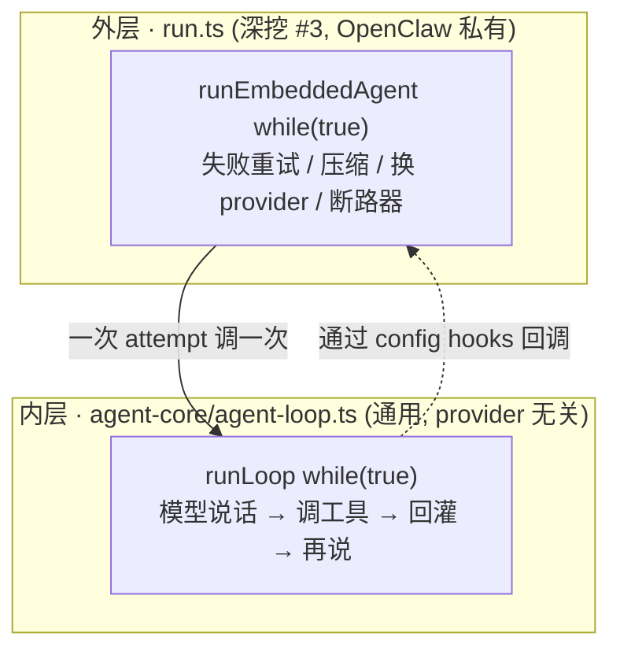
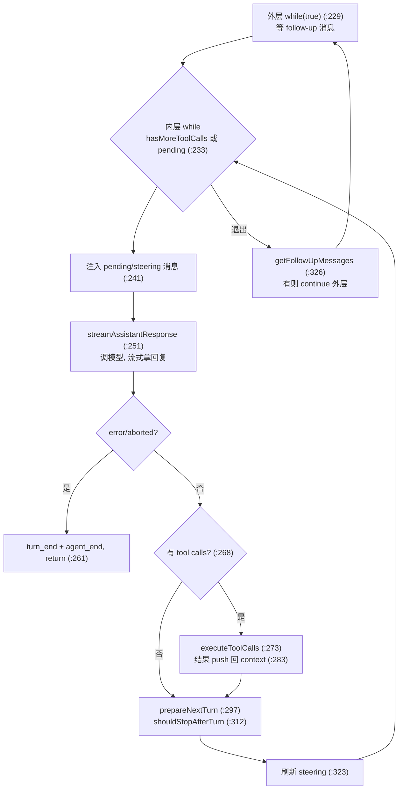
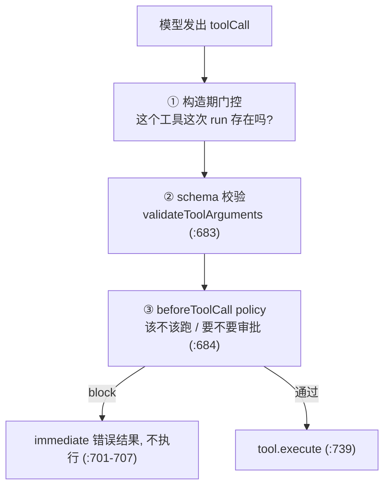
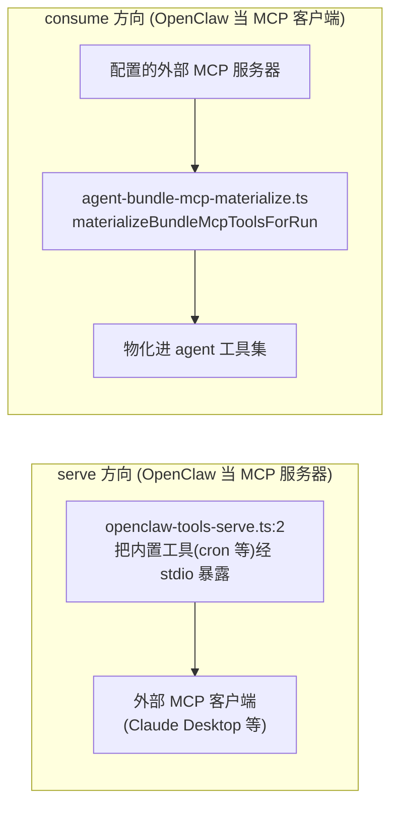

# OpenClaw 深挖 · 内层工具循环 + 工具系统 + MCP

> 系列第 9 份深挖。深挖 #3(runner)讲了**外层重试编排**,但「模型说话→调工具→回灌→再说」那一圈、以及工具怎么定义/校验/门控/MCP 桥接,全留白了。这份补上——**agent 真正干活的地方**。
> 范围:`packages/agent-core/src/agent-loop.ts`(内层循环)+ `src/agents/agent-tools.*`(工具+门控)+ `src/mcp/`(MCP 桥)。
> 深度:架构原理 + 代码走读,每个论断落到 `文件:行号`。
> 版本基准:`package.json` `2026.6.2`,分支 `main`。

---

## 目录

1. [两层 loop](#1-两层-loop)
2. [内层 loop 本体](#2-内层-loop-本体)
3. [hooks 才是架构](#3-hooks-才是架构)
4. [工具执行:顺序 vs 并行](#4-工具执行顺序-vs-并行)
5. [工具的三层门控](#5-工具的三层门控)
6. [beforeToolCall:安全的咽喉](#6-beforetoolcall安全的咽喉)
7. [工具从哪来](#7-工具从哪来)
8. [MCP 双向桥](#8-mcp-双向桥)
9. [值得记住的判断](#9-值得记住的判断)
10. [速查表](#10-速查表)

---

## 1. 两层 loop

深挖 #3 留的洞,本质是「OpenClaw 有**两层** loop,我只讲了外层」:



- **外层**(`run.ts`,深挖 #3):管「**一次完整尝试失败了整体怎么办**」——重试、压缩、换模型、断路器。OpenClaw 私有,3721 行。
- **内层**(`agent-core/src/agent-loop.ts`,本片):管「**这一次对话怎么进行**」——模型流式输出、调工具、把结果回灌、再问,直到模型不再调工具。**它在 `packages/` 里,是通用的、provider 无关的**——不知道 OpenClaw、不知道压缩、不知道 anthropic。

**判断**:这个内外分层是深挖 #3 第 11 章「内层和外层为什么要分开」的真正答案,但我当时没钻进内层。内层之所以能保持干净(整个 `runLoop` 才一百多行),是因为**所有 OpenClaw 特定的复杂度都被推到了外层,通过 config hooks 注入**(第 3 章)。这是和模型目录(#6)、harness(#3)同源的「**核心拥有通用循环,包装层拥有具体**」——只是这次「核心循环」具体到了 agent-core 这个包里的 `runLoop`。

---

## 2. 内层 loop 本体

`runLoop`(`agent-loop.ts:213`)是个**双层嵌套**:



一轮内层的实质(`:250-323`):

1. **注入 pending 消息**(`:241`):steering 或 follow-up 消息,在下一次模型响应**前**插进 context。
2. **`streamAssistantResponse`**(`:251`、`:345`):把 context 转成 LLM 消息(`convertToLlm`,`:360`)、带上 `tools`(`:366`)、解析 API key(为了过期 token,`:372`)、流式调模型。
3. **抽 tool calls**(`:268`):从模型回复的 content 里 filter 出 `type === "toolCall"`。
4. **执行工具**(`:273` `executeToolCalls`):结果 push 回 context(`:283-286`),`hasMoreToolCalls = !terminate`(`:281`)——有工具调用就得再问一轮(模型要看结果)。
5. **`prepareNextTurn`**(`:297`):hook,可在轮间**换模型/换 thinking level**。
6. **`shouldStopAfterTurn`**(`:312`):hook,决定要不要停。
7. **刷新 steering**(`:323` `getSteeringMessages`)。

**steering 是个亮点**(`:226`、`:241`、`:323`)。用户可以**在 agent 跑的过程中打字**,这些消息会在下一次模型响应前被注入(`getSteeringMessages` 拿、`message_start/end` 发、push 进 context)。这就是「实时打断/引导」——你不用等 agent 停下来,边跑边插话,它下一轮就看到。follow-up(`:326`)走同一条 pending 路径,只是发生在「一轮本来要结束之后」。

---

## 3. hooks 才是架构

内层 `runLoop` 干净得不可思议——一百多行,通用,无 OpenClaw 特定逻辑。秘密全在 **config hooks**。深挖 #3 那个 3721 行的外层 runner,是通过给 `AgentLoopConfig` 塞这几个回调,**把自己的复杂度投影进通用循环而不污染它**:

| hook | 内层调用点 | 外层(run.ts)塞进什么 |
|---|---|---|
| `transformContext` | `:355`(stream 前) | **压缩**——上下文太大时压历史(深挖 #3 第 6 章) |
| `prepareNextTurn` | `:297`(每轮后) | **换模型 / live 切换 / thinking 调整**(#3 第 9 章) |
| `shouldStopAfterTurn` | `:312` | 终止判定 |
| `getSteeringMessages` | `:226,323` | 实时打断消息 |
| `getFollowUpMessages` | `:326` | 后续排队消息 |
| `beforeToolCall` | `:684` | **工具 policy / 审批 / loop detection**(第 6 章) |
| `convertToLlm` | `:360` | AgentMessage[] → 各 provider 线协议消息 |
| `getApiKey` | `:373` | 解析会过期的 token |

**判断**:**这七个 hook 就是内外两层的全部接缝。** 理解了它们,就理解了为什么 run.ts 可以是个 3721 行的烂摊子、而 agent-loop.ts 能保持优雅——hook 边界把「失败恢复/压缩/provider 怪癖」这些脏活全挡在通用循环之外。深挖 #3 里那些 `prepareNextTurn`/`shouldStopAfterTurn` 的引用,落点就在这里的 `:297`/`:312`。**这是整个 agent 运行时最重要的一条架构线:通用引擎 + 注入式 hook,而不是一个全知全能的大循环。**

---

## 4. 工具执行:顺序 vs 并行

`executeToolCalls`(`agent-loop.ts:447`)先决定这批工具**顺序还是并行**(`:455-458`):

```ts
const hasSequentialToolCall = toolCalls.some(
  (tc) => currentContext.tools?.find((t) => t.name === tc.name)?.executionMode === "sequential",
);
if (config.toolExecution === "sequential" || hasSequentialToolCall) {
  return executeToolCallsSequential(...);   // :483
}
return executeToolCallsParallel(...);        // :545
```

规则:**config 要求顺序,或这批里任何一个工具标了 `executionMode === "sequential"`,整批就顺序跑;否则并行。**

**判断**:这是个**正确性**约束,不是性能选择。并行读文件没问题,但并行编辑/exec 会互相竞争(同时改一个文件、同时 spawn 进程抢资源)。所以「编辑/exec」这类工具标 `sequential`,而且**一个 sequential 工具就把整批拉成顺序**(`:455` `.some`)——保守但安全:宁可整批串行,不冒并行写竞争的险。这和深挖 #2/#3 反复出现的「会话串行」是同一种「可变资源要串行访问」的纪律,只是落在工具批次粒度。

---

## 5. 工具的三层门控

一个工具调用从「模型想调」到「真的执行」,要过**三道门**:



- **① 构造期**(`createOpenClawCodingTools`,`agent-tools.ts:398`):这次 run **哪些工具存在**,在构造工具集时就定了。它收 ~100 个 context 字段——`runtimeToolAllowlist`(显式允许哪些插件工具)、`groupId`/`memberRoleIds`(群级工具 policy)、`modelProvider`/`modelCompat`(provider 怪癖,如 anthropic OAuth 的工具名屏蔽)、`sandbox`(文件访问范围)、是否有 vision 能力等。**工具集是按 run 动态构造的,不是静态表。**
- **② schema 校验**(`prepareToolCall`,`agent-loop.ts:682-683`):`prepareToolCallArguments` + `validateToolArguments`——模型给的参数对不对 schema。不对直接 immediate 错误(`:722-727`)。
- **③ beforeToolCall policy**(`:684-708`,第 6 章):最后一道,也是最重的一道。

**判断**:三层门控对应三个问题——「这工具**该不该被这次 run 看到**」(构造期)、「参数**合不合法**」(schema)、「这次调用**该不该被允许**」(policy)。把它们分开,是因为它们的判定依据完全不同:构造期看 run 的身份/群/模型,schema 看类型,policy 看运行时上下文 + 人的意愿。这是给 LLM powerful 工具(Bash/Edit)还能安全的结构基础。

---

## 6. beforeToolCall:安全的咽喉

`config.beforeToolCall`(内层调用点 `agent-loop.ts:684`,返回 `{block, reason}` 可拦截)的 OpenClaw 实现是 `agent-tools.before-tool-call.ts`,文件头(`:1-5`)列了它干的事:

> Runs plugin hooks, trusted tool policies, approvals, diagnostics, loop detection, skill-use telemetry, and adjusted parameter tracking.

拆开看,这一道门里挤了**最安全敏感的逻辑**:

- **插件 hook**(`getGlobalHookRunner`,`:31`):插件可拦截/观察工具调用(深挖 #5 的 hook 体系)。
- **trusted tool policy**(`runTrustedToolPolicies`,`:34-38`):policy 引擎判这次调用允不允许。
- **人工审批**(`PluginApprovalResolutions`,`DEFAULT_PLUGIN_APPROVAL_TIMEOUT_MS`,`:25-28`):**「批准这个工具调用吗?」** 的提示路由到渠道,等用户点批准/拒绝(带超时)。
- **loop detection**(`ToolLoopDetectionConfig`,`:10`):检测 agent 卡在工具死循环。
- **参数调整**(`adjustedParamsByToolCallId`,`:54`):hook 可在执行前**改工具参数**。
- **skill 遥测**(`:47-52`)。

**判断**:**这是整个 agent 安全模型的咽喉。** 把 Bash、Edit 这种能改文件、跑命令的工具交给一个 LLM,凭什么敢?就凭这道门——每次工具调用前,trusted policy + 人工审批 + loop detection 一起把关。审批流把决定权交还给人(经渠道,深挖 #4),trusted policy 是自动规则,loop detection 防失控。**这道门是「给 AI 危险工具」和「不被 AI 搞砸」之间的全部防线。** 改这片任何东西,先想清楚它放开了什么。

---

## 7. 工具从哪来

进入 `context.tools` 的工具有三个来源,内层循环对它们一视同仁(都是 `AnyAgentTool`):

1. **内置 coding 工具**(`createOpenClawCodingTools`,`agent-tools.ts:398`):`exec`(`:181`)、`process`(`:211`)、文件系统工具(`createToolFsPolicy`,`:689`——读写受 fs policy 门控)、搜索工具(`createToolSearchTools`,`:944`),以及 Read/Edit/Bash 等(带 claude 风格别名)。
2. **插件工具**:插件经 SDK 贡献的工具,按 `runtimeToolAllowlist` 物化(深挖 #5)。
3. **MCP 工具**:外部 MCP 服务器的工具,物化进来(第 8 章)。

**判断**:内层循环只认 `AnyAgentTool`——它**不在乎工具是内置、插件还是 MCP**(`agent-loop.ts:672` 只按 name 查 `context.tools`)。这个统一抽象让「加一个工具来源」对核心循环零成本。工具集按 run 动态拼,正是为了把这三个来源 + 当时的 policy/model/channel 上下文揉成一份当次可用的工具列表。

---

## 8. MCP 双向桥

`src/mcp/` 把 OpenClaw 和 MCP(Model Context Protocol)**双向**打通,用的是官方 `@modelcontextprotocol/sdk`(`openclaw-tools-serve.ts:8`):



- **serve 出去**(`openclaw-tools-serve.ts`):OpenClaw 起一个 standalone MCP server(`:2` 注释、`createToolsMcpServer` + `connectToolsMcpServerToStdio`,`:12`),把选定的内置工具(`resolveOpenClawToolsForMcp`,`:14`,如 cron tool)暴露给外部 MCP 客户端。
- **consume 进来**(`agent-bundle-mcp-tools.ts` → `materializeBundleMcpToolsForRun`,`:28`):OpenClaw 当 MCP 客户端,把配置的外部 MCP 服务器的工具**物化**进 agent 工具集——成为第 7 章的「来源 3」。

**判断**:双向 MCP 很优雅。OpenClaw 既是 MCP server(自己的工具给别人用)又是 MCP client(别人的工具拿进来给 agent 用)。而且因为内层循环只认 `AnyAgentTool`,MCP 工具进来后和内置工具走完全相同的三层门控、相同的顺序/并行执行——**MCP 不是特殊路径,只是又一个工具来源**。这是把外部生态接进来而不污染核心循环的干净做法。

---

## 9. 值得记住的判断

1. **agent 有两层 loop。** 外层 run.ts(失败恢复)+ 内层 agent-core(模型↔工具)。内层通用、provider 无关、一百多行;脏活全在外层。
2. **七个 config hook 是内外全部接缝。** `transformContext`(压缩)/`prepareNextTurn`(换模型)/`shouldStopAfterTurn`/`getSteeringMessages`/`getFollowUpMessages`/`beforeToolCall`(policy)/`convertToLlm`。run.ts 靠它们把复杂度注入通用循环而不污染它——**整个 agent 运行时最重要的一条架构线**。
3. **steering = 实时打断。** 用户能在 agent 跑时插话,下一轮就被注入(`:226,323`)。
4. **工具顺序 vs 并行是正确性约束。** 一个 `executionMode: sequential` 工具把整批拉成串行——防并行写竞争,不是性能调优。
5. **工具过三道门:构造期 / schema / beforeToolCall。** 依据各不同(run 身份 / 类型 / 运行时+人意)。
6. **beforeToolCall 是 agent 安全咽喉。** trusted policy + 人工审批 + loop detection 一起,才敢把 Bash/Edit 给 LLM。改它先想清楚放开了什么。
7. **内层循环只认 `AnyAgentTool`。** 内置/插件/MCP 三来源一视同仁,加来源对核心零成本。
8. **MCP 双向且非特殊路径。** serve 出(当 server)+ consume 进(当 client),进来的工具走和内置完全相同的门控与执行。

---

## 10. 速查表

| 想搞懂… | 从这里读 |
|---|---|
| 内层 loop 入口 | `packages/agent-core/src/agent-loop.ts:119` `runAgentLoop`、`:213` `runLoop` |
| 模型流式调用 | `agent-loop.ts:345` `streamAssistantResponse`(tools 注入 `:366`) |
| 工具执行(顺序/并行决策) | `agent-loop.ts:447` `executeToolCalls`(`:455` 决策) |
| 工具准备 + 校验 + policy 门 | `agent-loop.ts:672` `prepareToolCall`(校验 `:682`、beforeToolCall `:684`) |
| 内外接缝(hooks) | `agent-loop.ts` 的 `transformContext:355`/`prepareNextTurn:297`/`shouldStopAfterTurn:312`/`getSteeringMessages:226` |
| 工具集构造 | `src/agents/agent-tools.ts:398` `createOpenClawCodingTools` |
| 内置工具样例 | `agent-tools.ts:181`(exec)、`:211`(process)、`:689`(fs policy)、`:944`(search) |
| beforeToolCall 实现(安全咽喉) | `src/agents/agent-tools.before-tool-call.ts:1`(审批/policy/loop) |
| MCP serve(当 server) | `src/mcp/openclaw-tools-serve.ts:2`、`tools-stdio-server.ts` |
| MCP consume(当 client) | `src/agents/agent-bundle-mcp-materialize.ts` `materializeBundleMcpToolsForRun` |
| 工具协议/描述/执行(另一套) | `src/tools/`(protocol/descriptors/execution) |

---

### 与前几份深挖的衔接

- 本片是深挖 #3 留洞的填补:#3 的外层 runner 通过第 3 章那七个 hook 驱动本片的内层 `runLoop`;#3 第 6 章的压缩 = `transformContext` hook、第 9 章的换模型 = `prepareNextTurn` hook 的落点。
- 第 6 章的人工审批流路由到渠道,接深挖 #4(channels 传输)——审批 UI 是渠道渲染的可移植动作。
- 第 5、6、7 章的插件工具 / 插件 hook / trusted policy 全经 SDK 进来,接深挖 #5(插件边界)。
- 第 7 章「工具集携带 modelCompat/provider 怪癖」接深挖 #6——provider 差异从模型目录的 compat flag 一路传到工具构造。

至此学习包 **9 份**(全景 + 8 子系统),agent 从「消息进来」到「模型调工具干活」到「存储落盘」端到端打通,只剩 channels 传输细节、harness 选择层等更外围的边角。
