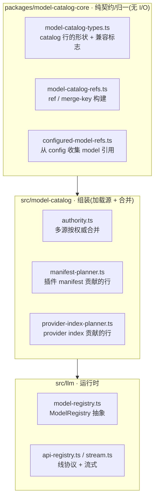
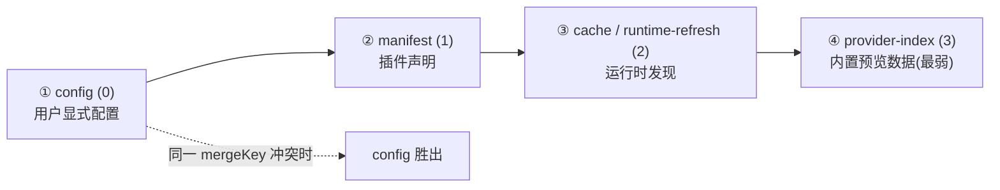
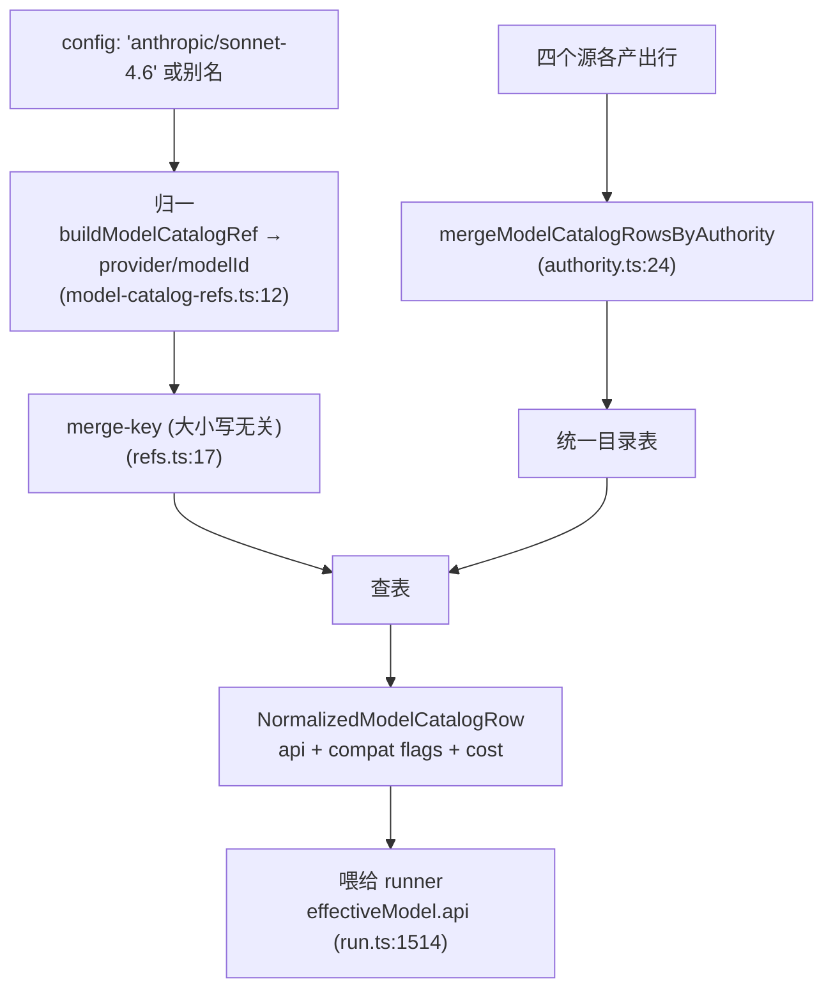

# OpenClaw 深挖 · model-catalog / llm（模型解析）

> 系列第 6 份子系统深挖，也是收口篇。它接住深挖 #3（runner）第 9 章和深挖 #4（auto-reply）第 7 章**两次明确留下的「模型解析」尾**。
> 范围：`packages/model-catalog-core`（契约）+ `src/model-catalog`（组装）+ `src/llm`（运行时）。
> 深度：架构原理 + 代码走读，每个论断落到 `文件:行号`。
> 版本基准：`package.json` `2026.6.2`，分支 `main`。

---

## 目录

1. [这份收口什么](#1-这份收口什么)
2. [三层分工](#2-三层分工)
3. [核心命题：一张多源合并的目录](#3-核心命题一张多源合并的目录)
4. [四个源 + 权威排序](#4-四个源--权威排序)
5. [catalog 行携带什么：全项目的无名英雄](#5-catalog-行携带什么全项目的无名英雄)
6. [模型解析全流程](#6-模型解析全流程)
7. [这把前面的尾都收了](#7-这把前面的尾都收了)
8. [值得记住的判断](#8-值得记住的判断)
9. [速查表](#9-速查表)

---

## 1. 这份收口什么

前面两片各留了一个洞：

- 深挖 #3 runner 第 9 章：`provider` / `modelId` / `effectiveModel` 怎么从配置解析出来，「留给模型目录那条线」。
- 深挖 #4 auto-reply 第 7 章：那条 100 行的模型 override 优先级链，为什么 config override 能压住一切。

这两个洞是同一个东西：**OpenClaw 怎么知道「anthropic/sonnet-4.6」这个字符串对应一个什么样的模型——用什么线协议、支不支持工具、支不支持缓存、谁说了算**。本片就讲这个。它是全项目里**最紧凑**的子系统（`src/llm` 只有 56 个文件），但它是让「多 provider」真正能用的**罗塞塔石碑**。

---

## 2. 三层分工

这片是深挖 #1 第 11 章「packages 契约层 vs src 实现层」的**教科书范例**，三层分得干干净净：



- **`packages/model-catalog-core`**：纯类型 + 纯归一函数，没有任何文件/网络 I/O。谁都能依赖（核心和插件共享同一套 catalog 类型）。
- **`src/model-catalog`**：组装层——加载各个源、按权威合并成统一目录。
- **`src/llm`**：运行时——`ModelRegistry`（`model-registry.ts:5-10`：`getAll`/`getAvailable`/`find`/`hasConfiguredAuth`）、线协议、流式。

**判断**：这是整个仓库「契约抽包、实现留 src、插件只碰契约」原则最清爽的一次落地。`AGENTS.md:93`「providers own auth/catalog/runtime hooks; core owns generic loop」——provider 插件经 manifest 往 `model-catalog-core` 的契约里塞数据，核心读这套契约跑通用循环，双方不互相 import 实现。

---

## 3. 核心命题：一张多源合并的目录

模型解析的本质，是查一张**目录表**。但这张表不是写死的，也不是单一来源的——它是**多个来源合并**出来的。同一个模型（如 `anthropic/sonnet-4.6`）可能被四个来源各描述一遍，彼此还可能冲突。

所以这片的核心问题是：

> 当 config、插件 manifest、运行时发现、内置 provider-index **四个源都声称知道** `anthropic/sonnet-4.6` 长什么样，且说法不一致时，**听谁的**？

答案是一套**权威排序**（authority），下一章。

---

## 4. 四个源 + 权威排序

合并逻辑在 `authority.ts`，开宗明义一张权威表（`authority.ts:9-15`）：

```ts
const MODEL_CATALOG_SOURCE_AUTHORITY = {
  config: 0,
  manifest: 1,
  cache: 2,
  "runtime-refresh": 2,
  "provider-index": 3,
};
```

**数字小的赢**（`:30-34` 注释：「Lower numeric authority wins」）。合并时按 mergeKey 分组，每组留权威最强的那行（`mergeModelCatalogRowsByAuthority`，`:24-39`）：



四个源的来历：

- **config（最强）**：用户在 `openclaw.json` 里显式写的。`collectConfiguredModelRefs`（`configured-model-refs.ts:29`）从 agents/channels/hooks 各处收集 model 引用，配置键包括 `model`/`imageModel`/`videoGenerationModel` 等（`AGENT_MODEL_CONFIG_KEYS`，`:18-26`），每个键可以是字符串或 `{primary, fallbacks[]}`（`:47-52`）。
- **manifest**：插件经 manifest 贡献（深挖 #5 里那些 `PluginManifestModelCatalog*` 类型；`planManifestModelCatalogRows`，`model-catalog/index.ts:6`）。
- **cache / runtime-refresh**：运行时从 provider API 发现并缓存的。
- **provider-index（最弱）**：内置的 `loadOpenClawProviderIndex`（`model-catalog/index.ts:4`）——预览/兜底数据。

**判断**：这套排序是个**干净、有原则的冲突解决策略**。它回答「四源打架听谁的」：用户显式配置永远赢，插件声明次之，运行时发现再次，内置预览垫底。这一条直接解释了 auto-reply 第 7 章的谜题——**为什么 config/session override 能压住一切**：因为它们是 `config` 源（authority 0），天然碾压其它所有源。模型 override 优先级不是 auto-reply 自己发明的，是 catalog authority 在产品层的体现。

---

## 5. catalog 行携带什么：全项目的无名英雄

合并出的每一行（`NormalizedModelCatalogRow`）携带两样关键东西（`model-catalog-types.ts`）：

**① 线协议 `api`**（`:4-18`，10 种）：

```
openai-completions / openai-responses / anthropic-messages /
google-generative-ai / google-vertex / github-copilot /
bedrock-converse-stream / ollama / azure-openai-responses ...
```

**② 兼容标志 `ModelCatalogCompatConfig`**（`:39-72`，约 35 个 flag），节选：

```ts
supportsTools?, supportsPromptCacheKey?, supportsLongCacheRetention?,
cacheControlFormat?: "anthropic", maxTokensField?: "max_completion_tokens"|"max_tokens",
requiresToolResultName?, requiresAssistantAfterToolResult?, requiresThinkingAsText?,
thinkingFormat?, supportedReasoningEfforts?, nativeWebSearchTool?,
unsupportedToolSchemaKeywords?, requiresMistralToolIds?, ...
```

**这个 `ModelCatalogCompatConfig` 是全项目的无名英雄。** 它是一张**知识库**：每一个 flag 编码某一家 provider/模型的一个怪癖——「这家的 max tokens 字段叫 `max_completion_tokens` 不叫 `max_tokens`」「这家工具结果后必须跟一条 assistant 消息」「这家支持 anthropic 风格的缓存控制」「这家的某些工具 schema 关键词不支持」。

**判断**：正是这张表，让深挖 #3 那个**唯一的、通用的** agent 循环能对付 100+ 个模型、十来种线协议。没有它，runner 里就得撒满 `if (provider === "mistral") ... else if (provider === "google") ...` 的分支；有了它，runner 只管读 flag——「这个模型 `requiresAssistantAfterToolResult` 吗？是就补一条」。`AGENTS.md:93`「core owns generic loop, providers own quirks」的物理落点就在这张 35 字段的表里。**这个项目能支持这么多 provider 而核心循环还保持通用，全靠把 provider 差异收敛进了这张数据表，而不是散进控制流。** 它的复杂度在**数据**，不在逻辑——这是对的地方。

---

## 6. 模型解析全流程

把前面串成一条从「配置字符串」到「可调用模型」的解析链：



要点：

- **ref 归一**（`model-catalog-refs.ts:12,17`）：`provider/modelId` 是显示用，merge-key（`provider::modelid`，大小写无关）是查表用。两者分开是为了「显示保留原样、匹配忽略大小写」。
- **解析产物**就是那一行 `api + compat`，直接喂给 runner——深挖 #3 里 `run.ts:1514` 那个 `modelApi: effectiveModel.api` 拿的就是这个。
- **别名**：config 可以写别名，经 aliasIndex 解析成真实 ref（auto-reply 第 4 章 `resolveModelRefFromString` 就在做这事）。

---

## 7. 这把前面的尾都收了

本片是收口篇，明确接上前面几处悬而未决：

| 前面留的尾 | 本片的收口 |
|---|---|
| runner #9「provider/model 怎么解析」 | 查多源合并目录（第 6 章），产物是 api+compat 行 |
| runner #6「prompt-cache 怎么知道支不支持」 | catalog 的 `supportsPromptCacheKey`/`supportsLongCacheRetention`/`cacheControlFormat` flag（第 5 章） |
| runner #6「thinking level 怎么映射」 | catalog 的 `thinkingFormat`/`supportedReasoningEfforts` flag |
| runner #8「fallback 模型从哪来」 | config 的 `{primary, fallbacks[]}` 结构（`configured-model-refs.ts:47-52`） |
| auto-reply #7「config override 为何压一切」 | config 是 authority 0，碾压 manifest/runtime/index（第 4 章） |
| runner「通用循环怎么跨 provider」 | `ModelCatalogCompatConfig` 35 个 flag 把差异收进数据表（第 5 章） |

**一个反复出现的形状**：`{primary, fallbacks[]}` 在这里（模型配置）、在 ACP 控制面（backend `{primary, fallbacks}`，深挖 #2 第 7.1 节）、在 runner 的跨 provider 故障切换（深挖 #3 第 8 章）都出现。「主 + 一串兜底」是整个仓库表达「弹性」的统一形状——理解一处就理解所有。

---

## 8. 值得记住的判断

1. **模型解析 = 查一张多源合并的目录。** 不是写死的，是 config/manifest/runtime/provider-index 四源按权威合并出来的。
2. **权威排序 config(0)>manifest(1)>runtime(2)>provider-index(3)，小者胜。** 这一条解释了 auto-reply 模型 override 为何 config 永远赢——它本就是最高权威源。
3. **`ModelCatalogCompatConfig`(~35 flag) 是全项目无名英雄。** 它把 100+ 模型、十来种协议的怪癖收进一张数据表，让 runner 那个唯一的通用循环能跨所有 provider。差异在数据里，不在控制流里。
4. **三层分工是契约/实现分离的教科书。** model-catalog-core 纯归一无 I/O、src/model-catalog 组装、src/llm 运行时。插件只碰契约。
5. **`{primary, fallbacks[]}` 是全仓统一的弹性形状。** 模型、ACP backend、provider 故障切换都用它。
6. **它小但承重。** 6 片里最紧凑，却是「多 provider 真正能用」的罗塞塔石碑。复杂度在数据表，是对的地方。

---

## 9. 速查表

| 想搞懂… | 从这里读 |
|---|---|
| catalog 公共门面 | `src/model-catalog/index.ts:3-9` |
| 多源权威合并 | `src/model-catalog/authority.ts:9`（表）、`:24`（合并） |
| catalog 行形状（api+compat） | `packages/model-catalog-core/src/model-catalog-types.ts:4`（api）、`:39`（compat） |
| ref / merge-key | `packages/model-catalog-core/src/model-catalog-refs.ts:12,17` |
| 从 config 收 model 引用 | `packages/model-catalog-core/src/configured-model-refs.ts:29`（键 `:18`、fallbacks `:47`） |
| 插件 manifest 贡献行 | `src/model-catalog/manifest-planner.ts` |
| provider-index 贡献行 | `src/model-catalog/provider-index-planner.ts` |
| 运行时模型注册表 | `src/llm/model-registry.ts:5` |
| 线协议 / 流式 | `src/llm/api-registry.ts`、`src/llm/stream.ts` |
| 硬策略原文 | `AGENTS.md:93` |

---

# 学习包总览（6 篇 + 全景）

至此，study-openclaw/ 下共 7 份文档，构成一套从地图到逐子系统的完整教材：

| # | 文档 | 一句话 |
|---|---|---|
| 0 | `openclaw-architecture-zh.md` | 全景地图：三层心智模型 + 复杂度分布 |
| 1 | `openclaw-acp-control-plane-zh.md` | 控制面：会话生命周期 + 句柄/backend 故障切换 |
| 2 | `openclaw-embedded-agent-runner-zh.md` | 计算面顶点：3721 行巨型函数 + 四大硬问题 |
| 3 | `openclaw-auto-reply-zh.md` | 产品大脑：消息的一生前半段 + 两条计算路径 |
| 4 | `openclaw-plugins-zh.md` | 扩展基石：声明与代码分离 + 边界机器强制 |
| 5 | `openclaw-gateway-zh.md` | 宿主进程：启动依赖链 + 先 listen 再预热 |
| 6 | `openclaw-model-catalog-zh.md` | 罗塞塔石碑：多源合并目录 + compat 知识库 |

**贯穿全套的几条主线**（散落各篇、在此汇总）：

1. **懒加载即性能**：CLI 入口 fast-path、acpx 懒注册 backend、插件惰性激活（cli-metadata/tool-discovery/full）、gateway 先 listen 再预热——同一哲学在五个尺度反复出现。
2. **按会话串行做了三遍**：投递 fencing（auto-reply）+ ACP actor 队列 + runner lane——因路径多、不一定都经过，每层自保。
3. **`{primary, fallbacks}` 弹性形状**：模型、ACP backend、provider 故障切换统一用它。
4. **「有输出就不许切换」安全闸**：runner（`!sawOutput`）和 ACP（backend-failover）各实现一遍的产品取舍。
5. **机器强制架构不变量**：4 个边界检查脚本守 SDK 边界、catalog authority 排序定冲突——不靠自觉，靠 CI 和数据。
6. **疤痕组织挂 issue**：runner 的断路器、auto-reply 的 stale override 守卫、gateway/post-attach 的时序魔数——每个看着冗余的分支都防一个真实事故，别乱删。
7. **复杂度放对地方**：插件复杂度在接缝、模型复杂度在数据表、gateway 复杂度在时序——核心循环因此能保持通用而简单。
