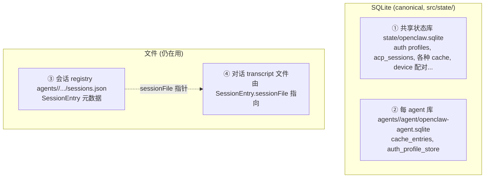
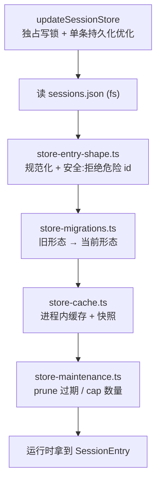

# OpenClaw 深挖 · sessions / 存储层

> 系列补充篇(第 7 份深挖)。前 7 份没碰存储,而这恰是**你最近 git 在动的地方**(commit:`mark transcript rewrites in registry`、`stabilize live session metadata`、`align transcript append mock`)。
> 范围:`src/state/`(SQLite)+ `src/config/sessions/`(会话存储)+ `src/sessions/`(语义)+ `src/transcripts/`(语音转录,辨析用)。
> 深度:架构原理 + 代码走读,每个论断落到 `文件:行号`。
> 版本基准:`package.json` `2026.6.2`,分支 `main`。

---

## 目录

1. [先破三个「transcript」歧义](#1-先破三个transcript歧义)
2. [存储全景](#2-存储全景)
3. [SQLite 层:两个库](#3-sqlite-层两个库)
4. [哪些进了 SQLite](#4-哪些进了-sqlite)
5. [但会话存储还是 sessions.json —— 文档与代码的偏差](#5-但会话存储还是-sessionsjson--文档与代码的偏差)
6. [会话存储分层](#6-会话存储分层)
7. [「registry」是什么 + updatedAt 标记](#7-registry-是什么--updatedat-标记)
8. [对话 transcript:指针 + fork 不复用](#8-对话-transcript指针--fork-不复用)
9. [值得记住的判断](#9-值得记住的判断)
10. [速查表](#10-速查表)

---

## 1. 先破三个「transcript」歧义

读这片前必须先拆掉一个命名陷阱。OpenClaw 里有**三个不同的东西都叫 transcript**,混了就全乱:

| 叫法 | 是什么 | 存哪 |
|---|---|---|
| **会话/对话 transcript** | agent 的消息历史(你发的、模型回的、工具调用) | **文件**,由 `SessionEntry.sessionFile` 指针指向 |
| `src/transcripts/` | **语音/会议转录**产品功能(voice-call/realtime-transcription) | **文件**(JSON+JSONL artifact),`TranscriptsStore` |
| ACP replay | 控制面事件重放(event ledger) | **SQLite** `acp_replay_sessions`/`acp_replay_events` |

**你 git 里改的「transcript rewrites」「transcript append」是第一个**——对话历史。`src/transcripts/store.ts:12-15` 那个 file-backed `TranscriptsStore` 是第二个,跟 agent 对话无关,本片不展开它。本片主讲第一个 + 它背后的会话存储。

---

## 2. 存储全景

OpenClaw 的持久化分**两类介质、四个去处**:



`AGENTS.md:76` 的口号是「Storage default: SQLite only」。但**当前代码的现实是 SQLite + 文件并存**——很多东西进了 SQLite(第 4 章),但会话存储和对话 transcript 还是文件(第 5 章)。这个差距是本片最重要的发现。

---

## 3. SQLite 层:两个库

`src/state/` 管两个 SQLite 库,结构对称:

| | 共享状态库 | 每 agent 库 |
|---|---|---|
| 入口 | `openclaw-state-db.ts` | `openclaw-agent-db.ts` |
| 路径 | `state/openclaw.sqlite` | `agents/<id>/agent/openclaw-agent.sqlite` |
| DDL | `openclaw-state-schema.sql` | `openclaw-agent-schema.sql` |
| 生成类型 | `openclaw-state-schema.generated.ts` + `.generated.d.ts` | 同 |

技术栈(`openclaw-state-db.ts:5-13`):

- **Node 内置 SQLite**:`node:sqlite` 的 `DatabaseSync`(不是 better-sqlite3 之类第三方)。
- **Kysely(同步)**:`getNodeSqliteKysely` / `executeSqliteQuerySync`——`AGENTS.md:77`「用 Kysely helper,不写裸 SQL,DDL/迁移除外」的落点。运行时查询走 Kysely,只有建表 DDL 是 `.sql`。
- **WAL 模式**:`configureSqliteWalMaintenance`(`:13`)——读写并发。
- **私有权限**:目录 `0700`、文件 `0600`(`:31-32`)——库里有 auth profile/credentials,必须防其他用户读。
- **busy timeout 30s**(`:30` `OPENCLAW_SQLITE_BUSY_TIMEOUT_MS`):锁等待上限。
- **迁移/备份审计**:模块自述拥有「schema creation, additive migrations, audit rows for migrations/backups」(`:21-27`),记录每次迁移/备份的 run(`:48-75`)。

**「schema-as-SQL → 生成 Kysely 类型」这个模式值得记**:`.sql` 是 DDL 真相源,codegen 产出带类型的 Kysely DB 接口(`.generated.ts`)。改表结构改 `.sql`,重新生成类型,运行时用 Kysely 拿到编译期类型安全。这是「DDL 用 SQL、查询用类型化 helper」的干净分工。

---

## 4. 哪些进了 SQLite

共享状态库的表(`openclaw-state-schema.sql` 实测,节选)能看出迁移覆盖面已经很广:

```
auth_profile_stores / auth_profile_state    ← 模型认证(深挖 #3 的 profile 轮换)
acp_sessions                                ← ACP 控制面会话行(深挖 #2)
acp_replay_sessions / acp_replay_events     ← ACP 事件重放
model_capability_cache / agent_model_catalogs ← 模型目录(深挖 #6)
device_pairing_* / node_pairing_* / device_auth_tokens ← 设备配对/鉴权
gateway_restart_sentinel / _intent / _handoff ← 网关重启(深挖 #5 的哨兵/交接)
installed_plugin_index                      ← 已装插件(深挖 #5)
agent_databases                             ← 每 agent 库的注册表
```

每 agent 库则放 `cache_entries`、`auth_profile_store`/`auth_profile_state`(agent 作用域的认证)。

**判断**:这张表清单是前几份深挖的「存储侧背书」——深挖 #2 的 acp_sessions、#3 的 auth profile、#5 的 gateway restart/插件索引、#6 的 model catalog cache,**全在 SQLite 里**。`gateway_restart_handoff` 是 SQLite 表这点还修正了我深挖 #5 的说法:重启交接不只是文件,主要走 SQLite 行。`agent_databases` 表是「每 agent 库的注册表」——共享库记着有哪些 agent 库,典型的「索引在共享库、数据在分库」。

---

## 5. 但会话存储还是 sessions.json —— 文档与代码的偏差

**这是本片的 headline,也是对你最有用的一条。**

`docs/refactor/database-first.md` 白纸黑字写着(`:1846`、`:2254`):

> No runtime `sessions.json`, transcript JSONL... Runtime no longer writes session indexes, transcript JSONL...

**但当前代码不是这样。** 通用会话存储**仍是 `sessions.json` 文件**:

```ts
// paths.ts:288-297  resolveStorePath 默认:
if (!store) {
  return path.join(resolveAgentSessionsDir(agentId, env, homedir), "sessions.json");
}
```

```ts
// store.ts:791  saveSessionStore 写的是文件路径,带独占写锁:
export async function saveSessionStore(storePath, store, opts) {
  await runExclusiveSessionStoreWrite(storePath, async () => {
    await saveSessionStoreUnlocked(storePath, store, opts);   // 写 sessions.json
  });
}
```

而且 schema 里**根本没有通用 sessions 表**(第 4 章那串表里,只有 `acp_sessions` 这种 ACP 专用的,没有承载 `SessionEntry` 的通用表)。

**结论(以当前代码为准)**:database-first 迁移是**真实但不完整**的。~40 张表确实进了 SQLite,但**两个最高频的存储——会话 registry(`sessions.json`)和对话 transcript 文件——还没迁**。`docs/refactor/database-first.md` 描述的是**目标态**,不是今天。

**给你的实用提醒**:在 sessions 里干活时,**信代码(`sessions.json` + 文件锁 + 缓存),别信那份 refactor doc**。你最近那些 commit(transcript rewrites、session metadata fixture)处理的就是这个文件态存储——它的并发、缓存、迁移、清理全得自己手搓(下一章),因为它享受不到 SQLite 的事务/并发。**这就是 `config/sessions/` 要 40 个文件的原因:它在替「还没进 SQLite」还债。**

---

## 6. 会话存储分层

正因为是文件态,`sessions.json` 的读写要自己搭一整套 SQLite 本该免费给的东西。`store-load.ts:1` 一句话概括职责:「normalizes persisted records, migrations, maintenance, and caches」。分层:



几个关键件:

- **安全规范化**(`store-entry-shape.ts:7-19`):持久化的 `sessionId` 可能是旧的/畸形的/恶意的。因为它要拼进**文件路径**,所以必须拒绝路径穿越——长度 >255、含 `/` `\` `..`、不匹配 `^[A-Za-z0-9][A-Za-z0-9._:@-]*$` 的一律 reject(`:12-18`)。**这条防御正是「文件态」逼出来的**:SQLite 行不会有路径穿越风险,文件态才需要(`AGENTS.md:89`「observed malformed input gets care」)。
- **独占写锁**(`store.ts:60` `runExclusiveSessionStoreWrite`、`:796`):同一 `storePath` 的写串行——文件没有 SQLite 的事务,只能自己加锁防并发写互相覆盖。
- **单条持久化优化**(`store.ts:170` `singleEntryPersistence`、`:665`):改一个会话不必重写整个 `sessions.json`,可只持久化那一条——文件态下省 I/O 的手搓优化(SQLite 的 UPDATE 天然如此)。
- **缓存**(`store-cache.ts`):进程内缓存 + 快照,靠 `getFileStatSnapshot`(`store-load.ts:13`)按文件 mtime 判失效。
- **维护**(`store-maintenance.ts`):`pruneStaleEntries` / `capEntryCount`——文件会无限长,得主动剪。

**判断**:这五样(规范化/锁/单条优化/缓存/维护)**全是 SQLite 免费提供、文件态必须手搓的东西**。`config/sessions/` 的 40 文件复杂度,本质是「迁移债的利息」。等会话存储哪天真进了 SQLite,这一片能砍掉一大半。

---

## 7. 「registry」是什么 + updatedAt 标记

你 commit 里的「registry」就是**会话存储本身**——`sessions.json` 里那张 `Record<sessionKey, SessionEntry>` 表。`docs/refactor/database-first.md:271` 说 transcript 身份是「`{agentId, sessionId}` in registry/control-plane rows」。

`SessionEntry`(`types.ts`)是「durable per-session metadata」(`:1`),携带:`sessionId`、`sessionFile`(transcript 指针)、`updatedAt`、模型 override、`acp`(`SessionAcpMeta`,深挖 #2 控制面读的就是它,`types.ts:3-9`)、group、delivery、CLI 绑定指纹(`CliSessionBinding`,`:46-58`)等。

**`updatedAt` 是「registry 标记」**——`agents/command/attempt-execution.ts:314` 注释点明:

> Keep updatedAt as the registry marker for transcript writes we own.

也就是说:当 agent 重写自己拥有的 transcript(比如压缩后),就 bump 这个会话在 registry 里的 `updatedAt`。**你那条 `mark transcript rewrites in registry` 改的就是这个标记逻辑**——让 registry 知道「这个会话的 transcript 被我们改过了」,供后续维护/同步判断。

---

## 8. 对话 transcript:指针 + fork 不复用

对话 transcript(消息历史)**不在 `sessions.json` 里**,而是一个**单独的文件**,由 `SessionEntry.sessionFile` 指针指向。`session-file.ts:8` 的 `resolveAndPersistSessionFile` 负责解析这个路径并写回 registry。

一个关键的 fork 安全规则(`session-file.ts:24-34`):

```ts
const shouldReusePersistedSessionFile = baseEntry.sessionId === sessionId;
// 注释:reset/fork 不该复用上一个 transcript 路径,除非 fallback 明确指向新 id 的文件
const entryForResolve = !shouldReusePersistedSessionFile
  ? (fallbackSessionFile ? { ...baseEntry, sessionFile: fallbackSessionFile }
                         : { ...baseEntry, sessionFile: undefined })
  : ...;
```

**判断**:这条「reset/fork 不复用旧 transcript」很重要。会话 reset 或 fork 出新 session id 时,必须给它**全新的 transcript 文件**,否则新会话会写进旧会话的历史里,污染两边。`shouldReusePersistedSessionFile = (baseEntry.sessionId === sessionId)` 这个等式是闸门:只有 sessionId 没变才复用文件路径。这解释了为什么 transcript 身份是 `{agentId, sessionId}` 而非 sessionKey——sessionKey 可以稳定但 sessionId 会随 reset/fork 变,transcript 跟 sessionId 走。

整条链:`sessionKey →(registry 查)→ SessionEntry →(sessionFile 指针)→ transcript 文件 →(append/rewrite)→ bump registry.updatedAt`。

---

## 9. 值得记住的判断

1. **三个「transcript」别混**:对话历史(文件,sessionFile 指)/ 语音转录(`src/transcripts`,独立产品)/ ACP replay(SQLite)。你的 git 活是第一个。
2. **database-first 迁移真实但不完整。** ~40 张表进了 SQLite,但**会话 registry 和对话 transcript 还是文件**。`docs/refactor/database-first.md` 是目标态,不是今天——**信代码别信那份 doc**。
3. **`config/sessions/` 的 40 文件复杂度 = 迁移债的利息。** 规范化/锁/单条优化/缓存/维护,全是 SQLite 免费给、文件态手搓的。进了 SQLite 能砍一半。
4. **文件态逼出了安全防御。** `store-entry-shape` 拒绝路径穿越 id——因为 id 要拼文件路径;SQLite 行无此风险。
5. **「registry」= sessions.json 的 SessionEntry 表,`updatedAt` 是 transcript 写入标记。** 你那条 commit 改的就是它。
6. **transcript 跟 sessionId 走,不跟 sessionKey。** reset/fork 换新 sessionId → 换新 transcript 文件,防历史污染。
7. **SQLite 用 Node 内置 `node:sqlite` + Kysely,schema-as-SQL → 生成类型。** DDL 用 `.sql`,查询用类型化 Kysely——`AGENTS.md:77` 的落点。
8. **两库分工 + agent_databases 注册表。** 共享库记全局 + 索引,分库放 agent 作用域数据。

---

## 10. 速查表

| 想搞懂… | 从这里读 |
|---|---|
| 共享 SQLite 库 | `src/state/openclaw-state-db.ts`(WAL/权限/迁移审计) |
| 每 agent SQLite 库 | `src/state/openclaw-agent-db.ts` |
| SQLite 表清单 | `src/state/openclaw-state-schema.sql` / `openclaw-agent-schema.sql` |
| 会话存储路径(仍是文件!) | `src/config/sessions/paths.ts:288` `resolveStorePath`(默认 `sessions.json`) |
| 会话存储读 | `src/config/sessions/store-load.ts` |
| 会话存储写(独占锁) | `src/config/sessions/store.ts:791` `saveSessionStore`、`:801` `updateSessionStore` |
| 持久化安全规范化 | `src/config/sessions/store-entry-shape.ts:7`(拒绝危险 id) |
| SessionEntry 形状 | `src/config/sessions/types.ts` |
| transcript 文件解析/持久化 | `src/config/sessions/session-file.ts:8` |
| 会话维护(prune/cap) | `src/config/sessions/store-maintenance.ts` |
| registry 标记逻辑 | `src/agents/command/attempt-execution.ts:314` |
| 会话语义(key/id/lifecycle) | `src/sessions/*`(session-id-resolution、transcript-events…) |
| 语音转录(辨析) | `src/transcripts/store.ts`(独立产品,非对话历史) |
| 迁移目标态文档(超前于代码) | `docs/refactor/database-first.md` |

---

### 与前几份深挖的衔接

- 第 4 章的 SQLite 表清单是前几份的**存储侧背书**:`acp_sessions`(#2)、`auth_profile_stores`(#3)、`gateway_restart_*`/`installed_plugin_index`(#5)、`model_capability_cache`/`agent_model_catalogs`(#6)全在这。
- 第 7 章 `SessionEntry.acp`(`SessionAcpMeta`)正是深挖 #2 控制面 `readSessionEntry` 读的字段——控制面的会话元数据持久在 `sessions.json` 的 `acp` 字段里,而 ACP 运行时/重放行在 SQLite `acp_*` 表。两者分工:**控制面元数据在文件 registry,运行时/重放在 SQLite**。
- 第 5 章「文档超前于代码」是全系列唯一一处明确的**文档与代码冲突**——其余几份多是「文件名误导」(boot.ts、index.ts),这次是 refactor doc 描述了尚未落地的目标态。

至此学习包 8 份(全景 + 7 子系统)。存储这片填上了主路径之外最贴你日常的一块。
