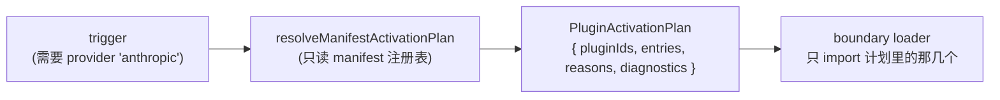
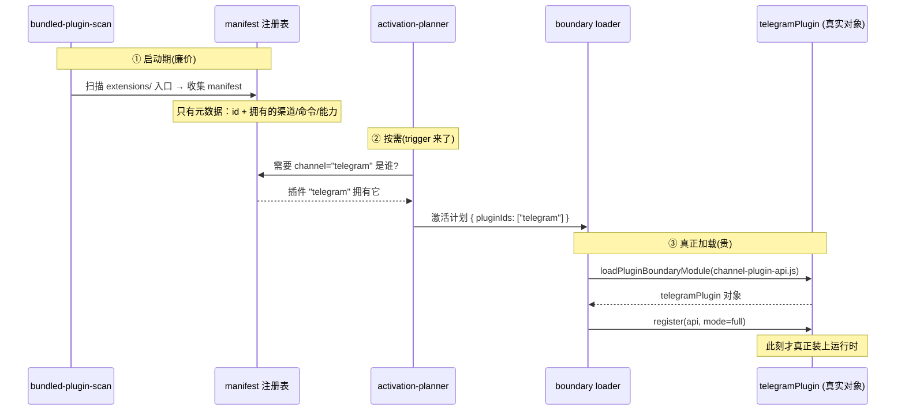

# OpenClaw 深挖 · plugins（插件 / SDK 体系）

> 系列第 4 份子系统深挖。前三份讲「消息怎么流」，这份讲「**这个仓库凭什么能挂住 135 个插件还不塌**」。
> 范围：`src/plugins/` 装载/激活机制 + `src/plugin-sdk/` 边界契约 + 边界强制。
> 深度：架构原理 + 代码走读，每个论断落到 `文件:行号`。
> 版本基准：`package.json` `2026.6.2`，分支 `main`。

---

## 目录

1. [核心命题](#1-核心命题)
2. [四个概念先分清](#2-四个概念先分清)
3. [插件入口：惰性指针，不是代码](#3-插件入口惰性指针不是代码)
4. [manifest 驱动的激活规划](#4-manifest-驱动的激活规划)
5. [边界装载：bundled vs external 的物理区别](#5-边界装载bundled-vs-external-的物理区别)
6. [注册模式：分深度注册](#6-注册模式分深度注册)
7. [SDK 子路径导出 = 唯一合法接缝](#7-sdk-子路径导出--唯一合法接缝)
8. [一个插件的一生](#8-一个插件的一生)
9. [值得记住的判断](#9-值得记住的判断)
10. [速查表](#10-速查表)

---

## 1. 核心命题

`extensions/` 有 **135 个插件**，`src/plugins/` 有 **360 个非测试文件**专门伺候它们。但全景地图第 1 章那个「core 保持 plugin-agnostic」的口号，落到实处是一个反直觉的事实：

> **纯核心装好后，连一个插件的代码都没 import，甚至跑不了一次模型 turn**（《ACP 控制面》第 5.2 节：没有插件注册 backend 就抛 `ACP_BACKEND_MISSING`）。

这整套 360 文件的机器，解决的是**同一个问题**：

> 怎么让核心**知道**有这些插件、知道它们各自管什么，却**不去加载**它们，直到真有东西需要？

答案是一条贯穿始终的设计原则：**把「声明」和「代码」彻底分开**。

- **声明**（manifest / entry）：廉价、启动就在、纯元数据。回答「谁管什么」。
- **代码**（runtime module）：昂贵、按需 import、可能根本不加载。回答「具体怎么做」。

理解了这一刀，这片的一切——惰性指针、激活规划、边界装载、分深度注册——都是它的推论。

---

## 2. 四个概念先分清

读这片最容易把四个东西混成一团，先钉清楚：

| 概念 | 是什么 | 在哪 |
|---|---|---|
| **entry（入口）** | 一组**惰性模块指针** + 元数据，`defineBundledChannelEntry(...)` 的产物 | `extensions/<id>/index.ts` |
| **manifest（清单）** | 插件**拥有什么**的声明（命令/渠道/提供商/能力/路由） | `src/plugins/manifest.ts` 一族类型 |
| **plugin（插件对象）** | 真正干活的对象（handler、register 逻辑） | 入口指针指向的模块，如 `channel-plugin-api.ts` |
| **boundary（边界）** | 把 entry 的指针**真正 import 进来**的接缝 | `src/plugins/runtime/runtime-plugin-boundary.ts` |

一句话串起来：**entry 声明指针 → manifest 声明归属 → 激活规划器按 manifest 决定要谁 → boundary 把要的那个 plugin 真正加载进来**。

---

## 3. 插件入口：惰性指针，不是代码

看一个真实插件入口，`extensions/telegram/index.ts` 全文就 26 行（`:1-26`）：

```ts
import { defineBundledChannelEntry } from "openclaw/plugin-sdk/channel-entry-contract";
export default defineBundledChannelEntry({
  id: "telegram",
  name: "Telegram",
  plugin:   { specifier: "./channel-plugin-api.js", exportName: "telegramPlugin" },
  secrets:  { specifier: "./secret-contract-api.js", exportName: "channelSecrets" },
  runtime:  { specifier: "./runtime-setter-api.js",  exportName: "setTelegramRuntime" },
  // …
});
```

**关键在 `plugin: { specifier, exportName }`**（`telegram/index.ts:9-12`）。入口**没有 import 真正的插件代码**——它只留了一个「去 `./channel-plugin-api.js` 取 `telegramPlugin`」的指针。真正的 `telegramPlugin` 对象（带消息处理逻辑）躺在另一个模块里，不加载。

`defineBundledChannelEntry`（`src/plugin-sdk/channel-entry-contract.ts:494`）把这些指针包成一组**惰性 loader**（`:513-547`）：

```ts
const loadChannelPlugin = (options?) =>
  loadBundledEntryExportSync<TPlugin>(importMetaUrl, plugin, options);  // :513
```

`loadChannelPlugin` 是个函数——**调用它**才会真去 import `channel-plugin-api.js`。入口本身只是把「怎么加载」准备好，不执行。返回的契约带 `kind: "bundled-channel-entry"`、id/name、configSchema、和一个 `register(api)`（`:549-558`）。

**判断**：这就是「声明与代码分离」最具体的落点。一个插件入口的加载成本 ≈ 一个对象字面量 + 几个闭包。135 个入口全加载也几乎不花钱——因为没有一行插件业务代码被 import。重的部分全在指针后面，等人来取。

---

## 4. manifest 驱动的激活规划

入口声明了「指针」，manifest 声明了「归属」——这个插件**拥有**哪些命令、渠道、提供商、能力。激活规划器据此决定**该唤醒谁**。

核心函数 `resolveManifestActivationPlan`（`activation-planner.ts:69`），它的文档注释是整片最该记住的一句：

> Returns a deterministic activation plan **without importing plugin runtime modules**. （`activation-planner.ts:68`）

它消费一个 **trigger**（`activation-planner.ts:16-22`）：

```ts
export type PluginActivationPlannerTrigger =
  | { kind: "command"; command: string }
  | { kind: "provider"; provider: string }
  | { kind: "agentHarness"; runtime: string }
  | { kind: "channel"; channel: string }
  | { kind: "route"; route: string }
  | { kind: "capability"; capability: PluginManifestActivationCapability };
```

流程是纯元数据运算：



输出 `PluginActivationPlan`（`:50-55`）带 `pluginIds` + 每个 entry 的 `reasons`（为什么要激活它，如 `manifest-provider-owner`、`activation-command-hint`，`:32-42`）。

**判断**：「不 import 就能算出激活计划」是整套架构的命门。用户运行 `/foo` 命令，规划器只查 manifest 就知道「`/foo` 归插件 X 管」，于是只唤醒 X，其余 134 个插件原地不动。`reasons` 字段还让这个决策**可解释**——不是黑箱「它被加载了」，而是「它因为拥有命令别名 `/foo` 被加载」。`diagnostics` 则收集冲突（两个插件都声称拥有 `/foo`）。这是 `AGENTS.md:100`「插件元数据是进程稳定的」能成立的基础：manifest 一次扫描、长期复用，不在热路径反复发现。

---

## 5. 边界装载：bundled vs external 的物理区别

激活计划算出来后，真正把插件代码 import 进来的是 `loadPluginBoundaryModule`（`runtime/runtime-plugin-boundary.ts:126`）。这里藏着 bundled 和 external 插件的**物理区别**（`:131-144`）：

```ts
if (isJavaScriptModulePath(modulePath)) {
  const native = tryNativeRequireJavaScriptModule(modulePath, {
    fallbackOnNativeError: options.origin !== "bundled",   // ← 关键
  });
  if (native.ok) return native.moduleExport as TModule;
  if (options.origin === "bundled")
    throw new Error(`bundled plugin runtime module must load natively: ${modulePath}`);
} else if (options.origin === "bundled") {
  throw new Error(`bundled plugin runtime module must be built JavaScript: ${modulePath}`);
}
return getPluginBoundarySourceLoader(modulePath)(modulePath) as TModule;  // 外部：源码加载兜底
```

两条铁律：

1. **bundled 插件必须是构建好的 JS，且必须原生加载**（`:139-143`）。它们随核心 dist 发布，运行时不许源码兜底。`bundled-plugin-scan.ts:24` 的 `rewriteBundledPluginEntryToBuiltPath` 就是把入口里的 `./xxx.ts` 改写成 `./xxx.js`——bundled 在运行时引用的永远是构建产物。
2. **external 插件可以源码加载兜底**（`fallbackOnNativeError: origin !== "bundled"`，`:134`；末行的 source loader）。因为外部插件自带包/依赖，可能没预构建。

**判断**：`fallbackOnNativeError: options.origin !== "bundled"` 这一个布尔，是 bundled/external 两类插件全部差异的浓缩。bundled = 核心的一部分、预构建、严格；external = 第三方、自带依赖、宽容加载。`AGENTS.md:62-64` 那段「内部 bundled 随 dist 发布、外部官方插件自带依赖且排除出 dist」的策略，在这一行代码里变成了运行时行为。读到 `origin === "bundled"` 的分支，就知道在处理「核心自家插件」的严格路径。

---

## 6. 注册模式：分深度注册

惰性还有更细的一层：就算激活了一个插件，也不一定要启动它的**全部**。`register(api)`（`channel-entry-contract.ts:558`）按 `api.registrationMode` 分深度（`:559-563`）：

```ts
register(api: OpenClawPluginApi) {
  if (api.registrationMode === "cli-metadata")  { registerCliMetadata?.(api); return; }
  if (api.registrationMode === "tool-discovery"){ /* 只注册工具 schema */ }
  // … full：真正装运行时
}
```

三种深度：

- **`cli-metadata`**：只要 CLI 帮助文本/命令元数据。`openclaw --help` 走这条——拿到所有插件的命令名做帮助，但**不启动任何插件运行时**。
- **`tool-discovery`**：只要工具 schema。模型要知道有哪些工具可用，但工具的实现先不加载。
- **`full`**：真正装运行时，准备干活。

**判断**：这解释了全景地图第 2 章那个谜题——「为什么 `openclaw --help` 在 135 个插件下还快」。因为 help 只触发 `cli-metadata` 注册，每个插件吐一行命令元数据就完事，没有一个插件的 runtime 被启动。这是「惰性」从「插件级」细化到「能力级」：不光是「要不要加载这个插件」，而是「加载到多深」。`AGENTS.md:98-101`「热路径带着准备好的事实、别反复发现」在这里体现为「按需要的深度注册，不一上来就全量启动」。

---

## 7. SDK 子路径导出 = 唯一合法接缝

插件要跟核心打交道，**只能**经 `openclaw/plugin-sdk/*` 子路径（`AGENTS.md:57`）。telegram 入口第一行 `import { defineBundledChannelEntry } from "openclaw/plugin-sdk/channel-entry-contract"` 就是范例——它不碰任何 `src/**`。

`package.json` 那 1960 行里，`exports` 字段铺了**数百个** `./plugin-sdk/*` 子路径（`package.json:150` 起一直到一千多行）。每一个都是一条**被显式承诺、可版本化的契约接缝**：

```jsonc
"./plugin-sdk/channel-entry-contract": { ... },   // telegram 入口靠它
"./plugin-sdk/acp-runtime-backend":   { ... },    // acpx 注册 backend 靠它
"./plugin-sdk/reply-payload":         { ... },
// …数百个
```

而且这条边界**不靠君子协定，靠机器强制**。仓库有**四个**静态检查脚本守着不同方向：

| 脚本 | 守的方向 |
|---|---|
| `scripts/check-src-extension-import-boundary.mjs` | 核心 src 不许碰插件内部 |
| `scripts/check-plugin-extension-import-boundary.mjs` | 插件之间不许互相 import 内部 |
| `scripts/check-sdk-package-extension-import-boundary.mjs` | SDK 包边界 |
| `scripts/check-test-helper-extension-import-boundary.mjs` | 测试 helper 边界 |

**判断**：数百个子路径导出，第一眼像臃肿，其实是**有意的显式契约面**。`AGENTS.md` 提到加一个新 SDK 接缝要同时更新 `exports` 和 entrypoints manifest——这种**刻意的摩擦**，是为了让 SDK 表面保持「每一个都是经过深思的承诺」，而不是随手加。而四个边界检查脚本则把「core 必须 plugin-agnostic」从一句愿望变成 CI 里**改不动的事实**：任何一个贡献者想从核心偷偷 import 插件内部，CI 直接挡下。**用机器强制架构不变量，比靠 review 靠自觉，是这个仓库能在 135 插件规模下不腐化的根本原因。**

---

## 8. 一个插件的一生

把前面拼成一条完整生命周期（以 telegram 为例）：



三个阶段对应三种成本：

- **① 启动期**：扫描入口、收 manifest。廉价，跑一次。**135 个插件都在这一步，但没一个被真加载。**
- **② 按需**：trigger 触发激活规划，纯元数据运算，不 import。
- **③ 真正加载**：boundary loader import 那一个被需要的插件，按需要的深度 register。**只有用到的插件走到这一步。**

这条三段式，就是「135 个插件共存却不拖垮启动」的全部秘密。

---

## 9. 值得记住的判断

1. **整片只解决一个问题：声明与代码分离。** entry 是惰性指针、manifest 是归属声明、planner 不 import 就算计划、boundary 才真加载。四样东西都是这一刀的推论。
2. **核心对插件「视而不见」是机制不是口号。** 没插件注册 backend 就跑不了 turn（《ACP 控制面》5.2）；四个边界检查脚本让核心**无法**偷偷 import 插件内部。
3. **`fallbackOnNativeError: origin !== "bundled"` 一个布尔 = bundled/external 全部差异。** bundled 预构建、严格原生加载；external 自带依赖、源码兜底。
4. **惰性细到「能力级」。** 注册模式 cli-metadata / tool-discovery / full——`openclaw --help` 只触发 cli-metadata，所以 135 插件下仍快。
5. **数百个 `./plugin-sdk/*` 导出是契约不是臃肿。** 每个是显式承诺；加新接缝有意设摩擦（要改 exports + manifest），保持表面克制。
6. **机器强制 > 自觉。** 边界靠 4 个 CI 脚本守，不靠 review。这是 135 插件规模下不腐化的根本。
7. **manifest 的 `reasons` 让激活可解释。** 不是黑箱「它被加载了」，而是「它因拥有命令 `/foo` 被加载」——调试插件冲突时这字段是金子。
8. **复杂度放对了地方。** 360 文件就为「装插件」看着重，但复杂度集中在**接缝**——正是该放的地方。核心和每个插件因此都能保持简单。

---

## 10. 速查表

| 想搞懂… | 从这里读 |
|---|---|
| 插件入口长什么样 | `extensions/telegram/index.ts:4`（真实范例 26 行） |
| 入口契约定义 | `src/plugin-sdk/channel-entry-contract.ts:494` `defineBundledChannelEntry` |
| 惰性 loader | `channel-entry-contract.ts:513`（`loadChannelPlugin`） |
| 分深度注册模式 | `channel-entry-contract.ts:558-563` |
| 激活规划（不 import 算计划） | `src/plugins/activation-planner.ts:69`（trigger `:16-22`、plan `:50-55`） |
| 真正 import 插件的接缝 | `src/plugins/runtime/runtime-plugin-boundary.ts:126` |
| bundled vs external 物理区别 | `runtime-plugin-boundary.ts:134`（那个布尔） |
| bundled 扫描/构建路径改写 | `src/plugins/bundled-plugin-scan.ts:24` |
| manifest 类型 | `src/plugins/manifest.ts` 一族 |
| SDK 契约面 | `package.json` 的 `exports`（数百个 `./plugin-sdk/*`） |
| 边界强制 | `scripts/check-{src,plugin,sdk-package,test-helper}-extension-import-boundary.mjs` |
| 硬策略原文 | `AGENTS.md:56-64` |

---

### 与前几份深挖的衔接

- 本片解释了《ACP 控制面》第 5.2 节那个「backend 由插件注册、核心没有」的**机制底座**：acpx 经 `openclaw/plugin-sdk/acp-runtime-backend` 注册，正是第 7 章「SDK 唯一合法接缝」的一个实例。
- 全景地图第 2 章「`openclaw --help` 为何快」的谜题，由本片第 6 章「cli-metadata 注册模式」解答。
- 全景地图第 7 章「135 个 extensions 怎么分类」给了广度，本片给了**深度**：它们怎么被声明、规划、加载。

至此，主数据路径（前 3 份）+ 扩展基石（本片）齐了。**后续可选**：`src/gateway` 启动序列（第二座大山，100+ server-*.ts），或 `model-catalog`/`llm` 提供商层（接住模型解析那条尾）。
