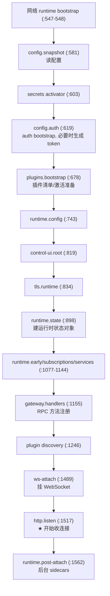
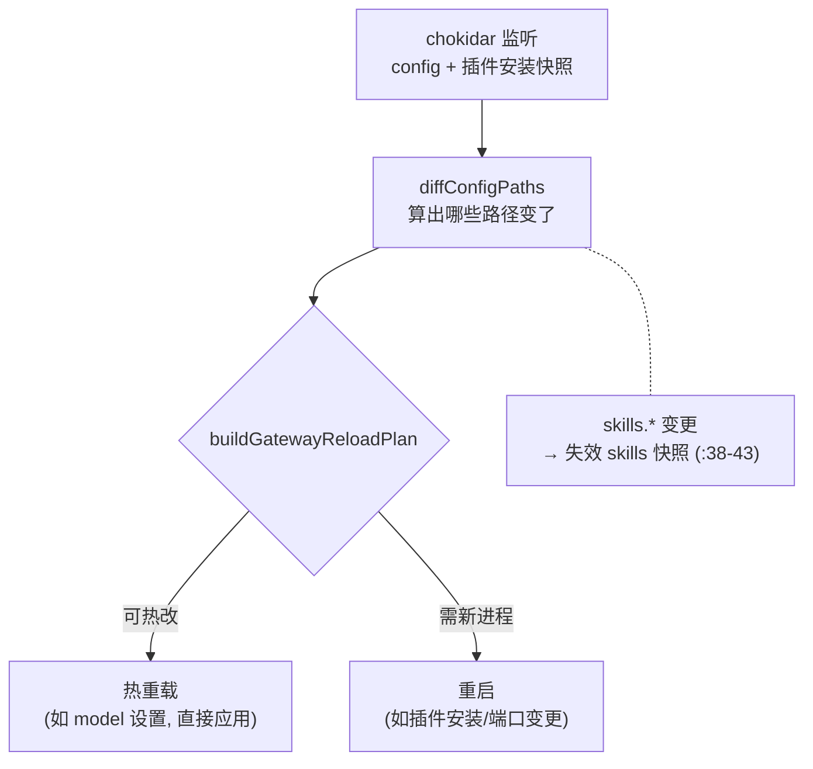
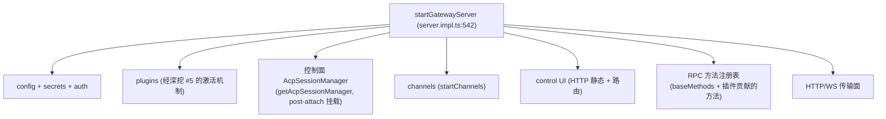

# OpenClaw 深挖 · gateway（启动与总装配）

> 系列第 5 份子系统深挖，全项目「第二座大山」。
> 范围：`src/gateway/` 的**启动序列、生命周期（热重载/重启/优雅关闭）、总装配**。不展开具体 RPC 业务方法。
> 深度：架构原理 + 代码走读，每个论断落到 `文件:行号`。
> 版本基准：`package.json` `2026.6.2`，分支 `main`。

---

## 目录

1. [gateway 是什么](#1-gateway-是什么)
2. [懒门面 → server.impl](#2-懒门面--serverimpl)
3. [启动是一条依赖链](#3-启动是一条依赖链)
4. [先能收连接，再后台预热](#4-先能收连接再后台预热)
5. [post-attach sidecars](#5-post-attach-sidecars)
6. [配置热重载 vs 重启](#6-配置热重载-vs-重启)
7. [重启自己：trace 交接](#7-重启自己trace-交接)
8. [优雅关闭](#8-优雅关闭)
9. [gateway 托管了什么](#9-gateway-托管了什么)
10. [值得记住的判断](#10-值得记住的判断)
11. [速查表](#11-速查表)

---

## 1. gateway 是什么

全景地图第 1 章定调：「Gateway 是控制平面」。落到代码，`src/gateway/` 有 **386 个非测试文件、100+ 个 `server-*.ts`**，但它们几乎**没有产品逻辑**——那些在 auto-reply（深挖 #4）。

gateway 这 386 文件干的全是**装配与生命周期**：

> 把 config、secrets、auth、plugins、runtime、channels、控制面、控制 UI、HTTP/WS、RPC 方法注册表——这一大堆东西，**按正确的顺序拼起来、跑起来、能热改配置、能优雅重启、能干净关闭**。

**判断**：和 auto-reply 一样，gateway 是「宽而浅」——文件多是因为要装配的东西多，不是因为单个算法难。它的复杂度是**编排与时序**，不是计算。理解它的关键不是读某个算法，而是搞懂「启动那条线按什么顺序、为什么这个顺序、哪些事推到后台」。

---

## 2. 懒门面 → server.impl

对外入口 `src/gateway/server.ts` 是个**纯懒加载门面**（文件头 `:1-8` 注释明说）。`startGatewayServer`（`server.ts:31`）先 `await import("./server.impl.js")` 再转发：

```ts
export async function startGatewayServer(...args) {
  const mod = await loadServerImpl();   // server.ts:34
  return await mod.startGatewayServer(...args);
}
```

目的（`server.ts:3-6` 注释）：让只想 import 网关**类型/helper** 的轻量调用方，不用付完整启动依赖图的加载成本。这是全景地图第 12 章「懒加载即性能策略」在 gateway 入口的落点——和 acpx 懒注册 backend、CLI 懒加载是同一套思路。

真正的实现全在 `server.impl.ts`（文件头 `:1-2`：建运行时状态、方法注册表、HTTP/WS、配置热重载、优雅重启/关闭）。下面讲的都是它。

---

## 3. 启动是一条依赖链

`startGatewayServer`（`server.impl.ts:542`，默认端口 18789 `:543`）是启动编排主函数。它**重度埋点**——几乎每个阶段都包在 `startupTrace.measure(name, ...)` 里（由 `OPENCLAW_GATEWAY_STARTUP_TRACE` 开启，`server.ts:11`）。把这些 measure 标签按出现顺序排出来，就是整条启动链：



**这个顺序是承重的，不是随意排的**——它是一条依赖链：

- **config 必须最先**：后面所有东西都要读配置。
- **secrets → auth**：auth bootstrap 要先有 secrets 才能解析/生成 token（`:619-636`，没配 token 时自动生成并 warn）。
- **plugins 在 runtime 之前**：runtime 需要插件元数据（哪些 provider/channel 可用），所以 `plugins.bootstrap`（`:678`）必须先于 `runtime.config`/`runtime.state`。这正是深挖 #5「manifest 先于 runtime」在启动层的体现。
- **handlers 在 ws 之前，ws 在 listen 之前**：要先把 RPC 方法注册好、WebSocket 挂好，才能开始 listen 收连接——否则连进来没人应答。
- **listen 在 post-attach 之前**：先能收连接，再做后台预热（第 4 章）。

连**启动代码本身都是惰性 import 的**（`:572-578`：`server-startup-config.js`、`server-startup-plugins.js` 动态加载）。启动被切成 `server-startup-{config,plugins,early,post-attach,memory,log}.ts` 一组文件，各管一段——这是 100+ `server-*.ts` 的由来：**一个巨大的启动流程，按阶段拆成了几十个文件**。

---

## 4. 先能收连接，再后台预热

整条启动链最重要的一个**架构决定**，是 `http.listen`（`:1517`）和 `post-attach`（`:1562`）的分界：

- **listen 之前**：只做「能正确应答请求」的**最低必要装配**——config、auth、插件元数据、RPC 方法、WS。
- **listen 之后（post-attach）**：所有**昂贵但非必需**的预热——模型预热、provider 认证预热、channel 启动、内存后端、更新检查。

**为什么这么切**：一个聊天网关的体感由「多快能开始干活」决定。把昂贵的预热推到 listen 之后，意味着 gateway **几秒内就开始收连接**，而不是等所有模型/渠道都热好才开门。

代价是有个**「能收连接但还没完全就绪」的窗口**。`STARTUP_UNAVAILABLE_GATEWAY_METHODS`（`server-startup-post-attach.ts:25`）就是这个窗口的产物——某些 RPC 方法在 sidecars 就绪前会报「暂不可用」。客户端连得上，但部分功能要等预热完。

**判断**：这是全景地图第 2/12 章「懒加载即性能」从「进程入口」放大到「整个进程生命周期」。同一个哲学——**把能延后的都延后，先到达可用状态**——在 CLI 入口、插件激活、gateway 启动三个尺度上反复出现。它也解释了为什么 gateway 要分 listen / post-attach 两段，而不是顺序跑完再 listen。

---

## 5. post-attach sidecars

post-attach（`server-startup-post-attach.ts`，文件头 `:1-2`：「warmups, sentinels, update checks, memory backend, plugin services」）是一堆**后台副车**。它的常量区（`:30-41`）全是调出来的时序魔数：

| 常量 | 值 | 在调什么 |
|---|---|---|
| `ACP_BACKEND_READY_TIMEOUT_MS` | 5000 | 等 acpx backend 就绪的上限 |
| `ACP_BACKEND_READY_POLL_MS` | 50 | 轮询 backend 就绪的间隔 |
| `PRIMARY_MODEL_PREWARM_TIMEOUT_MS` | 5000 | 主模型预热超时 |
| `PROVIDER_AUTH_PREWARM_START_DELAY_MS` | 5000 | provider 认证预热**延迟启动** |
| `AGENT_RUNTIME_PLUGIN_PREWARM_START_DELAY_MS` | 10000 | agent runtime 插件预热延迟 |
| `DEFERRED_SIDECAR_START_DELAY_MS` | 100 | sidecar 之间错峰 100ms |
| `QMD_STARTUP_IDLE_DELAY_MS` | 120000 | 空闲 2 分钟后才做某项 |

**判断**：这些数字没有注释解释为什么是这个值，是典型的**运营调优魔数**。它们共同在解决一个问题：**后台预热既不能阻塞、也不能一拥而上（thundering herd）**。所以 provider 认证延迟 5s 才开始、agent runtime 插件延迟 10s、sidecar 之间错峰 100ms——错开各项预热的启动时机，避免刚 listen 就把 CPU/网络打满，反而拖慢首批真实请求。这和 embedded runner 的断路器魔数、ACP 的宽限魔数同源：**都是线上观察调出来的、改动需谨慎的经验值**。

`ACP_BACKEND_READY_TIMEOUT_MS = 5000` 还印证了深挖 #2 的结论：gateway 在 post-attach 里**等** acpx backend 就绪（最多 5s），因为控制面要靠它跑 turn——但等不到也不死等，超时就先放行。

---

## 6. 配置热重载 vs 重启

gateway 是长驻进程，配置变了不该总是重启。`config-reload.ts`（文件头 `:1-2`：「Diffs config/plugin install snapshots and dispatches hot reload or restart plans」）用 chokidar 监听配置文件 + 插件安装快照，变更后走一个**决策**：



核心是 `buildGatewayReloadPlan`（`config-reload.ts:16`）——一个小**策略引擎**，按变更路径决定能不能热改：

- **能热改**：像 model 设置这类运行时参数，diff 出来直接应用，进程不重启。
- **需重启**：插件安装、端口变更等——`AGENTS.md:100`「gateway/plugin 元数据是进程稳定的，变更需重启」就是这条规则的来源。新装一个插件，进程内的注册表/manifest 缓存改不动，只能起新进程重扫。
- **特殊失效**：`skills.*` 任何前缀变更都强制失效会话的 skills 快照（`:38-43` 注释），否则会话会继续给模型广告陈旧的工具集。

**判断**：「热重载 vs 重启」的二分，本质是「这个配置影响的是**运行时可变状态**还是**进程稳定元数据**」。前者能 live 改，后者必须新进程。这条线和深挖 #5 的「manifest 一次扫描、长期复用」是一体两面——正因为插件元数据为了性能被当成进程稳定的，改它才必须重启。性能和「改配置要重启」是同一个取舍的两面。

---

## 7. 重启自己：trace 交接

gateway 不只是被动被重启，它能**主动重启自己**（配置需重启、有更新），并且把**可观测性上下文交接**给新进程。

启动一开始就在找上一条命的痕迹（`server.impl.ts:563-570`）：

```ts
if (!resumeGatewayRestartTraceFromEnv(process.env, ...)) {
  const restartHandoff = readGatewayRestartHandoffSync();      // 读交接文件
  resumeGatewayRestartTraceFromHandoff(restartHandoff?.restartTrace, [
    ["restartKind", restartHandoff?.restartKind],
    ["supervisorMode", restartHandoff?.supervisorMode],
  ]);
}
```

配合 post-attach 里的**重启哨兵**（`server-restart-sentinel.ts`、`RESTART_SENTINEL_FILENAME = "restart-sentinel.json"`，post-attach `:41`）——新进程能知道「我是被上一个进程为了 X 原因重启出来的」，并续上它的 startup trace。

**判断**：这套 trace 交接 + 哨兵，说明 gateway 被设计成**一个预期会被反复重启的受管服务**。重启不是异常，是正常运维动作（升级、改配置）。把 trace 跨重启续上，是为了让「为什么重启了、新进程起得快不快」这条线在重启边界不断裂——对一个要长期在线的网关，这是必要的可观测性投资。

---

## 8. 优雅关闭

关闭逻辑 `createCloseHandler`（`server.impl.ts:1021`），作为 `close` 返回给调用方（`:1763`）。它负责按相反顺序拆掉启动时装上的东西：停 sidecars、停 channels、关 WS/HTTP、清 tailscale 等。

一个值得注意的细节：**启动失败也走同一个 close**（`:1067` `createCloseHandler()({ reason: "gateway startup failed" })`）。也就是说启动到一半挂了，会用关闭逻辑把已经装上的半成品干净拆掉，不留半启动的僵尸状态。

**判断**：「启动失败复用关闭路径回滚」是个好设计——它保证了「装配」和「拆卸」是对称的、同一套代码，不会出现「启动失败后某个 sidecar 还在后台跑」的泄漏。这和 ACP 控制面 init 失败时 close backend 会话（深挖 #2 第 6.2 节）是同一种「两步操作要么都成、要么回滚」的资源一致性纪律，只是放大到了整个进程尺度。

---

## 9. gateway 托管了什么

把前面拼起来，gateway 作为宿主，在启动链上依次挂载了这些子系统：



几个连接点对应前面的深挖：

- **控制面**：post-attach 里经 `getAcpSessionManager()` 挂载（深挖 #2 提过它在 18 个调用点之一就是 `server-startup-post-attach.ts`）。gateway 是控制面的宿主进程。
- **channels**：`startChannels`（post-attach 参数 `:1586`）拉起所有渠道插件——它们经深挖 #5 的激活机制加载。
- **RPC 方法注册表**：`baseMethods` + 插件贡献的方法（`:1599-1600`）。这是控制 UI、CLI、远程客户端调 gateway 的接口面，本文未展开。

**判断**：gateway 不拥有任何上述子系统的**逻辑**——它只负责**按顺序把它们装上、连起来、管生命周期**。这正是全景地图第 1 章把它画成「总装配」而非某一层的原因。要找某个功能的实现，永远不在 gateway；gateway 只回答「这个功能在启动的哪一步、被怎么挂上来的」。

---

## 10. 值得记住的判断

1. **gateway 是宿主，不是业务。** 386 文件全是装配与生命周期，没有产品逻辑。宽而浅，像 auto-reply，不像 runner。
2. **启动顺序是承重的依赖链。** config→secrets→auth→plugins→runtime→handlers→ws→listen→post-attach，每一步都依赖前一步的产物。读懂顺序就读懂了 gateway。
3. **「先能收连接，再后台预热」是核心决定。** listen 在昂贵预热之前——几秒内开门，代价是有个「连得上但部分方法暂不可用」的窗口（`STARTUP_UNAVAILABLE_GATEWAY_METHODS`）。
4. **post-attach 的时序魔数在防 thundering herd。** 5s/10s 延迟启动、100ms 错峰——后台预热既不阻塞也不一拥而上。无注释、调出来的、改动谨慎。
5. **热重载 vs 重启 = 运行时可变状态 vs 进程稳定元数据。** model 设置能 live 改；插件安装/端口必须新进程。和深挖 #5「manifest 进程稳定」是一体两面。
6. **gateway 是预期被反复重启的受管服务。** restart trace 交接 + 哨兵让可观测性跨重启不断裂——重启是正常运维，不是异常。
7. **启动失败复用关闭路径回滚。** 装配与拆卸对称、同一套代码，不留半启动僵尸。
8. **连启动代码都惰性 import。** `server-startup-*.ts` 动态加载——懒加载哲学贯穿到启动流程自身。

---

## 11. 速查表

| 想搞懂… | 从这里读 |
|---|---|
| 对外懒门面 | `src/gateway/server.ts:31` |
| 启动编排主函数 | `src/gateway/server.impl.ts:542` `startGatewayServer` |
| 启动阶段顺序 | `server.impl.ts` 各 `startupTrace.measure(...)`（config `:581` → post-attach `:1562`） |
| 配置阶段 | `server-startup-config.ts`（`loadGatewayStartupConfigSnapshot`） |
| 插件 bootstrap | `server-startup-plugins.ts`（`:678` 调用） |
| listen / 收连接 | `server.impl.ts:1517` `http.listen` |
| 后台 sidecars | `server-startup-post-attach.ts`（魔数 `:30-41`） |
| 启动期不可用方法 | `server-startup-post-attach.ts:25` `STARTUP_UNAVAILABLE_GATEWAY_METHODS` |
| 配置热重载/重启决策 | `server-startup`… `config-reload.ts:16` `buildGatewayReloadPlan` |
| skills 快照失效 | `config-reload.ts:38-53` |
| 重启 trace 交接 | `server.impl.ts:563-570`、`server-restart-sentinel.ts` |
| 优雅关闭/启动失败回滚 | `server.impl.ts:1021` `createCloseHandler`（`:1067` 回滚、`:1763` 返回） |
| 控制面挂载 | post-attach 里 `getAcpSessionManager()` |

---

### 与前几份深挖的衔接

- 第 9 章「托管控制面」= 深挖 #2 那个 `AcpSessionManager` 的宿主就是 gateway 的 post-attach。
- 第 5 章 `ACP_BACKEND_READY_TIMEOUT_MS=5000` 印证深挖 #2/#5：gateway 等 acpx 插件注册 backend，最多 5s。
- 第 3、6 章「plugins 先于 runtime」「插件安装需重启」= 深挖 #5「manifest 进程稳定、一次扫描长期复用」在启动与热重载两个尺度的体现。
- 第 4 章「先 listen 再预热」= 全景地图第 12 章「懒加载即性能」放大到整个进程生命周期。

至此，主数据路径（#1-4）+ 扩展基石（#5）+ 宿主进程（本片）齐全。**唯一剩下的可选片**：`model-catalog`/`llm` 提供商层——接住 runner 第 9 章和 auto-reply 第 7 章共同留的「模型解析」尾。
