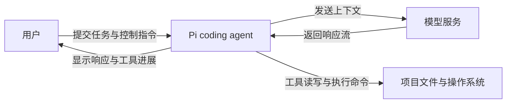
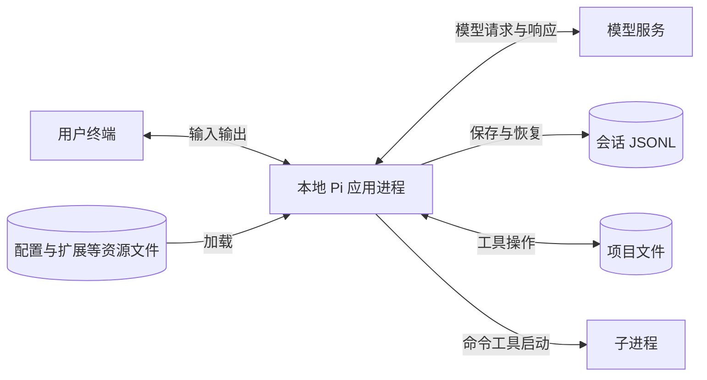
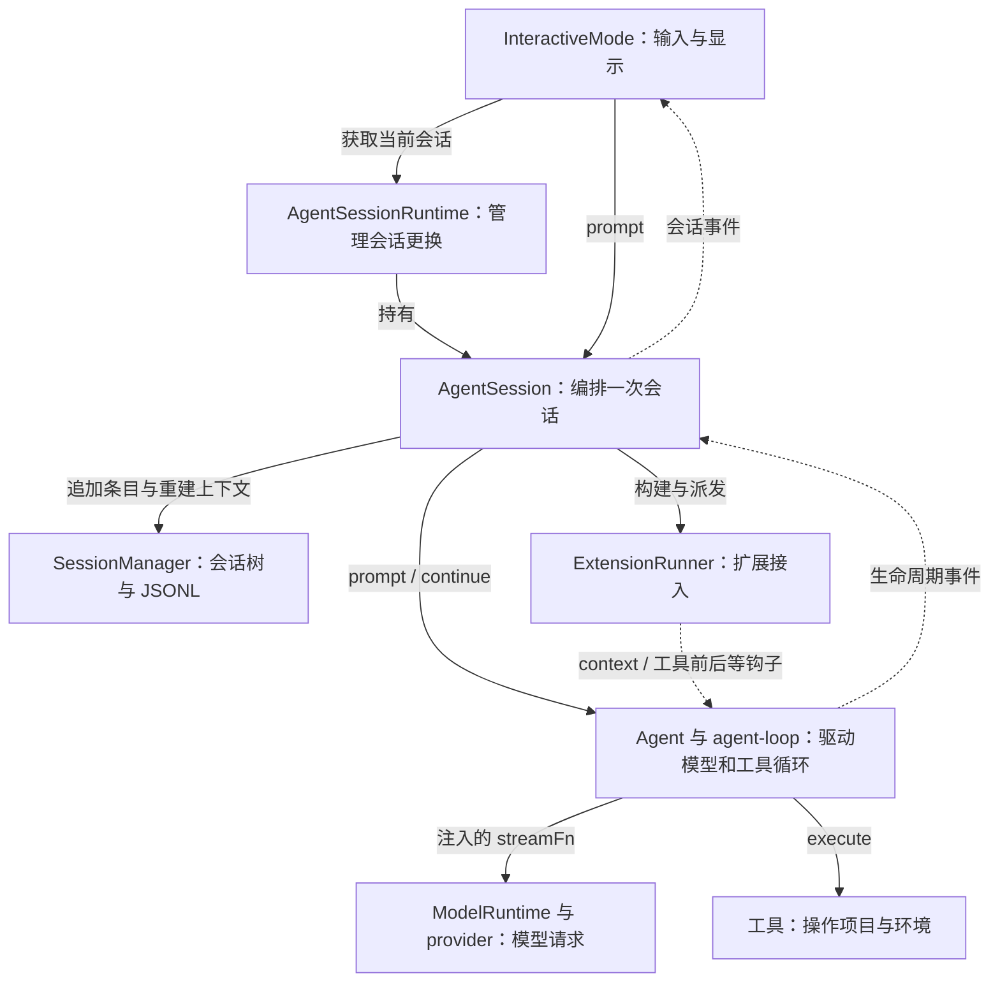
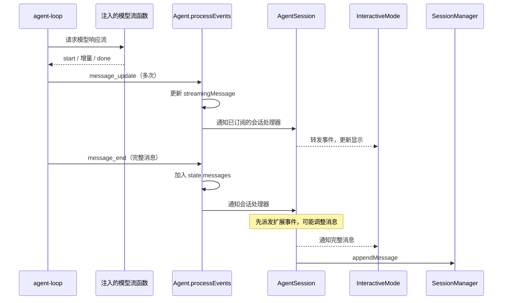

# 00 — 把 Pi 串起来：架构地图与源码阅读路线

这篇写给已经读过 01–07、理解局部机制，但还没有直接沿着源码走完一次交互的人。目标是让你打开一个文件时，知道它在系统中的位置，以及下一步应该跳到哪里。

源码基准：`6160683a4a8012f0d1cd30c145df18b4ca6f5176`，核对日期：2026-09-09。范围是本地 coding-agent 的交互模式与共享核心；不把仓库里的 server、orchestrator 等其他运行方式混进同一张图。

旧篇 02–06 的入口注明了 v0.84.2（`5cd93f688`）。本篇使用当前源码；旧篇的行号和局部调用方式需要重新定位。本文核对了主链路，不代表旧篇所有细节均已逐项复核。

## 目录

- 第 1 章 先建立边界：C4 的系统与运行单元视角
- 第 2 章 进入进程：四个容易混淆的对象
- 第 3 章 启动时，谁把这些对象装起来
- 第 4 章 输入一句话以后，控制权怎样走
- 第 5 章 同一段对话为什么有几种状态
- 第 6 章 把工具、压缩和扩展接回主链路
- 第 7 章 打开源码后的实际阅读顺序
- 第 8 章 旧笔记在地图上的位置
- 第 9 章 工程模式与复习自测

## 第 1 章 先建立边界：C4 的系统与运行单元视角

先把 Pi 看成一个供用户操作的 coding agent。用户提交任务；Pi 请求模型、执行本地工具、保存会话，然后把进展显示给用户。



这是系统上下文视角。下一步只展开图里的 Pi，区分正在运行的程序和它使用的数据存储。



这里采用 C4 的逐层展开思路：先确认系统边界，再确认应用与存储，最后进入应用内部。图中子进程表示命令工具的执行环境，不表示每个命令都是一个长期运行的服务。

源码依据：`packages/coding-agent/src/main.ts:841` 创建运行时，`:930` 分派运行模式；`core/sdk.ts:173` 装配核心对象；`core/session-manager.ts:1029` 处理会话写入。后续出现的 `core/` 均指 `packages/coding-agent/src/core/`。

**不要把源码包直接当成运行单元。** `packages/agent`、`packages/ai`、`packages/tui` 是代码组织边界；本地交互模式可以在同一个应用进程里使用它们。扩展也通过程序内的 runner 接入。阅读目录树时看到多个包，不意味着它们通过网络互相调用。

## 第 2 章 进入进程：四个容易混淆的对象

现在放大本地 Pi 进程。以下是学习用的组件视图：部分组件对应具体类，部分把协作的函数合并展示。实线是调用或管理关系；虚线是事件或回调关系，不是时间顺序。



先记住中间四个名字的区别：

| 对象 | 它持续负责什么 | 读到这里时该问什么 |
|---|---|---|
| `AgentSessionRuntime` | 当前会话及其工作目录相关服务；更换会话时清理并重建 | “现在使用的是哪个会话实例？” |
| `AgentSession` | 输入预处理、扩展、历史记录、压缩与运行后的处理 | “这次运行有哪些应用层规则？” |
| `Agent` | 内存消息、运行状态、队列，以及驱动底层循环 | “下一次模型响应和工具执行怎么推进？” |
| `SessionManager` | 带父子关系的条目、当前叶子、文件持久化与上下文重建 | “历史保存在哪里，当前选中了哪条路径？” |

源码入口分别是 `core/agent-session-runtime.ts:74`、`core/agent-session.ts:310`、`packages/agent/src/agent.ts:173`、`core/session-manager.ts:1071`。类的职责以实现为准；例如切换到另一会话的生命周期目前位于 `AgentSessionRuntime`，不要仅凭 `AgentSession` 文件顶部的概述推断归属。

举例：你想理解“为什么一次工具调用后会再次请求模型”，先去 `agent-loop.ts`；想理解“为什么下一次请求前会压缩”，从 `AgentSession` 安装给循环的回调进入；想理解“旧消息是否被删”，去 `SessionManager` 看条目和投影。这样每个问题都有明确的入口。

## 第 3 章 启动时，谁把这些对象装起来

启动阶段的任务是建立对象之间的连接。它完成后，后续输入会反复使用这些连接。

CLI 的启动路径可以按下面的调用关系定位。这里把 `main.ts` 中的工厂回调也展开了，不能把它读成文件从上到下的执行顺序。

```text
main.ts 创建 createRuntime 工厂
  → createAgentSessionRuntime(createRuntime, ...)
    → 调用工厂
      → createAgentSessionServices(...)：准备工作目录相关服务
      → createAgentSessionFromServices(...)
        → sdk.ts / createAgentSession(...)
          → new Agent(...)
          → new AgentSession(...)
    → new AgentSessionRuntime(...)
  → new InteractiveMode(runtime, ...)
```

对应 `main.ts:732`、`:817`、`:841`、`:934`，`core/agent-session-services.ts:135`、`:202`，`core/agent-session-runtime.ts:422`。

第一次阅读建议直接打开 `core/sdk.ts:173` 的 `createAgentSession`。它是一个很好的装配入口：你会看到管理配置、资源、模型和会话的对象怎样汇合，随后看到 `Agent` 和 `AgentSession` 被创建。

在这个函数里只抓住三处连接：

1. `:192` 的 `buildSessionContext()`：从已有历史构建消息，后面赋给 `agent.state.messages`。
2. `:306` 的 `new Agent(...)`：注入 `convertToLlm`、`streamFn`、`transformContext`。循环以后调用这些函数，就能连接消息转换、模型服务和扩展。
3. `:388` 的 `new AgentSession(...)`：把 `agent`、`sessionManager`、资源等放到同一个会话编排对象里。

接着进入 `core/agent-session.ts` 的构造函数，重点看 `:402` 到 `:406`：订阅 Agent 事件、安装工具钩子、安装下一轮刷新回调、构建运行时。

这也解释了为什么看调用关系时会断：**调用点和被调用函数的连接，可能早在启动时就通过参数或字段建立好了。** 在循环里看到 `config.transformContext(...)`，下一步要找谁设置了它；不一定能从这个调用点直接找到完整应用行为。

## 第 4 章 输入一句话以后，控制权怎样走

先限定一个场景：会话已经启动，当前空闲，输入普通文本，模型直接回答；暂时没有工具、压缩、扩展拦截和重试。

### 4.1 从输入到模型边界

打开 `packages/coding-agent/src/modes/interactive/interactive-mode.ts:1131`。交互主循环等 `getUserInput()`，然后调用 `this.session.prompt(userInput)`。编辑器提交通过回调或待处理输入队列交给它（`:3146`）；不能把所有普通输入都理解为编辑器直接调用模型。

然后依次跳转：

```text
InteractiveMode 的交互主循环
  → AgentSession.prompt(text)                 输入预处理与组装 user 消息
  → AgentSession._runAgentPrompt(messages)    管理运行与运行后的处理
  → Agent.prompt(messages)                   检查并启动一次运行
  → Agent.runPromptMessages(messages)         建立循环上下文与配置
  → runAgentLoop(...)                        接入新消息并发出起始事件
  → runLoop(...)                             决定继续还是结束
  → streamAssistantResponse(...)             构建本次模型输入
  → 注入的 streamFn(...)                     进入 ModelRuntime/provider
```

源码锚点：`core/agent-session.ts:1179`、`:1105`；`packages/agent/src/agent.ts:350`、`:409`；`packages/agent/src/agent-loop.ts:96`、`:156`、`:279`；`core/sdk.ts:324`；`core/model-runtime.ts:636`。

到 `streamAssistantResponse`，你熟悉的 02 篇终于出现了：先 `transformContext`，再 `convertToLlm`，然后把消息与 `systemPrompt`、`tools` 合成 `Context`。当前 SDK 的 `streamFn` 会进入 `ModelRuntime.streamSimple`，由它准备请求并交给对应 provider。

这条路径中**没有每次重新读取 JSONL**。`Agent.createContextSnapshot()` 从当前内存状态复制消息和工具数组（`agent.ts:437`）。恢复、压缩等情况下才需要从会话树重建有效消息；见第 5 章。

### 4.2 从模型响应回到界面和历史

模型侧响应被适配为统一事件流。`streamAssistantResponse` 消费这些事件：开始时建立部分消息，增量到来时更新它，完成时获得完整 `AssistantMessage`。



这是正常路径的顺序示意；界面完成一次实际重绘的时刻不由图中箭头保证。源码：`agent-loop.ts:279`，`agent.ts:544`，`core/agent-session.ts:643`，`interactive-mode.ts:3159`。

你在 03 篇里读到的“响应解析”和 01 篇里的“追加条目”，通过 `message_end → AgentSession._handleAgentEvent → SessionManager.appendMessage` 接上了。保存历史的入口在会话层，所以更换输入输出模式不必复制整套历史记录逻辑。

### 4.3 “回复结束”有几个层次

`message_end` 只说明一条消息结束；含工具调用的 assistant 消息结束后，还要执行工具。`turn_end` 位于该次 assistant 响应及其工具结果之后。`agent_end` 表示底层循环结束，但会话层还可能重试、压缩或处理新排队消息。

当前 `AgentSession._runAgentPrompt()` 会在 `agent.prompt()` 返回后调用 `_handlePostAgentRun()`；必要时调用 `agent.continue()`。最终在 `finally` 中发出 `agent_settled`。源码：`core/agent-session.ts:1105`、`:1120`、`:629`。

阅读事件代码时先确认是哪一级结束，就不会把“模型吐完字”误认为“整个会话已经空闲”。

## 第 5 章 同一段对话为什么有几种状态

这里是结构图无法单独解释的部分。下面几种对象描述了同一段交互，但用途不同。

| 形态 | 所在位置 | 包含什么，何时变化 |
|---|---|---|
| 会话条目与树 | `SessionManager` 的条目、索引、`leafId`；持久化为 JSONL | 消息、模型变化、压缩等条目；追加条目时形成父子关系 |
| 当前运行消息 | `Agent.state.messages` | 当前有效消息；普通消息完成时追加，恢复或压缩时可以整体替换 |
| 循环上下文 | `runLoop` 的 `currentContext` | 本次运行的消息、工具、系统提示词；响应与工具结果推进它，轮间回调可提供更新 |
| 本次模型输入 | `streamAssistantResponse` 的 `llmContext` | 转换后的模型消息与本次提示词、工具；每次模型调用重新构建 |

依据：`core/session-manager.ts:1058`、`:1071`；`agent.ts:437`、`:544`；`agent-loop.ts:96`、`:156`、`:279`。

注意：数组复制不是深复制。`Agent` 的快照会复制顶层数组；消息对象可以被共享。不要把这些形态理解为四套完全隔离的数据。

把两个方向分开看：

```text
恢复/压缩后的重建：
会话条目 → 选择 leaf 路径 → 应用压缩边界 → Agent.state.messages

正常的一次模型调用：
内存消息 → 循环上下文 → transformContext → convertToLlm → 模型 Context

普通消息完成后的记录：
message_end → Agent 内存追加 → AgentSession → SessionManager 追加条目
```

树的重建入口是 `core/session-manager.ts:461` 的 `buildSessionContext`。它通过 `buildContextEntries` 应用压缩边界，再通过 `sessionEntryToContextMessages` 转为消息。模型角色转换则位于另一个文件 `core/messages.ts:148`。它们虽然都在“构建上下文”，处理的输入和职责并不相同。

还有一个容易忽略的区别：`appendMessage` 不等于立即有一行落到磁盘。当前 `_persist` 对新会话会等待首条 assistant 消息出现，再把积累条目写入；之后通常追加写。内存模式也不写文件。源码：`core/session-manager.ts:1029`。

## 第 6 章 把工具、压缩和扩展接回主链路

### 6.1 场景一：让模型读取 README，再解释项目

假设模型选择调用已经启用的 `read` 工具。第一次 assistant 响应里有 `toolCall`；这仍是一条 assistant 消息，不是执行结果。

`runLoop` 检查其内容，调用 `executeToolCalls`。执行侧按工具名称查找实现、准备和校验参数，再执行 `tool.execute`。结果被封装为 `ToolResultMessage`，通过消息事件进入 Agent 状态和会话历史，也被追加到循环上下文。随后循环再次请求模型。

```text
user：请读 README 并解释项目
assistant：toolCall(read, ...)
toolResult：README 内容
assistant：根据内容回答
```

这是用于跟读的假设场景，并非实际请求记录。关键是第三行如何成为第二次模型请求的一部分：工具执行器把结果交还给循环，循环携带更新后的消息再次进入 `streamAssistantResponse`。

源码：`agent-loop.ts:156`、`:409`、`:677`、`:800`。先跟一个工具；批量工具的并行、顺序执行和终止规则留到第二遍。模型请求中的工具描述与本地可执行函数也要区分：本地执行发生在 `tool.execute`，模型通过名称和参数表达调用意图。

### 6.2 场景二：工具结果很长，下一次模型调用前需要压缩

仍沿用上面的场景。工具结果进入上下文后，循环准备下一轮，调用 `config.prepareNextTurn`。这个回调最终连接到 `AgentSession` 安装的 `prepareNextTurnWithContext`。

它检查上下文大小，必要时执行自动压缩。成功后追加 `compaction` 条目，从会话树重建 `agent.state.messages`，再把更新后的消息带回循环。下一次 `streamAssistantResponse` 使用更新后的上下文。

源码连接：`agent-loop.ts:156` → `agent.ts:445` → `core/agent-session.ts:542`、`:561` → `:2273`；实际重建在 `:2382` 附近。

压缩还有新 prompt 前检查、运行结束后检查和手动入口。这里先把“工具之后、下次响应之前”这一条接通；其余入口沿 `prompt`、`_handlePostAgentRun`、`compact` 查找。

**压缩在这条路径上追加摘要与边界，并改变有效消息投影，保留原有历史条目。** 旧笔记中的“改写历史”应按这个含义理解，不能理解为把 JSONL 里的旧行删除或覆盖。具体投影规则见 `core/session-manager.ts:418` 的 `buildContextEntries`。

### 6.3 场景三：扩展给工具执行或上下文增加规则

扩展与前面两条路径的连接点，在启动时就被装好了：

| 连接点 | 在原有路径上做什么 | 当前源码入口 |
|---|---|---|
| `_buildRuntime` / `_bindExtensionCore` | 创建 runner，将扩展 API 接到会话操作，刷新工具注册表 | `core/agent-session.ts:2789`、`:2572` |
| `before_agent_start` | 输入预处理后，允许增加消息或调整本次系统提示词 | `core/agent-session.ts:1179` |
| `transformContext` | 每次请求模型前，经 runner 处理消息 | `core/sdk.ts:362` |
| `beforeToolCall` / `afterToolCall` | 工具执行前后派发扩展钩子 | `core/agent-session.ts:486` |
| `prepareNextTurnWithContext` | 下一次响应前刷新工具、系统提示词、模型等 | `core/agent-session.ts:561` |

这样 04、05 篇就有了位置：04 解释连接是如何建立的，05 解释接好之后 `tools` 和 `systemPrompt` 如何汇入请求。首次阅读这里不需要展开整个事件目录。

## 第 7 章 打开源码后的实际阅读顺序

判断：你当前最需要的是完成一次有起点、有终点的源码穿行。第一遍限制在下表的函数，遇到认证细节、格式化、UI 样式等辅助代码先记录问题，继续沿主线走。

本机源码根为 `D:/Coding/GitCoding/pi`。下面的链接适合在当前工作区打开；换机器时按路径后半段和函数名定位。行号对应本文开头的 commit。

| 顺序 | 打开位置 | 只回答这个问题，答完就进入下一站 |
|---|---|---|
| 1 | [sdk.ts — createAgentSession](D:/Coding/GitCoding/pi/packages/coding-agent/src/core/sdk.ts:173) | 谁创建 Agent 和 AgentSession？哪些函数被注入？ |
| 2 | [agent-session.ts — 构造函数](D:/Coding/GitCoding/pi/packages/coding-agent/src/core/agent-session.ts:384) | 谁订阅事件？谁安装下一轮回调？ |
| 3 | [interactive-mode.ts — 输入主循环](D:/Coding/GitCoding/pi/packages/coding-agent/src/modes/interactive/interactive-mode.ts:1131) | 用户输入交给谁？ |
| 4 | [agent-session.ts — prompt](D:/Coding/GitCoding/pi/packages/coding-agent/src/core/agent-session.ts:1179) | 文本怎样变成消息，最后交给谁？ |
| 5 | [agent.ts — runPromptMessages](D:/Coding/GitCoding/pi/packages/agent/src/agent.ts:409) | 循环所需消息、配置和事件处理函数从哪来？ |
| 6 | [agent-loop.ts — runLoop](D:/Coding/GitCoding/pi/packages/agent/src/agent-loop.ts:156) | 什么情况下再次请求模型，什么情况下退出？ |
| 7 | [agent-loop.ts — streamAssistantResponse](D:/Coding/GitCoding/pi/packages/agent/src/agent-loop.ts:279) | 请求边界如何转换消息，响应如何变成事件？ |
| 8 | [agent.ts — processEvents](D:/Coding/GitCoding/pi/packages/agent/src/agent.ts:544) | 完整消息何时进入 Agent 状态？ |
| 9 | [agent-session.ts — _handleAgentEvent](D:/Coding/GitCoding/pi/packages/coding-agent/src/core/agent-session.ts:643) | 哪个事件连接到历史记录？ |
| 10 | [session-manager.ts — appendMessage](D:/Coding/GitCoding/pi/packages/coding-agent/src/core/session-manager.ts:1071) | 消息如何获得 id、parentId，并推进 leaf？ |

第一遍完成后，再回 `AgentSession._runAgentPrompt`（`:1105`）核对整次运行怎样结束。此时应该能离开笔记，说出普通回复的调用与事件路径。

第二遍只加一个工具，读 `executeToolCalls`，返回 `runLoop` 看第二次模型请求。第三遍只加一次压缩，从 `prepareNextTurn` 跟到新上下文返回循环。三遍都沿同一条主路走，每次只扩展一个分支。

每打开一个新函数，用一句话记下：**谁调用我、我读写什么、我把控制权或结果交给谁。** 例如：

> `SessionManager.appendMessage` 由会话事件处理器调用；把消息包成以当前 leaf 为父节点的条目；追加并更新 leaf，返回条目 id。

这句话比抄下一整段实现更能帮助你继续阅读。碰到函数参数、对象字段里的回调时，再补一句“谁安装了它”，回到第 3 章的装配入口寻找。

## 第 8 章 旧笔记在地图上的位置

| 旧篇 | 在本篇主路径上的位置 | 什么时候回去查 |
|---|---|---|
| [01 会话树](01-session-tree-and-context.md) | `SessionManager` 写入、分支与恢复 | 理解消息记录后，追问树如何保存与选择路径 |
| [02 上下文出去](02-context-to-llm.md) | 历史重建与模型请求边界 | 分清内存消息与模型 Context 后，展开转换细节 |
| [03 响应回来](03-llm-response-to-session.md) | 响应事件、工具、下一轮、持久化 | 已走通事件回路后，进入具体 provider 的流解析 |
| [04 扩展装配](04-extension-loading-path.md) | 启动装配与运行时钩子 | 想知道注入循环的行为从哪里注册 |
| [05 工具与提示词](05-tools-and-systemprompt-to-context.md) | Context 另外两个字段的准备与刷新 | 想知道同一循环为什么下一次用不同工具或提示词 |
| [06 压缩](06-compaction.md) | 轮间刷新与会话层的重建 | 想展开摘要切点、生成和失败处理 |
| [07 harness 设计空间](07-harness-design-space.md) | 从具体组件与边界抽象设计问题 | 能沿源码讲清三种场景后，再比较其他 agent |

旧篇是局部放大镜；本篇承担导航。遇到行号偏差先按函数名搜索，确认调用者，再对照旧篇解释。尤其不要把旧版本中的 Agent 驱动方式直接套到当前版本；当前 `Agent.runPromptMessages` 直接调用 `runAgentLoop`，事件通过传入的处理函数返回。

## 第 9 章 工程模式与复习自测

### 9.1 能从这次穿行带走的工程模式

应用层通过注入回调连接通用循环和具体规则：循环负责继续执行，会话层提供压缩、扩展等策略。事件把同一次执行连接到状态更新、界面和历史记录；理解事件的发出点与订阅点，才能补全普通调用图。

持久化历史与当前有效上下文分开，使历史可以保留，而模型只接收当前需要的内容。判断一个功能的影响时，要同时追踪它改变了哪份状态，以及新状态何时被下一次请求采用。

### 9.2 离开笔记后自测

1. 新输入到来时，Pi 是否从 JSONL 重建整段消息？请在源码里找到普通路径和恢复路径各一个证据。
2. `AgentSession`、`Agent`、`SessionManager` 各自在哪一步处理同一条 assistant 消息？
3. 工具结果如何进入下一次模型请求？中间有没有等待用户再次输入？
4. 为什么仅看到 `message_end` 或 `agent_end` 还不能断定会话完全空闲？
5. 压缩后，哪份历史保留、哪份消息被替换？循环怎样拿到新消息？
6. 在 `runLoop` 里看到一个回调字段时，怎样定位安装它的应用层代码？

核对入口：题 1 见第 3、4、5 章；题 2、4 见第 4 章；题 3、5 见第 6 章；题 6 见第 3 章。能带着问题打开对应源码并沿调用走下去，比记住本文的图更重要。
