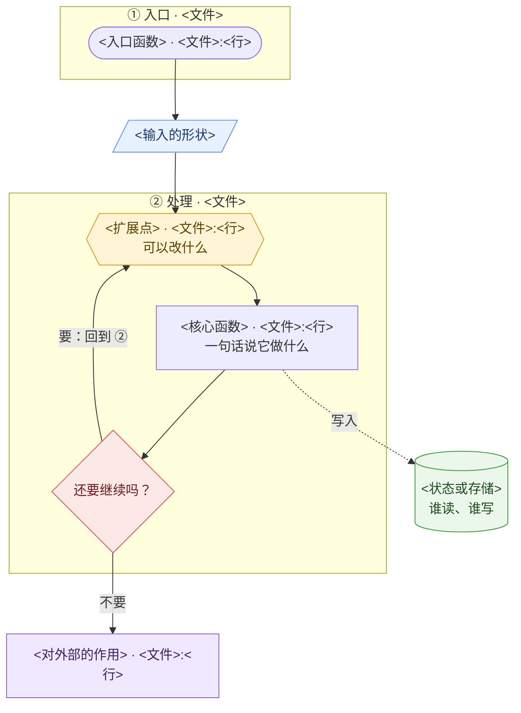

# <项目名> 全流程总图：<一个具体场景，比如"一条请求从进来到落库">

> 依据 <项目> 源码 commit `<短 sha>`（<年-月>），所有 `文件:行号` 都按这个版本标注。范围：<只画哪种模式 / 哪条路径，哪些不画>。

## 怎么读

- **编号 ① ② …** 是数据大致经过的顺序，从上往下读。
- **黄色六边形**：扩展点 / 钩子，外部代码能插手的地方。
- **蓝色平行四边形**：数据在这一站的形状。
- **绿色圆柱**：状态和存储。
- **红色**：关键检查点。
- **紫色**：对外部产生作用（写文件、发请求、执行命令）。
- 实线是主路径，虚线是读写状态或跨阶段的关系。
- **详解**：每一步、每个节点都有一张详解卡，写在文末"各步详解""节点详解"两节。

<!-- sources {} -->

## 图



<!-- tour
{
  "title": "<项目名> 全流程总图",
  "legend": { "hook": "扩展点", "check": "关键检查点", "world": "对外部产生作用" },
  "loopBack": ["DONE>HOOK"],
  "stations": [
    {"label": "① 入口", "view": ["ENTRY_ST", "D0"], "desc": "<这一站一两句话的说明>"},
    {"label": "② 处理", "view": ["CORE", "STORE", "EFFECT"], "desc": "<这一站的说明>", "shots": [
      {"title": "<第一步>", "view": ["HOOK", "STEP"], "desc": "<这一步的说明>"},
      {"title": "<第二步>", "view": ["DONE", "STORE", "EFFECT"], "desc": "<这一步的说明>"}
    ]}
  ]
}
-->

## 各步详解

步骤卡讲这一步整体在做什么、为什么这样设计；具体函数和数据写在"节点详解"里。标题和导览里的站名一致，多步的站写成"站名 · 步骤名"。

### ① 入口

<一段话：这一步整体在做什么，涉及哪几个节点。>

#### 设计理由

<为什么这样设计，只写源码或注释能证明的。引用写成 [文件名.ts:行号]。>

#### 通用模式

**<模式名>**：<一句话。读别的项目时该找什么。>

### ② 处理 · <第一步>

<……>

### ② 处理 · <第二步>

<……>

## 节点详解

每张卡挂在图上的一个节点上，标题写成"节点ID：显示名"。

### ENTRY：<入口函数>

#### 关键源码

```ts
// 从源码原样摘出 5 到 15 行；改动过就在说明里写"有简化"
```

### D0：<输入的形状>

#### 数据实例

```ts
// 真实的样子；编的数值标"示意"
```

### HOOK：<扩展点>

#### 扩展能做什么

<仓库里有示例就引用示例。>

#### 容易误解

<……>

### STEP：<核心函数>

#### 关键源码

### DONE：还要继续吗？

#### 容易误解

### STORE：<状态或存储>

#### 谁在读写

| 字段 | 什么时候写 | 位置 |
|---|---|---|

### EFFECT：<对外部的作用>

#### 关键源码
