# pi 全流程总图：一条消息从回车到 .jsonl，再回到屏幕

> 依据 pi 源码 commit `6160683a4`（2026-09），所有 `文件:行号` 都按这个版本标注。范围是交互模式（TUI）下的一次对话；print、rpc 两种前端共用同一个 core，不单独画。

## 怎么读

- **编号 ⓪–⑧** 是一条消息大致经过的顺序，从上往下读。⓪ 和"装配"在启动时发生，① 往后每次回车都走一遍。循环在图上展开了一次：④ 发请求、⑤ 请求与响应、⑥ 这一轮的结局，⑥ 里只有"下一轮"这条线往回指。⑦ 会把结果送回 ① 里的界面，一次交互到这里闭环。
- **黄色六边形**：扩展能插手的地方。handler 都是在"装配"阶段加载进来的。
- **蓝色平行四边形**：数据在这一站的形状。
- **绿色圆柱**：状态和存储。其中 `agent.state` 是内存里的真身，`.jsonl` 是磁盘上的真身。这两个都各画了两次：上面一个管启动时写入和快照读取，下面一个接运行中的写回，实际是同一个东西，分开画是为了让线都往下走。
- **红色**：压缩检查点，一共三个（A、B、C）。
- **紫色**：面向世界。整张图只有这一个紫色节点，pi 的重量分布在图上一眼就能看出来。
- 实线是数据主路径，虚线是读状态、改状态或跨阶段的关系。
- **详解**：每一步、每个节点都有一张详解卡（关键源码、数据实例、设计理由、容易误解等），写在文末"各步详解""节点详解"两节，源码链接固定在上游提交 `6160683a4`。查看页里点左栏的"展开详解"看步骤卡，点节点再点"展开详解"看节点卡。

## 图

```mermaid
flowchart TB
  classDef hook fill:#fff4d6,stroke:#d4a017,color:#5c4400
  classDef data fill:#e8f1ff,stroke:#5b8def,color:#1d3a6e
  classDef store fill:#eaf7ea,stroke:#3c9a3c,color:#1f4d1f
  classDef compact fill:#fde8e8,stroke:#d9534f,color:#6b1d1b
  classDef world fill:#f0e8ff,stroke:#8a5cd6,color:#3d2066

  %% ⓪ 启动
  subgraph BOOT["⓪ 启动：从磁盘恢复（每个会话一次）"]
    JSONL0[("sessions/…/xxx.jsonl<br/>一行一个 entry，parentId 连成树")]
    LOAD["loadEntriesFromFile<br/>session-manager.ts:514"]
    BSC["buildSessionContext · session-manager.ts:461<br/>从 leafId 回溯到根<br/>碰到 compaction 条目就换成 摘要 + 保留段"]
    JSONL0 --> LOAD --> BSC
  end

  %% 装配
  subgraph ASM["装配：启动时，以及工具集变化时"]
    EXT["扩展加载 · extensions/loader.ts<br/>registerTool、pi.on 事件 进各自的盒子"]
    RES["resource-loader.ts:119<br/>AGENTS.md / CLAUDE.md 向上收集<br/>skills、prompt 模板"]
    REG["_refreshToolRegistry · agent-session.ts:2696<br/>内置工具 + 扩展工具"]
    SETACT["setActiveToolsByName · agent-session.ts:970"]
    SP["_rebuildSystemPrompt · agent-session.ts:1065<br/>工具 snippet、项目上下文、skills、cwd<br/>得到 _baseSystemPrompt"]
    EXT --> REG --> SETACT
    SETACT --> SP
    RES --> SP
  end

  STATE[("agent.state · agent.ts<br/>messages / tools / systemPrompt<br/>内存里的真身")]
  BSC -->|"sdk.ts:376 恢复历史"| STATE
  SETACT -->|"state.tools"| STATE
  SP -->|"state.systemPrompt"| STATE

  %% ① 输入
  subgraph HUMAN["① 面向人 · interactive-mode.ts"]
    IN(["编辑器回车 · onSubmit :2965<br/>内置 /命令、! bash 在这里就分流走了"])
  end
  S0[/"string：一行文本<br/>粘贴的图片以文件路径出现在文本里"/]
  IN --> S0

  %% ② AgentSession.prompt
  subgraph PROMPT["② AgentSession.prompt · agent-session.ts:1179"]
    CMD{"是扩展注册的 /命令？"}
    HCMD{{"命令 handler :1188<br/>直接执行，不进 LLM"}}
    HIN{{"input 事件 :1203<br/>可 handled 吞掉 / transform 改写"}}
    EXP["展开 /skill:name 和 prompt 模板 :1218"]
    BUSY{"agent 正在跑？"}
    Q["steer / followUp 队列 :1223<br/>插话：等循环自己来取"]
    CKA["压缩检查点 A · :1266<br/>看上一条 assistant 的 usage"]
    UMSG["组装 user 消息 :1273<br/>加上攒着的 nextTurn 消息"]
    HBAS{{"before_agent_start :1290<br/>可追加 custom 消息<br/>可整个改写 systemPrompt"}}
    CMD -->|"是"| HCMD
    CMD -->|"否"| HIN --> EXP --> BUSY
    BUSY -->|"是"| Q
    BUSY -->|"否"| CKA --> UMSG --> HBAS
  end
  S0 --> CMD
  SP -.->|"底稿"| HBAS
  HBAS -.->|"改写时覆盖 :1311"| STATE
  S1[/"AgentMessage 数组<br/>role:'user'，content:[text, image…]<br/>可能还有 role:'custom'"/]
  HBAS --> S1

  %% ③ 快照
  SNAP["_runAgentPrompt :1105 → agent.prompt<br/>createContextSnapshot · agent.ts:437<br/>messages.slice()、tools.slice()"]
  S1 --> SNAP
  STATE -.->|"slice 出副本"| SNAP
  S2[/"AgentContext 副本<br/>systemPrompt, messages, tools<br/>循环只碰这份副本"/]
  SNAP --> S2

  %% ④ 循环：发请求前
  subgraph LOOP["④ 循环：发请求前 · agent-loop.ts · 一轮 = 一次模型请求 + 它要的工具"]
    LSTART["runAgentLoop :96<br/>user 消息推进副本，发 message_end"]
    INJ["注入插话 :201<br/>getSteeringMessages"]
    HCTX{{"context 事件 · transformContext :288<br/>可改整份 messages<br/>只影响这次发出去的，不落盘"}}
    CONV["convertToLlm :293<br/>AgentMessage → Message<br/>custom、bash 等折成 user，不可逆"]
    LLMCALL["streamFn → modelRuntime.streamSimple<br/>sdk.ts:314"]
    LSTART --> HCTX
    INJ --> HCTX
    HCTX --> CONV --> LLMCALL
  end
  S2 --> LSTART
  Q -.->|"轮间来取"| INJ

  %% ⑤ ai 包
  subgraph AI["⑤ ai 包 · api/anthropic-messages.ts"]
    HHDR{{"before_provider_headers · sdk.ts:337<br/>在 models.ts:662 调用 · 可改请求头"}}
    BP["buildParams :1020"]
    subgraph BODY["请求体：按缓存前缀的顺序排"]
      BT["tools · convertTools :1424<br/>最后一个工具带 cache_control<br/>defer_loading 的工具不占前缀位置"]
      BS["system · 带 cache_control :1070"]
      BM["messages · convertMessages :1222<br/>最后一条 user 带 cache_control :1373"]
      BT --> BS --> BM
    end
    HPAY{{"before_provider_request<br/>onPayload :570 · 可改整个请求体"}}
    HRESP{{"after_provider_response<br/>onResponse :587 · 只能看状态码和响应头"}}
    SSE["SSE 解码 :334 / :350<br/>text / thinking / toolcall 的 start · delta · end"]
    HHDR --> BP --> BT
    BM --> HPAY
    HRESP --> SSE
  end
  API[("LLM API")]
  LLMCALL --> HHDR
  HPAY -->|"HTTP"| API
  API -->|"响应头先到，再是 SSE 流"| HRESP
  S3[/"AssistantMessage<br/>content:[text, thinking, toolCall…]<br/>usage、stopReason"/]
  SSE -->|"边收边拼 partial · agent-loop.ts:315"| S3

  %% ⑥ 循环：这一轮的结局
  subgraph TURN["⑥ 循环：这一轮的结局 · agent-loop.ts:212"]
    OUT{"这一轮的结局"}
    EXEC["executeToolCalls :409<br/>默认并行，有 sequential 工具就串行"]
    VAL["validateToolArguments :625"]
    HTC{{"tool_call 事件 · beforeToolCall<br/>agent-session.ts:487 · 可 block"}}
    RUNT["tool.execute :686<br/>真的跑 bash、真的写文件"]
    HTR{{"tool_result 事件 · afterToolCall<br/>agent-session.ts:508<br/>可改 content / isError"}}
    TR[/"ToolResultMessage"/]
    NEXT["prepareNextTurn :177 = agent-session.ts:567<br/>① 压缩检查点 B：阈值<br/>② 换上最新 systemPrompt / tools / model"]
    FU{"还有排队的消息？<br/>先看 steer，再看 followUp"}
    AEND(["agent_end"])
    OUT -->|"有 toolCall"| EXEC --> VAL --> HTC --> RUNT --> HTR --> TR
    TR -->|"整批结果到齐 · turn_end"| NEXT
    OUT -->|"纯文本"| FU
    FU -->|"没有"| AEND
    OUT -->|"error / aborted<br/>含上下文溢出"| AEND
  end
  S3 --> OUT
  NEXT -->|"下一轮：回到 ④"| INJ
  FU -->|"有：回到 ④"| INJ

  %% ⑦ 事件分发
  subgraph SAVE["⑦ 事件分发：循环发出的每个事件都走这里"]
    ME(["循环事件<br/>message_start / update / end<br/>turn_* · tool_execution_* · agent_*"])
    PUSH["Agent.processEvents · agent.ts:544<br/>先更新 agent.state<br/>message_end 时 state.messages.push"]
    DISP["AgentSession._handleAgentEvent<br/>agent-session.ts:643 · 分三路"]
    HEXT{{"扩展收到事件 · _emitExtensionEvent :769<br/>多数事件只能观察<br/>message_end 可把整条消息换掉，角色须相同<br/>原地改写 :752，state 和落盘跟着变"}}
    SUBS["只在 message_end · agent-session.ts:673<br/>user / assistant / toolResult → appendMessage<br/>custom → appendCustomMessageEntry"]
    APP["appendMessage · session-manager.ts:1071<br/>新 id，parentId = leafId，leafId 前移"]
    LAZY["_persist · session-manager.ts:1029<br/>懒刷盘：还没出现 assistant 就先不建文件"]
    UIR(["回到 ① 用户眼前 · TUI 渲染<br/>interactive-mode.ts:3160 订阅 session 事件<br/>message_update 时流式刷新回复"])
    ME --> PUSH --> DISP --> HEXT
    HEXT -->|"落盘"| SUBS --> APP --> LAZY
    HEXT -->|"_emit 给订阅者 :670"| UIR
  end
  JSONL1[("xxx.jsonl 追加一行")]
  LAZY --> JSONL1
  STATE2[("agent.state（和上面是同一个对象）<br/>运行中的写回落在这里<br/>下次快照从这里 slice")]
  PUSH -.->|"message_end 时 push"| STATE2
  LSTART -->|"user 消息"| ME
  S3 --> ME
  TR --> ME

  %% ⑧ 收尾
  POSTN["⑧ _handlePostAgentRun · agent-session.ts:1120<br/>可重试的错误 → 重试<br/>压缩检查点 C · _checkCompaction :1141<br/>溢出 → 压缩后重试这一轮；阈值 → 只压缩<br/>agent_end 期间有人排队 → continue<br/>continue 会回到 ③ 重新快照，接着跑循环"]
  AEND --> POSTN

  %% 压缩
  subgraph COMP["压缩 · compaction/"]
    HCOMP{{"session_before_compact<br/>可取消 / 整个接管"}}
    CDO["findCutPoint 定切点 → 生成摘要<br/>appendCompaction · agent-session.ts:2381"]
    HCOMP --> CDO
  end
  CKA -.-> HCOMP
  NEXT -.-> HCOMP
  POSTN -.-> HCOMP
  CDO -->|"树上加一个 compaction 条目"| JSONL1
  CDO -.->|"state.messages 换成 摘要 + 保留段"| STATE2

  class HCMD,HIN,HBAS,HCTX,HTC,HTR,HHDR,HPAY,HRESP,HEXT,HCOMP hook
  class S0,S1,S2,S3,TR data
  class JSONL0,JSONL1,STATE,STATE2,API store
  class CKA,NEXT,POSTN,CDO compact
  class RUNT world
```



<!-- tour
{
  "loopBack": ["NEXT>INJ", "FU>INJ"],
  "stations": [
    {"label": "⓪ 启动", "view": ["BOOT", "STATE"], "desc": "磁盘上的 .jsonl 是一棵树。loadEntriesFromFile 把每行读成 entry，buildSessionContext 从 leafId 回溯到根，碰到 compaction 条目就换成摘要 + 保留段，结果在 sdk.ts:376 写进 agent.state。"},
    {"label": "装配", "view": ["ASM"], "desc": "两条线汇到 agent.state：扩展和内置工具进注册表，筛出启用的那些成为 state.tools；AGENTS.md、skills 和工具 snippet 拼成 systemPrompt。启动时走一遍，工具集变了再走一遍。"},
    {"label": "① 输入", "view": ["HUMAN", "S0"], "desc": "编辑器回车。内置 /命令和 ! bash 在 TUI 这层就分流走了，剩下的文本和图片交给 session.prompt。"},
    {"label": "② prompt", "view": ["PROMPT", "S1"], "desc": "一条输入进 session.prompt 以后，到交给循环之前，要过三道关。", "shots": [
      {"title": "分流", "view": ["CMD", "HCMD", "HIN", "EXP"], "desc": "先看是不是扩展注册的 /命令：是就直接执行 handler，不进 LLM。否则触发 input 事件，扩展可以把输入吞掉（handled），也可以改写（transform）。然后展开 /skill:name 和 prompt 模板。"},
      {"title": "忙不忙", "view": ["BUSY", "Q", "CKA"], "desc": "agent 正在跑，这条输入就进 steer / followUp 队列，等循环在轮与轮之间自己来取。空闲才往下走，先过压缩检查点 A：看上一条 assistant 的 usage。"},
      {"title": "组装", "view": ["UMSG", "HBAS", "S1"], "desc": "组装 user 消息，带上攒着的 nextTurn 消息。before_agent_start 可以追加 custom 消息，也可以整个改写 systemPrompt，改写会覆盖到 agent.state（:1311）。出来的是一组 AgentMessage。"}
    ]},
    {"label": "③ 快照", "view": ["STATE", "SNAP", "S2"], "desc": "从 agent.state slice 出一份副本交给循环，之后循环只碰这份副本。所以循环里压缩完，得通过 prepareNextTurn 把新的 messages 交回来。"},
    {"label": "④ 发请求前", "view": ["LOOP"], "desc": "一轮 = 一次模型请求 + 它要的工具。发请求前先注入插话；context 事件可以改整份 messages，但只影响这一次发出去的，不落盘；convertToLlm 把 AgentMessage 折成模型认得的 Message，然后调 streamFn。"},
    {"label": "⑤ 请求与响应", "view": ["AI", "API", "S3"], "desc": "ai 包里的一次 HTTP 往返。请求头、请求体、响应头各有一个扩展钩子。", "shots": [
      {"title": "拼请求", "view": ["HHDR", "BP", "BODY"], "desc": "before_provider_headers 可以改请求头。buildParams 按 tools → system → messages 排请求体，cache_control 分别打在最后一个工具、system、最后一条 user 上，缓存前缀就按这个顺序算。"},
      {"title": "发出去", "view": ["HPAY", "API"], "desc": "before_provider_request（onPayload）拿到的是整个请求体，可以改，然后才走 HTTP。"},
      {"title": "收回来", "view": ["HRESP", "SSE"], "desc": "响应头先到，after_provider_response 只能看状态码和响应头，不能改。之后是 SSE 流，按 text / thinking / toolcall 的 start · delta · end 解码。"},
      {"title": "拼成消息", "view": ["S3"], "desc": "边收边拼成 partial（agent-loop.ts:315），流结束就是一条完整的 AssistantMessage：content 里混着 text、thinking、toolCall，另外带着 usage 和 stopReason。"}
    ]},
    {"label": "⑥ 这一轮的结局", "view": ["TURN"], "desc": "看 AssistantMessage 决定往哪走：执行工具再来一轮、看 followUp 队列，或者结束。", "shots": [
      {"title": "三种结局", "view": ["OUT", "FU", "AEND"], "desc": "有 toolCall 就去执行工具；纯文本就看 followUp 队列，有消息回到 ④，没有就 agent_end；error / aborted（包括上下文溢出）直接 agent_end。"},
      {"title": "执行工具", "view": ["EXEC", "VAL", "HTC", "RUNT", "HTR", "TR"], "desc": "默认并行，有 sequential 工具就串行。先校验参数；tool_call 事件可以 block；然后 tool.execute 真的去跑；tool_result 事件可以改 content 和 isError。每个结果是一条 ToolResultMessage。"},
      {"title": "进下一轮", "view": ["TR", "NEXT"], "desc": "整批结果到齐，发 turn_end，进 prepareNextTurn：先过压缩检查点 B（只看阈值），再换上最新的 systemPrompt、tools、model，然后回到 ④。"}
    ]},
    {"label": "⑦ 事件分发", "view": ["SAVE", "JSONL1", "STATE2"], "desc": "循环发出的每个事件都走这里：先更新 agent.state，再分给扩展、界面、落盘。", "shots": [
      {"title": "先更新状态", "view": ["ME", "PUSH"], "desc": "每个事件先进 Agent.processEvents：先更新 agent.state，message_end 时把消息 push 进 state.messages，然后才通知订阅者。push 的去处是最下面那个 agent.state。"},
      {"title": "扩展先看", "view": ["DISP", "HEXT"], "desc": "AgentSession._handleAgentEvent 先把事件交给扩展。多数事件扩展只能看；message_end 可以把整条消息换掉（角色须相同），而且是原地改写，所以 state 和落盘拿到的都是换过的那条。"},
      {"title": "界面和落盘", "view": ["UIR", "SUBS", "APP", "LAZY"], "desc": "_emit 把事件推给 TUI，message_update 时流式刷新回复。落盘只发生在 message_end：user、assistant、toolResult 走 appendMessage，custom 走 appendCustomMessageEntry。新条目的 parentId 是当前 leafId，leafId 随之前移。"},
      {"title": "落到哪", "view": ["LAZY", "JSONL1", "STATE2"], "desc": "_persist 是懒刷盘：还没出现 assistant 就先不建文件。最终落在两处：.jsonl 追加一行；agent.state 里多一条消息，下一次快照就从这里 slice。"}
    ]},
    {"label": "⑧ 收尾", "view": ["POSTN"], "desc": "run 结束后：可重试的错误先重试；检查点 C 处理溢出和阈值；agent_end 期间有人排队就 continue，回到 ③ 重新快照接着跑。"},
    {"label": "压缩", "view": ["COMP", "JSONL1", "STATE2"], "desc": "A、B、C 三个检查点都汇到这里。扩展可以取消或整个接管；结果写成树上的 compaction 条目，并把 state.messages 换成摘要 + 保留段。"}
  ]
}
-->

> 图太大，在 markdown 预览里看不清。用浏览器打开同目录的 `pi-flow-map.html`：左边按阶段一步步跟（大的站拆成几步，←/→ 走），点节点看它的上游和下游，打开"追踪整条路径"能看它一路从哪来、流到哪去。改完这个文件后，在 `tools/flow-map` 下运行 `npm run check && npm run build` 重新生成。

## 压缩的三个检查点

自动压缩不是只在一个地方触发，源码里有三个检查点：

| | 位置 | 时机 | 处理 |
|---|---|---|---|
| A | `agent-session.ts:1266` | 新 prompt 发出之前 | 上一次被中断、没来得及压缩的情况 |
| B | `agent-session.ts:542` | 循环内，工具结果之后、下一次请求之前 | 只看阈值 |
| C | `agent-session.ts:1141` | 一次 run 结束之后 | 溢出恢复 + 阈值 |

B 是 2026-08-28 的提交 `56700d42e`（`fix(coding-agent): compact before post-tool model requests`，#8782）加的，之前只有 A 和 C，两个都在循环外面。问题出在工具结果上：一次工具调用返回了很大的结果，越过阈值后，还没来得及压缩就跟着下一次请求发出去了。改动后，工具结果到齐、下一次请求发出之前，循环里会检查一次阈值，超了就当场压缩。代码是 `_compactBeforeNextAssistantResponse`，挂在 `prepareNextTurn` 上。

在循环里压缩有个限制：循环手里拿的是 `agent.state` 的副本（`createContextSnapshot`，`agent.ts:437`），压缩改的是真身，改不到循环手里那份。所以压缩完只能通过 `prepareNextTurn` 的返回值，把一份新的交回给循环：

```typescript
await this._runAutoCompaction("threshold", false);
return {
	...context,
	messages: this.agent.state.messages.slice(),   // 从真身重新 slice 一份给循环
};
```

溢出走的是另一条路：模型返回 `stopReason === "error"`，循环直接结束，由循环外的检查点 C 压缩，再重试这一轮。


## 各步详解

步骤卡讲这一步整体在做什么、为什么这样设计；具体到某个函数、某个数据的内容放在下面的"节点详解"里。标题和导览里的站名一致。源码链接都固定在上游提交 `6160683a4`。

### ⓪ 启动

每次打开一个会话走一遍：把 `.jsonl` 读成条目列表，从当前叶子沿 `parentId` 一路走回根，得到"当前分支"，再把分支上的条目换算成消息，写进 `agent.state`。

#### 设计理由

会话文件在正常运行时只追加、不改写。新消息挂在当前 leafId 下面；从中间某条继续对话，就从那个节点长出新分支，旧分支原样留着；压缩、改名、打标签也都是追加一行新条目。代价是读的时候要"算"：从叶子回溯出路径，碰到压缩条目还要把被总结掉的部分换成摘要。所以启动分成两步：[loadEntriesFromFile](#node:LOAD) 负责读，[buildSessionContext](#node:BSC) 负责算。

#### 通用模式

**只追加的日志 + 投影**：磁盘上存完整的变更记录，内存里用的是从记录算出来的当前状态。历史不丢，分支很便宜，写到一半崩溃也最多丢最后一行。读别的框架时，可以先看它的会话存储是"整份覆盖"还是"只追加"。

### 装配

启动时，以及扩展注册新工具、切换工具集时，把"能用哪些工具"和"系统提示词"准备好，写进 `agent.state`。两条线：工具线是 扩展加载 → 注册表 → 启用列表；提示词线是 资源收集 → `_rebuildSystemPrompt`。两条线在 `setActiveToolsByName` 汇合。

#### 设计理由

系统提示词里有"可用工具"列表和各工具的使用说明（promptSnippet、promptGuidelines），工具集一变，提示词就得跟着变，否则模型读到的说明和它实际能调用的工具对不上。pi 把"换工具"和"重建提示词"写在同一个函数里（[agent-session.ts:970]），两者没有机会不同步。

#### 通用模式

**声明式注册 + 集中装配**：扩展只声明（`registerTool`、`pi.on`），不直接改 agent；harness 在固定时刻把所有声明收起来一次性装配。读别的框架时看两件事：工具和钩子是谁、在什么时候挂上去的；工具集变了以后，提示词会不会跟着更新。

### ① 输入

TUI 编辑器按回车后，文本先在界面层过一遍：内置命令（`/model`、`/tree`、`/fork`、`/login` 等）和 `!` 开头的 bash 在这里就处理掉，不进 session。剩下的文本交给 `session.prompt`：空闲时由主循环调用（[interactive-mode.ts:1135]），agent 正在跑时直接以插话的方式调用（[interactive-mode.ts:3140]）。

#### 设计理由

界面层只处理"界面自己的事"：切模型、看会话树、登录。凡是会影响对话的输入，包括扩展注册的 /命令，都交给 `session.prompt`。print 模式（[print-mode.ts:136]）和 rpc 模式也调用同一个入口，所以三种前端在对话上的行为一致。

#### 通用模式

**前端薄、core 厚**：前端只负责收输入、画输出，对话的语义全在 core 的一个入口里。换前端（TUI、Web、IDE 插件）不用重写 agent。

### ② prompt · 分流

`session.prompt` 拿到的是一段原始文本。第一关决定它还要不要进 LLM：扩展命令直接执行；`input` 事件可以把输入吞掉或改写；然后把 `/skill:name` 和 prompt 模板展开成真正要发的文本。

#### 设计理由

顺序是有讲究的。扩展命令排在最前，即使 agent 正在跑也立即执行（[agent-session.ts:1185]）。`input` 事件在展开**之前**触发（[agent-session.ts:1202]），扩展看到的是用户的原话，不是模板展开后的一大段。展开放在最后，排队和组装拿到的都是最终文本。

#### 通用模式

**输入管线**：命令分发 → 拦截改写 → 宏展开。斜杠命令、@ 引用、模板这类功能，大多数 agent 都在这一段处理。

### ② prompt · 忙不忙

agent 正在跑时，新输入不能另开一个 run，只能排队：steer 在这一轮的工具执行完、下一次请求之前插进去；followUp 等 agent 本来要停下时再发。空闲才往下走，先过压缩检查点 A。

#### 设计理由

同一时刻只有一个 run 在推进会话，`agent.prompt` 在运行中被调用会直接报错（[agent.ts:353]）。插话只能放在轮与轮之间，是因为一轮里 assistant 的 toolCall 和对应的 toolResult 必须紧挨着，中间插进一条 user 消息，模型 API 会拒绝。pi 自己往上下文里补 custom 消息也遵守同一条规则，只在 `turn_end` 之后插（[agent-session.ts:715]）。

检查点 A 的用处：run 结束后的检查点 C 会跳过被中断（aborted）的回复，所以在下一次 prompt 发出前补查一次（参考 [压缩检查点 A](#node:CKA)）。

#### 通用模式

**单写者 + 队列**：同一时刻只有一个循环在写会话，其他输入全部排队，由循环在安全点自己来取。

### ② prompt · 组装

空闲时把输入组装成一组 AgentMessage：一条 user 消息，加上之前攒下的 nextTurn 消息。再给扩展一次机会：`before_agent_start` 可以追加 custom 消息，也可以改写 systemPrompt。之后交给 `_runAgentPrompt`，进入 ③。

#### 设计理由

`before_agent_start` 是"每次 run 开始前"的钩子，适合按轮注入上下文，比如 plan 模式每次 run 前注入一段模式说明（[examples/plan-mode/index.ts]）。它注入的 custom 消息会落盘，成为历史的一部分；如果只想影响这一次发送、不留痕迹，应该用 ④ 的 [context 事件](#node:HCTX)。

#### 容易误解

systemPrompt 的改写只管这一次 run。run 结束时 `_systemPromptOverride` 会被清掉（[agent-session.ts:1113]）；下一次 prompt 如果没有扩展再改，就恢复成装配阶段的 `_baseSystemPrompt`（[agent-session.ts:1317]）。想一直生效，就得每次都返回改写后的提示词。

### ③ 快照

循环开始之前，`Agent` 把 `agent.state` 里的 systemPrompt、messages、tools 抄一份交给循环。从这一刻起到这次 run 结束，循环只读写自己这份副本；`agent.state` 那边靠 ⑦ 的事件回写，两边在每轮开始前对齐一次。这一步涉及三个节点：真身 `agent.state`、抄的动作 `createContextSnapshot`、抄出来的 `AgentContext 副本`。

#### 设计理由

循环跑的时候，`agent.state` 不止循环一个人在改：

- 每条消息结束，`processEvents` 往 `state.messages` 里 push（[agent.ts:556]）；
- 压缩直接给 `state.messages` 赋一个新数组（[agent-session.ts:2384]）；
- 工具集、模型也可能在运行中被换掉，比如扩展调用 `setActiveTools`。

循环手里是自己的数组，这些改动就不会在一次请求的中途把它脚下的上下文换掉。

#### 代价

副本的另一面是改不回去。循环中途压缩，换掉的是 state 的数组，循环手里还是旧的那份。pi 的办法是在轮与轮之间留一个同步点 `prepareNextTurn`：压缩完从 state 重新 slice 一份交回循环（[agent-session.ts:557]），顺带换上最新的 systemPrompt、tools 和 model（[agent-session.ts:561]）。

#### 通用模式

**快照 + 轮间同步点**：循环运行时不直接读写共享状态，只在每轮开始前的固定位置同步一次。读别的 agent 框架时，先弄清两件事：循环拿的是状态的引用还是拷贝；运行中状态被改（压缩、换工具、换模型）以后，循环在哪一刻看到。

### ④ 发请求前

一轮 = 一次模型请求 + 它要的工具。每轮发请求前做三件事：把排队的插话接到副本后面；把消息交给 `context` 事件，扩展可以改出一份"只给这次请求用"的列表；`convertToLlm` 把 AgentMessage 折成模型协议里的 Message。然后调用 streamFn。

#### 设计理由

pi 有两层消息类型。AgentMessage 是内部用的，可以有 custom、bashExecution、compactionSummary、branchSummary 这些模型不认识的角色；Message 是模型协议里的 user / assistant / toolResult。历史里存前者，只在发请求前的最后一刻才转换（[agent-loop.ts:293]）。这样历史保留了"这条消息原本是什么"：界面可以按类型渲染，扩展可以按 customType 找到自己的消息，压缩时也知道哪条是摘要。

#### 通用模式

**内部表示和线上格式分离**：会话里存富类型，发给模型前统一投影。读别的框架时看它的"消息"类型是不是直接等于某家 API 的格式；如果是，换模型、加自定义消息类型都会受限。

### ⑤ 请求与响应 · 拼请求

streamFn 进到 ai 包，按模型的 api 分发到具体实现，这里画的是 Anthropic。先经过 `before_provider_headers` 改请求头，再由 `buildParams` 把 Context 转成 Anthropic Messages API 的请求体。

#### 设计理由

Anthropic 计算缓存前缀的顺序固定是 tools → system → messages，和 JSON 里字段的书写顺序无关；前面一段变了，后面的缓存全部失效。pi 在三段末尾各打一个 `cache_control`：最后一个工具、system、最后一条 user 消息。工具和系统提示词不变时，每次请求都能复用上一次写下的缓存，只有新增的消息不命中。

#### 代价

会话中途换工具集（扩展 `registerTool`、plan 模式切到只读工具），tools 段就变了，整条前缀作废，下一次请求要重新写缓存；而且工具集一变，系统提示词里的工具列表也跟着变。`defer_loading` 的工具排在普通工具后面，不带 `cache_control`（[anthropic-messages.ts:1111]）。

#### 通用模式

**按变化频率排序**：越稳定的内容越靠前（工具定义 → 系统提示词 → 历史 → 新消息）。任何用前缀缓存的 LLM 应用都适用：别把时间戳、随机 id 这类每次都变的东西放在靠前的位置。

### ⑤ 请求与响应 · 发出去

`before_provider_request` 拿到的是**这家 provider 的原生请求体**，这里是 Anthropic Messages API 的参数。扩展可以返回一个新对象整个替换它，然后才真正发 HTTP。

#### 容易误解

- 扩展改的是 provider 格式，不是 pi 的 Context：同一个扩展换到 OpenAI 系的模型上，拿到的 payload 结构完全不同。
- 替换后的请求体会被强制加回 `stream: true`（[anthropic-messages.ts:572]），流式关不掉。
- 发请求这一层自己有一层重试（`retryProviderRequest`，在拿到响应之前），和 ⑧ 里 run 级别的重试是两回事。

### ⑤ 请求与响应 · 收回来

响应头先到：`after_provider_response` 能看到状态码和响应头，但不能改。之后是 SSE 流，一行行解码成事件，再翻译成 pi 自己的流事件：text / thinking / toolcall 各自的 start · delta · end，最后是 done 或 error。

#### 设计理由

每家 provider 的流格式都不一样（Anthropic 是 `content_block_*`，OpenAI 是一个个 chunk），ai 包在这一层把它们统一成同一套事件。上层的循环和界面只认这一套，不关心底下是哪家。

#### 通用模式

**适配层**：N 家供应商的协议差异收在一层里，上面只面对一个接口。换 provider、加 provider 都只动这一层。

### ⑤ 请求与响应 · 拼成消息

流一边到，一边拼成一条"半成品"的 AssistantMessage（partial）。循环先把它放进副本（[agent-loop.ts:319]），每来一个事件就换成最新的样子，同时发 `message_update` 给界面；流结束，partial 换成最终消息，发 `message_end`。

#### 容易误解

- 工具参数也是流式到达的。pi 每收到一段 JSON 就尝试解析一次（`parseStreamingJson`），界面上的工具参数是一点点长出来的，参数还不完整时也不会报错。
- provider 出任何错（HTTP 错误、上下文溢出、中途断流）都不会抛到循环里，而是变成一条 `stopReason: "error"` 的 AssistantMessage，错误信息放在 `errorMessage`（[anthropic-messages.ts:814]）。之后是重试还是压缩，由 ⑧ 看这条消息决定。

#### 通用模式

**把错误编码成数据**：失败也是一条正常的消息，走同一条路径（落盘、显示、判断），不需要另开一套异常处理。

### ⑥ 这一轮的结局 · 三种结局

看这条 AssistantMessage 决定往哪走：

- `error` / `aborted`：发 `turn_end`、`agent_end`，直接结束（[agent-loop.ts:215]）；
- 有 toolCall：执行工具，结果到齐后进入下一轮；
- 纯文本：先看 steer 队列，再看 followUp 队列，都没有才结束。

#### 容易误解

- stopReason 是 `length`（输出被截断）时，即使有 toolCall 也不执行，全部返回错误结果（[agent-loop.ts:227]），因为参数可能只有半截。
- "有 toolCall 就继续"不是绝对的：工具结果可以带 `terminate: true`，一批里所有结果都要求终止时，循环在这批之后停下（[agent-loop.ts:589]）。

#### 通用模式

**由模型输出驱动控制流**：循环自己没有计划，下一步做什么完全由上一条 assistant 消息决定：有工具调用就执行，没有就停。几乎所有 coding agent 的核心循环都是这个样子。

### ⑥ 这一轮的结局 · 执行工具

一批 toolCall 默认并行，但只有 execute 是并发的：参数校验和 `tool_call` 事件按顺序一个个过，结果也按模型给出的顺序排好再发出（[agent-loop.ts:547]）。只要有一个工具声明了 `executionMode: "sequential"`，整批改成串行（[agent-loop.ts:417]）。

#### 设计理由

所有失败都变成一条 `isError: true` 的 ToolResultMessage 交还给模型，而不是中断循环：工具不存在、参数校验失败、`tool_call` 拦截或抛异常、execute 抛异常、`tool_result` 处理抛异常，都是这样（[agent-loop.ts:607] 起）。模型看到错误信息，可以自己换个参数再试。

#### 通用模式

**错误即观察**：工具错误是给模型看的反馈，不是给程序看的异常。

### ⑥ 这一轮的结局 · 进下一轮

整批结果到齐，发 `turn_end`，然后在下一轮开始前调用 `prepareNextTurn`。pi 在这里做两件事：压缩检查点 B（只看阈值）；把最新的 systemPrompt、tools、model 交给循环。之后再取一次 steer 队列，回到 ④。

#### 设计理由

这是循环和外界唯一的同步点：轮内循环只用自己的副本，轮与轮之间把外界的改动（压缩、换工具、换模型）一次性交进来（参考 ③ 快照）。检查点 B 放在这里是因为工具结果可能很大。以前只在新 prompt 发出前（A）和 run 结束后（C）检查，run 进行中一次很大的工具输出，会跟着下一次请求直接发出去；2026-08-28 的提交 `56700d42e` 把检查提前到了这里。

### ⑦ 事件分发 · 先更新状态

循环里所有事件都经 `emit` 送出。`Agent.processEvents` 先改 `agent.state`：message_start / update 更新 `streamingMessage`，message_end 把消息 push 进 `messages`，tool_execution_* 维护 `pendingToolCalls`。改完再按顺序 await 每个订阅者（[agent.ts:588]）。

#### 设计理由

先改状态再通知。订阅者拿到事件时，`agent.state` 已经包含这条消息，不会读到"事件说有、状态里还没有"的中间态。

#### 代价

`emit` 是被 await 的：循环要等订阅者处理完这个事件才往下走。一个在 `message_end` 里做网络请求的慢扩展，会直接拖慢整个循环。

### ⑦ 事件分发 · 扩展先看

`AgentSession` 是 Agent 的订阅者，对每个事件按固定顺序做三件事：先 await 扩展（`_emitExtensionEvent`），再通知界面等监听者（`_emit`），最后在 message_end 时落盘（[agent-session.ts:667]）。

#### 设计理由

扩展排在最前，是因为 `message_end` 的扩展可以替换整条消息。替换发生在落盘之前，界面和落盘拿到的都是替换后的版本。替换用的是原地改写：清空原对象的字段再 `Object.assign`，因为同一个对象同时被循环的副本、`agent.state` 和随后的落盘引用着（参考 [createContextSnapshot](#node:SNAP)）。

#### 容易误解

扩展是 await 的，界面不是：`_emit` 直接调用监听函数，不等它返回（[agent-session.ts:590]）。界面渲染慢不会拖住循环，扩展慢会。

### ⑦ 事件分发 · 界面和落盘

界面按事件类型渲染：`message_update` 时刷新正在生成的回复，并为新出现的 toolCall 建工具组件。落盘只在 `message_end`：user、assistant、toolResult 存成 message 条目，custom 存成 custom_message 条目，bashExecution 在别处单独落盘。

#### 设计理由

只在 `message_end` 落盘，流式过程中的半成品永远不进文件。每条完整消息追加一行，一次写入就是一条完整记录。

#### 通用模式

**流式显示，完整落盘**：显示层追求快，存储层追求完整。两者订阅同一个事件流，但取的是不同的事件。

### ⑦ 事件分发 · 落到哪

一条消息最后落在两个地方：磁盘上的 `.jsonl` 追加一行；内存里的 `agent.state` 多一条，这在"先更新状态"那一步就已经 push 过了。下一次快照从 `agent.state` 取，下次打开会话从 `.jsonl` 读。

#### 容易误解

第一条 assistant 消息出现之前，`.jsonl` 文件根本不存在。header 和 user 消息先放在内存里，等 assistant 到了才一次性写出（[session-manager.ts:1029]）。打开 pi 问了一句、还没等到回答就退出，不会留下一个只有提问的会话文件。

### ⑧ 收尾

`agent.prompt` 返回时循环已经 `agent_end`。`_runAgentPrompt` 用一个 while 做收尾（[agent-session.ts:1105]）：`_handlePostAgentRun` 返回 true 就调用 `agent.continue()` 再跑一次。它依次检查：可重试的错误 → 退避后重试；检查点 C → 溢出就压缩后重试，超阈值就只压缩；`agent_end` 期间有人排队 → continue。

#### 设计理由

重试和溢出恢复都在循环外面做。循环只负责"跑一次"，出错就把错误消息交出来结束；要不要再来一次、要不要先压缩，是 AgentSession 的策略。agent 包因此不需要知道会话文件、压缩、重试设置这些概念。

#### 通用模式

**机制在内、策略在外**：循环（机制）保持简单、确定，失败处理（策略）放在外面一层，可以替换，也可以关掉。

### 压缩

三个检查点（A 新 prompt 前、B 轮与轮之间、C run 结束后）都走到 `_runAutoCompaction`：先 `prepareCompaction` 算出要总结哪些、从哪条开始保留原文；再给扩展 `session_before_compact` 一次机会，取消或整个接管；没人接管就用默认实现调模型生成摘要。结果作为一个 compaction 条目追加到会话树，然后从树重新算出 `agent.state.messages`。

#### 设计理由

压缩不删历史。被总结掉的消息仍在 `.jsonl` 里，只是 `buildSessionContext` 回溯时遇到 compaction 条目，会把它之前的部分换成摘要，从 `firstKeptEntryId` 开始保留原文（[session-manager.ts:418]）。

#### 通用模式

**摘要 + 最近原文**：最常见的上下文压缩策略。pi 默认保留最近约 20000 token 的原文（keepRecentTokens），在上下文用量超过 contextWindow − 16384（reserveTokens）时触发（[compaction.ts:132]）。

## 节点详解

每张卡挂在图上的一个节点上，标题开头是节点 id。在查看页里点节点，再点面板里的"展开详解"打开。

### JSONL0：sessions/…/xxx.jsonl

#### 数据实例

文件在 `~/.pi/agent/sessions/--<cwd 转义>--/<时间戳>_<会话 id>.jsonl`（[session-manager.ts:949]）。一行一个 JSON：第一行是 header，后面每行一个条目，`id` / `parentId` 把条目连成树。新会话的开头大致是这样（id 和时间是示意）：

```json
{"type":"session","version":3,"id":"…","timestamp":"2026-09-11T08:00:00.000Z","cwd":"/home/me/proj"}
{"type":"model_change","id":"a1b2c3d4","parentId":null,"timestamp":"…","provider":"anthropic","modelId":"…"}
{"type":"thinking_level_change","id":"e5f6a7b8","parentId":"a1b2c3d4","timestamp":"…","thinkingLevel":"off"}
{"type":"message","id":"c9d0e1f2","parentId":"e5f6a7b8","timestamp":"…","message":{"role":"user","content":[{"type":"text","text":"读一下 package.json 的 name"}],"timestamp":1757577600000}}
```

条目一共 9 种：message、thinking_level_change、model_change、compaction、branch_summary、custom、custom_message、label、session_info（[session-manager.ts:144]）。新会话先写 model_change 和 thinking_level_change，恢复时要用（[sdk.ts:383]）。条目 id 是 UUID 的前 8 位，碰撞了再换（[session-manager.ts:221]）。

### LOAD：loadEntriesFromFile

#### 关键源码

按 1MB 一块读，边读边按换行切行（[session-manager.ts:514]）：

```ts
pending += decoder.write(buffer.subarray(0, bytesRead));
let lineStart = 0;
let newlineIndex = pending.indexOf("\n", lineStart);
while (newlineIndex !== -1) {
	const entry = parseSessionEntryLine(pending.slice(lineStart, newlineIndex));
	if (entry) entries.push(entry);
	lineStart = newlineIndex + 1;
	newlineIndex = pending.indexOf("\n", lineStart);
}
pending = pending.slice(lineStart);
```

#### 容易误解

- 用 `StringDecoder` 解码：一个中文字符被 1MB 的块边界切成两半，也不会解出乱码。
- 坏行直接跳过（`JSON.parse` 失败就返回 null），一行坏掉不会让整个会话打不开；但第一行不是合法的 header，整个文件就当作"不是 pi 会话"，返回空列表。
- 读完如果文件末尾没有换行（上次写到一半就退出了），会补一个换行（[session-manager.ts:555]），免得下一次追加的新行粘在半行后面。

### BSC：buildSessionContext

#### 关键源码

```ts
export function buildSessionContext(entries, leafId, byId): SessionContext {
	const path = buildSessionPath(entries, leafId, byId);
	const { thinkingLevel, model } = getSessionContextSettings(path);
	const messages = buildContextEntries(entries, leafId, byId).flatMap(sessionEntryToContextMessages);
	return { messages, thinkingLevel, model };
}
```

三步：从叶子沿 parentId 走到根，得到路径（[session-manager.ts:334]）；在路径上找最新的 compaction 条目，只保留"compaction 条目本身 + firstKeptEntryId 之后的条目"（[session-manager.ts:418]）；再把每个条目换算成消息（[session-manager.ts:383]）。

#### 容易误解

- 返回的不只是消息，还有 model 和 thinkingLevel：取路径上最后一次 model_change 或最后一条 assistant 用的模型，启动时据此恢复模型（[sdk.ts:200]）。
- 不是每种条目都变成消息。custom、label、session_info 只存状态，不进上下文；custom_message、compaction、branch_summary 会变成消息，发请求前再在 [convertToLlm](#node:CONV) 里折成 user。
- 重新打开会话时，leafId 取的是文件里最后一个条目（[session-manager.ts:980]），不一定是最后一条消息。

### EXT：扩展加载

#### 关键源码

扩展是一个默认导出函数的 TS/JS 模块，用 jiti 直接加载，不用先编译（[loader.ts:488]）。pi 调用这个函数并传入 `pi` 对象；`pi.on`、`pi.registerTool` 只是把东西放进这个扩展自己的盒子（[loader.ts:280]）：

```ts
on(event: string, handler: HandlerFn): void {
	const list = extension.handlers.get(event) ?? [];
	list.push(handler);
	extension.handlers.set(event, list);
},
registerTool(tool: ToolDefinition): void {
	extension.tools.set(tool.name, { definition: tool, sourceInfo: extension.sourceInfo });
	runtime.refreshTools();
},
```

扩展从三处发现，按顺序去重：项目的 `.pi/extensions/`、全局的 `~/.pi/agent/extensions/`、配置里显式列出的路径（[loader.ts:756]）。

#### 设计理由

加载时只登记、不执行。事件真正发生时，runner 按加载顺序遍历各扩展的 handlers。扩展之间不直接通信，也不直接碰 agent，所有影响都经过 runner 的 `emit*` 函数，所以 pi 能统一处理报错：一个扩展抛异常只记一条错误，其他扩展照常运行。`tool_call` 是例外，见 [tool_call 事件](#node:HTC)。

### RES：resource-loader

#### 关键源码

每个目录只取一个项目上下文文件，按优先级找（[resource-loader.ts:71]）：

```ts
const candidates = ["AGENTS.override.md", "AGENTS.md", "AGENTS.MD", "CLAUDE.md", "CLAUDE.MD"];
```

收集顺序：先全局的 `~/.pi/agent/`，再从文件系统的根一路往下到 cwd（[resource-loader.ts:119]）。

#### 容易误解

- 离 cwd 越近的文件排得越靠后，拼进提示词时也在后面。
- 同一个目录里 AGENTS.md 和 CLAUDE.md 都有时，只读 AGENTS.md。
- skills 只把名字、描述和文件路径放进提示词，正文要模型自己用 read 工具去读（[skills.ts:355]）。用户用 `/skill:name` 主动调用时，正文才会直接展开进消息（参考 [展开](#node:EXP)）。

### REG：_refreshToolRegistry

#### 关键源码

先放内置工具，再放扩展工具（[agent-session.ts:2758]）：

```ts
const toolRegistry = new Map(wrappedBuiltInTools.map((tool) => [tool.name, tool]));
for (const tool of wrappedExtensionTools as AgentTool[]) {
	toolRegistry.set(tool.name, tool);
}
```

#### 容易误解

- 同名时扩展工具覆盖内置工具，后放的赢。想改 bash 的行为，就注册一个同名工具：[examples/sandbox/index.ts] 用 `...localBash` 注册了一个把命令放进沙箱执行的 bash。
- 注册表不等于启用列表。注册表是"能用的"，启用列表才进 `agent.state.tools`。扩展新注册的工具默认直接启用（[agent-session.ts:2780]）。

#### 扩展能做什么

`registerTool` 加新工具；`setActiveTools` 切换启用列表。plan 模式就是切到一组只读工具，退出时再切回来（[examples/plan-mode/index.ts]）。

### SETACT：setActiveToolsByName

#### 关键源码

```ts
setActiveToolsByName(toolNames: string[]): void {
	const tools: AgentTool[] = [];
	const validToolNames: string[] = [];
	for (const name of toolNames) {
		const tool = this._toolRegistry.get(name);
		if (tool) {
			tools.push(tool);
			validToolNames.push(name);
		}
	}
	this.agent.state.tools = tools;
	this._baseSystemPrompt = this._rebuildSystemPrompt(validToolNames);
	this.agent.state.systemPrompt = this._systemPromptOverride ?? this._baseSystemPrompt;
}
```

#### 容易误解

- 不在注册表里的名字直接忽略，不报错。
- 改的是 `agent.state`，正在跑的循环要等下一轮开始、[prepareNextTurn](#node:NEXT) 交进来时才看到新工具。源码注释写的是 "Changes take effect on the next agent turn"（[agent-session.ts:968]）。

### SP：_rebuildSystemPrompt

#### 数据实例

默认提示词的结构（[system-prompt.ts:127]），尖括号里是省略的内容：

```text
You are an expert coding assistant operating inside pi, a coding agent harness. …

Available tools:
- read: <read 的 promptSnippet>
- bash: <bash 的 promptSnippet>
…

Guidelines:
- <按启用的工具生成，再加上各工具的 promptGuidelines>
- Be concise in your responses
- Show file paths clearly when working with files

Pi documentation (…)

<project_context>
<project_instructions path="…/AGENTS.md"> … </project_instructions>
</project_context>

<available_skills> … </available_skills>
Current working directory: /home/me/proj
```

#### 容易误解

- 提示词里没有日期和时间。工具集和项目文件不变时，整段内容保持不变，对前缀缓存友好。
- 只有提供了 promptSnippet 的工具才出现在 "Available tools" 里（[system-prompt.ts:82]）。没有 snippet 的工具模型照样能调用，因为工具定义本身在请求的 tools 里，只是提示词里不提。
- 配置了自定义系统提示词时，开头这一大段整个被替换，但项目上下文、skills、cwd 仍然接在后面（[system-prompt.ts:48]）。

### STATE：agent.state

#### 数据实例

`agent.state` 的类型是 `AgentState`（[types.ts:334]），大致长这样：

```ts
{
	systemPrompt: "You are an expert coding assistant …",
	// 当前模型
	model: { provider, id, contextWindow, … },
	thinkingLevel: "off",
	tools: [read, bash, edit, write],
	// 当前分支的消息，压缩过的部分换成了摘要
	messages: [ … ],

	// 下面四个对外只读，由 processEvents 维护
	isStreaming: false,
	// 正在流式生成的那条消息
	streamingMessage: undefined,
	// 正在执行的工具调用 id
	pendingToolCalls: Set {},
	errorMessage: undefined,
}
```

快照只抄走其中三样：systemPrompt、messages、tools。model 和 thinkingLevel 走 `AgentLoopConfig`，其余四个字段只在运行时有意义。

#### 谁在读写

| 字段 | 什么时候写 | 位置 |
|---|---|---|
| messages | 启动时恢复历史 | [sdk.ts:376] |
| messages | 每条消息结束时 push | [agent.ts:556] |
| messages | 压缩后整个替换 | [agent-session.ts:2384] |
| tools | 切换启用的工具 | [agent-session.ts:980] |
| systemPrompt | 切换工具时重建 | [agent-session.ts:984] |
| systemPrompt | `before_agent_start` 改写 | [agent-session.ts:1313] |

读它的地方主要是两处：开跑时的快照（[agent.ts:437]），以及每轮开始前的同步（[agent-session.ts:557]）。

#### 容易误解

`state.messages = arr` 存进去的是 `arr` 的副本，setter 里做了一次 `slice()`（[agent.ts:87]）。赋值之后再往 `arr` 里 push，state 看不到；`state.messages.push(...)` 改的才是 state 自己的数组。pi 里两种写法都有：压缩用赋值，`processEvents` 用 push。

### IN：编辑器回车

#### 关键源码

`onSubmit` 里的分流，节选（[interactive-mode.ts:2965]）：

```ts
if (text.startsWith("!")) {
	const isExcluded = text.startsWith("!!");
	…
	await this.handleBashCommand(command, isExcluded);
	return;
}
if (this.session.isStreaming) {
	await this.session.prompt(text, { streamingBehavior: "steer" });
	return;
}
if (this.onInputCallback) {
	this.onInputCallback(text);   // 交给主循环，由它调用 session.prompt
}
```

#### 容易误解

- agent 运行时按回车是插话（steer）；按 follow-up 键（默认 Alt+Enter）才是 followUp，等 agent 停下再发（[interactive-mode.ts:4146]）。
- `!cmd` 的输出会作为 bashExecution 消息进入上下文；`!!cmd` 照样执行，但标记为 excludeFromContext，不发给模型。
- 压缩进行中的输入先排队，扩展命令除外（[interactive-mode.ts:3124]）。

### S0：string

#### 数据实例

```ts
"读一下 package.json 的 name"
```

交互模式里，`session.prompt` 只收到这一行字符串。Ctrl+V 粘贴图片时，pi 把图片存到临时目录，再把文件路径插进文本（[interactive-mode.ts:2934]）。`prompt()` 的 `images` 参数（[agent-session.ts:246]）用在启动参数带的图片、SDK 和 RPC 调用上。

### CMD：是扩展注册的 /命令？

#### 关键源码

```ts
const spaceIndex = text.indexOf(" ");
const commandName = spaceIndex === -1 ? text.slice(1) : text.slice(1, spaceIndex);
const args = spaceIndex === -1 ? "" : text.slice(spaceIndex + 1);

const command = this._extensionRunner.getCommand(commandName);
if (!command) return false;
```

#### 容易误解

- 这里只认扩展注册的命令。内置命令在 ① 已经处理掉了；`/skill:name` 和 prompt 模板不是命令，走后面的展开。
- 命令在 agent 运行中也立即执行，不排队。
- 命令抛异常不会让 prompt 失败：错误交给 `emitError` 报告，这条输入仍算"已处理"（[agent-session.ts:1350]）。

### HCMD：命令 handler

#### 扩展能做什么

`pi.registerCommand(name, { handler })` 注册一个 /命令。handler 拿到参数字符串和一个带会话控制方法的 ctx。常见用法是开关某种模式：[examples/pirate.ts] 用 `/pirate` 开关海盗腔，状态再由 `before_agent_start` 读出来改提示词。

#### 设计理由

命令本身不产生 user 消息，也不进 LLM。需要和模型交互的命令，自己调用 `pi.sendMessage` 之类的方法（[agent-session.ts:1186] 的注释）。这样"执行一个动作"和"说一句话"是两件事，不会因为敲了个命令就多出一轮对话。

### HIN：input 事件

#### 关键源码

多个扩展串起来处理（[runner.ts:1246]）：

```ts
const result = (await handler(event, ctx)) as InputEventResult | undefined;
if (result?.action === "handled") return result;
if (result?.action === "transform") {
	currentText = result.text;
	currentImages = result.images ?? currentImages;
}
```

#### 扩展能做什么

- [examples/input-transform.ts]：`?quick 问题` 改写成"简短回答：问题"；输入 `ping` 直接回 pong，不调模型。
- [examples/inline-bash.ts]：把提示里的 `!{pwd}` 换成命令的实际输出再发出去。

#### 容易误解

transform 是串联的，前一个扩展的输出是后一个的输入；任何一个返回 handled 就短路，后面的扩展看不到这条输入。事件里带着 `source`（从哪来）和 `streamingBehavior`，扩展能分辨这是一条新 prompt 还是一次插话。

### EXP：展开 /skill:name 和 prompt 模板

#### 关键源码

skill 展开成一个带标签的块（[agent-session.ts:1366]）：

```ts
const skillBlock = `<skill name="${skill.name}" location="${skill.filePath}">\nReferences are relative to ${skill.baseDir}.\n\n${body}\n</skill>`;
return args ? `${skillBlock}\n\n${args}` : skillBlock;
```

#### 数据实例

输入 `/skill:review 看看这个改动`，最后发出去的 user 消息正文是：

```text
<skill name="review" location="…/review/SKILL.md">
References are relative to …/review.

<SKILL.md 去掉 frontmatter 后的正文>
</skill>

看看这个改动
```

#### 容易误解

不认识的 skill 名原样保留，不报错，这段文本会原封不动地发给模型。

### BUSY：agent 正在跑？

#### 关键源码

```ts
if (this.isStreaming) {
	if (!options?.streamingBehavior) {
		throw new Error("Agent is already processing. Specify streamingBehavior ('steer' or 'followUp') to queue the message.");
	}
	if (options.streamingBehavior === "followUp") {
		await this._queueFollowUp(expandedText, currentImages);
	} else {
		await this._queueSteer(expandedText, currentImages);
	}
	return;
}
```

#### 容易误解

运行中调用 `prompt()` 必须说明是 steer 还是 followUp，否则直接报错。交互模式按回车时固定传 steer。进队列的文本已经过了 input 事件和模板展开。

### Q：steer / followUp 队列

#### 关键源码

队列默认一次只取一条（[agent.ts:141]）：

```ts
drain(): AgentMessage[] {
	if (this.mode === "all") {
		const drained = this.messages.slice();
		this.messages = [];
		return drained;
	}
	const first = this.messages[0];
	if (!first) return [];
	this.messages = this.messages.slice(1);
	return [first];
}
```

#### 容易误解

- 默认模式是 one-at-a-time：连着排了三条插话，会分三轮送进去，每轮一条；设置成 all 则一次全部取走。
- steer 在每轮结束后取；followUp 只在 agent 本来要停的时候才取（[agent-loop.ts:262]）。
- 队列里放的是组装好的 user 消息 `{ role: "user", content: [{ type: "text", text }], timestamp }`（[agent-session.ts:1448]），不是原始字符串。

### CKA：压缩检查点 A

#### 关键源码

```ts
// Check if we need to compact before sending (catches aborted responses).
const lastAssistant = this._findLastAssistantMessage();
if (lastAssistant) {
	await this._checkCompaction(lastAssistant, false);
}
```

#### 设计理由

第二个参数 `false` 表示不跳过被中断的回复。run 结束后的检查点 C 会跳过 aborted 的消息（[agent-session.ts:2162]）；用户按 Esc 中断时上下文可能已经很满，A 在下一次 prompt 发出前补上这一查。压缩的判断细节见 [收尾](#node:POSTN)。

### UMSG：组装 user 消息

#### 关键源码

```ts
const userContent: (TextContent | ImageContent)[] = [{ type: "text", text: expandedText }];
if (currentImages) {
	userContent.push(...currentImages);
}
messages.push({ role: "user", content: userContent, timestamp: Date.now() });

// Inject any pending "nextTurn" messages as context alongside the user message
for (const msg of this._pendingNextTurnMessages) {
	messages.push(msg);
}
this._pendingNextTurnMessages = [];
```

#### 容易误解

nextTurn 消息来自扩展：`pi.sendMessage(消息, { deliverAs: "nextTurn" })` 不会立刻触发对话，而是攒着，等用户下一次发消息时跟着一起进入（[agent-session.ts:1520]）。适合"下次对话时顺便告诉模型"的信息。

### HBAS：before_agent_start

#### 关键源码

多个扩展依次处理，每个都能看到前一个改过的提示词（[runner.ts:1131]），有简化：

```ts
const handlerResult = await handler(event, ctx);
if (handlerResult) {
	if (result.message) messages.push(result.message);
	if (result.systemPrompt !== undefined) {
		currentSystemPrompt = result.systemPrompt;
		systemPromptModified = true;
	}
}
```

#### 扩展能做什么

- 追加一条 custom 消息：plan 模式每次 run 前注入 `[PLAN MODE ACTIVE]` 说明（[examples/plan-mode/index.ts]）。
- 改写 systemPrompt：[examples/pirate.ts] 打开海盗模式时往提示词里加一段；[examples/claude-rules.ts] 把 `.claude/rules/` 下的规则文件列进提示词。

#### 容易误解

这里追加的 custom 消息会落盘，下次打开会话还在。只想影响这一次请求，用 ④ 的 [context 事件](#node:HCTX)。

### S1：AgentMessage 数组

#### 数据实例

交给 `_runAgentPrompt` 的一组消息，最常见的就是一条 user；有扩展参与时后面还跟着 custom：

```ts
[
	{
		role: "user",
		content: [{ type: "text", text: "读一下 package.json 的 name" }],
		timestamp: 1757577600000,
	},
	// before_agent_start 追加的，或者之前攒下的 nextTurn 消息
	{
		role: "custom",
		customType: "plan-mode-context",
		content: "[PLAN MODE ACTIVE] …",
		display: false,
		timestamp: 1757577600001,
	},
]
```

#### 容易误解

`role: "custom"` 不是模型协议里的角色。它在历史里一直保持 custom，只在发请求前被 [convertToLlm](#node:CONV) 折成 user。`display` 只管界面上显不显示，和发不发给模型无关。

### SNAP：createContextSnapshot

#### 关键源码

`Agent` 每次开跑都从这里拿上下文，新 prompt 和 continue 两条路都一样（[agent.ts:416]、[agent.ts:428]）：

```ts
private createContextSnapshot(): AgentContext {
	return {
		systemPrompt: this._state.systemPrompt,
		messages: this._state.messages.slice(),
		tools: this._state.tools.slice(),
	};
}
```

进了循环又抄一次，顺手把这次的 user 消息接在后面（[agent-loop.ts:105]）：

```ts
const currentContext: AgentContext = {
	...context,
	messages: [...context.messages, ...prompts],
};
```

#### 容易误解

`slice()` 复制的是数组，不是消息。快照之后有两个数组：循环自己的 `currentContext.messages` 和 `agent.state.messages`。循环每拿到一条完整消息，先放进自己的数组（[agent-loop.ts:350]），再发 `message_end`；`processEvents` 收到后把**同一个对象** push 进 state。两个数组各长各的，装的是同一批对象。

所以扩展在 `message_end` 里替换消息时，pi 不换对象，而是清空原对象的字段再填进新内容（[agent-session.ts:752]）。只有原地改，循环的副本、state 和随后的落盘看到的才是同一条。

### S2：AgentContext 副本

#### 数据实例

新会话里第一次回车，快照出来的 `AgentContext` 大致是这样（类型定义在 [types.ts:415]，只有三个字段）：

```ts
{
	// 装配阶段拼好的整段提示词
	systemPrompt: "You are an expert coding assistant operating inside pi, a coding agent harness. …",
	// 到上一轮为止的历史。新会话是空的，这次的 user 消息进循环时才接上
	messages: [],
	// 默认启用的四个工具
	tools: [read, bash, edit, write],
}
```

提示词开头见 [system-prompt.ts:127]，默认工具见 [sdk.ts:256]。模型、thinking 等级、各个钩子不在这里，走的是另一个参数 `AgentLoopConfig`（[agent.ts:445]）。

### LSTART：runAgentLoop

#### 关键源码

```ts
const newMessages: AgentMessage[] = [...prompts];
const currentContext: AgentContext = {
	...context,
	messages: [...context.messages, ...prompts],
};

await emit({ type: "agent_start" });
await emit({ type: "turn_start" });
for (const prompt of prompts) {
	await emit({ type: "message_start", message: prompt });
	await emit({ type: "message_end", message: prompt });
}
await runLoop(currentContext, newMessages, config, signal, emit, streamFn ?? getDefaultStreamFn());
```

#### 容易误解

user 消息的 `message_end` 是循环自己发的，而且在请求模型之前。所以 user 消息在模型回答之前就已经进了 `agent.state`，也交给了落盘；只是按 [懒刷盘](#node:LAZY) 的规则，要等第一条 assistant 出现才真正写进文件。

`newMessages` 记录这次 run 新产生的消息，最后随 `agent_end` 一起交出去。

### INJ：注入插话

#### 关键源码

每轮请求模型之前，先把排队的消息接上（[agent-loop.ts:200]）：

```ts
if (pendingMessages.length > 0) {
	for (const message of pendingMessages) {
		await emit({ type: "message_start", message });
		await emit({ type: "message_end", message });
		currentContext.messages.push(message);
		newMessages.push(message);
	}
	pendingMessages = [];
}
```

#### 容易误解

循环开始时就会先取一次 steer 队列（[agent-loop.ts:167]），用户在等待期间敲的插话能赶上第一次请求。插话的消息和普通 user 消息一样发 message_start / message_end，所以同样会落盘、显示在界面上。

### HCTX：context 事件

#### 关键源码

runner 先把整份消息深拷贝一次，再依次交给扩展（[runner.ts:1034]）：

```ts
async emitContext(messages: AgentMessage[]): Promise<AgentMessage[]> {
	let currentMessages = structuredClone(messages);
	for (const ext of this.extensions) {
		for (const handler of ext.handlers.get("context") ?? []) {
			const handlerResult = await handler({ type: "context", messages: currentMessages }, ctx);
			if (handlerResult?.messages) currentMessages = handlerResult.messages;
		}
	}
	return currentMessages;
}
```

（节选，省略了错误处理。）

#### 设计理由

`structuredClone` 是它"不落盘"的根本原因：扩展拿到的是一份深拷贝，怎么改都碰不到循环的副本和 `agent.state`，返回的列表只用于这一次请求。下一轮又从原始历史重新拷一份。

#### 扩展能做什么

[examples/plan-mode/index.ts] 在退出 plan 模式后，用它把历史里残留的 `[PLAN MODE ACTIVE]` 消息从请求里过滤掉；这些消息仍然留在历史里。其他典型用法：按规则裁剪过长的旧工具输出、临时插入检索结果。

#### 代价

只要有 runner，每轮请求都会做一次整份历史的深拷贝，不管有没有扩展真的处理 context 事件（[sdk.ts:362]）。

### CONV：convertToLlm

#### 关键源码

把 pi 自己的角色折成模型认得的三种（[messages.ts:148]），节选：

```ts
case "bashExecution":
	if (m.excludeFromContext) return undefined;   // !! 执行的命令不发
	return { role: "user", content: [{ type: "text", text: bashExecutionToText(m) }], timestamp: m.timestamp };
case "custom":
	return { role: "user", content, timestamp: m.timestamp };
case "compactionSummary":
	return { role: "user", content: [{ type: "text", text: COMPACTION_SUMMARY_PREFIX + m.summary + COMPACTION_SUMMARY_SUFFIX }], … };
case "user":
case "assistant":
case "toolResult":
	return m;
```

#### 数据实例

压缩摘要发给模型时长这样（[messages.ts:11]）：

```text
The conversation history before this point was compacted into the following summary:

<summary>
## Goal
…
</summary>
```

#### 容易误解

转换是单向的：发出去之后模型只看到一条条 user，不知道哪条原本是 custom、哪条是摘要。所以 custom 消息的 content 要写成模型能直接读懂的文字。

### LLMCALL：streamFn → modelRuntime.streamSimple

#### 关键源码

pi 传给 Agent 的 streamFn（[sdk.ts:314]），节选：

```ts
streamFn: async (model, context, options) => {
	…
	return modelRuntime.streamSimple(model, context, {
		...options,
		timeoutMs,
		maxRetries: options?.maxRetries ?? providerRetrySettings.maxRetries,
		transformHeaders: async (requestHeaders) => { … emitBeforeProviderHeaders … },
	});
},
```

#### 容易误解

- API key 每次请求前都重新解析一次（[agent-loop.ts:303]），源码注释写的是 "important for expiring tokens"：OAuth 令牌过期换新后，下一次请求就能用上。
- 这里返回的是一个事件流，不是一条完整消息。循环用 `for await` 一边读一边拼（参考 [拼成消息](#node:S3)）。

### HHDR：before_provider_headers

#### 关键源码

在 ai 包处理完鉴权、合并好请求头之后调用（[models.ts:662]）：

```ts
let headers = mergeHeaders(auth.headers, options?.headers);
if (options?.transformHeaders) headers = await options.transformHeaders(headers ?? {});
```

#### 容易误解

和别的钩子不同，它的返回值会被忽略：扩展要直接修改传进来的 `headers` 对象（[runner.ts:1100]）。它在 ai 包的通用层调用，所有 provider 都会经过，不只 Anthropic。

### BP：buildParams

#### 关键源码

把 Context 转成 Anthropic 请求体的骨架（[anthropic-messages.ts:1020]），有简化：

```ts
const params: MessageCreateParamsStreaming = {
	model: model.id,
	messages: converted.messages,
	max_tokens: options?.maxTokens ?? model.maxTokens,
	stream: true,
};
params.system = [{ type: "text", text: context.systemPrompt, cache_control: cacheControl }];
params.tools = [...convertTools(immediateTools, …, cacheControl), ...convertTools(deferredTools, …, undefined, true)];
```

#### 数据实例

一次带历史的请求体，大致是（数值是示意，省略了 thinking 等参数）：

```json
{
  "model": "claude-…",
  "max_tokens": 32000,
  "stream": true,
  "tools": [
    { "name": "read", "description": "…", "input_schema": { … } },
    { "name": "write", "description": "…", "input_schema": { … }, "cache_control": { "type": "ephemeral" } }
  ],
  "system": [{ "type": "text", "text": "You are an expert coding assistant …", "cache_control": { "type": "ephemeral" } }],
  "messages": [
    { "role": "user", "content": [{ "type": "text", "text": "读一下 package.json 的 name" }] },
    { "role": "assistant", "content": [{ "type": "tool_use", "id": "toolu_…", "name": "read", "input": { "path": "package.json" } }] },
    { "role": "user", "content": [{ "type": "tool_result", "tool_use_id": "toolu_…", "content": "…", "cache_control": { "type": "ephemeral" } }] }
  ]
}
```

#### 容易误解

`cache_control` 默认是 5 分钟的 ephemeral 缓存；设置环境变量 `PI_CACHE_RETENTION=long`，支持的模型会用 1 小时（[anthropic-messages.ts:54]、[anthropic-messages.ts:73]）。

### BT：tools

#### 关键源码

最后一个工具带 `cache_control`，deferred 的工具带 `defer_loading`（[anthropic-messages.ts:1424]），节选：

```ts
return {
	name: isOAuthToken ? toClaudeCodeName(tool.name) : tool.name,
	description: tool.description,
	input_schema: inputSchema,
	...(deferLoading ? { defer_loading: true } : {}),
	...(cacheControl && index === tools.length - 1 ? { cache_control: cacheControl } : {}),
};
```

#### 容易误解

- 普通工具和 deferred 工具分两次转换：普通的在前，最后一个打缓存标记；deferred 的接在后面，不带缓存标记（[anthropic-messages.ts:1111]）。
- 用 OAuth 登录（Claude 订阅）时，工具名会改成 Claude Code 的写法，回来的 toolCall 再改回去（[anthropic-messages.ts:656]）。

### BS：system

#### 关键源码

```ts
params.system = [
	{
		type: "text",
		text: sanitizeSurrogates(context.systemPrompt),
		...(cacheControl ? { cache_control: cacheControl } : {}),
	},
];
```

#### 容易误解

用 OAuth 登录时，system 会多出第一段 "You are Claude Code, Anthropic's official CLI for Claude."，pi 自己的提示词排在第二段，两段都带缓存标记（[anthropic-messages.ts:1069]）。

### BM：messages

#### 关键源码

给最后一条 user 消息的最后一个块打缓存标记（[anthropic-messages.ts:1373]）：

```ts
if (cacheControl && params.length > 0) {
	const lastMessage = params[params.length - 1];
	if (lastMessage.role === "user") {
		const lastBlock = lastMessage.content[lastMessage.content.length - 1];
		if (lastBlock && (lastBlock.type === "text" || lastBlock.type === "image" || lastBlock.type === "tool_result")) {
			lastBlock.cache_control = cacheControl;
		}
	}
}
```

（有简化。）

#### 容易误解

- 工具结果在 Anthropic 协议里是 user 消息里的 `tool_result` 块，所以工具轮的最后一条也是 user，照样打标记。
- 同一批工具结果会合并进同一条 user 消息（[anthropic-messages.ts:1365]），和上一条 assistant 里的 `tool_use` 一一对应。

### HPAY：before_provider_request

#### 关键源码

```ts
let params = buildParams(model, context, isOAuth, options);
const nextParams = await options?.onPayload?.(params, model);
if (nextParams !== undefined) {
	params = { ...(nextParams as MessageCreateParamsStreaming), stream: true };
}
```

#### 扩展能做什么

[examples/provider-payload.ts] 把每次的请求体写进 `.pi/provider-payload.log`，排查"到底发了什么"时很有用。也可以返回一个新对象，比如改 temperature、加 provider 特有的参数。

#### 容易误解

多个扩展串联，前一个返回的对象是后一个的输入（[runner.ts:1066]）；返回 `undefined` 表示不改。

### HRESP：after_provider_response

#### 关键源码

```ts
await options?.onResponse?.({ status: response.status, headers: headersToRecord(response.headers) }, model);
```

pi 把它转成扩展事件 `{ type: "after_provider_response", status, headers }`（[sdk.ts:350]）。

#### 容易误解

这时只拿到了响应头，正文（SSE 流）还没开始读，所以只能看状态码和响应头，比如记录限流相关的头。它发生在 HTTP 层重试之后：这里看到的是最终拿到的那次响应。

### SSE：SSE 解码

#### 关键源码

按 SSE 规范逐行解析：空行表示一个事件结束，`event:` 和 `data:` 分别累积（[anthropic-messages.ts:350]）。解出来的 Anthropic 事件再翻译成 pi 的流事件，比如文本增量（[anthropic-messages.ts:665]）：

```ts
} else if (event.type === "content_block_delta") {
	if (event.delta.type === "text_delta") {
		block.text += event.delta.text;
		stream.push({ type: "text_delta", contentIndex: index, delta: event.delta.text, partial: output });
	}
	…
```

#### 数据实例

Anthropic → pi 的事件对应关系：

| Anthropic | pi |
|---|---|
| message_start | 记下 responseId、input token 数 |
| content_block_start（text / thinking / tool_use） | text_start / thinking_start / toolcall_start |
| content_block_delta（text_delta / thinking_delta / input_json_delta） | text_delta / thinking_delta / toolcall_delta |
| content_block_stop | text_end / thinking_end / toolcall_end |
| message_delta | stopReason、最终 usage |

stop_reason 的映射：end_turn → stop，max_tokens → length，tool_use → toolUse，refusal → error（[anthropic-messages.ts:1463]）。

### API：LLM API

#### 数据实例

响应头之后的 SSE 流大致是这样（id、数值是示意）：

```text
event: message_start
data: {"type":"message_start","message":{"id":"msg_…","model":"claude-…","usage":{"input_tokens":12,"cache_read_input_tokens":3180,"output_tokens":1}}}

event: content_block_start
data: {"type":"content_block_start","index":0,"content_block":{"type":"tool_use","id":"toolu_…","name":"read","input":{}}}

event: content_block_delta
data: {"type":"content_block_delta","index":0,"delta":{"type":"input_json_delta","partial_json":"{\"path\": \"pack"}}

event: content_block_delta
data: {"type":"content_block_delta","index":0,"delta":{"type":"input_json_delta","partial_json":"age.json\"}"}}

event: content_block_stop
data: {"type":"content_block_stop","index":0}

event: message_delta
data: {"type":"message_delta","delta":{"stop_reason":"tool_use"},"usage":{"output_tokens":42}}

event: message_stop
data: {"type":"message_stop"}
```

#### 容易误解

usage 分两次到：input 和缓存命中数在 message_start 就有，output 在 message_delta 里才定。pi 在 message_start 就记下 input（[anthropic-messages.ts:607]），流中途被中断也知道这次请求用了多少上下文。

### S3：AssistantMessage

#### 数据实例

上面那段流拼出来的结果（[ai/types.ts:428]）：

```ts
{
	role: "assistant",
	content: [
		{ type: "toolCall", id: "toolu_…", name: "read", arguments: { path: "package.json" } },
	],
	api: "anthropic-messages",
	provider: "anthropic",
	model: "claude-…",
	responseId: "msg_…",
	usage: {
		input: 12, output: 42, cacheRead: 3180, cacheWrite: 0, totalTokens: 3234,
		cost: { input: …, output: …, cacheRead: …, cacheWrite: …, total: … },
	},
	stopReason: "toolUse",
	timestamp: 1757577601234,
}
```

#### 容易误解

- `content` 里可以同时有 text、thinking、toolCall 三种块，顺序和模型输出的顺序一致。
- stopReason 一共 7 种（[ai/types.ts:406]），循环主要看 `error`、`aborted`、`length` 和有没有 toolCall；`stop` 和 `toolUse` 本身不直接决定流程。
- `usage.totalTokens` 是 input + output + cacheRead + cacheWrite，⑧ 判断要不要压缩时就用它估算当前上下文有多大（[compaction.ts:146]）。

### OUT：这一轮的结局

#### 关键源码

`runLoop` 里拿到 assistant 消息之后的判断（[agent-loop.ts:212]），节选：

```ts
const message = await streamAssistantResponse(currentContext, config, signal, emit, streamFunction);
if (message.stopReason === "error" || message.stopReason === "aborted") {
	await emit({ type: "turn_end", message, toolResults: [] });
	await emit({ type: "agent_end", messages: newMessages });
	return;
}
const toolCalls = message.content.filter((c) => c.type === "toolCall");
if (toolCalls.length > 0) {
	const executedToolBatch =
		message.stopReason === "length"
			? await failToolCallsFromTruncatedMessage(toolCalls, emit)
			: await executeToolCalls(currentContext, message, config, signal, emit);
	…
}
```

#### 容易误解

判断"要不要执行工具"看的是 content 里有没有 toolCall，不是 stopReason 是不是 `toolUse`。

### EXEC：executeToolCalls

#### 关键源码

```ts
const hasSequentialToolCall = toolCalls.some(
	(tc) => currentContext.tools?.find((t) => t.name === tc.name)?.executionMode === "sequential",
);
if (config.toolExecution === "sequential" || hasSequentialToolCall) {
	return executeToolCallsSequential(…);
}
return executeToolCallsParallel(…);
```

#### 容易误解

并行模式下，准备阶段是串行的：每个 toolCall 先依次做参数校验、跑 `tool_call` 事件，全部过完才一起执行（[agent-loop.ts:487]）。结果用 `Promise.all` 收齐，按模型给出的顺序发出 ToolResultMessage，不按完成的先后。`tool_call` 里弹确认框的扩展，因此不会同时弹出好几个。

### VAL：validateToolArguments

#### 关键源码

先克隆、做类型转换，再用 schema 校验（[validation.ts:317]），节选：

```ts
const args = structuredClone(toolCall.arguments);
normalizeOptionalNulls(args, tool.parameters);
Value.Convert(tool.parameters, args);
…
if (validator.Check(args)) return args;
throw new Error(`Validation failed for tool "${toolCall.name}":\n${errors}\n\nReceived arguments:\n${…}`);
```

#### 容易误解

- 校验前会先尽量转换类型，比如模型把数字写成了字符串 `"5"`，能转就转，不直接判错。
- 校验失败不会中断循环：错误信息（带着模型传的原始参数）变成一条 isError 的工具结果还给模型，模型通常下一轮就会改正（[agent-loop.ts:668]）。

### HTC：tool_call 事件

#### 关键源码

扩展返回 `{ block: true }` 就不执行（[agent-loop.ts:626]）：

```ts
const beforeResult = await config.beforeToolCall({ assistantMessage, toolCall, args: validatedArgs, context: currentContext }, signal);
if (beforeResult?.block) {
	const result = createErrorToolResult(beforeResult.reason || "Tool execution was blocked");
	if (beforeResult.terminate === true) result.terminate = true;
	return { kind: "immediate", result, isError: true };
}
```

#### 扩展能做什么

- [examples/permission-gate.ts]：bash 命令匹配 `rm -rf`、`sudo` 等危险模式时弹框确认，没有界面（print 模式）就直接拦下。
- [examples/protected-paths.ts]：拦下对 `.env`、`.git/`、`node_modules/` 的 write 和 edit。
- [examples/plan-mode/index.ts]：plan 模式下只放行只读的 bash 命令。

#### 容易误解

- 别的事件里扩展抛异常，runner 都会接住、只记一条错误；`tool_call` 不接（[runner.ts:982]），异常一路抛到循环里，变成一条错误结果，工具不执行。拦截逻辑出了 bug，结果是"拦下"而不是"放行"。
- `reason` 会作为工具结果的文字发给模型，写清楚为什么拦，模型才知道该换什么做法。

### RUNT：tool.execute

#### 关键源码

```ts
const result = await prepared.tool.execute(
	prepared.toolCall.id,
	prepared.args,
	signal,
	(partialResult) => {
		updateEvents.push(Promise.resolve(emit({ type: "tool_execution_update", toolCallId, toolName, args, partialResult })));
	},
);
```

（有简化，[agent-loop.ts:686]。）

#### 容易误解

- 第四个参数是进度回调：bash 这种长时间运行的工具可以边跑边报输出，界面实时显示；这些中间结果只用于显示，不进上下文。
- 整张图里只有这一个节点在改动用户的环境（跑命令、写文件）。其余几十个节点都在处理上下文、事件和存储。

### HTR：tool_result 事件

#### 关键源码

多个扩展串联，每个都能改 content、details、isError、usage（[runner.ts:927]）：

```ts
const handlerResult = await handler(currentEvent, ctx);
if (handlerResult.content !== undefined) { currentEvent.content = handlerResult.content; modified = true; }
if (handlerResult.details !== undefined) { currentEvent.details = handlerResult.details; modified = true; }
if (handlerResult.isError !== undefined) { currentEvent.isError = handlerResult.isError; modified = true; }
```

#### 扩展能做什么

在结果交给模型之前加工它：截断过长的输出、去掉日志里的密钥、把某些"成功"改判成错误。仓库里的 [examples/git-checkpoint.ts] 只在这里记录当前的会话节点，不改结果。

#### 容易误解

改的是最终进上下文、进 `.jsonl` 的内容。扩展处理完之后，pi 还会统一压缩一遍结果里的图片（[agent-session.ts:524]），扩展塞进来的图片也一样处理。

### TR：ToolResultMessage

#### 数据实例

（[ai/types.ts:452]，内容是示意）

```ts
{
	role: "toolResult",
	toolCallId: "toolu_…",
	toolName: "read",
	content: [{ type: "text", text: "{\n  \"name\": \"pi-monorepo\",\n …" }],
	details: { … },      // 工具自己的结构化信息，给界面用，不发给模型
	isError: false,
	timestamp: 1757577601500,
}
```

#### 容易误解

`toolCallId` 必须和 assistant 消息里的 toolCall id 对上，模型 API 靠它配对。`details` 只落盘和给界面渲染用（比如 edit 工具的 diff），不会发给模型。

### NEXT：prepareNextTurn

#### 关键源码

pi 装在 Agent 上的实现（[agent-session.ts:561]），节选：

```ts
this.agent.prepareNextTurnWithContext = async (turn, signal) => {
	const context = await this._compactBeforeNextAssistantResponse(turn.context);   // 检查点 B
	…
	return {
		context: {
			...nextContext,
			systemPrompt: this._systemPromptOverride ?? this._baseSystemPrompt,
			tools: this.agent.state.tools.slice(),
		},
		model: this.agent.state.model,
		thinkingLevel: this.agent.state.thinkingLevel,
	};
};
```

#### 容易误解

- 检查点 B 只看阈值，不处理溢出：溢出意味着请求已经失败了，那是 run 结束后检查点 C 的事。
- 压缩可能要花几秒到几十秒，所以 prepareNextTurn 返回后，循环会再取一次 steer 队列（[agent-loop.ts:191]），把压缩期间用户敲的插话也带上。

### FU：还有排队的消息？

#### 关键源码

先看 steer，再看 followUp（[agent-loop.ts:257]）：

```ts
	pendingMessages = (await config.getSteeringMessages?.()) || [];
}
// Agent would stop here. Check for follow-up messages.
const followUpMessages = (await config.getFollowUpMessages?.()) || [];
if (followUpMessages.length > 0) {
	pendingMessages = followUpMessages;
	continue;
}
break;
```

#### 容易误解

steer 队列在**每一轮**结束后都会查，不只是纯文本结束时；followUp 队列只在"没有工具要执行、也没有 steer"时才查。两者的区别就在这里：steer 是"尽快插进去"，followUp 是"等你忙完"。

### AEND：agent_end

#### 数据实例

```ts
{ type: "agent_end", messages: newMessages }   // 这次 run 新产生的全部消息
```

#### 容易误解

`agent_end` 只表示循环不会再发事件了，不等于 agent 已经空闲。源码注释写得很清楚：要等 `agent_end` 的所有监听者处理完才算空闲（[agent.ts:540]）。之后还有 ⑧ 的重试、压缩、continue；全部结束后，AgentSession 另发一个 `agent_settled`（[agent-session.ts:629]）。扩展想在"真正结束后"做事，应该监听 `agent_settled`。

### ME：循环事件

#### 数据实例

循环发出的事件一共 10 种（[types.ts:431]）：

```ts
| { type: "agent_start" }
| { type: "agent_end"; messages }
| { type: "turn_start" }
| { type: "turn_end"; message; toolResults }
| { type: "message_start"; message }
| { type: "message_update"; message; assistantMessageEvent }   // 只有 assistant 流式时才有
| { type: "message_end"; message }
| { type: "tool_execution_start"; toolCallId; toolName; args }
| { type: "tool_execution_update"; toolCallId; toolName; args; partialResult }
| { type: "tool_execution_end"; toolCallId; toolName; result; isError }
```

#### 容易误解

user、assistant、toolResult 三种消息都有 message_start / message_end，界面和落盘统一只认这一对，不用区分消息是从哪来的。

### PUSH：Agent.processEvents

#### 关键源码

先改状态，再逐个 await 监听者（[agent.ts:544]），节选：

```ts
switch (event.type) {
	case "message_start":
	case "message_update":
		this._state.streamingMessage = event.message;
		break;
	case "message_end":
		this._state.streamingMessage = undefined;
		this._state.messages.push(event.message);
		break;
	…
}
for (const listener of this.listeners) {
	await listener(event, signal);
}
```

#### 容易误解

`streamingMessage` 记录正在生成的那条消息。它不在 `messages` 里，要等 message_end 才进去。

### DISP：AgentSession._handleAgentEvent

#### 关键源码

```ts
// Emit to extensions first
await this._emitExtensionEvent(event);
// Notify all listeners
this._emit(event.type === "agent_end" ? { ...event, willRetry: this._willRetryAfterAgentEnd(event) } : event);
// Handle session persistence
if (event.type === "message_end") { … }
```

#### 容易误解

- 发给界面的 `agent_end` 多带一个 `willRetry`：界面据此判断这次失败后会不会自动重试，决定显示"出错了"还是"正在重试"。
- 一条 user 消息开始时，如果它来自插话队列，会先从队列里摘掉再通知界面（[agent-session.ts:645]），界面上"待发送"的列表才能及时更新。

### HEXT：扩展收到事件

#### 关键源码

`message_end` 可以替换整条消息，但角色必须相同（[runner.ts:885]）：

```ts
if (handlerResult.message.role !== currentMessage.role) {
	this.emitError({ extensionPath: ext.path, event: "message_end", error: "message_end handlers must return a message with the same role" });
	continue;
}
currentMessage = handlerResult.message;
```

替换结果原地写回原对象（[agent-session.ts:821]）。

#### 扩展能做什么

- 看：`turn_start`、`turn_end`、`tool_execution_*` 适合做统计、日志、存检查点。[examples/git-checkpoint.ts] 在每轮开始时用 `git stash create` 存一个代码快照。
- 改：`message_end` 替换消息，比如给 assistant 的回复打上标记，或者脱敏后再落盘。

#### 容易误解

要求角色相同，是因为 user / assistant / toolResult 的位置关系有约束（toolCall 后面必须跟 toolResult），换了角色会破坏这个结构。

### SUBS：只在 message_end 落盘

#### 关键源码

```ts
if (event.type === "message_end") {
	if (event.message.role === "custom") {
		this.sessionManager.appendCustomMessageEntry(event.message.customType, event.message.content, event.message.display, event.message.details);
	} else if (event.message.role === "user" || event.message.role === "assistant" || event.message.role === "toolResult") {
		this.sessionManager.appendMessage(event.message);
	}
	// Other message types (bashExecution, compactionSummary, branchSummary) are persisted elsewhere
}
```

#### 容易误解

custom 消息落盘成 custom_message 条目，而不是 message 条目，重新打开会话时再还原成 custom 消息（[session-manager.ts:396]）。扩展只存状态、不想进上下文的数据，应该用 `pi.appendEntry` 写 custom 条目，那种条目不会变成消息。

### APP：appendMessage

#### 关键源码

```ts
appendMessage(message: Message | CustomMessage | BashExecutionMessage): string {
	const entry: SessionMessageEntry = {
		type: "message",
		id: generateId(this.byId),
		parentId: this.leafId,
		timestamp: new Date().toISOString(),
		message,
	};
	this._appendEntry(entry);   // 放进内存、更新索引、leafId = entry.id、_persist
	return entry.id;
}
```

#### 容易误解

树就是这样长出来的：新条目的 parentId 永远是当前 leafId，写完 leafId 前移。/tree 切到别的节点，改的只是 leafId，之后的新条目就挂到那个节点下面，形成分支。

### LAZY：_persist

#### 关键源码

```ts
const hasAssistant = this.fileEntries.some((e) => e.type === "message" && e.message.role === "assistant");
if (!hasAssistant) {
	…   // 还没有 assistant：先只放在内存里
	return;
}
if (!this.flushed) {
	const fd = openSync(this.sessionFile, "wx");
	for (const e of this.fileEntries) writeFileSync(fd, `${JSON.stringify(e)}\n`);
	this.flushed = true;
} else {
	appendFileSync(this.sessionFile, `${JSON.stringify(entry)}\n`);
}
```

（节选，[session-manager.ts:1029]。）

#### 容易误解

- 第一次写文件用 `"wx"` 打开：文件已经存在就报错，不会覆盖别的会话。
- 之后每条都是同步追加（`appendFileSync`），写完才返回。代价是每条消息一次磁盘写入；好处是进程随时退出，文件里都是完整的行。

### UIR：回到 ① 用户眼前

#### 关键源码

TUI 订阅 session 的事件（[interactive-mode.ts:3160]），`message_update` 时刷新正在生成的回复，并为新出现的 toolCall 建组件（[interactive-mode.ts:3244]），有简化：

```ts
case "message_update":
	this.streamingComponent.updateContent(this.streamingMessage, true);
	for (const content of this.streamingMessage.content) {
		if (content.type === "toolCall" && !this.pendingTools.has(content.id)) {
			const component = new ToolExecutionComponent(content.name, content.id, content.arguments, …);
			this.chatContainer.addChild(component);
			this.pendingTools.set(content.id, component);
		}
	}
	this.ui.requestRender();
```

#### 容易误解

工具组件在模型还在输出参数时就建好了，参数一边流进来一边显示；等 tool_execution_* 事件到了，同一个组件再显示执行结果。

### JSONL1：xxx.jsonl 追加一行

#### 数据实例

一轮工具调用之后，文件末尾新增的几行（示意，message 里的字段有省略）：

```json
{"type":"message","id":"3a4b5c6d","parentId":"c9d0e1f2","timestamp":"…","message":{"role":"assistant","content":[{"type":"toolCall","id":"toolu_…","name":"read","arguments":{"path":"package.json"}}],"stopReason":"toolUse","usage":{…},…}}
{"type":"message","id":"7e8f9a0b","parentId":"3a4b5c6d","timestamp":"…","message":{"role":"toolResult","toolCallId":"toolu_…","toolName":"read","content":[…],"isError":false,…}}
```

压缩后追加的是一个 compaction 条目：

```json
{"type":"compaction","id":"1c2d3e4f","parentId":"7e8f9a0b","timestamp":"…","summary":"## Goal\n…","firstKeptEntryId":"3a4b5c6d","tokensBefore":183204}
```

#### 容易误解

这是和 [上面那个 .jsonl](#node:JSONL0) 同一个文件，分开画只是为了让线都往下走。

### STATE2：agent.state（写回）

和 [上面的 agent.state](#node:STATE) 是同一个对象，分开画只是为了让线都往下走。运行中的写回都落在这里：

#### 谁在读写

| 写回 | 位置 |
|---|---|
| 每条消息结束时 push | [agent.ts:556] |
| 压缩后整个换成"摘要 + 保留段" | [agent-session.ts:2384] |
| 自动重试前，删掉最后那条出错的 assistant | [agent-session.ts:2946] |
| 溢出恢复前，同样删掉出错的那条 | [agent-session.ts:2224] |

#### 容易误解

后两种删除只删内存里的，`.jsonl` 里那条出错的消息还在。重新打开会话时，它会作为历史的一部分被读回来。

### POSTN：_handlePostAgentRun

#### 关键源码

```ts
if (this._isRetryableError(msg) && (await this._prepareRetry(msg))) {
	return true;
}
…
if (await this._checkCompaction(msg)) {
	return true;
}
// The agent loop drains both queues before emitting agent_end. Any messages
// here were queued by agent_end extension handlers and need a continuation.
return this.agent.hasQueuedMessages();
```

#### 容易误解

- 重试有两层：发请求时 ai 包自己的重试（拿到响应之前），和这里 run 级别的重试。这里默认最多 3 次，间隔 2 秒、4 秒、8 秒（[settings-manager.ts:882]、[agent-session.ts:2933]），哪些错误可以重试由错误信息匹配决定（[retry.ts:224]）。
- 上下文溢出不走重试，走压缩：先把出错的那条从 state 里删掉，压缩，再重试一次；第二次还溢出就放弃并报错（[agent-session.ts:2200]）。
- 阈值：上下文用量超过 contextWindow − reserveTokens（默认 16384）就压缩（[compaction.ts:235]）。

### HCOMP：session_before_compact

#### 数据实例

扩展收到的事件（[agent-session.ts:2299]）：

```ts
{
	type: "session_before_compact",
	preparation: {
		firstKeptEntryId,        // 从哪条开始保留原文
		messagesToSummarize,     // 要被总结掉的消息
		turnPrefixMessages,      // 切点落在一轮中间时，这一轮前半段的消息
		isSplitTurn,
		tokensBefore,
		previousSummary,         // 上一次压缩的摘要，用来增量更新
		fileOps,                 // 读过、改过哪些文件
		settings,
	},
	branchEntries,               // 当前分支的全部条目
	reason: "threshold" | "overflow",
	willRetry,
	signal,
}
```

返回 `{ cancel: true }` 取消这次压缩；返回 `{ compaction: { summary, firstKeptEntryId, tokensBefore, details } }` 由扩展提供结果，pi 不再调模型。

#### 扩展能做什么

[examples/custom-compaction.ts] 整个接管压缩：把所有消息都总结掉、一条原文也不留，并且改用更便宜的 Gemini Flash 来生成摘要。

#### 设计理由

分工按"谁掌握什么信息"来划：切点、要总结哪些消息、之前的摘要，这些 pi 算得最准，放在 `preparation` 里交给扩展；摘要怎么写、用哪个模型写，是可以换的策略，交给扩展决定。

### CDO：生成摘要并写入

#### 关键源码

切点从最新的消息往回数，攒够 keepRecentTokens（默认 20000）就停下，停在最近的合法切点上（[compaction.ts:403]），有简化：

```ts
for (let i = endIndex - 1; i >= startIndex; i--) {
	accumulatedTokens += messageTokens;
	if (accumulatedTokens >= keepRecentTokens) {
		// Find the closest valid cut point at or after this entry
		…
		break;
	}
}
```

摘要写好后追加到树上，再从树重新算出 state（[agent-session.ts:2381]）：

```ts
this.sessionManager.appendCompaction(summary, firstKeptEntryId, tokensBefore, details, fromExtension, usage);
const sessionContext = this.sessionManager.buildSessionContext();
this.agent.state.messages = sessionContext.messages;
```

#### 容易误解

- 切点只能落在 user 或 assistant 消息上，不会落在 toolResult 上，免得把 toolCall 和它的结果拆开（[compaction.ts:393] 的注释）。
- token 数是估算的：大致按字符数除以 4（[compaction.ts:266]），不调 tokenizer。
- 摘要用固定的结构（Goal、Constraints & Preferences、Progress、Key Decisions、Next Steps、Critical Context），末尾还附上读过、改过的文件列表（[compaction.ts:949]）。
- 再次压缩时不是从头总结，而是拿上一次的摘要做增量更新（`previousSummary`）。

[agent-session.ts:970]: https://github.com/earendil-works/pi/blob/6160683a4a8012f0d1cd30c145df18b4ca6f5176/packages/coding-agent/src/core/agent-session.ts#L970
[interactive-mode.ts:1135]: https://github.com/earendil-works/pi/blob/6160683a4a8012f0d1cd30c145df18b4ca6f5176/packages/coding-agent/src/modes/interactive/interactive-mode.ts#L1135
[interactive-mode.ts:3140]: https://github.com/earendil-works/pi/blob/6160683a4a8012f0d1cd30c145df18b4ca6f5176/packages/coding-agent/src/modes/interactive/interactive-mode.ts#L3140
[print-mode.ts:136]: https://github.com/earendil-works/pi/blob/6160683a4a8012f0d1cd30c145df18b4ca6f5176/packages/coding-agent/src/modes/print-mode.ts#L136
[agent-session.ts:1185]: https://github.com/earendil-works/pi/blob/6160683a4a8012f0d1cd30c145df18b4ca6f5176/packages/coding-agent/src/core/agent-session.ts#L1185
[agent-session.ts:1202]: https://github.com/earendil-works/pi/blob/6160683a4a8012f0d1cd30c145df18b4ca6f5176/packages/coding-agent/src/core/agent-session.ts#L1202
[agent.ts:353]: https://github.com/earendil-works/pi/blob/6160683a4a8012f0d1cd30c145df18b4ca6f5176/packages/agent/src/agent.ts#L353
[agent-session.ts:715]: https://github.com/earendil-works/pi/blob/6160683a4a8012f0d1cd30c145df18b4ca6f5176/packages/coding-agent/src/core/agent-session.ts#L715
[examples/plan-mode/index.ts]: https://github.com/earendil-works/pi/blob/6160683a4a8012f0d1cd30c145df18b4ca6f5176/packages/coding-agent/examples/extensions/plan-mode/index.ts
[agent-session.ts:1113]: https://github.com/earendil-works/pi/blob/6160683a4a8012f0d1cd30c145df18b4ca6f5176/packages/coding-agent/src/core/agent-session.ts#L1113
[agent-session.ts:1317]: https://github.com/earendil-works/pi/blob/6160683a4a8012f0d1cd30c145df18b4ca6f5176/packages/coding-agent/src/core/agent-session.ts#L1317
[agent.ts:556]: https://github.com/earendil-works/pi/blob/6160683a4a8012f0d1cd30c145df18b4ca6f5176/packages/agent/src/agent.ts#L556
[agent-session.ts:2384]: https://github.com/earendil-works/pi/blob/6160683a4a8012f0d1cd30c145df18b4ca6f5176/packages/coding-agent/src/core/agent-session.ts#L2384
[agent-session.ts:557]: https://github.com/earendil-works/pi/blob/6160683a4a8012f0d1cd30c145df18b4ca6f5176/packages/coding-agent/src/core/agent-session.ts#L557
[agent-session.ts:561]: https://github.com/earendil-works/pi/blob/6160683a4a8012f0d1cd30c145df18b4ca6f5176/packages/coding-agent/src/core/agent-session.ts#L561
[agent-loop.ts:293]: https://github.com/earendil-works/pi/blob/6160683a4a8012f0d1cd30c145df18b4ca6f5176/packages/agent/src/agent-loop.ts#L293
[anthropic-messages.ts:1111]: https://github.com/earendil-works/pi/blob/6160683a4a8012f0d1cd30c145df18b4ca6f5176/packages/ai/src/api/anthropic-messages.ts#L1111
[anthropic-messages.ts:572]: https://github.com/earendil-works/pi/blob/6160683a4a8012f0d1cd30c145df18b4ca6f5176/packages/ai/src/api/anthropic-messages.ts#L572
[agent-loop.ts:319]: https://github.com/earendil-works/pi/blob/6160683a4a8012f0d1cd30c145df18b4ca6f5176/packages/agent/src/agent-loop.ts#L319
[anthropic-messages.ts:814]: https://github.com/earendil-works/pi/blob/6160683a4a8012f0d1cd30c145df18b4ca6f5176/packages/ai/src/api/anthropic-messages.ts#L814
[agent-loop.ts:215]: https://github.com/earendil-works/pi/blob/6160683a4a8012f0d1cd30c145df18b4ca6f5176/packages/agent/src/agent-loop.ts#L215
[agent-loop.ts:227]: https://github.com/earendil-works/pi/blob/6160683a4a8012f0d1cd30c145df18b4ca6f5176/packages/agent/src/agent-loop.ts#L227
[agent-loop.ts:589]: https://github.com/earendil-works/pi/blob/6160683a4a8012f0d1cd30c145df18b4ca6f5176/packages/agent/src/agent-loop.ts#L589
[agent-loop.ts:547]: https://github.com/earendil-works/pi/blob/6160683a4a8012f0d1cd30c145df18b4ca6f5176/packages/agent/src/agent-loop.ts#L547
[agent-loop.ts:417]: https://github.com/earendil-works/pi/blob/6160683a4a8012f0d1cd30c145df18b4ca6f5176/packages/agent/src/agent-loop.ts#L417
[agent-loop.ts:607]: https://github.com/earendil-works/pi/blob/6160683a4a8012f0d1cd30c145df18b4ca6f5176/packages/agent/src/agent-loop.ts#L607
[agent.ts:588]: https://github.com/earendil-works/pi/blob/6160683a4a8012f0d1cd30c145df18b4ca6f5176/packages/agent/src/agent.ts#L588
[agent-session.ts:667]: https://github.com/earendil-works/pi/blob/6160683a4a8012f0d1cd30c145df18b4ca6f5176/packages/coding-agent/src/core/agent-session.ts#L667
[agent-session.ts:590]: https://github.com/earendil-works/pi/blob/6160683a4a8012f0d1cd30c145df18b4ca6f5176/packages/coding-agent/src/core/agent-session.ts#L590
[session-manager.ts:1029]: https://github.com/earendil-works/pi/blob/6160683a4a8012f0d1cd30c145df18b4ca6f5176/packages/coding-agent/src/core/session-manager.ts#L1029
[agent-session.ts:1105]: https://github.com/earendil-works/pi/blob/6160683a4a8012f0d1cd30c145df18b4ca6f5176/packages/coding-agent/src/core/agent-session.ts#L1105
[session-manager.ts:418]: https://github.com/earendil-works/pi/blob/6160683a4a8012f0d1cd30c145df18b4ca6f5176/packages/coding-agent/src/core/session-manager.ts#L418
[compaction.ts:132]: https://github.com/earendil-works/pi/blob/6160683a4a8012f0d1cd30c145df18b4ca6f5176/packages/coding-agent/src/core/compaction/compaction.ts#L132
[session-manager.ts:949]: https://github.com/earendil-works/pi/blob/6160683a4a8012f0d1cd30c145df18b4ca6f5176/packages/coding-agent/src/core/session-manager.ts#L949
[session-manager.ts:144]: https://github.com/earendil-works/pi/blob/6160683a4a8012f0d1cd30c145df18b4ca6f5176/packages/coding-agent/src/core/session-manager.ts#L144
[sdk.ts:383]: https://github.com/earendil-works/pi/blob/6160683a4a8012f0d1cd30c145df18b4ca6f5176/packages/coding-agent/src/core/sdk.ts#L383
[session-manager.ts:221]: https://github.com/earendil-works/pi/blob/6160683a4a8012f0d1cd30c145df18b4ca6f5176/packages/coding-agent/src/core/session-manager.ts#L221
[session-manager.ts:514]: https://github.com/earendil-works/pi/blob/6160683a4a8012f0d1cd30c145df18b4ca6f5176/packages/coding-agent/src/core/session-manager.ts#L514
[session-manager.ts:555]: https://github.com/earendil-works/pi/blob/6160683a4a8012f0d1cd30c145df18b4ca6f5176/packages/coding-agent/src/core/session-manager.ts#L555
[session-manager.ts:334]: https://github.com/earendil-works/pi/blob/6160683a4a8012f0d1cd30c145df18b4ca6f5176/packages/coding-agent/src/core/session-manager.ts#L334
[session-manager.ts:383]: https://github.com/earendil-works/pi/blob/6160683a4a8012f0d1cd30c145df18b4ca6f5176/packages/coding-agent/src/core/session-manager.ts#L383
[sdk.ts:200]: https://github.com/earendil-works/pi/blob/6160683a4a8012f0d1cd30c145df18b4ca6f5176/packages/coding-agent/src/core/sdk.ts#L200
[session-manager.ts:980]: https://github.com/earendil-works/pi/blob/6160683a4a8012f0d1cd30c145df18b4ca6f5176/packages/coding-agent/src/core/session-manager.ts#L980
[loader.ts:488]: https://github.com/earendil-works/pi/blob/6160683a4a8012f0d1cd30c145df18b4ca6f5176/packages/coding-agent/src/core/extensions/loader.ts#L488
[loader.ts:280]: https://github.com/earendil-works/pi/blob/6160683a4a8012f0d1cd30c145df18b4ca6f5176/packages/coding-agent/src/core/extensions/loader.ts#L280
[loader.ts:756]: https://github.com/earendil-works/pi/blob/6160683a4a8012f0d1cd30c145df18b4ca6f5176/packages/coding-agent/src/core/extensions/loader.ts#L756
[resource-loader.ts:71]: https://github.com/earendil-works/pi/blob/6160683a4a8012f0d1cd30c145df18b4ca6f5176/packages/coding-agent/src/core/resource-loader.ts#L71
[resource-loader.ts:119]: https://github.com/earendil-works/pi/blob/6160683a4a8012f0d1cd30c145df18b4ca6f5176/packages/coding-agent/src/core/resource-loader.ts#L119
[skills.ts:355]: https://github.com/earendil-works/pi/blob/6160683a4a8012f0d1cd30c145df18b4ca6f5176/packages/coding-agent/src/core/skills.ts#L355
[agent-session.ts:2758]: https://github.com/earendil-works/pi/blob/6160683a4a8012f0d1cd30c145df18b4ca6f5176/packages/coding-agent/src/core/agent-session.ts#L2758
[examples/sandbox/index.ts]: https://github.com/earendil-works/pi/blob/6160683a4a8012f0d1cd30c145df18b4ca6f5176/packages/coding-agent/examples/extensions/sandbox/index.ts
[agent-session.ts:2780]: https://github.com/earendil-works/pi/blob/6160683a4a8012f0d1cd30c145df18b4ca6f5176/packages/coding-agent/src/core/agent-session.ts#L2780
[agent-session.ts:968]: https://github.com/earendil-works/pi/blob/6160683a4a8012f0d1cd30c145df18b4ca6f5176/packages/coding-agent/src/core/agent-session.ts#L968
[system-prompt.ts:127]: https://github.com/earendil-works/pi/blob/6160683a4a8012f0d1cd30c145df18b4ca6f5176/packages/coding-agent/src/core/system-prompt.ts#L127
[system-prompt.ts:82]: https://github.com/earendil-works/pi/blob/6160683a4a8012f0d1cd30c145df18b4ca6f5176/packages/coding-agent/src/core/system-prompt.ts#L82
[system-prompt.ts:48]: https://github.com/earendil-works/pi/blob/6160683a4a8012f0d1cd30c145df18b4ca6f5176/packages/coding-agent/src/core/system-prompt.ts#L48
[types.ts:334]: https://github.com/earendil-works/pi/blob/6160683a4a8012f0d1cd30c145df18b4ca6f5176/packages/agent/src/types.ts#L334
[sdk.ts:376]: https://github.com/earendil-works/pi/blob/6160683a4a8012f0d1cd30c145df18b4ca6f5176/packages/coding-agent/src/core/sdk.ts#L376
[agent-session.ts:980]: https://github.com/earendil-works/pi/blob/6160683a4a8012f0d1cd30c145df18b4ca6f5176/packages/coding-agent/src/core/agent-session.ts#L980
[agent-session.ts:984]: https://github.com/earendil-works/pi/blob/6160683a4a8012f0d1cd30c145df18b4ca6f5176/packages/coding-agent/src/core/agent-session.ts#L984
[agent-session.ts:1313]: https://github.com/earendil-works/pi/blob/6160683a4a8012f0d1cd30c145df18b4ca6f5176/packages/coding-agent/src/core/agent-session.ts#L1313
[agent.ts:437]: https://github.com/earendil-works/pi/blob/6160683a4a8012f0d1cd30c145df18b4ca6f5176/packages/agent/src/agent.ts#L437
[agent.ts:87]: https://github.com/earendil-works/pi/blob/6160683a4a8012f0d1cd30c145df18b4ca6f5176/packages/agent/src/agent.ts#L87
[interactive-mode.ts:2965]: https://github.com/earendil-works/pi/blob/6160683a4a8012f0d1cd30c145df18b4ca6f5176/packages/coding-agent/src/modes/interactive/interactive-mode.ts#L2965
[interactive-mode.ts:4146]: https://github.com/earendil-works/pi/blob/6160683a4a8012f0d1cd30c145df18b4ca6f5176/packages/coding-agent/src/modes/interactive/interactive-mode.ts#L4146
[interactive-mode.ts:3124]: https://github.com/earendil-works/pi/blob/6160683a4a8012f0d1cd30c145df18b4ca6f5176/packages/coding-agent/src/modes/interactive/interactive-mode.ts#L3124
[interactive-mode.ts:2934]: https://github.com/earendil-works/pi/blob/6160683a4a8012f0d1cd30c145df18b4ca6f5176/packages/coding-agent/src/modes/interactive/interactive-mode.ts#L2934
[agent-session.ts:246]: https://github.com/earendil-works/pi/blob/6160683a4a8012f0d1cd30c145df18b4ca6f5176/packages/coding-agent/src/core/agent-session.ts#L246
[agent-session.ts:1350]: https://github.com/earendil-works/pi/blob/6160683a4a8012f0d1cd30c145df18b4ca6f5176/packages/coding-agent/src/core/agent-session.ts#L1350
[examples/pirate.ts]: https://github.com/earendil-works/pi/blob/6160683a4a8012f0d1cd30c145df18b4ca6f5176/packages/coding-agent/examples/extensions/pirate.ts
[agent-session.ts:1186]: https://github.com/earendil-works/pi/blob/6160683a4a8012f0d1cd30c145df18b4ca6f5176/packages/coding-agent/src/core/agent-session.ts#L1186
[runner.ts:1246]: https://github.com/earendil-works/pi/blob/6160683a4a8012f0d1cd30c145df18b4ca6f5176/packages/coding-agent/src/core/extensions/runner.ts#L1246
[examples/input-transform.ts]: https://github.com/earendil-works/pi/blob/6160683a4a8012f0d1cd30c145df18b4ca6f5176/packages/coding-agent/examples/extensions/input-transform.ts
[examples/inline-bash.ts]: https://github.com/earendil-works/pi/blob/6160683a4a8012f0d1cd30c145df18b4ca6f5176/packages/coding-agent/examples/extensions/inline-bash.ts
[agent-session.ts:1366]: https://github.com/earendil-works/pi/blob/6160683a4a8012f0d1cd30c145df18b4ca6f5176/packages/coding-agent/src/core/agent-session.ts#L1366
[agent.ts:141]: https://github.com/earendil-works/pi/blob/6160683a4a8012f0d1cd30c145df18b4ca6f5176/packages/agent/src/agent.ts#L141
[agent-loop.ts:262]: https://github.com/earendil-works/pi/blob/6160683a4a8012f0d1cd30c145df18b4ca6f5176/packages/agent/src/agent-loop.ts#L262
[agent-session.ts:1448]: https://github.com/earendil-works/pi/blob/6160683a4a8012f0d1cd30c145df18b4ca6f5176/packages/coding-agent/src/core/agent-session.ts#L1448
[agent-session.ts:2162]: https://github.com/earendil-works/pi/blob/6160683a4a8012f0d1cd30c145df18b4ca6f5176/packages/coding-agent/src/core/agent-session.ts#L2162
[agent-session.ts:1520]: https://github.com/earendil-works/pi/blob/6160683a4a8012f0d1cd30c145df18b4ca6f5176/packages/coding-agent/src/core/agent-session.ts#L1520
[runner.ts:1131]: https://github.com/earendil-works/pi/blob/6160683a4a8012f0d1cd30c145df18b4ca6f5176/packages/coding-agent/src/core/extensions/runner.ts#L1131
[examples/claude-rules.ts]: https://github.com/earendil-works/pi/blob/6160683a4a8012f0d1cd30c145df18b4ca6f5176/packages/coding-agent/examples/extensions/claude-rules.ts
[agent.ts:416]: https://github.com/earendil-works/pi/blob/6160683a4a8012f0d1cd30c145df18b4ca6f5176/packages/agent/src/agent.ts#L416
[agent.ts:428]: https://github.com/earendil-works/pi/blob/6160683a4a8012f0d1cd30c145df18b4ca6f5176/packages/agent/src/agent.ts#L428
[agent-loop.ts:105]: https://github.com/earendil-works/pi/blob/6160683a4a8012f0d1cd30c145df18b4ca6f5176/packages/agent/src/agent-loop.ts#L105
[agent-loop.ts:350]: https://github.com/earendil-works/pi/blob/6160683a4a8012f0d1cd30c145df18b4ca6f5176/packages/agent/src/agent-loop.ts#L350
[agent-session.ts:752]: https://github.com/earendil-works/pi/blob/6160683a4a8012f0d1cd30c145df18b4ca6f5176/packages/coding-agent/src/core/agent-session.ts#L752
[types.ts:415]: https://github.com/earendil-works/pi/blob/6160683a4a8012f0d1cd30c145df18b4ca6f5176/packages/agent/src/types.ts#L415
[sdk.ts:256]: https://github.com/earendil-works/pi/blob/6160683a4a8012f0d1cd30c145df18b4ca6f5176/packages/coding-agent/src/core/sdk.ts#L256
[agent.ts:445]: https://github.com/earendil-works/pi/blob/6160683a4a8012f0d1cd30c145df18b4ca6f5176/packages/agent/src/agent.ts#L445
[agent-loop.ts:200]: https://github.com/earendil-works/pi/blob/6160683a4a8012f0d1cd30c145df18b4ca6f5176/packages/agent/src/agent-loop.ts#L200
[agent-loop.ts:167]: https://github.com/earendil-works/pi/blob/6160683a4a8012f0d1cd30c145df18b4ca6f5176/packages/agent/src/agent-loop.ts#L167
[runner.ts:1034]: https://github.com/earendil-works/pi/blob/6160683a4a8012f0d1cd30c145df18b4ca6f5176/packages/coding-agent/src/core/extensions/runner.ts#L1034
[sdk.ts:362]: https://github.com/earendil-works/pi/blob/6160683a4a8012f0d1cd30c145df18b4ca6f5176/packages/coding-agent/src/core/sdk.ts#L362
[messages.ts:148]: https://github.com/earendil-works/pi/blob/6160683a4a8012f0d1cd30c145df18b4ca6f5176/packages/coding-agent/src/core/messages.ts#L148
[messages.ts:11]: https://github.com/earendil-works/pi/blob/6160683a4a8012f0d1cd30c145df18b4ca6f5176/packages/coding-agent/src/core/messages.ts#L11
[sdk.ts:314]: https://github.com/earendil-works/pi/blob/6160683a4a8012f0d1cd30c145df18b4ca6f5176/packages/coding-agent/src/core/sdk.ts#L314
[agent-loop.ts:303]: https://github.com/earendil-works/pi/blob/6160683a4a8012f0d1cd30c145df18b4ca6f5176/packages/agent/src/agent-loop.ts#L303
[models.ts:662]: https://github.com/earendil-works/pi/blob/6160683a4a8012f0d1cd30c145df18b4ca6f5176/packages/ai/src/models.ts#L662
[runner.ts:1100]: https://github.com/earendil-works/pi/blob/6160683a4a8012f0d1cd30c145df18b4ca6f5176/packages/coding-agent/src/core/extensions/runner.ts#L1100
[anthropic-messages.ts:1020]: https://github.com/earendil-works/pi/blob/6160683a4a8012f0d1cd30c145df18b4ca6f5176/packages/ai/src/api/anthropic-messages.ts#L1020
[anthropic-messages.ts:54]: https://github.com/earendil-works/pi/blob/6160683a4a8012f0d1cd30c145df18b4ca6f5176/packages/ai/src/api/anthropic-messages.ts#L54
[anthropic-messages.ts:73]: https://github.com/earendil-works/pi/blob/6160683a4a8012f0d1cd30c145df18b4ca6f5176/packages/ai/src/api/anthropic-messages.ts#L73
[anthropic-messages.ts:1424]: https://github.com/earendil-works/pi/blob/6160683a4a8012f0d1cd30c145df18b4ca6f5176/packages/ai/src/api/anthropic-messages.ts#L1424
[anthropic-messages.ts:656]: https://github.com/earendil-works/pi/blob/6160683a4a8012f0d1cd30c145df18b4ca6f5176/packages/ai/src/api/anthropic-messages.ts#L656
[anthropic-messages.ts:1069]: https://github.com/earendil-works/pi/blob/6160683a4a8012f0d1cd30c145df18b4ca6f5176/packages/ai/src/api/anthropic-messages.ts#L1069
[anthropic-messages.ts:1373]: https://github.com/earendil-works/pi/blob/6160683a4a8012f0d1cd30c145df18b4ca6f5176/packages/ai/src/api/anthropic-messages.ts#L1373
[anthropic-messages.ts:1365]: https://github.com/earendil-works/pi/blob/6160683a4a8012f0d1cd30c145df18b4ca6f5176/packages/ai/src/api/anthropic-messages.ts#L1365
[examples/provider-payload.ts]: https://github.com/earendil-works/pi/blob/6160683a4a8012f0d1cd30c145df18b4ca6f5176/packages/coding-agent/examples/extensions/provider-payload.ts
[runner.ts:1066]: https://github.com/earendil-works/pi/blob/6160683a4a8012f0d1cd30c145df18b4ca6f5176/packages/coding-agent/src/core/extensions/runner.ts#L1066
[sdk.ts:350]: https://github.com/earendil-works/pi/blob/6160683a4a8012f0d1cd30c145df18b4ca6f5176/packages/coding-agent/src/core/sdk.ts#L350
[anthropic-messages.ts:350]: https://github.com/earendil-works/pi/blob/6160683a4a8012f0d1cd30c145df18b4ca6f5176/packages/ai/src/api/anthropic-messages.ts#L350
[anthropic-messages.ts:665]: https://github.com/earendil-works/pi/blob/6160683a4a8012f0d1cd30c145df18b4ca6f5176/packages/ai/src/api/anthropic-messages.ts#L665
[anthropic-messages.ts:1463]: https://github.com/earendil-works/pi/blob/6160683a4a8012f0d1cd30c145df18b4ca6f5176/packages/ai/src/api/anthropic-messages.ts#L1463
[anthropic-messages.ts:607]: https://github.com/earendil-works/pi/blob/6160683a4a8012f0d1cd30c145df18b4ca6f5176/packages/ai/src/api/anthropic-messages.ts#L607
[ai/types.ts:428]: https://github.com/earendil-works/pi/blob/6160683a4a8012f0d1cd30c145df18b4ca6f5176/packages/ai/src/types.ts#L428
[ai/types.ts:406]: https://github.com/earendil-works/pi/blob/6160683a4a8012f0d1cd30c145df18b4ca6f5176/packages/ai/src/types.ts#L406
[compaction.ts:146]: https://github.com/earendil-works/pi/blob/6160683a4a8012f0d1cd30c145df18b4ca6f5176/packages/coding-agent/src/core/compaction/compaction.ts#L146
[agent-loop.ts:212]: https://github.com/earendil-works/pi/blob/6160683a4a8012f0d1cd30c145df18b4ca6f5176/packages/agent/src/agent-loop.ts#L212
[agent-loop.ts:487]: https://github.com/earendil-works/pi/blob/6160683a4a8012f0d1cd30c145df18b4ca6f5176/packages/agent/src/agent-loop.ts#L487
[validation.ts:317]: https://github.com/earendil-works/pi/blob/6160683a4a8012f0d1cd30c145df18b4ca6f5176/packages/ai/src/utils/validation.ts#L317
[agent-loop.ts:668]: https://github.com/earendil-works/pi/blob/6160683a4a8012f0d1cd30c145df18b4ca6f5176/packages/agent/src/agent-loop.ts#L668
[agent-loop.ts:626]: https://github.com/earendil-works/pi/blob/6160683a4a8012f0d1cd30c145df18b4ca6f5176/packages/agent/src/agent-loop.ts#L626
[examples/permission-gate.ts]: https://github.com/earendil-works/pi/blob/6160683a4a8012f0d1cd30c145df18b4ca6f5176/packages/coding-agent/examples/extensions/permission-gate.ts
[examples/protected-paths.ts]: https://github.com/earendil-works/pi/blob/6160683a4a8012f0d1cd30c145df18b4ca6f5176/packages/coding-agent/examples/extensions/protected-paths.ts
[runner.ts:982]: https://github.com/earendil-works/pi/blob/6160683a4a8012f0d1cd30c145df18b4ca6f5176/packages/coding-agent/src/core/extensions/runner.ts#L982
[agent-loop.ts:686]: https://github.com/earendil-works/pi/blob/6160683a4a8012f0d1cd30c145df18b4ca6f5176/packages/agent/src/agent-loop.ts#L686
[runner.ts:927]: https://github.com/earendil-works/pi/blob/6160683a4a8012f0d1cd30c145df18b4ca6f5176/packages/coding-agent/src/core/extensions/runner.ts#L927
[examples/git-checkpoint.ts]: https://github.com/earendil-works/pi/blob/6160683a4a8012f0d1cd30c145df18b4ca6f5176/packages/coding-agent/examples/extensions/git-checkpoint.ts
[agent-session.ts:524]: https://github.com/earendil-works/pi/blob/6160683a4a8012f0d1cd30c145df18b4ca6f5176/packages/coding-agent/src/core/agent-session.ts#L524
[ai/types.ts:452]: https://github.com/earendil-works/pi/blob/6160683a4a8012f0d1cd30c145df18b4ca6f5176/packages/ai/src/types.ts#L452
[agent-loop.ts:191]: https://github.com/earendil-works/pi/blob/6160683a4a8012f0d1cd30c145df18b4ca6f5176/packages/agent/src/agent-loop.ts#L191
[agent-loop.ts:257]: https://github.com/earendil-works/pi/blob/6160683a4a8012f0d1cd30c145df18b4ca6f5176/packages/agent/src/agent-loop.ts#L257
[agent.ts:540]: https://github.com/earendil-works/pi/blob/6160683a4a8012f0d1cd30c145df18b4ca6f5176/packages/agent/src/agent.ts#L540
[agent-session.ts:629]: https://github.com/earendil-works/pi/blob/6160683a4a8012f0d1cd30c145df18b4ca6f5176/packages/coding-agent/src/core/agent-session.ts#L629
[types.ts:431]: https://github.com/earendil-works/pi/blob/6160683a4a8012f0d1cd30c145df18b4ca6f5176/packages/agent/src/types.ts#L431
[agent.ts:544]: https://github.com/earendil-works/pi/blob/6160683a4a8012f0d1cd30c145df18b4ca6f5176/packages/agent/src/agent.ts#L544
[agent-session.ts:645]: https://github.com/earendil-works/pi/blob/6160683a4a8012f0d1cd30c145df18b4ca6f5176/packages/coding-agent/src/core/agent-session.ts#L645
[runner.ts:885]: https://github.com/earendil-works/pi/blob/6160683a4a8012f0d1cd30c145df18b4ca6f5176/packages/coding-agent/src/core/extensions/runner.ts#L885
[agent-session.ts:821]: https://github.com/earendil-works/pi/blob/6160683a4a8012f0d1cd30c145df18b4ca6f5176/packages/coding-agent/src/core/agent-session.ts#L821
[session-manager.ts:396]: https://github.com/earendil-works/pi/blob/6160683a4a8012f0d1cd30c145df18b4ca6f5176/packages/coding-agent/src/core/session-manager.ts#L396
[interactive-mode.ts:3160]: https://github.com/earendil-works/pi/blob/6160683a4a8012f0d1cd30c145df18b4ca6f5176/packages/coding-agent/src/modes/interactive/interactive-mode.ts#L3160
[interactive-mode.ts:3244]: https://github.com/earendil-works/pi/blob/6160683a4a8012f0d1cd30c145df18b4ca6f5176/packages/coding-agent/src/modes/interactive/interactive-mode.ts#L3244
[agent-session.ts:2946]: https://github.com/earendil-works/pi/blob/6160683a4a8012f0d1cd30c145df18b4ca6f5176/packages/coding-agent/src/core/agent-session.ts#L2946
[agent-session.ts:2224]: https://github.com/earendil-works/pi/blob/6160683a4a8012f0d1cd30c145df18b4ca6f5176/packages/coding-agent/src/core/agent-session.ts#L2224
[settings-manager.ts:882]: https://github.com/earendil-works/pi/blob/6160683a4a8012f0d1cd30c145df18b4ca6f5176/packages/coding-agent/src/core/settings-manager.ts#L882
[agent-session.ts:2933]: https://github.com/earendil-works/pi/blob/6160683a4a8012f0d1cd30c145df18b4ca6f5176/packages/coding-agent/src/core/agent-session.ts#L2933
[retry.ts:224]: https://github.com/earendil-works/pi/blob/6160683a4a8012f0d1cd30c145df18b4ca6f5176/packages/ai/src/utils/retry.ts#L224
[agent-session.ts:2200]: https://github.com/earendil-works/pi/blob/6160683a4a8012f0d1cd30c145df18b4ca6f5176/packages/coding-agent/src/core/agent-session.ts#L2200
[compaction.ts:235]: https://github.com/earendil-works/pi/blob/6160683a4a8012f0d1cd30c145df18b4ca6f5176/packages/coding-agent/src/core/compaction/compaction.ts#L235
[agent-session.ts:2299]: https://github.com/earendil-works/pi/blob/6160683a4a8012f0d1cd30c145df18b4ca6f5176/packages/coding-agent/src/core/agent-session.ts#L2299
[examples/custom-compaction.ts]: https://github.com/earendil-works/pi/blob/6160683a4a8012f0d1cd30c145df18b4ca6f5176/packages/coding-agent/examples/extensions/custom-compaction.ts
[compaction.ts:403]: https://github.com/earendil-works/pi/blob/6160683a4a8012f0d1cd30c145df18b4ca6f5176/packages/coding-agent/src/core/compaction/compaction.ts#L403
[agent-session.ts:2381]: https://github.com/earendil-works/pi/blob/6160683a4a8012f0d1cd30c145df18b4ca6f5176/packages/coding-agent/src/core/agent-session.ts#L2381
[compaction.ts:393]: https://github.com/earendil-works/pi/blob/6160683a4a8012f0d1cd30c145df18b4ca6f5176/packages/coding-agent/src/core/compaction/compaction.ts#L393
[compaction.ts:266]: https://github.com/earendil-works/pi/blob/6160683a4a8012f0d1cd30c145df18b4ca6f5176/packages/coding-agent/src/core/compaction/compaction.ts#L266
[compaction.ts:949]: https://github.com/earendil-works/pi/blob/6160683a4a8012f0d1cd30c145df18b4ca6f5176/packages/coding-agent/src/core/compaction/compaction.ts#L949
