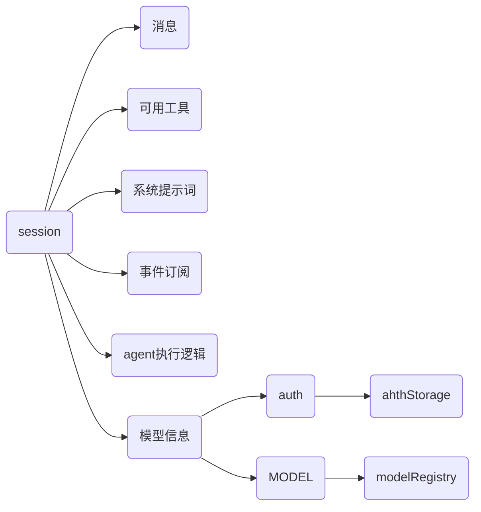

# session 
session是一整个会话，包含了会话需要的全部内容，比如当前消息与历史消息、可用工具、系统提示词、时间订阅、agent loop、auth与模型信息。



# 事件订阅
事件订阅的作用在于将模型执行过程中产生的内容向外界输出，对外提供事件窗口，由订阅者决定如何输出。
```
处理逻辑：
session 内部运行
      ↓
产生事件
      ↓
subscribe 回调收到事件
      ↓
调用方决定如何展示或处理
```

# 认证存储和模型注册表
