> **译文** | 原文：[`packages/agent/docs/harness.md`](https://github.com/earendil-works/pi/blob/main/packages/agent/docs/harness.md) · 版本：v0.84.2（`5cd93f688`）· 译于 2026-08-21

# AgentHarness — 实现规范

- [Part 0 — 导读](#part-0--导读)
  - [0.1 本文是什么](#01-本文是什么)
  - [0.2 系统模型](#02-系统模型)
  - [0.3 三类存储](#03-三类存储)
  - [0.4 完整示例——Slack thread](#04-完整示例slack-thread)
  - [0.5 完整示例——工具执行中崩溃](#05-完整示例工具执行中崩溃)
  - [0.6 非目标](#06-非目标)
  - [0.7 记号与源类型](#07-记号与源类型)
- [Part 1 — Storage](#part-1--storage)
  - [1.1 模型](#11-模型)
  - [1.2 标识](#12-标识)
  - [1.3 Register namespace](#13-register-namespace)
  - [1.4 Transaction](#14-transaction)
  - [1.5 查询](#15-查询)
  - [1.6 用量账本](#16-用量账本)
  - [1.7 后端](#17-后端)
  - [1.8 为什么使用只写一次的数据加 register](#18-为什么使用只写一次的数据加-register)
- [Part 2 — 对话树](#part-2--对话树)
  - [2.1 Entry](#21-entry)
  - [2.2 放置](#22-放置)
  - [2.3 Lane](#23-lane)
  - [2.4 Fact](#24-fact)
  - [2.5 分支查询与上下文](#25-分支查询与上下文)
  - [2.6 分支索引](#26-分支索引)
  - [2.7 Fork](#27-fork)
  - [2.8 Session 与 repository 边界](#28-session-与-repository-边界)
  - [2.9 精确重写](#29-精确重写)
- [Part 3 — Operation 状态机](#part-3--operation-状态机)
  - [3.1 Operation](#31-operation)
  - [3.2 Operation state——程序计数器](#32-operation-state程序计数器)
  - [3.3 Lane state 与当前状态有效性](#33-lane-state-与当前状态有效性)
  - [3.4 原子转换规则](#34-原子转换规则)
  - [3.5 状态图](#35-状态图)
  - [3.6 接受](#36-接受)
  - [3.7 助手生成](#37-助手生成)
  - [3.8 工具](#38-工具)
  - [3.9 摘要生成——上下文压缩与 navigation 摘要](#39-摘要生成上下文压缩与-navigation-摘要)
  - [3.10 Navigation](#310-navigation)
  - [3.11 Inbox、队列与延迟写入](#311-inbox队列与延迟写入)
  - [3.12 Checkpoint procedure](#312-checkpoint-procedure)
  - [3.13 终止 transaction](#313-终止-transaction)
- [Part 4 — 执行、恢复、中止与关闭](#part-4--执行恢复中止与关闭)
  - [4.1 解释器](#41-解释器)
  - [4.2 Effect 边界](#42-effect-边界)
  - [4.3 Lane mutation line](#43-lane-mutation-line)
  - [4.4 恢复](#44-恢复)
  - [4.5 崩溃位置与恢复策略](#45-崩溃位置与恢复策略)
  - [4.6 中止](#46-中止)
  - [4.7 关闭——受控崩溃](#47-关闭受控崩溃)
  - [4.8 Fault](#48-fault)
  - [4.9 外部终止](#49-外部终止)
- [Part 5 — 公开接口](#part-5--公开接口)
  - [5.1 Lane 接口](#51-lane-接口)
  - [5.2 Harness](#52-harness)
  - [5.3 SessionTree](#53-sessiontree)
  - [5.4 Snapshot 与订阅](#54-snapshot-与订阅)
  - [5.5 Event](#55-event)
  - [5.6 Hook](#56-hook)
  - [5.7 Agent loop 构建块](#57-agent-loop-构建块)
  - [5.8 Telemetry](#58-telemetry)
- [Part 6 — 未来：分区保留（Postgres）](#part-6--未来分区保留postgres)
- [Part 7 — Schema 演进](#part-7--schema-演进)
  - [7.1 问题](#71-问题)
  - [7.2 为什么该设计缩小了问题](#72-为什么该设计缩小了问题)
  - [7.3 机制：storage version 加 migrate-on-open](#73-机制storage-version-加-migrate-on-open)
  - [7.4 Migration 是全函数](#74-migration-是全函数)
  - [7.5 三层结构，重述为策略](#75-三层结构重述为策略)
- [Part 8 — 构建顺序](#part-8--构建顺序)
- [Part 9 — Invariant 与测试](#part-9--invariant-与测试)
  - [9.1 Invariant](#91-invariant)
  - [9.2 Race 目录](#92-race-目录)
  - [9.3 测试层级](#93-测试层级)
- [附录 A — 术语表](#附录-a--术语表)
- [附录 B — Coding-agent v3 格式兼容性](#附录-b--coding-agent-v3-格式兼容性)
- [附录 C — 开放问题](#附录-c--开放问题)

# Part 0 — 导读

## 0.1 本文是什么

一个用于 agent 对话的持久化 runtime。它持久化对话和 operation state，让被中断的工作可以恢复，而不会重复已经 settle 的 effect。

## 0.2 系统模型

### Session

一个 session 对相关工作分组，由四部分组成：

- **Entry 树。** Entry 可以是消息、上下文压缩、分支摘要或应用定义的自定义 entry。Entry 不可变。每个分支是一条对话 thread；共享树在保留历史的同时支持分支、上下文压缩、fork 和并行工作。

  ```text
  a ── b ── c ── d
        └── e ── f
  ```

- **Fact。** 可变、带 namespace 的键值状态。内置项包括 session 名称和 entry label；应用可以存储自定义 fact。
- **Lane。** 指向树中位置的命名 cursor。每个 session 都有 `main`。一个 lane 拥有自己的 leaf、模型配置、队列，并且最多拥有一个 operation。额外 lane 支持 Slack thread、subagent，以及在共享历史上进行的其他并行工作。
- **用量账本。** Session 中只追加的 token 和费用 event。

### Harness 与 operation

Session 层管理持久数据并暴露类型化 tree view。Harness 驱动 lane：接受 prompt、运行模型和工具 step、管理队列、压缩或 navigate 树，并恢复被中断的工作。它还拥有 harness 全局的可用工具及 prompt 资源 registry、拦截和转换执行的 hook、报告活动与持久变更的被动 event，以及 runtime 配置。

一个 **operation** 是 lane 接受的一项工作：run、上下文压缩或 navigation。其不可变元信息记录标识、意图和起点；完整的当前状态记录 phase、control、队列和恢复数据。每次持久状态转换都会替换当前状态。完成时移除 operation state，并记录 lane 的结果。

### Storage

在 session 和 harness 下方，`Storage` 对三类持久形式提供原子 transaction 和查询：不可变 entry、可变 register，以及只追加的用量 row。Register 构成可变、带 namespace 的键值存储。Fact 位于其中；内部 harness namespace 持久存储待处理内容，以及崩溃恢复所需的 lane 与 operation state。具体而言，`op.meta` 只写一次，用于存储 operation 元信息；`op.state` 在每次转换后都替换为完整的当前状态。终止 transaction 删除两者并写入 `lane.lastResult`。任何局部 transaction 都不可见。

## 0.3 三类存储

Part 1–5 的一切都由此推出。

**1. 三类存储，一个 invariant。** 所有持久数据都属于以下一种：

```text
entries        对话树——只写一次、只追加
registers      当前可变状态——带 namespace 的类型化 cell，可覆盖或删除
usage ledger   费用历史——只追加的 row
```

*每个 payload 都位于 entry、register 或 ledger 中；不存在第四个地方。* Entry 是完整的对话记录——放置位置和 payload 位于同一 row。Register 直接保存当前类型化值；覆盖会丢弃旧值，删除会移除 key。在树中获得位置之前就需要持久存在的内容（排队输入、延迟写入）会等待在 `pending.entry` register 中，并在放置它的 transaction 中变成 entry。各后端 projection——分支索引、全文搜索、统计——都可由三类存储 rebuild，不具备权威性。

**2. 原子 transaction。** Transaction 是一组 entry insert、usage insert 和 register write（set 或 delete），以严格递增的 sequence number 全部提交或全部不提交。Transaction 内部不存在崩溃状态。这是唯一的写入原语。

**3. 持久化程序计数器。** 每个 step 之后，harness 都覆盖一个 register——`op.state/{operationId}`——写入 operation 的*完整*当前状态。恢复不会 replay journal，也不会根据缺失项推断位置；它读取该 register 并对其执行 switch。状态是*完整的*——绝不依赖先前状态。较小的捕获值（配置、stream 选项、重试策略）内联保存；较大的稳定 payload 位于相邻 `op.*` register 中，或通过 ID 命名。Operation 结束时，终止 transaction 删除其 register：已完成 session 只保留对话、ledger，以及少量 lane 和 fact register。没有需要回收的失效状态。

**4. Effect sandwich。** Provider 请求和真实工具调用被两个 commit 包裹：

```
commit:  "即将执行 X；其输出将使用 ID R 和 U"          ← intent
         执行 X                                            ← 不确定部分
commit:  输出 + 用量 + 下一状态                             ← settlement
```

Hook 遵循自己的 replay 契约：结果在消费它的 transaction 中变为持久状态；在该 transaction 前崩溃可能重新运行 hook。因此，每个外部 effect 都可能已经发生却没有持久化 settlement。Provider/tool intent 会在 replay 策略依赖这种不确定性时将其明确表示；幂等 hook 则把它作为非目标接受。

## 0.4 完整示例——Slack thread

用户在已有 400 个历史 entry 的 channel 中发帖。应用为该 thread 创建 lane，锚定在 channel 当前 leaf。Entry ID 是 UUIDv7（§1.2）；示例会将其缩写。

```
harness.createLane("slack:1719432.0021", at: "0195c8d1-4a2e-7b31-…")
lane.prompt("what changed in auth last week?")
```

按顺序发生以下事情：

1. **接受。** Harness 验证输入、运行 `before_run` hook，并提交一个 transaction：用户消息 entry、operation 的 `op.meta` register，以及第一个 `op.state`——*“我位于 checkpoint，需要一个助手响应。”*
2. **Intent。** 内部 ready-state commit 后，它提交请求 intent：*“我即将发起 provider 请求。响应将是 entry `0195c8d1-53a0-7c44-…`，用量 row 将是 `0195c8d1-53a0-7d18-…`。”* 两个 ID 此时创建；尚未发送任何内容。
3. **请求。** Streaming 开始。这是唯一不持久化的部分。
4. **Settlement。** 一个 transaction 提交响应 entry、其用量 row 和下一状态：*“响应包含工具调用；这是 batch plan，result ID 已经分配。”*
5. 工具调用遵循相同的 intent → effect → settlement 形态，每个调用一对 commit。
6. 模型在没有工具调用的情况下停止时，终止 transaction 删除 operation register，把结果记录到 `lane.lastResult`，并让 lane 进入 idle。

以下是 trace（ID 已缩写；每个 `TX[...]` 都是一次原子 commit）：

```text
TX[ insert entry n1 (user msg), upsert op.meta/O, upsert op.state/O = checkpoint,
    upsert lane.leaf = n1, upsert lane.state = { currentOperationId: O } ]
TX[ upsert op.state/O = assistant ready (config snapshot) ]
TX[ upsert op.state/O = effect_pending (reserves response n2, usage u1) ]
… provider streams …                                  ← 不确定窗口
TX[ insert entry n2, insert usage u1, upsert lane.leaf = n2,
    upsert op.state/O = tools (result id n3 reserved) ]
TX[ upsert op.tool_args/O:s1:0, upsert op.state/O = call 0 effect_pending ]
… tool runs …
TX[ insert entry n3, upsert lane.leaf = n3, upsert op.state/O = checkpoint ]
… second turn: ready · intent · stream · settle (n4, u2) …
TX[ delete op.meta/O, op.state/O, op.tool_args/O:*,
    upsert lane.lastResult = { O, completed, n4 },
    upsert lane.state = { currentOperationId: null } ]
```

在任意两个 transaction 之间终止进程并重启。Harness 读取 lane register，精确得知最后提交的是上述哪一句状态，并从那里继续。如果在 step 3 中终止，它知道请求可能已经计费，也可能已经产生输出——这是整个系统中唯一真正不确定的窗口，并且有明确策略处理它。

与此同时，同一 channel 的第二条 thread 在自己的 lane 上运行，共享相同的 400 个历史 entry，彼此无需协调。

## 0.5 完整示例——工具执行中崩溃

```
lane.prompt("delete the stale migrations and run the test suite")
```

模型返回两个工具调用。Harness 提交 batch plan，然后提交 `call 0 即将以这些精确参数执行，并声明自身不适合 replay`。工具开始删除文件。进程被终止。

```text
TX[ insert entry n2 (assistant, 2 calls), insert usage u1, upsert lane.leaf = n2,
    upsert op.state/O = tools (result ids n3, n4 reserved) ]
TX[ upsert op.tool_args/O:s1:0, upsert op.state/O = call 0 effect_pending,
                                                    replay: "never" ]
… tool deletes files …  ← CRASH
```

重启后，harness 读取一个 register，发现 `calls[0].status = "effect_pending", replay = "never"`。它不会重新运行删除操作，而是使用 effect 开始前预留的 result ID 追加一个合成错误结果，将该调用标记为完成，然后继续 call 1：

```text
TX[ insert entry n3 (synthetic "interrupted" result), upsert lane.leaf = n3,
    upsert op.state/O = call 0 completed ]
```

对话保持一致——每个工具调用都有结果——并且没有操作运行两次。

如果工具声明 `replay: "safe"`（读取、查询），harness 会使用持久化参数重新执行它。

## 0.6 非目标

- **外部 effect 恰好执行一次。** 参见上文。有自身副作用的 hook 必须以 operation ID 为 key 保持幂等。
- **Provider stream 恢复。** 局部 stream 只存在于进程内，永不持久化。已 settle 的响应必须在任何分类发生前*完整*持久化。
- **多个 writer。** 每个 session 一个进程。Serving 层据此路由；SQLite 后端通过 fenced lease 强制该约束（§1.7）。Lane 覆盖看似需要多个 writer 的工作负载。
- **复制。** 一个 session 只存在于一个位置。
- **持久写入历史。** Register 只保存当前值：被覆盖的 register 已消失，API 和表都不暴露写入历史。测试中的写入顺序断言使用包装 `commit()` 的 instrumentation storage decorator（Part 9）；生产审计属于 telemetry 层（§5.8）。
- **将删除作为 runtime 功能。** Entry 和用量 row 永不删除：上下文压缩改变 provider context，而非 storage；终止清理只删除 register。注意，`retainedTail` 会把旧消息向前复制到较新的 compaction entry，摘要也由旧内容派生，因此上下文压缩同样不是擦除。满足合规要求的“擦除此项”属于管理性精确重写（§2.9），是唯一获准的例外。

## 0.7 记号与源类型

- `TX[ a, b, c ]`——一个原子 commit，按顺序包含写入 `a`、`b`、`c`。写入词汇为 `insert entry`、`insert usage`、`upsert namespace/key = value` 和 `delete namespace/key`。
- ID 是 UUIDv7（§1.2）。示例会将其缩写：时间前缀无关时，短 tag——`e_*` entry ID、`u_*` usage ID、`op_*` operation ID——代表完整 ID；前缀重要时，示例会显示它（`0195c8d1-4a2e-7b31-…`）。
- `S(next)`——用下一个完整 operation state 覆盖 `op.state/{operationId}` register。`L(next)`——对 `lane.state/{lane}` 执行同样操作。
- **必须/不得**是规范性要求，其他内容都是解释。

源类型来源：

- `AgentMessage`、`AgentTool`、`AgentToolResult`、`QueueMode` 和 `ThinkingLevel`：`packages/agent/src/types.ts`。
- `AgentEventSink`：`packages/agent/src/agent-loop.ts`。
- `Skill`、`PromptTemplate`、`AgentHarnessResources`（下文简称 `Resources`）、`AgentHarnessTool`、`AgentHarnessStreamOptions` 和 `AgentHarnessStreamOptionsPatch`：`packages/agent/src/harness/types.ts`。
- `Model`、`Models`、`Usage`、`RetryPolicy`、`StopReason`、`AssistantMessage`、`ImageContent`、provider message、stream 选项和 deferred handle：`packages/ai`。
- `CompactionSettings`、`CompactionPreparation`、`CompactResult`、`BranchPreparation` 和 `BranchSummaryResult`：`packages/agent/src/harness/compaction/`。除非本文明确更改，否则现有 preparation 和 split-turn 算法仍是实现起点。
- `TelemetryContext` 和类型化 schema helper：`packages/telemetry`；agent 拥有的 schema 仍位于 `packages/agent/src/harness/telemetry.ts`。
- 持久化自定义消息注册使用的 `TSchema`：`typebox`。

公开 `QueueMode` 仍为 `"all" | "one-at-a-time"`。公开 `RetryPolicy` 仍采用 pi-ai 结构 `{ enabled, maxRetries, baseDelayMs }`；operation state 存储规范化后的 `{ maxAttempts, baseDelayMs }` 等价形式。`maxRetries` 和 `baseDelayMs` 必须是有限、非负的安全整数，且 `maxRetries + 1` 必须仍为安全整数；禁用重试时规范化为一次 attempt。指数 delay 和 `notBefore` 算术在 `Number.MAX_SAFE_INTEGER` 处饱和。公开 `CompactionSettings` 仍为 `{ enabled, reserveTokens, keepRecentTokens }`；两个 token 数都必须是有限、非负的安全整数。构造函数和 setter 会在发布前拒绝无效设置。该设计为 `AgentHarnessStreamOptions` 及其 patch 类型新增 `deferred?: boolean | { window?: "15m" | "1h" | "24h" }`；结构化请求始终强制将其设为 false。

```ts
type SettledAssistantMessage = AssistantMessage & {
  stopReason: Exclude<StopReason, "pending">;
};

// Provider dispatch 在请求时通过 Models 解析持久化的
// { provider, modelId } 标识，同时应用认证。Registry entry
// 缺失或被替换会像未知工具一样，在带内使请求失败。
```

---

# Part 1 — Storage

Storage 不了解 agent、lane 或对话。它存储 entry 和 usage row、更新 register，并回答一小组固定查询。Part 2–4 完全构建在此之上。

## 1.1 模型

```ts
type JsonValue = null | boolean | number | string | JsonValue[] | { [k: string]: JsonValue };

/** 只写一次。完整的对话记录：放置位置和 payload 位于同一 row。
    恰好在一个 transaction 中创建，永不修改或删除。扩展该 base 的
    四种具体 entry 类型在 §2.1 定义。 */
interface EntryBase {
  id: string;                // UUIDv7（§1.2）
  parentId: string | null;
  seq: number;               // storage 在 commit 时分配
  timestamp: number;         // Unix ms，storage 在 commit 时分配
  type: EntryType;
  customType?: string;       // type === "custom" 时存在
  // ...每种 entry 类型的 payload 字段（§2.1）
}

type EntryType = "message" | "compaction" | "branch_summary" | "custom";

/** 唯一的可变存储。带 namespace 的 key，直接保存其当前类型化值。
    覆盖会替换值；删除会移除 key。 */
interface Register<N extends RegisterNamespace = RegisterNamespace> {
  namespace: N;
  key: string;
  value: RegisterValues[N];
  seq: number;               // 最后一次设置该 register 的写入 seq
}

/** 只追加的费用账本 row。永不修改，永不删除（§1.6）。 */
interface UsageRow {
  id: string;                // UUIDv7（§1.2）
  seq: number;               // storage 在 commit 时分配
  usage: Usage;
  entryId?: string;          // 存在归属 entry 时，该费用所属的 entry
  adjustment: boolean;       // true = 调用方提供的 reconciliation，而非 provider 报告
  details?: JsonValue;
}
```

## 1.2 标识

每个 ID——entry、usage 和所有预留 ID——都是由 session ID generator 生成的 **UUIDv7**（§2.8）；旧格式 import 会重新生成 ID 以满足要求（附录 B）。前 48 bit 是生成时间，因此每个引用都自描述且可按时间排序。代价是 ID 会泄露创建时间。（未来的分区 Postgres 后端可以利用此前缀——参见资料性 Part 6。）

生成规则：

1. ID 在**预留时**用 `now()` 生成。直接 append 在同一 transaction 中放置；助手/工具 ID 的时间最多比放置时间早一个请求时长。
2. **工具结果 ID 继承其助手 ID 的时间戳**（`idGenerator.next(timestampMs?)`，使用新的随机尾部），因此即使跨越午夜边界，调用及其结果组在 ID 顺序中仍保持时间聚合。
3. 合成 settlement 使用已经预留的 ID 写入（§4.5），无需特殊情况。

**不透明 payload**——自定义 entry `data`、`details`、`fact.custom` 值、消息文本、hook `resumeData`——可能嵌入 entry ID。Harness 从不跟踪这些引用，它们可能失效；应复制内容，不要引用内容。

**绝对约束。** 在一个 session 内，entry 和 usage row 永不删除——精确重写（§2.9）是唯一例外。Parent 缺失始终表示数据损坏。

## 1.3 Register namespace

```ts
interface RegisterValues {
  "lane.leaf":       string | null;                // entry ID；null = lane 位于 root
  "lane.config":     LaneConfiguration;            // §2.3
  "lane.state":      LaneState;                    // §3.3
  "lane.lastResult": LaneLastResult;               // §3.13
  "op.meta":         Operation;                    // §3.1
  "op.state":        OperationState;               // §3.2——程序计数器
  "op.tool_args":    Record<string, JsonValue>;    // 有效工具参数（§3.8）
  "op.preparation":  DurableStructuralPreparation; // §3.9
  "pending.entry":   PendingEntry;                 // §2.2
  "fact.name":       string;
  "fact.label":      string;
  "fact.custom":     JsonValue;                    // JSON null 是合法值
}
type RegisterNamespace = keyof RegisterValues;

/** 尚未放置的内容：在放置 transaction 写入完整 entry 并删除该
    register 前，它是当前可变状态（§2.2）。 */
interface PendingEntry {
  type: "message" | "custom";
  customType?: string;
  payload?: JsonValue;       // 将成为 entry payload 的内容；
                             // 不存在 = 没有 data 的自定义 entry
}

interface DurableFileOperations {
  read: string[]; written: string[]; edited: string[];
}
type DurableStructuralPreparation =
  | { kind: "compaction"; messagesToSummarize: AgentMessage[];
      turnPrefixMessages: AgentMessage[]; retainedTail: AgentMessage[];
      isSplitTurn: boolean; tokensBefore: number; previousSummary?: string;
      fileOps: DurableFileOperations; settings: CompactionSettings }
  | { kind: "branch_summary"; messages: AgentMessage[];
      fileOps: DurableFileOperations; totalTokens: number };
```

| Namespace | Key | 值 | 含义 |
|---|---|---|---|
| `lane.leaf` | lane 名称 | entry ID 或 `null` | 该 lane 下一次 append 的位置 |
| `lane.config` | lane 名称 | `LaneConfiguration` | 完整 lane 配置 |
| `lane.state` | lane 名称 | `LaneState`（§3.3） | `currentOperationId`、`pendingNextRun` |
| `lane.lastResult` | lane 名称 | `LaneLastResult`（§3.13） | lane 最近一次 operation 的终止结果 |
| `op.meta` | operation ID | `Operation`（§3.1） | 接受数据；只写一次，永不覆盖 |
| `op.state` | operation ID | `OperationState`（§3.2） | 完整 operation state——**程序计数器** |
| `op.tool_args` | `{opId}:{stepId}:{sourceIndex}` | 有效参数 | 在工具 clearance 时写入一次（§3.8） |
| `op.preparation` | `{opId}:{taskId}` | `DurableStructuralPreparation` | 在 decision hook 前写入一次（§3.9） |
| `pending.entry` | 预留 entry ID | `PendingEntry` | 等待放置的排队内容（§2.2） |
| `fact.name` | `""` | 字符串 | session 名称 |
| `fact.label` | entry ID | 字符串 | entry label |
| `fact.custom` | 应用 key | `JsonValue` | 应用状态 |

这是完整集合。Key 的形态体现了两种生命周期：

```text
lane.*  fact.*     存续于 session；fact 只由显式应用操作删除
op.*               存续于 operation；由终止 transaction 删除（§3.13）
pending.entry      存续到内容被放置或取消
```

- `op.meta` 和 `op.preparation` key 恰好写入一次；`op.tool_args` key 每个 key 写入一次，以产生它的 step 为 key，因此 batch 永不冲突。它们最迟在终止 transaction 中删除；operation 期间只有 `op.state` 会被覆盖。
- Operation 拥有且结束时仍未消费的 `pending.entry` register（剩余 inbox item 和由 abort drain 的 item）由终止 transaction 删除——已消费 item 的 register 在放置 transaction 中消失；lane 拥有的 item（`pendingNextRun`）可跨 operation 存续，在消费或取消时消失（§3.11）。
- `lane.lastResult` 只由终止 transaction 写入，并由该 lane 的下一次终止 transaction 覆盖——每个 lane 永久只有一个有界 register。恢复从不读取它；它的存在使应用在接受 operation 后即使崩溃并重新打开，仍能得知其结果（§3.13）。
- 删除 fact 会移除其 register。在 `fact.custom` 中存储 JSON `null` 是另一种合法状态；不存在 tombstone。
- 取消不留下痕迹：`cancelQueued` 按 pending → `cancelled`、entry 存在 → `already_consumed`、否则 → `not_found` 进行分类（§3.11）。客户端重试丢失的 cancel 时把 `not_found` 视为成功。

## 1.4 Transaction

```ts
/** 映射的 discriminated union：namespace 强制 value 类型。 */
type RegisterSetWrite = {
  [N in RegisterNamespace]: { kind: "register"; op: "set"; namespace: N;
                              key: string; value: RegisterValues[N] }
}[RegisterNamespace];

type Write =
  | { kind: "entry"; entry: Omit<Entry, "seq" | "timestamp"> }
  | { kind: "usage"; row: Omit<UsageRow, "seq"> }
  | RegisterSetWrite
  | { kind: "register"; op: "delete"; namespace: RegisterNamespace; key: string };

interface Transaction { writes: Write[] }

interface CommitResult { firstSeq: number; seqs: number[]; timestamp: number }
```

规则：

1. Transaction **全部提交或全部不提交**。不存在某些 write 已存在、其他 write 不存在的可观察状态。
2. Write 按给定顺序获得**严格递增**的 `seq` 值；transaction 内和 transaction 间都允许存在空档。`seq` 在整个 session 的所有 lane 和所有 write 类型间单调递增。Register `set` 会用分配的 `seq` 标记 register。
3. 一个 transaction 内，write 按顺序应用：entry 可以把同一 transaction 中较早创建的 entry 作为 parent；register value 可以引用同一 transaction 中较早创建的 entry 或 usage ID。放置 transaction 会一起插入完整 entry 并删除其 `pending.entry` register（§2.2）——不存在两者同时存在的时刻。
4. Entry 与 usage ID 共享一个 session 范围的 ID namespace。以任意已存在 ID 写入任一种类型都表示**数据损坏**，不是更新。
5. 对相同 `(namespace, key)` 执行 register `set` 会替换当前值；`delete` 移除 key；之后的 `set` 会重新创建它。不保留历史。指向缺失 key 的 `delete` 不执行任何操作，因此清除未设置 label 等公开删除保持合法。
6. 一个 session 的 transaction **串行执行**。只有一个 writer 和一个队列。

Session 会在 storage admission 前验证完整 transaction，包括 JSON 序列化和运行时 schema。已经 admission 的 commit 失败会使 **harness fault**：所有 effect 停止，所有调用 reject，必须重启进程。不能容忍部分应用的 transaction。

## 1.5 查询

一个 `Storage` 实例服务一个 session。Repository 发现和生命周期位于该接口之外（§2.8）。

```ts
interface Storage {
  commit(tx: Transaction): Promise<CommitResult>;

  getEntries(ids: string[]): Promise<ReadonlyMap<string, Entry>>;

  getRegister<N extends RegisterNamespace>(namespace: N, key: string):
    Promise<Register<N> | undefined>;
  /** keyPrefix 是对 (namespace, key) 的索引前缀列表；终止清理的
      op.* 前缀扫描使用它（§3.13）。 */
  listRegisters<N extends RegisterNamespace>(namespace: N, keyPrefix?: string):
    Promise<Register<N>[]>;

  scanBranch(q: BranchScan): Promise<Entry[]>;            // §2.5
  scanBranchStructure(q: BranchScan): Promise<EntryStructure[]>;
  scanEntries(q: EntryScan): Promise<Entry[]>;            // session 范围的树 inventory
  scanUsage(q: UsageScan): Promise<UsageRow[]>;           // 按 seq 范围读取 ledger（§1.6）
  getStats(): Promise<SessionStats>;                      // 维护的 projection（§1.6）

  close(): Promise<void>;
}

/** 不含 payload 字段的放置元信息。 */
type EntryStructure = Pick<Entry, "id" | "parentId" | "seq" | "timestamp" | "type" | "customType">;

interface EntryScan {
  type?: EntryType; customType?: string;
  fromSeq?: number; toSeq?: number;
  order?: "asc" | "desc"; limit?: number;
}

interface UsageScan {
  fromSeq?: number; toSeq?: number;
  order?: "asc" | "desc"; limit?: number;
}
```

这里有意不提供跨 namespace register scan，也没有持久写入日志。恢复、fact、fork 和执行沿精确 ID 与 key 进行；entry inventory 使用 `scanEntries`；ledger 读取使用 `scanUsage`；总计使用统计 projection（§1.6）；测试顺序断言用 instrumentation-storage decorator 包装 `commit()`（Part 9）；生产审计属于 telemetry（§5.8）。

恢复和执行读取必须由索引驱动且有界。它们不得根据缺失值推断状态，也没有可供 fold 的 register 历史。允许精确 dereference：一个当前状态可以指向一组有界 entry 和 register，并在一个 batch 中获取，无需依赖顺序归并。公开 inventory 和调试 API 可以有意读取比 hot path 更多的数据；它们的 `limit`/分页行为在 `SessionTree` 层显式定义。

`close()` 是幂等的。它封闭 admission，拒绝之后在该实例上的 read/commit，drain 封闭前已经 admission 的 commit，然后释放资源和 writer claim。持久数据通过 repository 重新打开。

## 1.6 用量账本

每个 settle 的 provider attempt 都写入一个 `UsageRow`——成功、失败、重试和合成 attempt 都包括在内，也包括 operation 后来中止的 attempt。Settlement transaction 一起写入响应 entry 和其 usage row（§3.7）；合成 settlement 使用预留 usage ID 写入零用量。Row 只追加：终止清理会删除 operation register，但永不删除其 ledger row，因此无论 orchestration state 发生什么，计费信息都会保留。

```jsonc
{ "id": "u_7", "seq": 815, "entryId": "e_51", "adjustment": false,
  "usage": { "input": 12000, "output": 431, "cost": { ... } } }
```

- `entryId` 在费用有归属 entry 时指向该 entry。在生成 entry 前失败的结构化（摘要）attempt 和独立 adjustment 没有该字段。
- `adjustment: true` 表示调用方提供的 reconciliation（`recordUsage`，§5.1），而非 provider 报告。Format-3 import 写入一条聚合 adjustment row（附录 B）。
- Provider attempt usage ID 是在 intent commit 中预留的 UUIDv7（§1.2），因此 settlement 会使用 intent 承诺的精确 ID 写入。Adjustment row、工具报告 usage row、hook 提供的上下文压缩/navigation usage row（§3.9、§3.10）和 import aggregate 在 commit 时生成 ID，不预留任何 ID。
- `getStats()` 是在 ledger 和 message-entry 数量上维护的 projection——`messageCount` 只计算 `message` entry，不包括 compaction、summary 或 custom entry。每次 commit 后它都等于 ledger 总和；一致性 suite 会断言这一点（Part 9）。单条 row 在 commit 时通过 `usage` event 到达应用（§5.5），`scanUsage`（§1.5）按 seq 范围将其读回——消费者持久化自己应用过的最大 event `seq`，宕机后即可用 `scanUsage({ fromSeq })` 追赶。恢复从不读取 ledger。

## 1.7 后端

目前提供同一模型的三种编码——Memory、JSONL、SQLite——三者都通过相同的一致性 suite（Part 9）。每个后端都记录 session 的 `storageVersion`（Part 7）：JSONL header 字段、SQLite catalog column。Memory session 始终是当前版本。可能的第四种后端——分区 Postgres——在资料性 Part 6 中概述；本文其他内容都不依赖它。

### Memory

```ts
entries:   Map<string, Entry>
registers: Map<string, Register>       // key: `${namespace}\u0000${key}`
usage:     Map<string, UsageRow>
children:  Map<string, string[]>       // parentId → entry ID，用于 tree walk
```

一个队列串行化 commit。Commit 验证 write 并将其应用到临时 transaction state，再一起发布这些 map。Register delete 就是 map delete。Read 是 map lookup；`scanBranch` 在 RAM 中沿 `parentId` 行走并过滤。不存在日志：Memory 恰好保存 live state，不保存其他内容。

### JSONL

文件不是状态，而是上述 Memory map 的 **replay recipe**。每次 `commit()` 占一个物理行。Storage 先分配 sequence/timestamp 字段，再把一个已提交 write 编码成 JSON object line，或把多个编码成一个 **array line**。

```jsonl
{"v":4,"kind":"header","id":"s_1","storageVersion":1,"createdAt":1700000000000,"cwd":"..."}
[{"kind":"entry","seq":101,"timestamp":1700000000000,"id":"e_50","parentId":"e_41","type":"message","message":{"role":"user","content":[...]}},
 {"kind":"register","op":"set","seq":102,"namespace":"op.meta","key":"op_9","value":{...}},
 {"kind":"register","op":"set","seq":103,"namespace":"op.state","key":"op_9","value":{...}},
 {"kind":"register","op":"set","seq":104,"namespace":"lane.leaf","key":"main","value":"e_50"},
 {"kind":"register","op":"set","seq":105,"namespace":"lane.state","key":"main","value":{...}}]
{"kind":"usage","seq":110,"id":"u_7","entryId":"e_51","adjustment":false,"usage":{...}}
{"kind":"register","op":"delete","seq":131,"namespace":"op.state","key":"op_9"}
```

- 这是 format 4。源码树中现有的不兼容 format-4 代码尚未完成，将被原地替换；不需要为它提供 migration。Coding-agent format 3 仍受支持（附录 B）。
- Open 会按顺序把 line replay 到 Memory map：entry 和 usage row 累积；后续 register `set` 覆盖 key，`delete` 移除 key。这是*解码*，不是恢复逻辑。Open 会验证持久化 sequence 的单调性——严格递增、允许空档（§1.4）——以及时间戳，绝不重新生成已提交时间戳。之后所有查询都在 RAM 中运行。
- **被撕裂的最后一行会被整体丢弃**，包括 array 中的每个元素，并在接收新 write 前截断。由此保证“transaction 内不存在崩溃前缀”。
- 畸形的*中间* line 或完整但无效的 transaction 表示数据损坏。唯一例外：schema migration 前、已经被取代的旧形 register line 在 replay 时宽松解码为带 key 的原始 JSON（Part 7）；compaction 会淘汰它们。
- 持久性达到进程崩溃级别：已经 resolve 的 `commit()` 能经受进程终止。不承诺 fsync。
- 可选：为每个 entry 保留 `(offset, length)` 并惰性加载 payload，只让 structure 和 register 常驻内存。仅在 profiling 证明有必要时这样做。

**Snapshot compaction。** 在 SQLite 中，register `set` 是原地 upsert——30 turn 的 run 会留下一个 `op.state` row，随后变为零。在 JSONL 中，每个 `set` 都会 append，因此同一次 run 会 append 约 10 个完整 `op.state` line；终止 `delete` line 落盘时，它们全部立刻失效：即使逻辑状态没有历史，文件仍随*写入历史*增长。解决办法是通过临时文件 + 原子 rename，把文件重写为 `header + current entries + current registers + usage rows`；保留的 line 维持原 `seq`，丢弃 line 留下的空档是合法的（§1.4），因此 compaction 不需要重编号机制。对于四 entry 的 run：

```text
compaction 前：约 10 个 transaction line、约 27 次 write——op.state revision、
                工具参数、pending payload，终止 line 后全部失效
compaction 后：header + 4 个 entry line + 2 个 usage line + 4 个 lane register line
```

Compaction 时机：打开时 dead-byte 比率超过阈值；可选地在终止 transaction 后；schema migration 后始终执行（Part 7）。两次 compaction 之间，正常操作只追加，每次 commit 为 O(1)。一个值得明确的结果是：已删除 pending payload 和已取代 state revision 在 compaction 前会**继续作为字节存在**——逻辑删除立即发生，物理删除延后。需要快速物理移除已取消敏感内容的部署应在终止边界积极 compaction。

### SQLite

**每个 session 一个数据库文件。** 文件就是 session，与 JSONL 文件完全相同。数据损坏被限制在一个 session 内；删除就是 unlink 文件；SQLite 的每文件单 writer 规则按构造方式与设计的每 session 单 writer 规则一致。

```sql
entries(id TEXT PRIMARY KEY, parent_id TEXT, seq INTEGER, type TEXT,
        custom_type TEXT, timestamp INTEGER, payload TEXT) WITHOUT ROWID;
CREATE INDEX ix_entry_parent ON entries(parent_id);
CREATE INDEX ix_entry_seq ON entries(seq, type);

registers(namespace TEXT, key TEXT, seq INTEGER, value TEXT,
          PRIMARY KEY (namespace, key));

usage_ledger(id TEXT PRIMARY KEY, seq INTEGER, entry_id TEXT, adjustment INTEGER,
             usage TEXT, details TEXT) WITHOUT ROWID;
CREATE INDEX ix_usage_seq ON usage_ledger(seq);

-- 私有分支索引（§2.6）。不是 register；其他后端没有等价结构。
branch_entries(branch_id TEXT, entry_id TEXT, entry_seq INTEGER, entry_type TEXT,
               PRIMARY KEY (branch_id, entry_id)) WITHOUT ROWID;
-- 有序扫描。entry_seq 必须紧跟 branch_id，否则 ORDER BY 需要
-- 临时 b-tree；entry_id 和 entry_type 位于后方，让索引覆盖只读 ID 的查询。
CREATE INDEX ix_be_seq  ON branch_entries(branch_id, entry_seq, entry_id, entry_type);
-- 按类型过滤的扫描。
CREATE INDEX ix_be_type ON branch_entries(branch_id, entry_type, entry_seq, entry_id);
CREATE INDEX ix_be_entry ON branch_entries(entry_id);
branch_meta(branch_id TEXT PRIMARY KEY, tip_entry_id TEXT, tip_seq INTEGER,
            base_branch_id TEXT, base_seq INTEGER);
CREATE UNIQUE INDEX ix_bm_tip ON branch_meta(tip_entry_id);

-- 各一行：文件就是 session。
session(created_at, parent_session_id, storage_version, metadata,
        message_count, usage_payload, next_seq);
writer_lease(owner_id TEXT, fence INTEGER, expires_at_ms INTEGER);
```

一个 `commit()` 就是一个 SQL transaction：插入 entry、插入 ledger row、upsert 或删除 register、维护分支索引、递增 `session_stats`。绝不 UPDATE 或 DELETE entry/ledger row；可变性限于 register、分支索引（`branch_meta` tip 和 base）、统计、sequence、session catalog row 与 lease。

**每个 transaction 都必须以 `BEGIN IMMEDIATE` 开始。** Deferred `BEGIN` 在写入前读取会取得 read snapshot，之后必须升级为 write lock；如果另一 writer 在此期间已经 commit，SQLite 会让升级失败——而 `busy_timeout` **无法**挽救，因为无论等待多久都不能刷新 stale snapshot。唯一恢复方式是 rollback 并完整重试。

每次 commit 都采用该形态，不只是少数几次。分配 sequence 范围会读取 session row 的 `next_seq`，然后写回，因此系统执行的每个 transaction 都是先读后写。分支创建（§2.6）又增加一个实例：插入前读取最新 compaction。`BEGIN IMMEDIATE` 预先取得 write lock，避免无法恢复的 stale-snapshot upgrade，因此这里不存在 deferred `BEGIN` 更合适的情况。

**`writer_lease` 强制单 writer 规则。** WAL 很乐意让两个进程交替写入一个文件，而这恰好是设计禁止的交错——因此每 session 文件并没有消除 lease 的必要性。过期 fenced ownership：`open()` 取得 claim；storage 在 append 时和 idle 期间续期；close 在队列 drain 后停止续期，并且只删除与自身匹配的 `(owner_id, fence)` pair——因此 stale owner 无法释放取代它的新 owner。这使“一个进程拥有一个 session”成为强制属性，而不是依赖 serving 层遵守的约定。Memory 和 JSONL 没有等价机制，依赖进程所有权；同一 JSONL session 被打开两次会发生未检测的数据损坏。

原子性本身无需特殊处理。多 write transaction 由文件格式保证全部提交或全部不提交：WAL frame 只在 commit record 落盘时变为可见，因此并发 reader 要么看不到 transaction 的任何 write，要么看到全部。

`scanBranch` 的每个物理 segment 使用一个 JOIN；§2.6 组合 segment 范围：

```sql
SELECT e.id, e.parent_id, e.seq, e.type, e.custom_type, e.timestamp, e.payload
FROM branch_entries b
CROSS JOIN entries e ON e.id = b.entry_id
WHERE b.branch_id = ? AND b.entry_seq > ? AND b.entry_seq <= ?
ORDER BY b.entry_seq;
```

`CROSS JOIN` 是关键要求：它强制 `branch_entries` 成为外层循环。否则 planner 可能从 `entries` 驱动、扫描表，再通过临时 b-tree 排序。测试中必须断言该 plan：

```
SEARCH b USING COVERING INDEX ix_be_seq (branch_id=? AND entry_seq>?)
SEARCH e USING PRIMARY KEY (id=?)
```

任何包含 `USE TEMP B-TREE FOR ORDER BY` 或扫描 `entries` 的 plan 都是 regression。

`scanBranchStructure` 使用相同查询但不含 payload column。`getEntries` 是按 `e.id IN (...)` 的 primary-key lookup。

由于文件就是 session，精确重写（§2.9）与 fork 都是文件操作：构建新数据库（`VACUUM INTO`，或在一个 read snapshot 上复制 row），对于重写则将其原子替换到旧路径——与 JSONL 形态相同。

## 1.8 为什么使用只写一次的数据加 register

- **恢复就是读取。** 每个 lane 五次 register point lookup，然后按精确 ID dereference（§4.4）。不存在可能产生 bug 的 reducer。
- **崩溃状态可枚举。** 只存在于 transaction 之间，不存在于 transaction 内部。
- **清理是删除，不是收集。** 30 turn 的 run 会覆盖同一个 `op.state` register 约 30 次，然后删除它。剩下的恰好是对话、ledger 以及少量 lane/fact register——没有失效 state value、history row，也没有需要垃圾回收的内容。（JSONL 把*物理*回收延后到 snapshot compaction；逻辑状态完全相同。）
- **不通过重写进行修复。** 恢复使用正常执行会提交的相同转换来 append entry，并且只覆盖自己拥有的 register；中断后重新运行会得到相同结果。
- **并发很简单。** Reader 永远看不到部分状态；没有需要加锁的内容。
- **唯一有意的双写。** 排队内容序列化两次：enqueue 时写入 `pending.entry` register，放置时写入 entry。只有排队 item 支付该代价——助手和工具 settlement 这条 hot path 只写一次 entry。作为交换，每个队列 item 只有一个 ID，取消会彻底删除内容，任何 payload 都不会在没有 owner 的情况下存在。

---

# Part 2 — 对话树

## 2.1 Entry

**Entry** 是完整存储 row（§1.1）：放置字段与 payload 位于一起。`getEntries` 和 scan 返回的内容就是已提交内容——没有 materialization step，也没有 join。

```ts
interface MessageEntry       extends EntryBase { type: "message"; message: AgentMessage;
                                                 terminate?: true }
interface CompactionEntry    extends EntryBase { type: "compaction"; summary: string;
                                                 retainedTail: AgentMessage[]; tokensBefore: number;
                                                 details?: JsonValue; usage?: Usage; fromHook: boolean }
/** fromId 是被摘要分支在 navigation 前的 leaf：产生它的 operation
    的 sourceLeafId（§3.10）。 */
interface BranchSummaryEntry extends EntryBase { type: "branch_summary"; fromId: string;
                                                 summary: string; details?: JsonValue;
                                                 usage?: Usage; fromHook: boolean }
interface CustomEntry        extends EntryBase { type: "custom"; customType: string; data?: JsonValue }

type Entry = MessageEntry | CompactionEntry | BranchSummaryEntry | CustomEntry;
```

规则：

- `type` 和 `customType` 是结构字段：分支查询按它们过滤，分支索引将它们反规范化（§2.6）。`customType` 只在 custom entry 上设置；payload 字段绝不决定结构。
- Assistant entry 始终包含 `SettledAssistantMessage`。写入前拒绝 `pending`。
- Tool-result entry 带有 `terminate?: true`。这是 `ToolResultMessage` 没有字段表示的 orchestration state。
- 每个 compaction 和 branch summary 都带有 `fromHook`：hook 输出为 `true`，生成内容为 `false`。
- 每个 compaction 都存储完整 `retainedTail`（空时为 `[]`）。**Context 永远不会读取 compaction 之前的内容。** 因此 compaction 是自包含 checkpoint，而不是指向历史的 pointer。
- Custom entry 可以不含 `data`。Entry 要么通过其类型的 runtime schema 解码，要么表示数据损坏。
- Payload 内联，因此两个 entry 永不共享存储内容；没有 deduplication 层。

## 2.2 放置

树的核心规则：

> **Entry** 在放置发生时以完整形态创建。在放置*之前*就持久存在的内容是当前可变状态，等待在 `pending.entry` register 中；放置 transaction 写入 entry 并删除 register。之后两者都永不修改。

三种情况都属于机械操作：

**出生即放置**——助手响应、工具结果、直接 append 到 idle lane。内容与放置同时到达；一个 transaction：

```
TX[ insert e_a4 = { parent: e_q1, type: "message", message: <assistant response> },
    upsert lane.leaf/main = "e_a4" ]
```

**内容先到，之后放置**——排队输入（`steer`、`followUp`、`nextRun`）和延迟 tree write。Entry ID 在 enqueue 时生成，同时作为 register key；queue state 只通过这一个 ID 引用内容。两个 transaction，可能相隔很久：

```
t0  TX[ upsert pending.entry/e_q1 = { type: "message", payload: <200KB message> },
        S(next){ ...inbox.steer += "e_q1" } ]

t1  TX[ insert e_q1 = { parent: e_a3, type: "message", message: <from the register> },
        delete pending.entry/e_q1,
        upsert lane.leaf/main = "e_q1",
        S(next){ ...inbox.steer -= "e_q1" } ]
```

Register 在放置 entry 的 transaction 中消失。在 `t1` 前崩溃：item 仍在队列中。之后崩溃：item 已放置，register 已消失。**不存在第三种状态**——在放置或取消前，每个 commit 边界上 register 和 entry 恰好存在一个，永不同时存在，也永不同时缺失。取消是另一个出口：`cancelQueued` 删除 register，内容直接消失，从未进入树（§3.11）。

**内容存在前预留 ID**——助手响应和工具结果。预留 ID 只是 `op.state` 中生成的字符串；在 settlement 插入完整 entry 前，不存在 register 或 row。预留没有成本。

这是**两种预留机制**：settlement 系列 ID（响应、工具结果、usage row）是 operation state 中的字符串；排队内容 ID 是 `pending.entry` register。“预留 ID 只是字符串”只适用于前者。

可以依赖以下结论：

- Pending item 对 tree query **不可见**（没有 entry），但在 snapshot 中**可见**：拥有它的 state 列出其 ID，payload 从 register dereference。
- “它是否已经放置？”由拥有它的 queue list 和 register 是否存在回答——绝不根据 entry 缺失回答。
- 双写是模型唯一有意的冗余（§1.8）。SQLite 和 Postgres 可以在放置 transaction 中通过 register row 的 `INSERT … SELECT` 实现放置；在 JSONL 中，两份内容都以字节存在到 snapshot compaction（§1.7）。只有排队 item 支付该成本；settlement 从不这样做。

## 2.3 Lane

配置后的 lane 是三个 register——第一次 operation 结束后再加上 `lane.lastResult`（§3.13）。全新或规范化 v3 的 `main` 在第一次 attach harness 前可能暂时没有 `lane.config`：

```
lane.leaf/{name}    = entry ID 或 null
lane.config/{name}  = LaneConfiguration      // 只有未配置 main 才缺失
lane.state/{name}   = LaneState
```

```ts
interface LaneConfiguration {
  model: { provider: string; modelId: string };
  thinkingLevel: ThinkingLevel;
  activeToolNames: string[];
}
```

- Lane leaf 恰好以两种方式移动：lane append entry（leaf 变成该 entry），或 lane navigate（leaf 跳到已有 entry）。
- `LaneConfiguration` 是**完整的**。Setter 覆盖整个 register；它绝不是 patch，也绝不是 tree entry。
- 创建 lane 不会从 anchor 复制 tree content、history 或 configuration：

```
TX[ upsert lane.config/{name} = <seed configuration>,
    upsert lane.leaf/{name}   = anchorEntryId,
    upsert lane.state/{name}  = { currentOperationId: null, pendingNextRun: [] } ]
```

- Lane 永不删除或重命名。名称是永久应用 key。
- 每个 session 都有 `main`。
- 位于同一 leaf 的两个 lane 会在下一次 append 时直接分叉。

## 2.4 Fact

作用域为 session、以后写入者为准、不属于树。

```
fact.name/""          = string
fact.label/{entryId}  = string
fact.custom/{key}     = JsonValue
```

将 fact 设为 `undefined` 会删除其 register——是真正删除，不是 tombstone；删除未设置 fact 不执行任何操作（§1.4）。JSON `null` 是合法 custom value，直接存储；根据 register 本身存在与否可以将它与删除区分。内置和 custom namespace 永不重叠。Fact write 立即 commit，永不移动 leaf。

## 2.5 分支查询与上下文

```ts
interface BranchScan {
  start?: string;               // Storage 层必填；Session tree view
                                // 默认使用 view 的 lane leaf
  stopAtType?: EntryType;       // 第一次匹配后结束 scan，包含该匹配
  stopAtId?: string;
  type?: EntryType;
  customType?: string;
  order?: "newestFirst" | "oldestFirst";   // 默认 newestFirst
  limit?: number;
  cursor?: EntryCursor;
}
type EntryCursor = { seq: number };
```

语义：取得从 `start` 到 root 的路径；排序（默认 `newestFirst`）；在第一个 `stopAt` 匹配处**包含该项并停止**；按 `type`/`customType` 过滤；应用排他 cursor；最后应用 `limit`。对于 `newestFirst`，cursor 保留 `seq < cursor.seq`；对于 `oldestFirst`，保留 `seq > cursor.seq`。`stopAt` entry 只有同时通过过滤才返回。

**Context projection**——如何构建 provider 请求：

1. `scanBranch({ start: leaf, order: "newestFirst", stopAtType: "compaction" })`。
2. 反转为 oldest-first。如果 compaction 终止了 scan，context 是：其 `summary`，然后是 `retainedTail`，再是它之后的每个 entry。**不读取更早内容。**
3. 丢弃 stop reason 为 `error`、`aborted` 或 `deferred` 的助手响应。保留真正达到输出限制的 `length`。
4. 让 custom entry 经过 `entryProjectors`。未投影的 custom entry 永不进入 context。
5. 运行 `transform_context`，然后运行 `toProviderMessages`。

Overflow 响应不需要专门的省略规则：它以 stop reason `error` 提交（§3.7），因此会像其他错误一样被规则 3 丢弃，也会被任何以相同方式过滤的下游 `transformMessages` 丢弃。

**只追加 context invariant。** 在一个 lane 的多次请求之间，provider context 只能在尾部增长。在上一次请求尾部前插入内容会使 provider KV cache 失效，并倍增费用。*因此* mid-run write 会延迟到 checkpoint，在尾部 append。Compaction 是唯一有意的 cache invalidation，以此换取更小 context。

## 2.6 分支索引

Memory 和 JSONL 在 RAM 中沿 parent pointer 行走。SQLite 维护私有的分段 branch cache，使分叉 append 不需要复制无界 root prefix。

`branch_entries` 存储物理存在于一个 segment 中的 entry。`branch_meta` 存储其 tip，以及可选 `{ baseBranchId, baseSeq }`。一个 segment 在逻辑上包含自己位于 `baseSeq` 以上的 row，以及被引用 base 直到 `baseSeq` 的 prefix。

Append：

1. 如果 branch tip 等于 lane leaf，append 一个 row 并移动 tip。
2. 否则，解析实际覆盖该 leaf 的 branch；通过完整 segment chain 找到不晚于该 leaf 的最新 compaction；只复制该 compaction 之后直到 leaf 的 row，并将更旧 prefix 设为新 segment 的 base。
3. Append 新 entry，并让它成为新 segment tip。

读取时先读最新 segment。如果请求范围跨越 `baseSeq`，继续沿 base chain 读取，并将上界限制在该边界。过滤/限制前，将 segment result 合并为请求的顺序。

两条正确性规则是强制要求：

- Base branch 本身必须在其逻辑范围内覆盖 leaf；仅仅在 ancestor 中包含 leaf 不够。
- 最新 compaction 搜索必须遍历 base chain；只检查最新物理 segment 可能漏掉它。

Cache 必须保证：

- 沿 segment chain 会得到精确 root path，没有空档或重复；
- 所有包含一个 entry 的 chain 在该 entry 以下一致；
- runtime read 永不 fallback 到 table scan 或 parent walk；
- stale branch 仍是有效 cache history；
- 只有显式 repair operation 才能从 entry rebuild cache。

测试会断言这些 invariant 和必要 query plan。任何 wall-clock threshold 都不是规范性要求。

## 2.7 Fork

Fork 是在一个一致 source-session snapshot 上执行的 repository operation。它复制选定 entry、最新 fact、lane leaf 和完整 configuration；绝不复制 `op.*`、`pending.entry`、`lane.lastResult` register 或 ledger row——destination lane 从全新空 `LaneState` 开始。

```ts
type ForkOptions =
  | { scope?: "branch"; entryId?: string; position?: "before" | "at" }
  | { scope: "tree" };
```

- Memory 和 JSONL 把 snapshot 获取作为 source storage queue 上的一项 job。SQLite 使用一个 read transaction。
- Branch scope 复制一条路径，并且只创建 destination `main`。Tree scope 复制整棵树和每个 lane leaf/configuration。
- Destination idle，其 token/费用 ledger 从零开始。Entry-local display usage 保留在复制的 entry 上。
- Fact 遵循选定 scope：name/custom fact 始终复制；label 仅在其 target 被复制时复制，除非 tree scope 复制所有 target。
- 任意 message 都可作为 fork point。请求构建会修复 orphan tool call。
- 复制的 entry 保持原 ID。
- Destination metadata 记录 `parentSessionId`。

只有全新/未配置 `main` 的 source——新 format 4 或只读规范化 v3——可能没有 configuration。两种 fork scope 都会创建一个未配置 destination `main`，由首次 harness attachment 正常 seed。Fork 复制的每个已配置 format-4 lane 都保留当前完整 configuration。

## 2.8 Session 与 repository 边界

`Storage` 有意只对应一个 session。`Session` 提供类型化验证、绑定 lane 的 view，以及类型化 entry/register 解码。`SessionRepo` 负责发现和 storage-instance 生命周期：

```ts
interface SessionMetadata {
  id: string;
  createdAt: number;
  /** 当前 storage schema version（Part 7）。 */
  storageVersion: number;      // 新 format-4 session 从 1 开始
  cwd?: string;                // 应用记录时的工作目录
  parentSessionId?: string;
  /** 只有 v3 parent path 无法解析到可用 header ID 时存在。 */
  legacyParentSessionPath?: string;
}

interface SessionCodecOptions {
  /** 内置 provider-message role 默认已注册。 */
  customMessageSchemas?: Record<string, TSchema>;  // 以 custom `role` 为 key
}

interface SessionRepo<M extends SessionMetadata = SessionMetadata,
                      C extends { id?: string; parentSessionId?: string } =
                        { id?: string; parentSessionId?: string },
                      L = void> {
  create(options: C): Promise<Session<M>>;
  open(metadata: M): Promise<Session<M>>;
  list(options?: L): Promise<M[]>;
  delete(metadata: M): Promise<void>;
  fork(source: M, options: ForkOptions & C): Promise<Session<M>>;
}

interface Session<M extends SessionMetadata = SessionMetadata> extends SessionTree {
  readonly metadata: M;
  /** 生成 UUIDv7 ID；传入 timestamp 会生成 follower ID（§1.2）。 */
  readonly idGenerator: { next(timestampMs?: number): string };
  view(lane: string): SessionTree;

  /** 包内部 harness storage 接口；在委托给 Storage 前验证。 */
  commit(tx: Transaction): Promise<CommitResult>;
  getEntries(ids: string[]): Promise<ReadonlyMap<string, Entry>>;
  getRegister<N extends RegisterNamespace>(namespace: N, key: string):
    Promise<Register<N> | undefined>;
  listRegisters<N extends RegisterNamespace>(namespace: N, keyPrefix?: string):
    Promise<Register<N>[]>;

  close(): Promise<void>;
}
```

Repository constructor 接受 `SessionCodecOptions`。每个通过 declaration merging 添加的 custom `AgentMessage` 都必须有字符串 `role` 和已注册 runtime schema；未知 custom role 在持久化前和解码时被拒绝。新 repository session 创建 leaf 为 null、`LaneState` 为空的 `main`，但不创建 configuration；首次 harness attachment 写入 seed configuration。

`open()` 比较已存储 `storageVersion` 与 binary 版本：相等则继续；更旧版本在返回前、writer lease 下运行 chained migration（Part 7）；更新版本则拒绝打开。旧 coding-agent v3 JSONL session 通过相同 repository 打开并在 load 时规范化（附录 B——其中“v3”指旧 JSONL session 格式，不是本文版本）。

Repository 实现把 `fork(source, ...)` 解析到 source 的串行化 snapshot 边界：活动 Memory/JSONL storage 把 snapshot 与 commit 一起排队；非活动 JSONL 文件作为一个不可变 prefix 读取；SQLite 使用一个 session 文件的 read snapshot。Repository 可以为此维护以 session ID 为 key 的 active-storage registry。这是 repository coordination，不属于单 session `Storage` 契约。

Repository 如何组织 session 由其自行选择，只受 storage backend 限制：JSONL 和 SQLite storage 每个 session 一个文件，因此其 repository 基于文件；Postgres storage 可以把所有 session 放在一个数据库中。

### Search

Search 是位于 repository 之上的**独立 service**，拥有自己的 store。依赖只有一个方向：service 消费 `repo.list()` 和只读 session open；repository 不知道 search，也不暴露 search 方法；一致性测试不覆盖这里。需要 search 的应用构造 service 并直接查询：

```ts
const search = createSqliteSearchService({ repo, dbPath });    // 参考实现
await search.sync();                                           // 追赶 cursor
events.on("entry_added", (e) => search.notify(e.sessionId));   // 可选 freshness

const hits = await search.searchSessions({ text: "auth migration", limit: 10 });
```

```ts
interface SessionSearchService {
  /** 按最佳匹配排序的 session。必需。 */
  searchSessions(query: SearchQuery): Promise<SessionSearchHit[]>;
  /** 按匹配排序的 entry。可选能力。 */
  searchEntries?(query: SearchQuery): Promise<EntrySearchHit[]>;

  sync(): Promise<void>;              // 枚举 session，追赶所有 cursor
  notify(sessionId: string): void;    // freshness 提示；debounce 后 pull 单个 session
  remove(sessionId: string): Promise<void>;
  close(): Promise<void>;
}

interface SearchQuery { text: string; limit?: number }  // limit 计算该方法的单位

interface SessionSearchHit {
  sessionId: string;
  score?: number;
  top?: { entryId: string; snippet?: string; timestamp: number };  // 最佳匹配，用于显示
}

interface EntrySearchHit {
  sessionId: string; entryId: string; timestamp: number;
  snippet?: string; score?: number;
}
```

应用负责生命周期：启动时或定时运行 `sync()`；需要 freshness 时把 `notify()` 连接到 event stream；在 `repo.delete()` 旁调用 `remove()`（也可留给下一次 `sync()`，后者会与 `repo.list()` 对账）。Hit 携带 `sessionId`；调用方通过已有 repository join metadata。

**索引基于 pull；event 只是提示。** Service 为每个 session 保存持久 cursor——已索引的最大 entry `seq`。`sync()` 通过 repository 枚举 session（旧、新和通过复制到达的文件都一样），在每个 session 上读取 `scanEntries({ fromSeq: cursor + 1 })`，按 `(sessionId, entryId)` 幂等索引 message-entry text，并推进 cursor。Batch 中途崩溃会把少数 row 重新索引到相同状态；面对多年旧 session 的新部署 service 从空状态开始，以相同 loop 追赶。`notify()` 永不携带内容——它只是触发对一个 session 进行 debounce pull 的提示；丢失提示会由下一次 sweep 补上。索引是无权威性的可 rebuild projection：索引失败永不影响 harness 或 commit。

两点机械细节。读取另一进程正在写入的 session 是合法的——writer lease 限制 writer，WAL 提供跨进程 snapshot read——但 sweep 可以把 lease-held session 作为优化跳过，因为 `notify()` 覆盖 hot session。精确重写（§2.9）会交换 session store，并可能重新编号 seq，因此 cursor 以 `(sessionId, storeGeneration)` 为 key；重写递增 metadata 中的 generation counter，不匹配会触发该 session 完整重新索引。

参考实现是一个独立 SQLite 数据库——在 `(session_id, entry_id, text)` 上的 FTS5 表，加 cursor 表——它可以在 JSONL session 文件上原样工作。多个进程可以在常规纪律下共享它（WAL、`busy_timeout`、`BEGIN IMMEDIATE`、幂等 row、单调 cursor update）；writer 串行执行。

**开放问题——metadata 过滤。** Coding-agent resume flow 按 `cwd` 过滤 session；其他 repository 完全没有 cwd 概念。Repository 已经通过其 `L` options generic（`list(options?: L)`）对实现专用 listing 建模，但 `SearchQuery` 有意保持通用——repo 专用 filter 如何到达 index？以下 candidate 留给真正处理此争议的人决定：

```ts
// (a) 类型化 filter passthrough——service 以 filter 类型为 generic
await search.searchSessions({ text: "auth", filter: { cwd: "/repo" } });

// (b) 先通过 repo 自身 listing 限制；传入 candidate ID 集
const local = await repo.list({ cwd: "/repo" });
await search.searchSessions({ text: "auth", within: local.map((m) => m.id) });

// (c) 在应用中后过滤——破坏 ranking：limit 在 filter 前应用
const all = await search.searchSessions({ text: "auth", limit: 10 });
const hits = all.filter((h) => byId.get(h.sessionId)?.cwd === "/repo");

// (d) sync 时索引选定 metadata 字段；在 index 中原生过滤
createSqliteSearchService({ repo, dbPath, metadataFields: ["cwd"] });
await search.searchSessions({ text: "auth", where: { cwd: "/repo" } });
```

(a) 保持一次 round trip，但让 service 对每个 repo 的 filter 词汇成为 generic；(b) 与任意未修改 repo 组合，但可能把巨大 ID 集发送到查询；(c) 如图所示不可靠——在 `limit` 后过滤会丢失结果；(d) 最符合 index 擅长的工作，但使 service 与 sync 时选定的 metadata 字段耦合，并在字段变化时需要重新 `sync`。

## 2.9 精确重写

Entry 和 usage row 永不删除（§1.2）。唯一获准的例外是**精确重写**：一个管理性 repository operation，在一致 snapshot 上像 fork 一样（§2.8），把保留集合——entry、usage row、fact、lane register——复制到全新 session store，然后将其原子替换旧 store。其 keep predicate 可以表达任何 runtime mechanism 都不允许的操作：满足合规要求的擦除（包括向前复制进 `retainedTail` 和摘要的内容）、修剪废弃分支，以及重新生成旧格式 ID（附录 B）。这是 harness 之上的 tooling——harness 接口不暴露它，core rule 也不依赖它。

# Part 3 — Operation 状态机

## 3.1 Operation

```ts
interface Operation {
  operationId: string;
  lane: string;
  sourceLeafId: string | null;
  startedAt: number;
  intent:
    | { kind: "run"; promptEntryIds: string[];
        systemPromptOverride?: string; resumeData?: Record<string, JsonValue> }
    | { kind: "compaction"; customInstructions?: string }
    | { kind: "navigation"; targetId: string | null; summarize: boolean;
        label?: string; customInstructions?: string };
}
```

接受数据位于 `op.meta/{operationId}` register：接受时写入一次、永不覆盖，并由终止 transaction 删除（§3.13）。`sourceLeafId` 是 operation *之前*的 lane leaf；operation 自身 append 的 entry 位于其后。`promptEntryIds` 指向调用方规范化 prompt entry，它们在接受 transaction 中出生即放置（§3.6）。

## 3.2 Operation state——程序计数器

`op.state/{operationId}` 直接保存一个完整 `OperationState`。每次转换覆盖整个 register；终止 transaction 删除它（§3.13）。Union 中没有 finished member——已结束 operation 根本没有 state，其结果位于 `lane.lastResult`。

```ts
type OperationState = RunState | CompactionState | NavigationState;

type Control =
  | { status: "running" }
  | { status: "cancel_requested"; requestedAt: number;
      /** 已 drain 的 queue ID。其 pending.entry register 在 drain 后继续存在，
          只由终止 transaction 删除（§3.11、§3.13）。 */
      drainedSteer: string[]; drainedFollowUp: string[] };

interface RunState {
  kind: "run";
  control: Control;
  /** 接受时原子捕获；setter 影响后续 operation。 */
  settings: {
    compaction: CompactionSettings;
    steeringMode: QueueMode;
    followUpMode: QueueMode;
    toolExecution: "sequential" | "parallel";
  };
  phase: RunPhase;
  inbox: Inbox;
  /** 该 operation 中最新的持久化助手生成/fetch 响应。 */
  latestAssistantEntryId: string | null;
}

interface CheckpointPhase {
  kind: "checkpoint";
  continuation: Continuation;
  /** 下一 generation step 的持久关联源。 */
  triggerEntryId: string;
  /** 每个 trigger 边界最多尝试一次 threshold compaction。 */
  thresholdCheckedTriggerEntryId?: string;
  /** one-at-a-time drain 后，在 drain 另一项排队输入前先生成。 */
  skipInboxOnce?: boolean;
}

type RunPhase =
  | CheckpointPhase
  | { kind: "assistant"; generation: Generation }
  | { kind: "tools"; batch: ToolBatch }
  | { kind: "compaction"; reason: "threshold" | "overflow";
      structural: StructuralDecision; resumeAfter: CheckpointPhase }
  | { kind: "deferred"; deferred: Deferred }
  | { kind: "failure_drain"; error: OperationError; provenance:
      | { kind: "response"; entryId: string }
      | { kind: "structural"; taskId: string } };

type Continuation =
  | { kind: "need_assistant"; overflowRecoveryUsed: boolean }
  | { kind: "may_finish"; includeFinalAssistant: boolean };

interface Inbox {
  /** 预留 entry ID。Payload——对于 write 还包括 entry type 和
      customType——位于每个 ID 的 pending.entry register（§1.3、§2.2）。 */
  steer: string[];
  followUp: string[];
  writes: string[];
}

interface OperationError { code: string; message: string; details?: JsonValue }
```

Queue item 只有一个 entry ID；其他一切——payload、write type、`customType`——都从其 `pending.entry` register dereference。

`latestAssistantEntryId` 在每次助手 generation 或 deferred-fetch 响应的同一 settlement transaction 中更新。它让 finish 和 resume 可以构造 result/event，无需 branch scan。工具工作仍活动时，tool batch 保留产生它的 turn ID。

任何 append 对话输入或工具结果并需要另一助手的转换，都会写入带 `need_assistant(false)` 的 checkpoint，并把 append 的 entry 作为 `triggerEntryId`。`may_finish` checkpoint 把 `triggerEntryId` 设为造成该边界的 entry：对于 `stop`/真正 `length` settlement 是 settle 响应（§3.7）；对于全部 terminate 的 tool batch 是最新结果 entry（§3.8）——因此 threshold dedup（§3.12）和 restore validation（§3.3）总会指向现有 entry。未投影 custom write 会保留当前 checkpoint，包括 trigger 和 overflow flag。进入 threshold compaction 时，首先把 checkpoint 复制到 `resumeAfter`，并设置 `thresholdCheckedTriggerEntryId = triggerEntryId`；因此 decline、空 preparation、成功和崩溃都无法重新检查同一边界。

### Generation

```ts
interface NormalizedRetryPolicy { maxAttempts: number; baseDelayMs: number }

interface GenerationContext {
  stepId: string;
  triggerEntryId: string;
  /** Step 开始时 lane configuration 的内联 snapshot。 */
  configuration: LaneConfiguration;
  streamOptions: AgentHarnessStreamOptions;
  retryPolicy: NormalizedRetryPolicy;
  /** 从产生它的 checkpoint 的 need_assistant continuation 复制，
      使崩溃恢复后分类的 settlement 仍知道 overflow recovery
      是否已经用过（§3.7、§3.9）。 */
  overflowRecoveryUsed: boolean;
}

type Generation =
  | { status: "ready"; context: GenerationContext; nextAttempt: number }
  | { status: "effect_pending"; context: GenerationContext; attempt: number;
      responseEntryId: string; usageId: string;
      intendedOutputLimit: number; contextWindow: number }
  | { status: "retry_wait"; context: GenerationContext; nextAttempt: number;
      notBefore: number; errorMessage: string };
```

Context 把 configuration、stream option 和 retry policy **内联**创建 snapshot；`LaneConfiguration` 很小。因此恢复无需解析任何内容，就能精确报告缺失项（§4.4）。每次 attempt 都从 generation `ready` 运行 `before_request`（已到期 retry wait 先回到 `ready`）。它的受控 patch 与 context 捕获的 base stream option 组合；随后计算 `intendedOutputLimit` 和 `contextWindow`，并在 dispatch 前持久化进 `effect_pending` intent。Intent 前崩溃可能重新运行 hook。Harness 拥有的 `before_payload`/`after_response` callback 只在 intent 后 mount，不能通过 stream option 替换。

### Tool batch

```ts
interface ToolBatch {
  assistantEntryId: string;
  /** 产生它的 generation/fetch snapshot；active tool name 来自这里。 */
  configuration: LaneConfiguration;
  /** 助手 generation step ID；恢复后的工具 event 使用它作为 turnId。 */
  turnId: string;
  calls: ToolCall[];
}

type ToolCall =
  | { status: "planned"; sourceIndex: number; resultEntryId: string }
  | { status: "effect_pending"; sourceIndex: number; resultEntryId: string;
      replay: "never" | "safe" }
  | { status: "completed"; sourceIndex: number; resultEntryId: string;
      terminate: boolean };
```

Source call 来自 `assistantEntryId` 加 `sourceIndex`；较大有效参数只存一份，位于 `op.tool_args/{operationId}:{stepId}:{sourceIndex}` register——产生它的 generation `stepId` 区分跨 turn batch——在 clearance 时写入（§3.8），并由该确定性 key 定位；state 不携带每个 call 的参数引用。无条件持久化它们，因为不只是 `before_tool`，`prepareArguments` 也可能修改参数。多个 parallel call 可以同时处于 effect-pending；result entry 按 source 顺序 commit。

### Deferred

```ts
type Deferred =
  | { status: "suspended"; stepId: string; sourceEntryId: string; poll: number;
      configuration: LaneConfiguration; streamOptions: AgentHarnessStreamOptions }
  | { status: "effect_pending"; stepId: string; sourceEntryId: string; poll: number;
      responseEntryId: string; usageId: string;
      configuration: LaneConfiguration; streamOptions: AgentHarnessStreamOptions };
```

一次 `resume()` 最多执行一次 `fetchDeferred(handle, { wait: 0 })`。Suspended `poll` 是已完成 poll 数；新 intent 使用 `poll + 1`，该从一开始计数的值同时是 `before_request.attempt` 和 poll turn-ID suffix。Poll 从原 generation 复制的 base stream option 开始，强制 `deferred:false`，运行 `before_request`，mount `before_payload`/`after_response`，然后提交新 intent，像助手 generation 一样 dispatch。当前全局 stream setting 不影响它。没有 polling retry cap、backoff 或内部 loop。Pending 响应必须携带完全相等的 handle，并成为下一 source。Handle 不匹配的 pending 响应会规范化为解释不匹配的持久 `error` 响应；响应、usage、`latestAssistantEntryId` 和 response-provenance `failure_drain` 原子提交。

完整转换表——每行一个 `commit()`；分类顺序（§3.7）适用于每个 poll settlement，取消优先：

| 来源 | 触发 | Transaction | 目标 |
|---|---|---|---|
| assistant `effect_pending` | settlement 使用有效 handle 分类为 `deferred` | §3.7 的 deferred row | suspended，`poll: 0`，`sourceEntryId: R` |
| suspended，poll *k* | `resume()`：poll 的 `before_request` settlement 提交 intent，消耗本次调用唯一 poll 许可 | 生成新 R′ 和 U′，然后 `TX[ S(deferred{effect_pending, poll k+1, responseEntryId R′, usageId U′}) ]` | effect_pending，poll *k*+1 |
| effect_pending，poll *k*+1 | fetch 返回 handle 完全相同的 **pending** | `TX[ insert response entry R′, upsert lane.leaf = R′, insert usage U′, S(latestAssistantEntryId=R′, deferred{suspended, sourceEntryId R′, poll k+1}) ]`——pending 响应成为下一 source，operation 再次 suspend；本次调用不执行第二次 poll | suspended，poll *k*+1 |
| effect_pending | fetch 返回 handle 不匹配的 **pending** | 规范化为解释不匹配的持久 `error` 响应：`TX[ insert normalized response R′, upsert lane.leaf = R′, insert usage U′, S(latestAssistantEntryId=R′, failure_drain{error, provenance:response R′}) ]` | failure_drain |
| effect_pending | fetch 返回带工具调用的 **ready** | `TX[ insert response R′, upsert lane.leaf = R′, insert usage U′, S(latestAssistantEntryId=R′, tools{plan with reserved result ids}) ]`——result ID 作为 R′ follower 生成（§1.2） | tools |
| effect_pending | fetch 返回不带工具调用的 **ready** | `TX[ insert response R′, upsert lane.leaf = R′, insert usage U′, S(latestAssistantEntryId=R′, checkpoint{may_finish, includeFinalAssistant:true}) ]` | checkpoint |
| effect_pending | fetch 以 provider `error` settle | `TX[ insert response R′, upsert lane.leaf = R′, insert usage U′, S(latestAssistantEntryId=R′, failure_drain{error, provenance:response R′}) ]`——poll 没有 retry path | failure_drain |
| effect_pending，已恢复，running control | 崩溃使 poll 结果未知；下一次 `resume()` 替换它 | 在**相同** poll 编号生成新 R″/U″ 并提交新 intent——未知结果 poll 从未完成，因此 `poll` 不递增；旧预留 ID 字符串被放弃，永不 materialize | effect_pending，poll *k*+1 |
| effect_pending，cancelled control | live 或 restore 后 reconcile（§4.5、§4.6） | 在**现有**预留 ID 下合成 settlement：`TX[ insert synthetic aborted response R′, upsert lane.leaf = R′, insert zero usage U′, S(latestAssistantEntryId=R′, cancelled checkpoint{may_finish}) ]` | cancelled checkpoint → aborted finish |
| suspended，cancelled control | reconcile | 不启动 fetch；best-effort `cancel_deferred` 指向最新 source（§4.6），operation 通过 aborted 终止 transaction 完成 | terminal |

### 结构化工作

```ts
type StructuralDecision = { taskId: string } & (
  | { status: "deciding" }
  | { status: "generating"; generation: SummaryGeneration }
);

interface SummaryContext {
  taskId: string;
  resultEntryId: string;
  kind: "compaction" | "branch_summary";
  configuration: LaneConfiguration;
  streamOptions: AgentHarnessStreamOptions;
  retryPolicy: NormalizedRetryPolicy;
  reason?: "manual" | "threshold" | "overflow";
}

type SummaryGeneration =
  | { status: "ready"; context: SummaryContext; nextAttempt: number }
  | { status: "effect_pending"; context: SummaryContext; attempt: number;
      /** 当前嵌套请求 intent；请求之间不存在。 */
      request?: { index: number; usageId: string };
      usageIds: string[] }
  | { status: "retry_wait"; context: SummaryContext; nextAttempt: number;
      notBefore: number; errorMessage: string };

interface CompactionState {
  kind: "compaction";
  control: Control;
  customInstructions?: string;
  structural: StructuralDecision;
}

type NavigationState =
  | { kind: "navigation"; control: Control; targetId: string | null; label?: string;
      summarize: false; phase: { kind: "ready_to_commit" } }
  | { kind: "navigation"; control: Control; targetId: string; label?: string;
      customInstructions?: string; summarize: true;
      phase: { kind: "summary"; structural: StructuralDecision } };
```

结构化 preparation 从预留 source leaf 和 setting snapshot 构建并规范化（`Set<string>` file-operation 字段变为排序数组），在 decision hook 前只写一次到 `op.preparation/{operationId}:{taskId}` register，并与 `deciding` state 位于同一 transaction（§3.9）。State 只携带 `taskId`；确定性 key 定位 register，hook/generator 把数组 hydrate 回 source preparation 类型。Reopen 永不根据当前 setting rebuild，因此 provider 会看到 hook 批准的相同 summary input。

一次结构化 attempt 可以使用现有 compaction 实现发起一到两个 provider 请求。其请求 callback 先提交 `request:{index,usageId}`，再通过嵌套 Effects action 执行 provider 请求，然后原子写入 usage 并清除/推进 request 字段。中间内容只存在于进程内；任何恢复的 `effect_pending` attempt 都整体视为不确定，依据捕获策略启动后续 attempt，而不是继续第二个请求。持久 `generating` decision 会阻止其 decision hook 再次运行。

## 3.3 Lane state 与当前状态有效性

```ts
interface LaneState {
  currentOperationId: string | null;
  /** 预留 entry ID；payload 位于 pending.entry register（§2.2）。 */
  pendingNextRun: string[];
}
```

Restore 只验证当前 lane/operation register，以及它们直接指向的 entry/register；没有需要审计的历史，历史也不存在。必要检查：

- `lane.state/{lane}` 保存 `LaneState`；当它指向 operation O 时，`op.meta/O` 保存该 lane 的 `Operation`，`op.state/O` 保存与 O intent kind 兼容的 `OperationState`；
- 当前 state 或 `op.meta` 指向的每个 entry ID——trigger、latest assistant、batch assistant、deferred source、completed result、prompt entry、非 null `sourceLeafId`、navigation intent 的非 null `targetId`、lane leaf——都解析为预期类型的已有 entry；
- 预留 response/result/usage ID 如果已经 materialize，必须包含预期 kind 和 identity；未 materialize 的预留 ID 解析为空，这是预期的 settlement 前状态，不是错误；
- `inbox.*`、`control.drained*` 和 `pendingNextRun` 中每个 ID 都有 payload 有效的 `pending.entry` register；每个 effect-pending call 都有 `op.tool_args` register；每个 structural decision 都有 `op.preparation` register；
- tool source index 完整、有序、唯一、在范围内，并使用唯一 result ID；completed result entry 与 source call 匹配；
- cancellation、navigation source/target 和 structural-source 组合满足 state discriminant。

Runtime schema 在发布前验证每个已解码 register value。`lane.lastResult` 在公开读取路径验证——outcome/error/`runCompletion` 组合必须对 operation kind 合法；completed run 只有在 `runCompletion: "terminated_tools"` 时才省略 final assistant——但它永远不是恢复输入（§3.13）。这些有界检查会拒绝 TypeScript transition function 不可能产生的损坏/imported state。

## 3.4 原子转换规则

> 在内存中计算下一个完整 state，然后原子 commit 使该 state 成立的每个 entry insert、usage insert 和 register write。

写入完整 `LaneState` 的 transaction 会在 lane mutation line 内重新读取最新 register value，只更改该 transition 拥有的字段。尤其是，终止 transaction 在保留并发接受的 `pendingNextRun` 的同时清除 `currentOperationId`。Conditional transition 通过 register `seq`——`op.state` seq、`lane.state` seq，以及 snapshot configuration 时预期的 `lane.config` seq（§4.1）——标识自己扩展的 state，绝不通过 value ID；CAS token 发生变化，linearization 不变。下方每条 edge 都恰好是一个 `commit()`。

## 3.5 状态图

```mermaid
stateDiagram-v2
    [*] --> idle
    idle --> checkpoint : prompt() accepted

    checkpoint --> assistant : continuation = need_assistant
    checkpoint --> compaction : context threshold
    checkpoint --> checkpoint : apply write / consume steer / consume follow-up
    checkpoint --> terminal : may_finish + empty inbox

    assistant --> assistant : retryable error (retry_wait)
    assistant --> tools : toolUse
    assistant --> compaction : overflow (first time)
    assistant --> deferred : stopReason deferred
    assistant --> checkpoint : stop / genuine length
    assistant --> failure_drain : terminal error / retries exhausted / 2nd overflow

    tools --> tools : per-call intent + settlement
    tools --> checkpoint : batch complete

    compaction --> checkpoint : resumeAfter restored
    compaction --> failure_drain : overflow declined; threshold/overflow generation failed

    deferred --> deferred : poll returns pending
    deferred --> tools : ready response with calls
    deferred --> checkpoint : ready response without calls
    deferred --> failure_drain : provider error

    failure_drain --> checkpoint : new user-context input applied
    failure_drain --> terminal : inbox drained (failed)

    checkpoint --> terminal : abort reconciled (aborted)
    compaction --> terminal : abort before structural commit (aborted)
    failure_drain --> terminal : abort reconciled after writes drain (aborted)
    terminal --> [*]
```



`terminal` 不是 state，而是终止 transaction（§3.13）：commit 后 operation 根本没有 `op.state` register。

独立 operation：

```
compaction:  deciding ──hook declines───────────→ terminal TX (declined)
                      ──hook supplies result────→ terminal TX (completed)
                      ──hook selects generation─→ generating ──→ terminal TX (completed|failed)

navigation:  ready_to_commit ───────────────────→ terminal TX (completed)
             summary.deciding ──hook declines───→ terminal TX (declined; no move)
                              ──→ generating ───→ terminal TX (completed|failed)
```

Declined summarized navigation 不移动任何内容：leaf 保持在 source，终止 transaction 记录 outcome `declined`。在任何结构化 commit 前 abort 会以 `aborted` 完成，同样不移动（§4.6）。

## 3.6 接受

| 来源 | 触发 | Transaction |
|---|---|---|
| idle lane | `before_run` 后的 `prompt()` | `TX[ 按顺序 insert 已捕获 nextRun item（payload 来自其 pending.entry register）和新消息（调用方 prompt、hook injection）的 entry，delete 已捕获 pending.entry register，upsert lane.leaf = 最新 entry，upsert op.meta/O，S(run{captured settings, checkpoint need_assistant(false), trigger = newest entry, skipInboxOnce, empty inbox}), L({currentOperationId: O, captured ids removed from pendingNextRun}) ]` |
| 已预留 idle lane | 非空 preparation 的 `compact()` | `TX[ upsert op.preparation/O:{taskId} = P, upsert op.meta/O, S(compaction{deciding, taskId}), L({currentOperationId: O}) ]` |
| idle lane | 验证后的无摘要 `navigateTree()` | `TX[ upsert op.meta/O, S(navigation{ready_to_commit}), L ]` |
| 已预留 idle lane | 带 preparation 的摘要 `navigateTree()` | `TX[ upsert op.preparation/O:{taskId} = P, upsert op.meta/O, S(navigation{summary.deciding, taskId}), L ]` |

已捕获 `nextRun` item 的 payload 已位于 `pending.entry` register；接受时从这些 payload 插入 entry、删除 register，并从 `pendingNextRun` 移除 ID——完成唯一有意双写的放置一半（§1.8）。较晚捕获的 item 保留 enqueue 时生成的 ID（§1.2）。

手动 compaction 先分配 operation ID 并取得进程内 lane admission reservation，再读取 preparation。Summarized navigation 在收集/构建 branch preparation 时使用相同 reservation；unsummarized navigation 不需要，因为验证和接受共享一个 lane-line job。Reservation 期间，竞争 operation 收到带 provisional ID/kind 的 `LaneBusy`，idle tree write 等待；`nextRun` 和 configuration change 仍可 commit，因为它们不移动 leaf。空 compaction preparation 会释放 reservation，并返回 `NothingToCompact`，不写 operation。非空 preparation 只在预留 source leaf 未变化时接受。进程终止会丢弃 reservation，让 lane 保持 idle。

接受前拒绝**不写任何内容**：`LaneBusy`、`NothingToCompact`、`InvalidNavigation`（target 是当前 leaf、root target 带 label、从 root summarize，或 null target 带 summarize）、`UnknownTarget`（非 null target 缺失）、`MissingIdentities`（model、provider 或 active tool name 无法解析），以及接受会 append 零 entry 时的 `InvalidMessage`——没有 hook injection 和已捕获 `nextRun` item 的空规范化 prompt 没有最新 entry 可锚定 checkpoint trigger。Prompt 在 `before_run` 前分配 operation ID，让 hook 幂等 key 稳定。Hook 仍在接受前运行；如果并发调用方抢先取得 lane，其输出和 provisional ID 会被丢弃，不存在 operation。

**接受必须观察到 `currentOperationId === null`。** 因为接受位于 lane mutation line，这是验证，不是 compare-and-swap。

## 3.7 助手生成

| 来源 | 触发 | Transaction | 目标 |
|---|---|---|---|
| checkpoint `need_assistant` | drive | 有条件地把当前 lane config、stream option 和规范化 retry policy 内联 snapshot 到 context：`TX[ S(assistant{ready, nextAttempt:1}) ]` | ready |
| assistant `ready` | `before_request` aggregate 完成 | 生成 R 和 U，然后 `TX[ S(assistant{effect_pending, attempt=nextAttempt, responseEntryId R, usageId U, intendedOutputLimit, contextWindow}) ]` | effect_pending |
| effect_pending | settle 时有工具调用 | `TX[ insert response entry R, upsert lane.leaf = R, insert usage U, S(latestAssistantEntryId=R, tools{plan with reserved result ids}) ]` | tools |
| effect_pending | 可重试错误且仍有 attempt | `TX[ insert response entry R, upsert lane.leaf = R, insert usage U, S(latestAssistantEntryId=R, assistant{retry_wait, nextAttempt k+1, notBefore}) ]` | retry_wait |
| effect_pending | 首次 overflow，preparation 非空 | `TX[ insert response entry R **normalized to error**, upsert lane.leaf = R, insert usage U, upsert op.preparation/O:{taskId} = P, S(latestAssistantEntryId=R, compaction{reason:overflow, structural:{deciding, taskId}, resumeAfter:{checkpoint, prior trigger, need_assistant(true)}}) ]` | compaction |
| effect_pending | 首次 overflow，preparation 为空 | `TX[ insert normalized response entry R, upsert lane.leaf = R, insert usage U, S(latestAssistantEntryId=R, failure_drain{error, provenance:response R}) ]` | failure_drain |
| effect_pending | `stopReason: "deferred"` | `TX[ insert response entry R, upsert lane.leaf = R, insert usage U, S(latestAssistantEntryId=R, deferred{suspended, sourceEntryId R, poll 0, configuration/options copied}) ]` | deferred |
| effect_pending | `stop` 或真正 `length` | `TX[ insert response entry R, upsert lane.leaf = R, insert usage U, S(latestAssistantEntryId=R, checkpoint{may_finish, includeFinalAssistant:true}) ]` | checkpoint |
| effect_pending | terminal error、attempt 耗尽或第二次 overflow | `TX[ insert response entry R, upsert lane.leaf = R, insert usage U, S(latestAssistantEntryId=R, failure_drain{error, provenance:response R}) ]` | failure_drain |
| retry_wait | `notBefore` 到期 | `TX[ S(assistant{ready, nextAttempt:k+1}) ]` | ready |

**绝不存在持久的“有响应无 usage”或“有响应与 usage 却没有 decision”。** 三者一起落下，或全部不落。`R` 和 `U` 在 intent 时生成，在 settlement 插入完整 row 前只作为 state 中的字符串存在（§2.2）。规划工具的 settlement 会把每个 `resultEntryId` 生成为 `R` 的 follower，继承其 48-bit 时间戳（§1.2），因此助手及其 result 按构造形成 ID 时间聚合组。

### 分类顺序

纯内存计算，在 settlement transaction 前完成。第一个匹配者生效。

| 条件 | 结果 |
|---|---|
| `control.status === "cancel_requested"` | 将 stop reason 规范化为 `aborted`；在 cancelled control 下提交 `checkpoint{may_finish, includeFinalAssistant:true}`，然后 reconcile write/finish |
| overflow：adapter 报告，或消息匹配 context-limit pattern 的 `error`，或输出低于 `intendedOutputLimit` 的 `length` | **将 stop reason 规范化为 `error`**；首次 compaction，第二次进入 `failure_drain` |
| 带有效 handle 的 `deferred` | deferred suspended |
| 可重试 `error`，仍有 attempt / 否则 | retry_wait / failure_drain |
| `toolUse`，或已接受响应携带 call | tools |
| `stop` 或真正达到输出限制的 `length` | checkpoint `may_finish` |

Commit 时会执行两种规范化，均为有意行为。Cancelled 响应以 `aborted` 提交。被分类为 overflow 的响应以 `error` 提交。两种情况下原 stop reason 都被覆盖，原因以人类可读形式保存在 `errorMessage`。

因为已提交响应是 `error`，§2.5 规则 3 自动把它从 context 丢弃——compaction 和 operation state 都不引用它，也没有专门省略规则。响应作为持久历史永久留在树中，因为 provider 请求已经发生并计费。

**Overflow detection 是 heuristic，必须明确标注。** 三种来源按可靠性递减：

1. **Adapter 报告。** 能在 settlement 计算 `usage.input + usage.cacheRead > contextWindow` 的 provider adapter 设置 `stopReason: "error"`，消息匹配 context-limit pattern。这不需要新 stop reason，也不改变任何 adapter 的 stop-reason mapping；这些 mapping 通常会对未知值 throw。这样做的 adapter 还应要求输出可忽略，避免丢弃仅因计数器触发但内容实质完整的回答。
2. **错误消息匹配。** Provider 通常把 context-limit failure 作为 HTTP error 返回，最终形成带消息的 `error`。无论在哪里，字符串匹配都很脆弱。
3. **低于 `intendedOutputLimit` 的 `length`。** 仅在 harness 侧应用。Adapter 不得应用该规则，因为它无法区分 oversized request 与在 thinking 中途截断的 response——两者需要相反处理，真正截断必须留在 context。

Overflow 在 retryable error 前检查，因此 oversized request 会 compaction，而不是原样重试。

**`aborted` 不是分类输入。** 它表示 harness 自身 abort signal 已触发（§4.6），而 `abort()` 会先 commit `control` 再 signal——所以 settle 的 `aborted` 响应必然有 `control.status === "cancel_requested"`，由第一行捕获。`control.status === "running"` 时的 `aborted` 响应不可达，表示数据损坏（Part 9）。

Overflow 分类永不生成 tool plan。携带 tool call 的*真正* `length` 会生成完整 plan、一个也不执行，并为每个 call append 一条 `isError: true` result，解释截断可能损坏参数——这些 result 随后需要另一助手 turn。

## 3.8 工具

| 来源 | 触发 | Transaction | 目标 |
|---|---|---|---|
| call *i* `planned` | clearance 通过（`before_tool`、lookup、参数验证） | `TX[ upsert op.tool_args/O:{stepId}:{i} = effective args, S(call i = effect_pending, replay) ]` | dispatch |
| call *i* `effect_pending` | effect settle，`after_tool` 已应用 | `TX[ insert result entry, upsert lane.leaf, insert tool usage row (if reported), S(call i = completed, terminate) ]` | tools 或 checkpoint |
| call *i* `planned` | 未知工具 / 无效参数 / `before_tool` block 或 throw / control cancelled | `TX[ insert synthetic error result entry, upsert lane.leaf, S(call i = completed, terminate from an intentional block, otherwise false) ]` | tools |
| 所有 call completed | — | fold 进最后一次 settlement，同时删除 batch 的 `op.tool_args/{O}:{stepId}:*` register | checkpoint |

Batch 完成转换：

- **每个** completed call 都设置 `terminate: true` → `checkpoint{may_finish, includeFinalAssistant: false}`
- 否则 → `checkpoint{need_assistant(overflowRecoveryUsed: false)}`

`terminate` 使工具可以在没有另一 provider turn 的情况下结束 run。动机是用“提交最终结果”工具代替 structured output：模型调用它，harness 提交结果，run 以这些工具结果作为 final entry 完成——此时 `run_end` 不带 `finalMessage`。没有它，每个这种 run 都要额外支付一次仅用于停止的模型 turn。

模式：

- **Sequential**（选项，或任意被调用工具声明 `executionMode: "sequential"`）：每次一个 call，按 clear → intent → execute → finalize → commit 执行。
- **Parallel**（默认）：clearance 和 intent commit 按 source 顺序发生；dispatch 不等待更早 call；effect 并发 settle；phase 3、result-message 生命周期和 result commit 按 source 顺序等待并 finalize。

Blocked 和 invalid call 跳过 intent commit 与 effect，但仍在 source 位置 commit result。它们永不写 `op.tool_args` register。

Call 内部按 `sourceIndex` 跟踪。Hook、event 和 tool context 看到 provider `toolCallId` 与工具名——永远看不到 index。

## 3.9 摘要生成——上下文压缩与 navigation 摘要

两种 operation 都通过相同的 `deciding → generating → result` machinery 生成摘要，因此一起规定。维度：

| | compaction | navigation |
|---|---|---|
| **独立 operation** | `lane.compact()`——reason `manual` | `lane.navigateTree(target)` |
| **run 内的 phase** | reason `threshold`、`overflow` | — |

| reason | 请求者 | hook decline 时 |
|---|---|---|
| `manual` | 调用方 | operation 以 `declined` 完成 |
| `threshold` | checkpoint 的 context-size check | 回到存储的 `resumeAfter` |
| `overflow` | 无法容纳的请求 | `failure_drain` |

“Auto compaction”是 run 内的两行：`threshold` 和 `overflow`。非空 preparation 与进入 `deciding` 的转换一起 commit（upsert `op.preparation/O:{taskId}` 加 structural state；threshold 还包括已标记 `resumeAfter`）。Preparation 返回 `undefined` 时永不创建 `StructuralDecision`：threshold 原子标记 checkpoint 已检查并继续；overflow 使用规范化 overflow 响应原子进入 response-provenance `failure_drain`。两条路径都不发出 structural lifecycle。空的 standalone preparation 在接受前被拒绝。

| 来源 | 触发 | Transaction |
|---|---|---|
| deciding | hook decline | standalone：outcome `declined` 的终止 transaction（§3.13）· threshold：`TX[ S(restore marked resumeAfter) ]` · overflow：`TX[ S(failure_drain{error, provenance:structural taskId}) ]` |
| deciding | hook 提供 compaction | standalone：`TX[ insert hook usage row?, insert compaction entry, upsert lane.leaf, terminal writes (§3.13) ]`；run 内：相同结果发布 write 加 `S(resumeAfter)` |
| deciding | hook 提供 navigation summary | 使用 §3.10 最终 transaction，带 hook usage/result |
| deciding | hook 选择 generation | 有条件地在 `TX[ S(generating{ready}) ]` 中内联 snapshot 当前 config/policy——**decision hook 永不再次运行** |
| generating ready / retry 到期 | drive | `TX[ S(effect_pending, attempt k) ]` |
| generating effect_pending | 一个嵌套请求返回 | `TX[ insert usage row under request.usageId, S(effect_pending, request cleared, usageIds += id) ]`；请求二前 commit 另一个 request intent |
| generating effect_pending | 可重试 attempt outcome | usage 已持久；`TX[ S(retry_wait) ]` |
| generating effect_pending | terminal 或 attempt 耗尽 | standalone：outcome `failed` 的终止 transaction（§3.13）· run 内：`TX[ S(failure_drain{provenance:structural taskId}) ]` |
| generating effect_pending | compaction 成功 | standalone：`TX[ insert result entry, upsert lane.leaf, terminal writes (§3.13) ]`；run 内：结果发布 write 加 `S(resumeAfter)` |

结构化 provider stream 是内部实现：它们**不**发出公开 assistant-message lifecycle。保留现有 summary generator，但其一/两个请求 callback 使用 §3.2 和 §4.2 的嵌套 request intent/effect/usage 边界。中间内容不持久化；最终 transaction 前崩溃会让整个 attempt 结果未知，之后的编号 attempt 只依据捕获的 retry policy 启动。无论如何，失败 attempt 的 usage 都留在 ledger——终止清理只删除 register，永不删除 ledger row（§1.6）。

### 完整示例——overflow

`e_40` 是等待助手 turn 的工具结果。请求无法容纳。

```
… e_38 ── e_39 ── e_40                     phase: assistant, effect_pending
                                           continuation was need_assistant(false)
```

**1. Settlement。** 分类判断为 overflow。Preparation 针对将形成的 branch 构建；因为已知响应规范化为 `error`，普通 projection 会排除它。随后响应和 preparation 一起 commit：

```
TX[ insert e_41 = { …assistant response, stopReason: "error",
                    errorMessage: "context window exceeded: …" },
    upsert lane.leaf/main = "e_41", insert usage u_41,
    upsert op.preparation/op_9:t_1 = <structural preparation>,
    S(compaction{ reason: overflow,
                  structural: { deciding, taskId: "t_1" },
                  resumeAfter: { checkpoint, triggerEntryId: "e_40",
                                 continuation: need_assistant(true) } }) ]

… e_38 ── e_39 ── e_40 ── e_41
```

**2. Compaction。** 持久 preparation 按 §2.5 普通规则构建。`e_41` 是 `error` 响应，因此规则 3 会将它丢弃——无论 summary input 还是 `retainedTail` 都不含它，不需要特殊情况：

```
… e_40 ── e_41 ── e_42 (compaction)
                  retainedTail: [e_39, e_40]        ← e_41 按规则 3 缺失
```

Tail 以 `e_40` 工具结果结束，这正是即将请求助手 turn 时的正确形态。

**3. Resume。** `resumeAfter` 恢复 `need_assistant(overflowRecoveryUsed: true)`。Context 现在是 summary + tail + `e_42` 之后内容，规模很小：

```
… e_41 ── e_42 ── e_43        对 e_40 的回答
   ✗ (error, out of context)
```

`e_41` 作为持久历史永久留在树中——请求已经发出并计费。如果重试*再次* overflow，`overflowRecoveryUsed` 已经是 `true`，run 会进入 `failure_drain`，而不是循环 compaction。消费新的用户输入会 append 到树，并把 flag 重置为 `false`。

## 3.10 Navigation

无摘要和有摘要 navigation 都在**一个** transaction 中完成——navigation 的终止 transaction（§3.13），结果发布 write 内联其中：

```
TX[ insert hook-reported usage row (only for a hook-supplied summary),
    upsert lane.leaf = target,
    insert summary entry with its display usage snapshot (when summarize;
      parent is the target; fromId = the operation's sourceLeafId — the
      pre-navigation source leaf),
    upsert lane.leaf = summary entry (when summarize),
    upsert fact.label (when a label is present),
    delete the operation's op.* registers,
    upsert lane.lastResult = { kind: "navigation", outcome: "completed", leafId },
    L({ currentOperationId: null }) ]
```

Write 在 transaction 内按顺序应用。生成的 provider usage 已按 §3.9 每请求写入，此处不再写；summary payload 只 snapshot 产生它的 attempt usage。Summary entry 明确以 target 为 parent，之后的 register write 使该 summary 成为完成后的 lane leaf。崩溃后要么看到未触及、仍位于 source 的 navigation，要么看到完全完成的 navigation。**不存在 prepared-summary state，也不存在 move 后 recovery state。** 在该 transaction 前 abort 会以不 append entry 的 aborted 终止 transaction 结束；之后 abort 表示 operation 已经完成。

## 3.11 Inbox、队列与延迟写入

每次 queued admission 都生成 item 的 entry ID（§1.2），并将 payload 一次写入 `pending.entry/{id}`；queue list 只携带 ID。

| 公开输入 | 接受条件 | Transaction |
|---|---|---|
| `nextRun(msg)` | 任意 state，包括 idle | `TX[ upsert pending.entry/{id} = payload, L(pendingNextRun += id) ]`——永不启动 run |
| `steer(msg)` | running control 的开放 run——包括 deferred suspension；`cancel_requested` 下 → `NoActiveRun` | `TX[ upsert pending.entry/{id} = payload, S(inbox.steer += id) ]` |
| `followUp(msg)` | running control 的开放 run——包括 deferred suspension；`cancel_requested` 下 → `NoActiveRun` | `TX[ upsert pending.entry/{id} = payload, S(inbox.followUp += id) ]` |
| tree write，run active | 包括 suspended 和 cancelling | `TX[ upsert pending.entry/{id} = payload, S(inbox.writes += id) ]`——可经受 abort |
| tree write，lane idle | idle | `TX[ insert entry, upsert lane.leaf ]` |
| tree write，structural op open | — | 等 operation 结束，再重新评估 |
| `cancelQueued(id)` | item 仍 pending | `TX[ S or L with the id removed, delete pending.entry/{id} ]` |
| checkpoint 消费输入 | eligible | `TX[ insert entries from the register payloads, delete their pending.entry registers, upsert lane.leaf, S(ids removed, continuation → need_assistant(false), triggerEntryId = newest entry, skipInboxOnce = true) ]` |
| 第一次 `abort()` | run active | `TX[ S(control = cancel_requested, requestedAt, drainedSteer, drainedFollowUp, steer/followUp emptied) ]`——drained `pending.entry` register **不**删除 |
| finish | inbox 为空，无必要 continuation | 终止 transaction（§3.13） |

`cancelQueued` 按以下顺序 triage：ID 仍 pending 于 queue list → 在一个 transaction 中移除它并删除其 `pending.entry` register；内容消失、从未进入树，调用返回 `cancelled`。该 ID 下存在 entry → `already_consumed`。两者都没有 → `not_found`——之前已取消、由 abort 清除或从未存在。客户端重试丢失的 cancel 时把 `not_found` 视为成功。不存在 disposition register，这里也没有任何内容作为恢复输入。

第一次 `abort()` 把 steer/follow-up ID 移到 `control.drainedSteer`/`control.drainedFollowUp`，但不删除其 `pending.entry` register：`AbortResult` 和崩溃后的 `SuspendedOperation.aborting` 从这些 register dereference drained payload。它们在终止 transaction 中消失（§3.13），绝不会更早。Deferred write 留在 `inbox.writes`，并在 reconcile 期间应用。

因为接受、取消、消费、abort 和 finish 都在 lane mutation line 上串行执行，每场 race 恰好有两种可能 history，并且持久状态中**任何 item 都不可能既 pending 又 applied**：每个 commit 边界上，queued ID 要么有 register（pending 或 drained），要么有 entry（consumed），要么两者都没有（cancelled）——绝不会两者都有。

## 3.12 Checkpoint procedure

顺序很重要。在每个 queue drain point，`"all"` 按接受顺序消费所有当前 eligible item；`"one-at-a-time"` 只消费最旧一个，保留其他 item pending。任何 projecting drain 都设置持久 `skipInboxOnce`；下一 pass planner 跳过 step 1–2，启动 generation，并在 ready-state transition 中清除 flag。因此崩溃无法把 one-at-a-time 变成 all-item drain。

1. 除非 `skipInboxOnce`，原子应用已接受 deferred write。
2. 除非 `skipInboxOnce`，按 steering mode 原子消费 eligible steering。
3. 只有 `thresholdCheckedTriggerEntryId !== triggerEntryId` 时运行 threshold compaction，并在 `resumeAfter` 中保留已标记 checkpoint。
4. 如果 continuation 是 `need_assistant`，启动 generation 并清除 `skipInboxOnce`。
5. 助手和工具 continuation 耗尽后，原子消费 eligible follow-up。
6. 如果 continuation 是 `may_finish` 且 inbox 为空，调用 `before_run_end`。
7. 有条件地 finish——终止 transaction（§3.13）。

被消费 steer/follow-up 和 projecting message write 进入 `need_assistant(false)`，将 `triggerEntryId` 设为最新 append entry，并设置 `skipInboxOnce`。Tool result 同样如此，除非每个 result 都 terminate。Unprojected custom write 被 append 并从 inbox 移除，但保留先前 continuation、failure provenance 和 overflow flag。Cancelled control 下，每个 deferred write 都 append 并移除，但不改变 phase/continuation，也不启动工作；reconcile 在 write drain 后以 aborted 终止 transaction 结束。

`before_run_end` 可以返回 follow-up。它**仅在** control 仍 running 且 operation 仍位于相同 finish boundary 时 commit；否则 stale hook result 被丢弃。Follow-up 出生即放置——其 entry 与 `need_assistant` state 一起 commit，没有 pending register。

`failure_drain` 按相同顺序应用已接受 write，然后应用 eligible steer 和 follow-up input。Projecting user-context input 原子进入 `checkpoint{need_assistant(false)}` 并清除 failure。Unprojected custom write 不会这样做。如果没有这种输入，它以 failed 完成，不运行 `before_run_end` 或另一 provider 请求。

## 3.13 终止 transaction

不存在 finished state。Operation 通过停止存在而结束：一个**终止 transaction**删除 operation 拥有的每个 register，将 outcome 记录到 `lane.lastResult`，并清除 lane 的 `currentOperationId`。Commit 后，operation 唯一持久痕迹是它产生的对话 entry 和 ledger row。

Result 在 commit 前从最终 operation state 在内存中计算——与调用方 promise resolve 的值相同。其 register 形式如下：

```ts
type LaneLastResult = {
  operationId: string;
  kind: "run" | "compaction" | "navigation";
  leafId: string | null;
  /** Outcome 包含助手时最新的 settled assistant（仅 run）。 */
  finalAssistantEntryId?: string;
} & (
  | { outcome: "failed"; error: OperationError; runCompletion?: never }
  | { outcome: "completed"; error?: never;
      runCompletion?: "assistant" | "terminated_tools" }
  | { outcome: "declined" | "aborted"; error?: never; runCompletion?: never }
);
```

正常 run finish 在 `may_finish.includeFinalAssistant` 为 true 时复制 `RunState.latestAssistantEntryId` 并记录 `runCompletion: "assistant"`。全 terminate tool batch 记录 `runCompletion: "terminated_tools"` 并省略 final assistant。Failed/aborted run outcome 在非 null 时包含最新 settled assistant，否则省略。Structural operation 省略 `runCompletion` 和 final assistant。只有终止 transition 构造 `LaneLastResult`。

每种 operation kind 和 outcome 的每个终止 transaction 都采用同一形态：

```
TX[ <result-publication writes, when the terminal transition also publishes
     content: §3.9's standalone summary entry and leaf move, §3.10's
     navigation writes>,
    delete op.meta/{O},
    delete op.state/{O},
    delete op.tool_args/{O}:*        defensive prefix scan — listRegisters with
                                     keyPrefix (§1.5); batch completion already
                                     deletes these atomically (§3.8),
    delete op.preparation/{O}:*      prefix scan; in-run compactions leave their
                                     preparation after resume,
    delete pending.entry/{id}        for every operation-owned pending id,
    upsert lane.lastResult/{lane} = <computed result>,
    L({ currentOperationId: null }) ]
```

Operation 拥有的 pending ID 是剩余 `inbox.steer ∪ inbox.followUp ∪ inbox.writes` 加 `control.drainedSteer ∪ control.drainedFollowUp`——abort drain 后存活的 register 在此消失（§3.11）。**绝不包括 `lane.state.pendingNextRun`**：这些 register 属于 lane，可跨 operation 存活，只在消费或取消时消失。Ledger row 永不删除（§1.6）。`L` write 在 lane mutation line 上重新读取最新 `LaneState`，只清除 `currentOperationId`，保留并发接受的 `pendingNextRun`（§3.4）。

对于 §0.4 形态的 completed run——prompt `e_50`、tool call `e_51`/`e_52`、final answer `e_53`：

```
TX[ delete op.meta/op_9,
    delete op.state/op_9,
    delete op.tool_args/op_9:s_1:0,   ← 通常已在 batch completion 时删除
    upsert lane.lastResult/main = { operationId: "op_9", kind: "run",
                                    outcome: "completed", leafId: "e_53",
                                    finalAssistantEntryId: "e_53",
                                    runCompletion: "assistant" },
    upsert lane.state/main = { currentOperationId: null, pendingNextRun: [] } ]
```

之后 session 恰好保存对话 entry、ledger row 和 lane register（`lane.leaf`、`lane.config`、`lane.state`、`lane.lastResult`）。Run 的约 10 个 `op.state` revision、tool-args register 和任何 pending payload 只曾作为 register overwrite 存在，现在已经消失——没有需要收集的内容（§1.8）。

**观察契约。** Terminal outcome 通过 live caller promise（以及对应 `run_end`/`compaction_end`/`navigation_end` event）观察一次，它携带完整内存 result；之后通过 `lane.lastResult` 观察，直到同一 lane 的下一次终止 transaction 将其覆盖。`lane.lastResult` 只由终止 transaction 写入——每个 lane 永久一个有界 register。恢复从不读取它：无论 register 内容如何，restore 都把 `currentOperationId: null` 的 lane 视为 idle。它的存在让接受 operation 后失去进程并重新打开的应用仍能回答“`op_9` 发生了什么？”——包括 tree 本身无法重建的 outcome：structural failure error、`declined`，以及 leaf 移动时 `aborted` 与 `completed` 的歧义。

本节承载的 invariant（Part 9 重述）：`op.*` register 和 operation 拥有的 `pending.entry` register **当且仅当** operation open 时存在，因为终止 transaction 将它们与清除 `currentOperationId` 原子执行。不存在可观察或需要修复的部分清理状态。

# Part 4 — 执行、恢复、中止与关闭

## 4.1 解释器

Runtime 根据完整持久 state 和一个小型进程内 scheduler 制定计划。规划前 batch-load state 指向的 entry 和稳定 register value。Driver 还把当前 settings revision snapshot 到 `RuntimeSnapshot`；这不会发起 provider 请求。Provider 和工具在 **dispatch 时**通过 state 中捕获的持久 identity 从 registry 解析——entry 缺失或被替换会使该 dispatch 带内失败（合成错误 settlement），与未知工具完全相同。Tool batch 首次成为 current 时，driver 解析一次 `toolContext`，并在 `DriveState.toolBatches` 中为该 batch 的每个 sequential/parallel call 保留它。随后 `nextAction` 对这些输入是纯函数。

```ts
interface CurrentOperation {
  operation: Operation;
  state: OperationState;
  /** Load 时的 register seq；conditional commit 比较这些值（§3.4）。 */
  operationStateSeq: number;
  laneState: LaneState;
  laneStateSeq: number;
  leafId: string | null;
  configuration: LaneConfiguration;
  configurationSeq: number;
}

type EffectKey = string; // 由持久 step/attempt 或 assistant/sourceIndex 确定性生成

interface LiveEffect { plan: EffectPlan; promise: Promise<EffectOutput> }

interface DriveState {
  deferredPollsRemaining: 0 | 1;
  running: Map<EffectKey, LiveEffect>;
  /** 每个 live 或 restored batch 一份 context/tool-definition snapshot。 */
  /** toolContext 每 batch 解析一次；key：assistantEntryId。 */
  toolBatches: Map<string, unknown>;
  /** 进程内 best-effort attempt；reopen 后可以再次尝试。 */
  deferredCancellations: Set<string>;
}

type EffectPlan = { telemetryContext: TelemetryContext } & (
  | { kind: "assistant"; key: EffectKey;
      generation: Extract<Generation, { status: "effect_pending" }>;
      streamOptions: AgentHarnessStreamOptions }
  | { kind: "summary"; key: EffectKey;
      generation: Extract<SummaryGeneration, { status: "effect_pending" }> }
  | { kind: "tool"; key: EffectKey; assistantEntryId: string;
      sourceIndex: number;
      /** 完整 op.tool_args register key：{opId}:{stepId}:{sourceIndex}（§3.8）。 */
      argsKey: string }
  | { kind: "deferred"; key: EffectKey;
      deferred: Extract<Deferred, { status: "effect_pending" }>;
      streamOptions: AgentHarnessStreamOptions }
  | { kind: "cancel_deferred"; key: EffectKey; sourceEntryId: string;
      handle: DeferredHandle }
  | { kind: "hook"; key: EffectKey; name: keyof HookMap; event: unknown }
);

type SummaryAttemptOutcome =
  | { kind: "success"; result: CompactResult | BranchSummaryResult }
  | { kind: "retry" | "failure"; error: OperationError };

type EffectOutput =
  | { kind: "not_started"; key: EffectKey }
  | { kind: "assistant" | "deferred"; key: EffectKey;
      message: SettledAssistantMessage }
  | { kind: "summary"; key: EffectKey; outcome: SummaryAttemptOutcome }
  | { kind: "tool_raw"; key: EffectKey;
      result: AgentToolResult<unknown>; isError: boolean }
  | { kind: "hook"; key: EffectKey; result: unknown }
  | { kind: "cancel_deferred"; key: EffectKey };

type SettlementOutput = Exclude<EffectOutput, { kind: "tool_raw" }> |
  { kind: "tool"; key: EffectKey; result: AgentToolResult<unknown>;
    isError: boolean; terminate: boolean };

interface SettlementResult {
  current: CurrentOperation;
  /** 成功 pre-intent hook 准备的即时 live dispatch。 */
  dispatch?: EffectPlan;
  /** 持久 state 仍可安全 dispatch 时 identity 解析失败。 */
  suspend?: OperationResult;
  /** Poll intent 已 commit；消耗本次 resume 调用唯一许可。 */
  consumeDeferredPoll?: true;
}

interface RuntimeSnapshot {
  settingsRevision: number;
  streamOptions: AgentHarnessStreamOptions;
  retryPolicy: NormalizedRetryPolicy;
}

type PlannerInputs = {
  /** 精确的进程内 plan；永不根据持久 ID 重建 live plan。 */
  running: ReadonlyMap<EffectKey, EffectPlan>;
  deferredPollsRemaining: 0 | 1;
  deferredCancellations: ReadonlySet<string>;
  /** Entry 加已加载 op.tool_args/op.preparation/pending.entry register value——
      每个 key 写入一次或在消费前保持稳定，可安全作为不可变 planner input。
      以 entry ID 或 register key 为 key。 */
  loaded: ReadonlyMap<string, Entry | Register>;
  runtime: RuntimeSnapshot;
  context?: AgentMessage[];
  now: number;
};

type OperationResult = RunOutcome | CompactionOutcome | NavigationOutcome;

type Action =
  | { kind: "transition"; next: OperationState; telemetryContext: TelemetryContext;
      /** 该 transition snapshot 当前可变 request state 时必需。 */
      expectedConfigurationSeq?: number;
      expectedSettingsRevision?: number }
  | { kind: "dispatch"; intent?: OperationState; effect: EffectPlan;
      consumeDeferredPoll?: true }
  | { kind: "await_effect"; key: EffectKey }
  | { kind: "wait"; until: number; telemetryContext: TelemetryContext }
  | { kind: "suspend"; result: OperationResult }
  | { kind: "finish"; result: OperationResult };

async function drive(current: CurrentOperation, live: DriveState): Promise<OperationResult> {
  while (true) {
    const inputs = await loadPlannerInputs(current, live); // 有界 entry/register read
    const action = nextAction(current.state, inputs);       // 纯函数且穷尽

    switch (action.kind) {
      case "transition": {
        const committed = await commitTransitionIfCurrent(
          current, action.next, action.telemetryContext,
          action.expectedConfigurationSeq, action.expectedSettingsRevision);
        current = committed ?? await reloadCurrent(current.operation.operationId);
        break;
      }

      case "dispatch": {
        if (action.intent) {
          const committed = await commitTransitionIfCurrent(
            current, action.intent, action.effect.telemetryContext);
          if (!committed) {
            current = await reloadCurrent(current.operation.operationId);
            break;                         // lane mutation 获胜；不 dispatch
          }
          current = committed;
        }
        if (action.consumeDeferredPoll) live.deferredPollsRemaining = 0;
        if (action.effect.kind === "cancel_deferred")
          live.deferredCancellations.add(action.effect.sourceEntryId);
        live.running.set(action.effect.key,
          { plan: action.effect, promise: fx.run(action.effect) });
        break;                             // 允许按 source 顺序 parallel dispatch
      }

      case "await_effect": {
        const liveEffect = live.running.get(action.key);
        if (!liveEffect) throw new Error("planned effect is not running");
        const { plan } = liveEffect;
        const output = await liveEffect.promise;
        live.running.delete(action.key);
        if (plan.kind === "cancel_deferred") {
          current = await reloadCurrent(current.operation.operationId); // 无持久 write
          break;
        }
        let settlement: SettlementOutput;
        if (output.kind === "tool_raw") {
          if (plan.kind !== "tool") throw new Error("tool output/plan mismatch");
          settlement = await fx.finalizeTool(plan, output); // source 顺序 after_tool
        } else {
          settlement = output; // not_started 不经 hook 合成 settle
        }
        const settled = await commitEffectSettlement(
          current, plan, settlement, plan.telemetryContext);
        current = settled.current;
        if (settled.suspend) return settled.suspend;
        if (settled.consumeDeferredPoll) live.deferredPollsRemaining = 0;
        if (settled.dispatch)
          live.running.set(settled.dispatch.key,
            { plan: settled.dispatch, promise: fx.run(settled.dispatch) });
        break;
      }

      case "wait":
        await fx.sleep(
          Math.max(0, action.until - Date.now()), action.telemetryContext);
        current = await reloadCurrent(current.operation.operationId);
        break;

      case "finish":
        current = await fx.commitTerminal(current, action.result) ?? current;
        return action.result;

      case "suspend":
        return action.result;
    }
  }
}
```

Intent/普通 transition 要求 `op.state` register 仍携带预期 `operationStateSeq`；否则返回 `undefined`，loop 在不 dispatch 的情况下重新规划。如果 conditional commit 或 `reloadCurrent` 发现 operation register 已消失——它不再是 lane 当前 operation——drive 通过外部终止停止（§4.9）。成功的 `before_request`/`before_tool` hook settlement 会原子提交 effect intent（以及有效 `op.tool_args` register），并返回完整进程内 dispatch plan；drive 立即安装该 promise。剩余纯进程间隙发生崩溃时，保守地按普通 unknown-effect 情况处理。创建 generation/summary `ready` state 的 transition 还会提供它读取的 `lane.config` register seq 和 harness-settings revision；settings/lane commit 要求两者仍匹配，从而给出 setter-first 或 step-start-first 顺序。产生的 context 持久捕获内联 configuration、规范化 retry policy 和 base stream option。普通外部执行前一刻，`fx.run` 再次进入 lane mutation line：cancellation-first 返回 `not_started`；start-first 注册 live effect/controller，使之后的 abort 能 signal 它。随后 dispatch 按捕获的持久 identity 从 registry 解析 provider 或工具；解析失败带内 settle。因此 intent 后的间隙不会启动不属于两种串行顺序之一的 effect。Settlement 重新加载最新完整 state，验证相同 effect key 仍 pending，将输出 merge 进该 state，并应用当前 cancellation control。因此 steer/write acceptance、abort 和其他 parallel-tool intent 不会擦除 live result 或覆盖更新的 inbox/control state。

Parallel tool call 按 source 顺序把 phase 2 dispatch 到 `DriveState.running`。Planner 可以在较早 promise 运行时 dispatch 较晚 call，但只对第一个 incomplete source position 发出 `await_effect`。随后该 raw result 按 source 顺序经过 `fx.finalizeTool`/`after_tool` 再 settlement。较晚已经 settle 的 raw promise 会留在进程内直到轮到它。重启后 `running` 为空，因此持久 `effect_pending` 遵循 recovery policy，不会被误认为 live effect。

恢复规则：

- cancelled control 下的 `not_started` 使用预留 ID 将 assistant/fetch 合成为 `aborted`，把工具 settle 为 planned aborted result 且不运行 `after_tool`，丢弃未 commit hook decision，丢弃结构化工作再以 aborted finish，并丢弃 stale deferred-cancel action 而不 settlement；
- ready generation/summary 与 cleared tool 在 `dispatch` 前 commit `effect_pending`；
- 恢复的 generation/summary pending 没有 live key 时，按捕获 retry policy 推进，或在达到 cap 时合成 settle；
- 恢复的工具只在持久声明和当前声明都为 `safe` 时 replay，否则 settle interrupted；
- 恢复的 deferred pending 通常 suspend，直到应用 `resume()` 用一个新 poll intent 替换它；cancelled control 则在 finish 前把现有预留 response/usage ID 合成为 `aborted`；
- 通过 `before_request` settlement commit deferred intent 会返回 `consumeDeferredPoll:true`；drive 在安装 dispatch 前清除本次调用唯一许可，因此 pending 响应会再次 suspend，而不是再次 poll；
- retry wait 经过 `fx.sleep`，该动作对 manual drive 可见，随后重新加载 cancellation；
- structural decision hook 从 `deciding` 运行；消费它的 transaction 要么完成 structure，要么记录 `generating`，因此只有 commit 前崩溃才重跑它。

新 operation drive 从零 deferred permit 开始；`resume()` 从一个开始。Repair 和非 poll 工作不消耗 permit。

## 4.2 Effect 边界

每个 operation-procedure commit、provider 请求、工具调用、hook 调用和 timer 都恰好跨过一个注入的 `Effects`（`fx`）方法。Procedure 接收 `fx`、telemetry context 和只读 runtime view——绝不直接接收 `Session`、`Models`、tool registry 或 hook runner。不受 gate 的 lane 接口 commit——接受、queue/configuration 调用、fact、lane 创建和 idle write——直接使用相同 lane mutation line 和类型化 `Session` transaction API。

```ts
type SummaryRequestOutput =
  | { kind: "response"; message: SettledAssistantMessage }
  | { kind: "not_started" };

interface Effects {
  commitTransition(current: CurrentOperation, next: OperationState,
                   telemetry: TelemetryContext,
                   expectedConfigurationSeq?: number,
                   expectedSettingsRevision?: number):
    Promise<CurrentOperation | undefined>;
  commitEffectSettlement(current: CurrentOperation, plan: EffectPlan,
                         output: SettlementOutput, telemetry: TelemetryContext):
    Promise<SettlementResult>;
  /** 终止 transaction（§3.13）：register delete、lane.lastResult、
      清除 lane.state——加 outcome 携带的最终 entry/label write（§3.10）。
      条件是 op.state 仍以预期 seq 存在；undefined = 外部先完成终止
      （§4.9）。Transition commit 以相同方式从 state diff 推导
      entry/usage write。 */
  commitTerminal(current: CurrentOperation, result: OperationResult):
    Promise<CurrentOperation | undefined>;
  /** 对按 source 顺序选定的 raw phase-2 result 运行 after_tool。 */
  finalizeTool(plan: Extract<EffectPlan, { kind: "tool" }>,
               output: Extract<EffectOutput, { kind: "tool_raw" }>):
    Promise<Extract<SettlementOutput, { kind: "tool" }>>;
  /** 组合 summary plan 对每个 provider 请求可重入地使用它。 */
  runSummaryRequest(plan: { taskId: string; attempt: number; requestIndex: number;
                            usageId: string; configuration: LaneConfiguration;
                            messages: AgentMessage[];
                            telemetryContext: TelemetryContext }):
    Promise<SummaryRequestOutput>;
  settleSummaryRequest(current: CurrentOperation,
                       plan: { taskId: string; attempt: number; requestIndex: number;
                               usageId: string },
                       response: SettledAssistantMessage,
                       telemetry: TelemetryContext): Promise<CurrentOperation>;
  /** 执行前在 lane mutation line 重新验证/注册 effect start。 */
  run(plan: EffectPlan): Promise<EffectOutput>;
  sleep(delayMs: number, telemetry: TelemetryContext): Promise<void>;
}
```

§4.1 所示 commit helper 委托给这些方法。预期 provider、tool、structural 和 deferred-cancel failure 返回带内 `EffectOutput` variant；`run` 只因 close、harness fault 或 invariant defect reject。`cancel_deferred` 是普通 start/settlement 的显式例外：其 start check 要求相同的 open cancelled operation 和 `abort()` 注册的进程内 source target（持久 phase 可能已经推进），使用 close-only signal 而不是已经 pulled 的 operation signal；awaited output 绕过 `commitEffectSettlement`，不执行持久 write。Automatic effect 直接执行；manual effect gate 相同调用。被动 event-listener delivery 是 observation，不是 interpreter effect：发布后被隔离并由 telemetry 包裹，但从不被 manual drive park。`sleep` 在 harness signal pulled 时提前 resolve，随后 loop 重新加载 cancellation control。对于 split-turn summary，request-intent `commitTransition`、`runSummaryRequest` 和 usage/state `settleSummaryRequest` 是三个不同的嵌套 gated action。`runSummaryRequest` 执行与 `run` 相同的串行 start check；abort-first 返回 `not_started`，不留下 usage，并让外层 summary plan 返回自己的 `not_started` settlement，从而在 cancelled control 下丢弃 structural work。外层 summary orchestration action 只是进程内组合；manual drive 和 crash test 仍停在每个嵌套边界之间。这些方法是完整 procedure crash-site catalog；不受 gate 的 public mutation 是 Part 9 的 race boundary。

**Provider signal 由 harness 拥有。** `fx` 提供传给每个 provider 请求的 `AbortSignal`。调用方不能提供：每个公开接口的 option type 都没有 `signal`（§5.2），harness 在 dispatch 前从 `streamOptions` patch 去除任何 signal。只有 `abort()` 和 `close()` 能 pull 它。因此 §4.6 的保证成立。

**Manual drive。** 使用 `drive: "manual"` 时，harness 会在每个 effect 前 park，并每次暴露一个 JSON-safe action：

```ts
peekAction(): Promise<ActionInfo | undefined>;      // 稳定、无副作用
executeAction(): Promise<ActionInfo | undefined>;   // 恰好释放一个
runToCompletion(): Promise<void>;
```

Lane 接口调用——包括 operation acceptance、`steer`、`abort`、config setter 和 tree write——保持**不受 gate**，使测试能驱动任意 race 的两个顺序。Manual mode 下，有 `before_run` handler 时它在接受前 park；没有 handler 时接受立即 commit，第一个 parked action 是 run 的第一个 procedure transition。Gate 可重入：嵌套 `fx` 调用（尤其 stream 内的 request hook）独立 park，driver 在 parent 继续前释放它们。Action park 时 close 会将其作为未执行而 reject；持久 state 恰好是已提交 prefix。

构造和测试共同保证：manual mode 驱动的 operation 在 parked 时执行零 storage write、零 provider/tool call。

## 4.3 Lane mutation line

Lane 上每个依赖 state 的 mutation 都 linearize：验证、最多一次原子 commit，并在下一 mutation 开始前完成内存更新。Provider、tool、hook 和 retry work 永不占用该 line。

这里串行执行：operation acceptance、queue enqueue/cancel、queue consumption、deferred-write acceptance/application、abort、lane-configuration setter、finish、lane creation。Harness 全局 stream/retry/compaction/queue setting 使用第二条 mutation line，并带单调递增 process revision。Operation acceptance 和 generation/summary start 先取得 settings line，再取得 lane line，通过有条件提交两个 expected token 来 snapshot setting；global setter 只取得 settings line。没有代码按相反顺序获取它们。

结果：两个 public call 间每场 race 恰好有**两种**可能持久 history，两者都必须测试（Part 9）。

## 4.4 恢复

Recovery 是针对 register 的 point lookup。没有 history、fold、journal replay 或 tree walk。每个 lane：

```ts
async function restore(lane: string): Promise<
  { kind: "idle"; lane: string } | { kind: "suspended"; current: CurrentOperation }
> {
  const config = await storage.getRegister("lane.config", lane);
  const state  = await storage.getRegister("lane.state", lane);
  const leaf   = await storage.getRegister("lane.leaf", lane);

  const opId = state.value.currentOperationId;
  const meta    = opId ? await storage.getRegister("op.meta", opId) : undefined;
  const opState = opId ? await storage.getRegister("op.state", opId) : undefined;

  // Idle lane 也要验证：leaf 是否存在，以及每个 pendingNextRun ID
  // 的 pending.entry register（§3.3）。只有 operation 检查以是否
  // 存在 open operation 为条件。
  const entryIds     = directEntryIds(opState?.value, meta?.value, state.value, leaf.value);
  const registerKeys = directRegisterKeys(opState?.value, state.value);
  const [entries, registers] = await Promise.all([
    storage.getEntries(entryIds), getRegisters(registerKeys),
  ]);
  validateCurrent({ config, state, leaf, meta, opState }, entries, registers); // §3.3

  if (!opId) {
    // 应用需要 reconcile 崩溃前 outcome 时可读取 lane.lastResult；
    // restore 自身永不读取它。
    return { kind: "idle", lane };
  }

  return { kind: "suspended", current: {
    operation: meta.value, state: opState.value,
    operationStateSeq: opState.seq,
    laneState: state.value, laneStateSeq: state.seq,
    leafId: leaf.value,
    configuration: config.value, configurationSeq: config.seq,
  } };
}
```

五次 register point lookup：三个 lane register；只有 operation open 时再读 `op.meta` 和 `op.state`。`op.state` **就是**程序计数器：interpreter 选择下一 action 所需的一切都在其中，或能从中通过精确 entry ID/确定性 register key 到达。

**有界 hydration 与验证。** 从 loaded state 收集它直接指向的内容，并一次 batch fetch：

- **entry：** `triggerEntryId`、`latestAssistantEntryId`、`batch.assistantEntryId`、deferred `sourceEntryId`、completed `resultEntryId`、lane leaf，以及来自 `op.meta` 的内容——`meta.value` 是 hydration input，不只是检查存在——`promptEntryIds`、非 null `sourceLeafId` 和 navigation intent 的非 null `targetId`；
- **register：** effect-pending call 的 `op.tool_args/…`、structural work 的 `op.preparation/…`，以及每个 `inbox.*`、`control.drained*`、`pendingNextRun` ID 的 `pending.entry/…`。

然后对该精确集合执行 §3.3 的有界验证：每个命名项存在且 shape 正确；已经 materialize 的预留 ID 包含 intent 承诺的内容；tool call index 完整且唯一。Configuration、stream option 和 retry policy 完全不需要 lookup——它们内联在 state 中。

Restore 永不执行：读取 register history（不存在）、fold、scan table、构建 provider context、探测缺失 planned entry、审计 completed operation，或根据缺失项推断 state。

Restore 已经为验证获取直接命名 entry/register。Driver 会复用/cache 它们，并只按下一 action 需要惰性构建 derived provider context 或额外 branch projection；`nextAction` 自身只对 scalar 和提供的 loaded map 执行 switch（§4.1）。

### 完整示例——不确定窗口中崩溃

进程在 assistant intent 后、stream 中途终止（§3.7 `effect_pending` row；§0.4 的 run）。Reopen：

```
lane.state/main -> { currentOperationId: "op_9" }
op.meta/op_9    -> { intent: run, sourceLeafId: "e_41" }
op.state/op_9   -> { phase: assistant effect_pending, attempt: 1,
                     responseEntryId: "e_51", usageId: "u_7",
                     context: { configuration: { model: {...}, ... },
                                retryPolicy: { maxAttempts: 3, ... } } }

getEntries(["e_50"]) -> exists ✓        已放置 prompt
getEntries(["e_51"]) -> absent          已预留、未 settle——符合预期
```

Harness 恢复时不启动任何 effect，并报告 operation suspended。应用调用 `resume()` 后，interpreter 看到没有 live key 的 `effect_pending`（进程内 `running` map 随进程消失），根据捕获 state 自身应用 §4.5 uncertain-window policy：

- attempt 1 < `maxAttempts` 3 → 使用**捕获的** configuration 和 policy 开始新 attempt 2，即使用户昨天已更改模型；
- 达到 cap → 合成 error 响应：插入 entry `e_51` `{ stopReason: "error", … }`、插入零 usage `u_7`、进入 failure drain——使用 intent 预留的精确 ID；
- control 为 `cancel_requested` → 在 `e_51` 下合成 `aborted`，且永不重试。

工具采用相同形态（仅在捕获声明和当前声明都为 `safe` 时 replay，否则在预留 result ID 下合成 interrupted result）；deferred 则等待应用下次 `resume()`，每次 poll 预留新 ID。

### 各后端

- **Memory：** map 就是 state；无需处理。
- **JSONL：** replay 文件到 entry/register/usage map——这是*解码*，不是恢复逻辑（§1.7）；被撕裂的最后一行整体丢弃。解码后，restore 执行相同 register read。
- **SQLite**（以及未来 Postgres）：就是上述 point lookup。

### 缺失 identity

Admission 解析配置 identity，任意项缺失时在写入前返回 `Err(MissingIdentities)`。之后 dispatch 信任环境：provider 和工具在使用时按捕获持久 identity lookup，失败时带内 settle 为 error——与未知工具契约相同。如果 state 仍可安全 dispatch（`ready`、`planned` 或 summary request 之间）时解析失败，已接受调用 resolve 为 `Ok({kind:"suspended", reason:"missing_identities", ...})`，而不是消耗 attempt；state 不变，operation 保持 open。之后的 `resume()` precheck 在相同条件下返回 `Err(MissingIdentities)`。注册缺失项不会 auto-drive。因为捕获 configuration 内联，restore 不解析任何内容就能精确报告缺失项。恢复的 `effect_pending` 遵循 unknown-effect recovery，不会声称 effect 从未启动。合成 settlement、usage repair、queue application、finish 和 non-replay reconciliation 不需要 identity。

## 4.5 崩溃位置与恢复策略

原子 transaction 没有内部 prefix，因此每个对重复敏感的 effect 只有以下持久位置：

| 崩溃点 | 持久内容 | 恢复 |
|---|---|---|
| intent commit 前 | 前一 state | 正常规划 effect，如同什么都没发生 |
| intent 后、dispatch 前 | `effect_pending`；effect 未运行，或无法判断 | 应用下方策略 |
| effect 期间或之后、settlement 前 | `effect_pending`；outcome 未知 | 相同策略 |
| settlement commit 后 | output + usage + next state | 继续；永不再次 settlement |
| queue-application commit 前/后 | item 完全 pending / entry 存在且 register 已消失 | 之后应用 / 永不应用两次 |
| 最终 structural commit 前 | source leaf 未动，生成工作未 commit | 按当前 state 和 policy 重新计算 |
| 最终 structural commit 后 | move + summary entry + label + usage + terminal cleanup | 已完成 |
| 第一次 abort commit 后 | cancellation 和 drained ID 持久；drained payload 仍在 pending register | 不启动新普通 effect；reconcile |
| terminal commit 后 | op register 删除、`lane.lastResult` 写入、`currentOperationId` 为 null | lane idle |

**整个系统唯一不确定的区间是：intent 已持久，settlement 缺失。** 三种策略覆盖它：

| 恢复 state | 策略 |
|---|---|
| generation `effect_pending` | 仅在**捕获的** retry policy 允许时开始后续编号 attempt。否则在已经预留的 response ID 下持久化合成 error。Cancellation 已持久时改为在该 ID 下持久化合成 `aborted`，永不重试。 |
| tool `effect_pending` | 只有 stored declaration 和当前 tool declaration 都为 `safe` 时，才用持久 `op.tool_args` 参数重新执行。否则在预留 result ID 下 append 合成 `interrupted` error。 |
| deferred `effect_pending` | running control 下等待应用下一次 `resume()`，它预留新 poll/response/usage ID；cancelled control 下把现有预留 response/usage ID 合成 settle 为 `aborted`。没有 cap。 |

## 4.6 中止

Abort 不是 phase，而是 `control`。

- **第一次 `abort()`：** 一次 commit 将 `control` 设为 `cancel_requested`，记录 `requestedAt`，把被 drain 的 steer 和 follow-up 的精确 ID 移入 `control.drained*`，并保持 `phase` 不变。被 drain item 的 `pending.entry` register **不会**删除：`AbortResult` 和崩溃后 `SuspendedOperation.aborting` 会从中解引用精确 payload；它们一直保留到 terminal transaction（§3.11、§3.13）。commit 后，harness 拉起 signal，并取消尚未 release 的 gated effect。marker 一旦持久化，调用就 resolve；reconciliation 在后台运行（automatic drive），或停在下一个 action（manual drive）。
- operation open 时的后续 `abort()`：不 append、不发 signal，返回同一批 drained payload。terminal state 后返回 `NoActiveOperation`。
- **取消后仍允许：** settle 已 intent 的 effect、写入其 usage、应用已接受的 deferred write、commit configuration change，以及完成 cancellation。
- **禁止：** 启动任何新的 provider request、tool、decision hook 或 retry。
- **Post-effect hook：** abort 与尚未启动的 `after_response`/`after_tool` 在 effect-start check 上串行化。abort 先发生则跳过 hook；assistant/fetch settlement 使用 raw response，再将其规范化为 `aborted`，live tool 则保留 raw result 并令 `terminate:false`。hook 先发生则让它完成，并使用转换后的值。已经运行的 hook 不会被强制中断。
- **按 output reconciliation：** planned tool call 获得 aborted error result；恢复出的 started call 获得 `interrupted`；live started call 按上文保留 finalized 或 raw result；取消后的 assistant 或 fetch settlement 以 stop reason `aborted` 存到预留 response ID 下，并进入 cancelled checkpoint state。

**signal 所有权让 `aborted` 没有歧义。** Provider 实现当且仅当收到的 signal 已被拉起时，才必须设置 `stopReason: "aborted"`；该 signal 完全由 harness 拥有（§4.2）。因为 `abort()` 先 commit `control`，再拉起 signal，所以一个已经 settle 的 `aborted` response 总能保证 cancellation 已持久化。Timeout、transport failure、malformed stream 和 provider-side refusal 都 settle 为 `error`，走普通 retry path——它们应该重试，而用户 abort 不应重试。`control.status === "running"` 时出现 `aborted` response 是不可达状态；一旦出现，说明 session 已损坏（Part 9）。

对于 deferred source，`abort()` 的 lane job 会把最新持久化 handle 注册为进程内 cancellation target，并立即在 `DriveState.running` 中安装 `EffectPlan{kind:"cancel_deferred"}`，即使 drive 正在等待 live fetch。它是 cancelled control 下唯一允许启动的 external action；即便 fetch settlement 推进了 durable phase，它仍然有效；它越过普通 manual gating 和 `pi.ai.request`，使用捕获的 identity 调用 `Models.cancelDeferred`，把成功/失败转为 in-band output，并且永不写 operation state。Cancellation reconciliation 会在 terminal finish 前等待并移除这个 live plan。失败只进入 telemetry，不阻塞 finish。`deferredCancellations` 防止同一进程内重复；reconciliation 期间 crash/reopen 后可以重试。Provider identity 缺失时跳过 cancellation，但不会跳过 durable reconciliation。

不存在通用 assistant closure。Harness 不会仅为了制造 closure 而启动 request 或 append assistant message。因此，在 step 之间、tool work 期间或 suspended 时 abort，完全可能没有任何 abort 专属 assistant event。

对于 structural operation，race 由 commit point 决定：marker 先 commit，就丢弃内存中的 generated work 并以 `aborted` finish；structural commit 获胜，则 procedure 完成已经 commit 的 compaction 或 navigation，并以 `completed` finish。

## 4.7 关闭——受控崩溃

**Close 不是 abort。** Close 不写任何内容：不写 cancellation、terminal state 或 settlement。

```
close()
  → 停止接受新工作
  → 拉起 signal，让进行中的 provider request 和 cooperative tool 停止
  → reject 停住的 manual action 和尚未 resolve 的本地 promise
  → 等待 storage 已接受的 commit 排空
  → 关闭 storage，释放 writer lease（§1.7）
```

harness-wide admission barrier 将 close 与每个 operation 和 surface commit 串行化。先取得 admission 的 commit 可以完成，close 会等待它；先 seal admission 的 close 会阻止 commit 进入 storage。seal 后被截断的 stream 在本地 settle 为 `aborted`，但其 settlement transaction 不会被 admission 接受。因此 durable state 停在 `effect_pending`，与进程死亡完全一样。

所以 close 不需要自己的 recovery 机制：reopen 找到 `effect_pending` 后应用 §4.5 policy——按捕获的 retry policy 启动更高编号的 attempt，或在达到 cap 时合成 error。Open operation 保持 open 且可 resume。

这也保持了 aborted-implies-cancelled invariant（Part 9）。Close 与 abort 拉起同一 signal，但已经 seal 的 admission barrier 会阻止本地 `aborted` response 在 running control 下 commit。

## 4.8 Fault

storage commit 失败会使整个 harness fault。Faulted harness 停止所有 effect，并以 `HarnessFault` reject pending 和未来调用；它绝不是 `Err` result。在 fault 关闭 observation 之前取得的 snapshot 中会出现 `faulted: true`。修复原因后，reopen 会从各 lane 的 register 恢复。Close 同样以 `HarnessClosed` reject 已接受 operation 的本地 promise；尚未接受的调用返回 `Err(Closed)`。没有 `Result` channel 的 surface——返回 `Promise<void>` 的 configuration/fact setter、返回 ID string 的 `SessionTree` append——在 close 时及之后以 `HarnessClosed` reject。Provider、tool 和 isolated hook failure 仍然局限于各 lane，并保持 in-band。可信 deterministic application computation（`systemPrompt`、`toolContext`、`toProviderMessages` 或 `entryProjector`）throw/reject 属于应用缺陷，会使 harness fault；它绝不会作为未声明的 operation error 逸出。`AgentTool.prepareArguments` 是特意保留的例外，由 tool pipeline 处理成 synthetic tool error。

## 4.9 外部终止

Operation 可以从自己的 drive 外部结束：管理型 force-kill 工具——或未来任何 repairer（Part 6）——可以在 live drive 仍将 operation 保存在内存时，commit terminal transaction（§3.13）；它可以带或不带 reserved ID 下的 synthetic settlement。Drive 只通过一种方式发现这一点：conditional commit 或 `reloadCurrent` 发现该 operation 已不再是 lane 的 current operation——它的 register 已不存在。

规则是：**drive 停止。** 它拉起 operation signal，取消进行中的 effect；丢弃所有内存 result，不做写入——因为已没有 register 拥有 settlement；发出 operation end event；再用 finalizing transaction 写入的 `lane.lastResult` resolve live caller 的 promise（如有 `finalAssistantEntryId`，则解引用以重建 `finalMessage`）。

在正式 backend 中，finalizer 要么在进程内——admin surface 像其他 job 一样在 lane mutation line 上 commit——要么在另一个进程中，并先在 close/crash 后接管 writer lease。每个 terminal transaction（包括 drive 自己的）都以 `op.state` 仍存在且 seq 符合预期为条件；这保证 race 下 invariant 21（每个 operation 至多一个 terminal transaction）成立。它绝不会重建 register，也不会 commit 竞争性的 terminal transaction，更不会把 register 缺失视为损坏：`currentOperationId` 已清空且 `op.*` register 不存在，正是普通 post-terminal shape（§3.13）。

Suspended operation 不需要 drive 来停止。Finalizer 的 terminal transaction 让 lane 进入 idle；之后 `resume()` 看到 `currentOperationId: null`，返回 `NothingToResume`；应用从 `getLastResult()`（§5.1）读取 outcome——与任何 post-crash outcome 使用同一 reconciliation path。

---

# Part 5 — 公开接口

## 5.1 Lane 接口

预期内的拒绝返回 `Result.err`。已接受的 operation 返回 `Result.ok`，包括 failed、aborted 和 suspended outcome。Storage fault、已接受工作期间 close，以及 invariant defect 会 reject promise。

```ts
interface AgentLane {
  readonly name: string;
  getLeafId(): Promise<string | null>;
  /** lane 最近一次 terminal outcome（§3.13）；第一次 terminal transaction
      前为 undefined。Recovery 从不查询它。 */
  getLastResult(): Promise<LaneLastResult | undefined>;

  prompt(text: string, images?: ImageContent[]): Promise<RunResult>;
  prompt(message: AgentMessage | AgentMessage[]): Promise<RunResult>;
  skill(name: string, additionalInstructions?: string): Promise<RunResult>;
  promptFromTemplate(name: string, args?: string[]): Promise<RunResult>;
  compact(options?: { customInstructions?: string }): Promise<CompactionResult>;
  navigateTree(targetId: string | null, options?: NavigateOptions): Promise<NavigationResult>;
  resume(): Promise<ResumeResult>;
  abort(): Promise<AbortResult>;

  steer(message: string | AgentMessage, images?: ImageContent[]): Promise<QueueResult>;
  followUp(message: string | AgentMessage, images?: ImageContent[]): Promise<QueueResult>;
  nextRun(message: string | AgentMessage, images?: ImageContent[]): Promise<NextRunResult>;
  cancelQueued(entryId: string): Promise<CancelQueuedResult>;

  recordUsage(usage: Usage, options?: { entryId?: string; details?: JsonValue }):
    Promise<RecordUsageResult>;
  waitForIdle(): Promise<void>;
  runWhenIdle(callback: () => void | Promise<void>): Promise<void>;

  peekAction(): Promise<ActionInfo | undefined>;
  executeAction(): Promise<ActionInfo | undefined>;
  runToCompletion(): Promise<void>;

  /** durable provider/model identity 未注册时为 undefined。 */
  getModel(): Promise<Model | undefined>;
  setModel(model: Model): Promise<void>;
  getThinkingLevel(): Promise<ThinkingLevel>; setThinkingLevel(l: ThinkingLevel): Promise<void>;
  getActiveTools(): Promise<string[]>;        setActiveTools(names: string[]): Promise<void>;

  session: SessionTree;
  watch(): Promise<WatchHandle<LaneSnapshot>>;
}

interface NavigateOptions { summarize?: boolean; label?: string; customInstructions?: string }
interface ActionInfo { kind: string; description: string; details?: JsonValue }
interface WatchHandle<T> { snapshot: T; start(listener: EventListener): void; unsubscribe(): void }
```

Skill/template expansion 发生在 storage 前。Prompt intent 只命名规范化后的 caller message，不包括捕获的 `nextRun` 和 hook injection。

`getLastResult()` 是 post-crash reconciliation path：应用接受 operation 后进程丢失，reopen 后从 `lane.lastResult` register 读取 promise 未能交付的 outcome（§3.13）。调用方也通过它获知由外部终结的 operation outcome（§4.9）。

`waitForIdle()` 在 lane mutation line 上注册；当所有更早接受的 lane job 均已 settle、`currentOperationId` 为 null，且没有进程内 operation/admission reservation 时 resolve。之后可以立即启动新的 operation。多个 waiter 一起 resolve；close/fault 会 reject pending waiter。

`runWhenIdle(callback)` 按同一规则等待，再为 callback 获取进程内 lane admission reservation。callback return 或 throw 时释放 reservation；callback rejection 向外传播。Callback 不得调用同一 lane 上修改 state 的方法，否则会在自己的 reservation 后形成 deadlock。Close 会 reject 尚未启动的 callback，并等待已运行的 callback；后者不能被强制中断。

### Result 与 error

```ts
type Result<T, E> = { ok: true; value: T } | { ok: false; error: E };
type Tagged<Tag extends string, P extends object = Record<never, never>> =
  Error & { readonly _tag: Tag } & Readonly<P>;

type OptionalFinalAssistant =
  | { finalEntryId: string; finalMessage: AssistantMessage }
  | { finalEntryId?: never; finalMessage?: never };

type MissingIdentitySuspension = {
  kind: "suspended"; reason: "missing_identities";
  missing: { tools: string[]; models: string[] };
};

type RunOutcome =
  | ({ kind: "completed"; leafId: string } & OptionalFinalAssistant)
  | ({ kind: "aborted"; leafId: string } & OptionalFinalAssistant)
  | ({ kind: "failed"; leafId: string; error: OperationError } & OptionalFinalAssistant)
  | { kind: "suspended"; reason: "deferred"; leafId: string;
      finalEntryId: string; deferred: DeferredHandle }
  | (MissingIdentitySuspension & { leafId: string });

type CompactionOutcome =
  | { kind: "completed"; leafId: string; entry: CompactionEntry }
  | { kind: "declined" | "aborted"; leafId: string }
  | { kind: "failed"; leafId: string; error: OperationError }
  | (MissingIdentitySuspension & { leafId: string });

type NavigationOutcome =
  | { kind: "completed"; oldLeafId: string | null; newLeafId: string | null;
      summaryEntry?: BranchSummaryEntry }
  | { kind: "declined" | "aborted"; leafId: string | null }
  | { kind: "failed"; leafId: string | null; error: OperationError }
  | (MissingIdentitySuspension & { leafId: string | null });

type ResumeOutcome =
  | ({ operation: "run"; runId: string } & RunOutcome)
  | ({ operation: "compaction"; runId: string } & CompactionOutcome)
  | ({ operation: "navigation"; runId: string } & NavigationOutcome);
```

如果所有 finalized tool result 都 terminate，completed run 可以省略 final assistant field。这两个 field 始终同时存在或同时缺失。

预期 error 使用 `harness/result.ts` 中现有的 `TaggedError` 实现：

| tag | `message` 之外的 field |
|---|---|
| `LaneBusy` | `lane`、`operationId`、`operationKind` |
| `MissingIdentities` | `lane`、`tools`、`models` |
| `NoActiveRun`、`NoActiveOperation`、`NothingToResume`、`NothingToCompact` | `lane` |
| `InvalidMessage`、`InvalidNavigation` | `lane`、`reason` |
| `UnknownSkill`、`UnknownTemplate` | `name` |
| `UnknownTarget` | `targetId` |
| `LaneExists`、`InvalidLane` | `lane`（`InvalidLane` 另有 `reason`） |
| `Closed` | 无 |

```ts
type RunResult = Result<{ runId: string } & RunOutcome,
  LaneBusy | MissingIdentities | InvalidMessage | UnknownSkill | UnknownTemplate | Closed>;
type CompactionResult = Result<{ runId: string } & CompactionOutcome,
  LaneBusy | MissingIdentities | NothingToCompact | Closed>;
type NavigationResult = Result<{ runId: string } & NavigationOutcome,
  LaneBusy | MissingIdentities | InvalidNavigation | UnknownTarget | Closed>;
type ResumeResult = Result<ResumeOutcome,
  LaneBusy | NothingToResume | MissingIdentities | Closed>;
type QueueResult = Result<{ entryId: string }, NoActiveRun | InvalidMessage | Closed>;
type NextRunResult = Result<{ entryId: string }, InvalidMessage | Closed>;
type CancelQueuedResult = Result<
  { kind: "cancelled" | "already_consumed" | "not_found" }, Closed>;
type AbortResult = Result<{ runId: string; steer: AgentMessage[]; followUp: AgentMessage[] },
  NoActiveOperation | Closed>;
type RecordUsageResult = Result<{ usageId: string }, Closed>;

class HarnessFault extends Error {
  readonly cause: unknown;
  constructor(message: string, cause: unknown) { super(message); this.cause = cause; }
}
class HarnessClosed extends Error {}
```

`cancelQueued` 没有 unknown-item error：既非 pending 也未 materialize 的 ID 返回 `not_found`（§3.11）——它可能之前已取消、被 abort 清除，或从未存在；重试丢失 cancel 的 client 会把它视为成功。`AbortResult` 的 steer/follow-up payload 从被 drain item 仍存活的 `pending.entry` register 解引用（§4.6）。`recordUsage` 在 commit 时生成 ledger row ID（§1.6）并返回它。

`runId` 是 operation 的 durable `operationId`；public name 为兼容性保留。`HarnessFault` 和 `HarnessClosed` reject promise；它们不是 tagged expected error，也不属于这些 union。

## 5.2 Harness

```ts
class AgentHarness<TContext extends object | undefined = object | undefined>
  implements AgentLane {
  /** 必要时初始化尚未配置的 main，再恢复每个 lane，但不启动 provider、
      tool、hook 或 timer effect。每个有 open operation 的 lane 返回一个
      suspension descriptor。 */
  static create<TContext extends object | undefined>(options: AgentHarnessOptions<TContext>): Promise<{
    harness: AgentHarness<TContext>;
    suspended: SuspendedOperation[];
  }>;

  lane(name: string): Promise<AgentLane | undefined>;      // 查询，从不创建
  createLane(name: string, at: string | null): Promise<Result<AgentLane, LaneExists | InvalidLane | UnknownTarget | Closed>>;
  lanes(): Promise<LaneInfo[]>;                            // 始终包含 "main"

  // Harness-global。Tool 实现是代码，无法持久化；active name 存在各 lane
  // 的 configuration 中。setTools 只替换 registry。
  getTools(): Promise<AgentHarnessTool<TContext>[]>;
  setTools(t: AgentHarnessTool<TContext>[]): Promise<void>;
  getResources(): Promise<Resources>;            setResources(r: Resources): Promise<void>;
  getStreamOptions(): Promise<AgentHarnessStreamOptions>;
  setStreamOptions(o: AgentHarnessStreamOptions): Promise<void>;
  getRetryPolicy(): Promise<RetryPolicy>;        setRetryPolicy(p: RetryPolicy): Promise<void>;
  getCompactionSettings(): Promise<CompactionSettings>;
                                                 setCompactionSettings(s: CompactionSettings): Promise<void>;
  getSteeringMode(): Promise<QueueMode>;         setSteeringMode(m: QueueMode): Promise<void>;
  getFollowUpMode(): Promise<QueueMode>;         setFollowUpMode(m: QueueMode): Promise<void>;

  watchSession(): Promise<{ snapshot: SessionSnapshot;
                            start: (l: EventListener) => void; unsubscribe: () => void }>;

  hooks: Hooks;
  events: Events;

  /** 干净地 detach（§4.7）。Open operation 保持可 resume。 */
  close(): Promise<void>;
}

interface LaneInfo {
  name: string;
  leafId: string | null;
  operation: null | { id: string; kind: "run" | "compaction" | "navigation";
                      status: "running" | "suspended" | "aborting" };
}

interface SuspendedOperation {
  lane: string; operationId: string;
  kind: "run" | "compaction" | "navigation";
  reason: "crash" | "deferred" | "missing_identities";
  startedAt: number;
  prompt?: AgentMessage[];
  deferred?: DeferredHandle;
  /** 从被 drain item 仍存活的 pending.entry register 解引用的 payload（§4.6）。 */
  aborting?: { steer: AgentMessage[]; followUp: AgentMessage[] };
  missing: { tools: string[]; models: string[] };
}

// QueueMode、RetryPolicy 和 CompactionSettings 使用 §0.7 指定的源类型。
```

### Option

```ts
/** AgentHarnessStreamOptions 是 §0.7 的精选源类型。它排除了 harness
    自己拥有的 signal 和 provider lifecycle callback。 */
interface AgentHarnessOptions<TContext extends object | undefined = object | undefined> {
  session: Session;
  models: Models;

  // create() 时捕获的 immutable lane seed。首次 attach session 时初始化
  // main，并初始化之后由此 harness 创建的每个 lane。对于已经有
  // configuration 的 lane，它永远不是 fallback。
  model: Model;
  thinkingLevel?: ThinkingLevel;          // 默认 "off"
  activeToolNames?: string[];             // 默认：初始 tool name

  tools?: AgentHarnessTool<TContext>[];
  toolContext?: TContext | (() => TContext | Promise<TContext>);
  systemPrompt?: string | ((ctx: TContext) => string | Promise<string>);  // 每个 request
  resources?: Resources;                  // skill、prompt template

  streamOptions?: AgentHarnessStreamOptions;
  retry?: RetryPolicy;
  compaction?: CompactionSettings;
  steeringMode?: QueueMode;
  followUpMode?: QueueMode;
  toolExecution?: "sequential" | "parallel";   // 默认 parallel
  drive?: "automatic" | "manual";              // 默认 automatic

  toProviderMessages?: (m: AgentMessage[]) => Message[] | Promise<Message[]>;
  entryProjectors?: Record<string, EntryProjector>;
  /** 现有 typed telemetry contract；默认为 no-op。 */
  telemetryContext?: TelemetryContext;
}

type Resources = AgentHarnessResources<Skill, PromptTemplate>;
type EntryProjector = (entry: CustomEntry) =>
  AgentMessage[] | undefined | Promise<AgentMessage[] | undefined>;
```

`create()` 把三个 seed field 复制到一个 immutable `LaneConfiguration` 中，并将 model 存为 `{ provider, modelId }`。Restore 前，它会为全新或 normalized-v3 的 `main` commit seed，作为第一个 `lane.config`。现有 lane 只使用当前 config；seed 永不覆盖它们。Format-4 session 中缺少 configuration 的 lane 属于损坏。

`createLane(name, at)` 原子写入自身 register 和最初捕获的 seed，不受之后修改影响。Setter 只替换所在 lane 的 register value。Reopen option 可以为新 lane 提供 seed，但不能在没有 setter 的情况下修改现有 lane。应用通过 `setStreamOptions({ deferred: ... })` 或初始 `streamOptions` 启用 deferred generation；`before_request` 可在每次 attempt patch 同一个精选 field。

初始、替换及 hook patch 后的 stream option 在发布前会规范化为 detached JSON-safe value，因为 ready state 会持久化它们。Metadata 中的 function、symbol、bigint、cycle、非有限 number 和不支持的 prototype 会 reject construction/setter，且不改变 setting；无效 hook patch 被隔离为 `handler_error` 并忽略，不改变 operation state。Patch deletion semantics 在这项验证前应用。

`systemPrompt`、`toolContext`、`toProviderMessages` 和 `entryProjectors` 是 deterministic/idempotent computation callback，crash 后可能重复；有副作用的 interception 应放在 hook 中。`before_run` 收到一次 `systemPrompt` preview evaluation。Hook override 固定在 `Operation` 中；没有 override 时，每个 provider request 都会再次 evaluate callback。

## 5.3 SessionTree

```ts
interface SessionTree {
  getLeafId(): Promise<string | null>;
  getEntry(id: string): Promise<Entry | undefined>;
  getStats(): Promise<SessionStats>;

  // Global fact。最新值胜出，不受 branch 限制。undefined 删除 register；
  // JSON null 是合法 custom value。Custom key 不能与 name 或 labels 冲突。
  getName(): Promise<string | undefined>;
  setName(name: string | undefined): Promise<void>;
  getLabel(targetId: string): Promise<string | undefined>;
  setLabel(targetId: string, label: string | undefined): Promise<void>;
  getCustomFact(key: string): Promise<JsonValue | undefined>;
  setCustomFact(key: string, value: JsonValue | undefined): Promise<void>;

  /** Session-wide，所有 branch，按 sequence 排序。 */
  findEntries(query?: EntryQuery): Promise<Entry[]>;
  findEntry(query?: EntryQuery): Promise<Entry | undefined>;

  /** Branch-scoped：从 start 朝 root 的 path（§2.5）。 */
  findEntriesOnBranch(query?: BranchScan): Promise<Entry[]>;
  findEntryOnBranch(query?: BranchScan): Promise<Entry | undefined>;

  // write 在 durable acceptance 时 resolve；返回 entry ID；write deferred 时
  // 预留该 ID。
  appendMessage(message: AgentMessage): Promise<string>;
  appendCustomEntry(customType: string, data?: JsonValue): Promise<string>;
}

interface EntryQuery { type?: EntryType; customType?: string;
                       order?: "asc" | "desc"; limit?: number; cursor?: EntryCursor }
interface SessionStats { messageCount: number; usage: Usage }
```

Global query 先 filter，再应用 exclusive cursor，最后应用 `limit`；默认顺序为 `"desc"`。Descending cursor 保留 `seq < cursor.seq`，ascending cursor 保留 `seq > cursor.seq`。

常用模式：effective extension state 是 `findEntryOnBranch({ type: "custom", customType })`；collection 用 `findEntriesOnBranch(...)`；global inventory 用 `findEntries(...)`。注意，extension-state lookup **没有** `stopAt`，因此会越过 compaction——这正是 §2.6 采用 segment 而非 truncate 的原因。

`SessionTree` 不负责 navigation；移动 lane 使用该 lane 上的 `navigateTree()`。Finder 和 `getEntry` 只返回已 commit entry：deferred write 应用前在这里不可见，但会以 reserved ID 出现在 snapshot 中。

## 5.4 Snapshot 与订阅

```ts
const { snapshot, start, unsubscribe } = await lane.watch();
await send(client, { kind: "snapshot", snapshot });   // 先把 snapshot 发到 wire
start((event) => send(client, event));                // 按序 flush buffer，再转 live
```

`watch()` 原子地 snapshot 并开始 buffering。`start(listener)` 按序 flush，之后交付 live event；每个 event 恰好到达一次、顺序不变，不需要 sequence number，也没有 registration race。`unsubscribe()` 丢弃 watcher 及其 buffer。永不 start 的 watcher 会无界 buffering。

```ts
interface QueuedItem { entryId: string; message: AgentMessage }

interface LaneSnapshot {
  lane: string;
  transcript: Entry[];       // 此 lane 的 context window 及其 compaction entry
  leafId: string | null;

  operation: null | {
    id: string;
    kind: "run" | "compaction" | "navigation";
    status: "running" | "suspended" | "aborting";
    startedAt: number;
    suspended?: SuspendedOperation;
    streamingMessage?: AssistantMessage;     // 从 message_start 到 entry commit
    runningTools: { toolCallId: string; toolName: string; args: unknown;
                    partialResult?: AgentToolResult<unknown> }[];
    retry?: { attempt: number; maxAttempts: number; nextAttemptAt: number };
  };

  queues: { steer: QueuedItem[]; followUp: QueuedItem[]; nextRun: QueuedItem[] };
  pendingWrites: { entryId: string; type: EntryType; customType?: string;
                   message?: AgentMessage; data?: JsonValue }[];
  faulted: boolean;
}

interface SessionSnapshot {
  lanes: (LaneInfo & { suspended?: SuspendedOperation })[];
  faulted: boolean;
}
```

`operation.status` 来自 durable state 加一个进程内 suspension marker：deferred、restored 或 missing-identity suspension 为 `suspended`；`control.status === "cancel_requested"` 时为 `aborting`；否则为 `running`。Missing-identity marker 保存精确的 `SuspendedOperation`，在本进程中直到 resume 成功或 abort 前一直存在；reopen 后重建为 `reason:"crash"`。它改变 snapshot，但永不改变 durable recovery state。`queues` 和 `pendingWrites` 来自 `inbox` 与 `pendingNextRun`，内容从各 ID 的 `pending.entry` register 解引用；abort-drained item 只通过 `AbortResult` 与 `SuspendedOperation.aborting` 暴露，绝不会仍显示为 queued。`streamingMessage` 与 `runningTools` 是叠加其上的进程内附加信息。

规则：

- Configuration **不在** snapshot 中。Getter 返回当前值；`config_update` event 通知 UI 何时重新读取。只有一个事实来源。
- `streamingMessage` 不属于 `transcript`。`message_end` 用最终 post-hook value 替换它，但不清除；匹配的 `entry_added` 确认 append，把 entry 加入 `transcript`，并清除 draft。
- Direct message 和 finalized tool result 使用同样即时的 `message_start` → `message_end` lifecycle，且只在 `entry_added` 时进入 `transcript`。它们从不填充 `streamingMessage`。
- `aborting` snapshot 只报告实际存在的 state，绝不合成 streaming assistant message。
- Reconnect 意味着新的 `watch()`。只有进程死亡会丢失 stream state；restored harness 显示 suspended operation。Durable transcript 中每个 entry 都是完整的——丢失的 draft 从来不是 entry。
- Lane watcher 接收 `lane` 匹配的 event，以及没有 lane 的 event。Harness-global `usage` event 是明确的例外：它携带来源 lane，但会送达所有 watcher，因为 totals 是 session-wide。

## 5.5 Event

只有一个扁平 stream。`events.on(type, listener)` 匹配整个 harness；lane watcher 按上述规则 filter。Event 是**被动的**：listener 不能修改 execution，payload 与 procedure state 隔离；throw 会产生 `handler_error` 和 telemetry，但不影响 execution。只有 hook 可以 intercept。

Durable-fact event 在 commit **之后**触发——`entry_added` 意味着可以 query。Multi-write event 等待全部成功，再按 mutation order 触发。进程内 lifecycle event 不必 durable：`message_end` 先于 entry insert。

```ts
type HarnessEventPayload =
  // Run lifecycle
  | { type: "run_start"; runId: string }
  | { type: "run_resume"; runId: string }
  | { type: "run_suspend"; runId: string; reason: "deferred";
      deferred: DeferredHandle }
  | { type: "run_suspend"; runId: string; reason: "missing_identities";
      missing: { tools: string[]; models: string[] } }
  | { type: "run_abort"; runId: string; steer: AgentMessage[]; followUp: AgentMessage[] }
  | ({ type: "run_end"; runId: string; leafId: string | null } & (
      | ({ outcome: "completed" | "aborted" } & OptionalFinalAssistant)
      | ({ outcome: "failed"; error: OperationError } & OptionalFinalAssistant)))
  | { type: "fault"; code: string; message: string }
  | ({ type: "handler_error"; error: string; stack?: string } &
     ({ kind: "hook"; hook: string } | { kind: "event"; event: string }))

  // Step 和 retry。第一次成功不发 retry event。
  | { type: "turn_start"; runId: string; turnId: string }
  | { type: "turn_end"; runId: string; turnId: string;
      message: AssistantMessage; toolResults: ToolResultMessage[] }
  | { type: "retry_scheduled"; runId: string; step: string; attempt: number;
      maxAttempts: number; delayMs: number; errorMessage: string }
  | { type: "retry_start"; runId: string; step: string; attempt: number }
  | { type: "retry_end"; runId: string; step: string; attempt: number;
      success: boolean; finalError?: string }

  // Message
  | { type: "message_start"; runId?: string; message: AgentMessage }
  | { type: "message_update"; runId: string; message: AgentMessage;
      event: AssistantMessageEvent }
  | { type: "message_end"; runId?: string; message: AgentMessage; entryId?: string }

  // Tool
  | { type: "tool_start"; runId: string; turnId: string; toolCallId: string;
      toolName: string; args: unknown }
  | { type: "tool_update"; runId: string; turnId: string; toolCallId: string;
      toolName: string; partialResult: AgentToolResult<unknown> }
  | { type: "tool_end"; runId: string; turnId: string; toolCallId: string;
      toolName: string; result: AgentToolResult<unknown>; isError: boolean; terminate: boolean }

  // Tree、queue、fact
  | { type: "entry_added"; entry: Entry }
  | { type: "write_pending"; runId: string; entryId: string; entryType: EntryType }
  | { type: "queue_update"; steer: QueuedItem[]; followUp: QueuedItem[];
      nextRun: QueuedItem[] }
  | ({ type: "fact_update" } & (
      | { fact: "name"; name: string | undefined }
      | { fact: "label"; targetId: string; label: string | undefined }
      | { fact: "custom"; key: string; value: JsonValue | undefined }))

  // Configuration
  | ({ type: "config_update" } & (
      | { property: "model"; value: { provider: string; modelId: string }; previous: unknown }
      | { property: "thinkingLevel"; value: ThinkingLevel; previous: ThinkingLevel }
      | { property: "activeTools"; value: string[]; previous: string[] }
      | { property: "tools" | "resources" | "streamOptions" | "retryPolicy"
                  | "compactionSettings" | "steeringMode" | "followUpMode" }))

  // Structural
  | { type: "compaction_start"; runId: string; reason: "manual" | "threshold" | "overflow" }
  | ({ type: "compaction_end"; runId: string; reason: "manual" | "threshold" | "overflow" } & (
      | { outcome: "completed"; entry: CompactionEntry; fromHook: boolean }
      | { outcome: "declined" | "aborted" }
      | { outcome: "failed"; error: OperationError }))
  | { type: "navigation_start"; runId: string; targetId: string | null }
  | ({ type: "navigation_end"; runId: string;
       oldLeafId: string | null; newLeafId: string | null } & (
      | { outcome: "completed"; summaryEntry?: BranchSummaryEntry }
      | { outcome: "declined" | "aborted"; summaryEntry?: never; error?: never }
      | { outcome: "failed"; error: OperationError; summaryEntry?: never }))

  // Lane 与 cost
  | { type: "lane_created"; at: string | null }
  | { type: "usage"; lane: string; row: UsageRow; totals: Usage };

type SpecialEventPayload = Extract<HarnessEventPayload,
  { type: "fault" | "fact_update" | "usage" | "config_update" | "handler_error" }>;
type LaneEventPayload = Exclude<HarnessEventPayload, SpecialEventPayload>;
type ConfigEventPayload = Extract<HarnessEventPayload, { type: "config_update" }>;
type LaneConfigEventPayload = Extract<ConfigEventPayload,
  { property: "model" | "thinkingLevel" | "activeTools" }>;
type GlobalConfigEventPayload = Exclude<ConfigEventPayload, LaneConfigEventPayload>;
type HandlerErrorPayload = Extract<HarnessEventPayload, { type: "handler_error" }>;

type HarnessEvent =
  | (LaneEventPayload & { lane: string; recovery?: true })
  | (LaneConfigEventPayload & { lane: string; recovery?: true })
  | (Extract<HarnessEventPayload, { type: "fault" | "fact_update" }> &
      { lane?: never; recovery?: never })
  | (Extract<HarnessEventPayload, { type: "usage" }> & { recovery?: never })
  | (GlobalConfigEventPayload & { lane?: never; recovery?: never })
  | (HandlerErrorPayload & (
      | { lane: string; recovery?: true }
      | { lane?: never; recovery?: never }
    ));

type HarnessEventType = HarnessEvent["type"];
type EventListener<E extends HarnessEvent = HarnessEvent> =
  (event: E) => void | Promise<void>;

interface Events {
  on<T extends HarnessEventType>(
    type: T,
    listener: EventListener<Extract<HarnessEvent, { type: T }>>,
  ): () => void;
}
```

Run/turn/retry/message/tool、entry/write/queue、lane model/thinking/active-tool configuration、structural 和 lane-created event 必须有 `lane`。Fact、fault 和 harness-global configuration 没有。`handler_error` 沿用失败 handler 的 scope。`usage` 是 global-delivery 例外：base `lane` 不存在，而 payload 携带来源 lane 和完整 ledger row，包括 durable `seq`（§1.6）。`recovery: true` 只出现在 `resume()` 重新发出的进程内 lifecycle 上，已经存在的 durable entry event 永远没有。Cross-lane event 按进程排序，不按全局 sequence 排序。Totals consumer 保存已应用的最大 usage `row.seq`，避免迟到的旧 event 让 totals 倒退。

Conformance test 精确断言 streamed assistant response 的顺序：

```
message_start → message_update* → after_response hook → message_end（最终值，
可选 reserved ID）→ 原子 response + usage + classified-state commit
→ entry_added → usage
```

只有 `entry_added` 能证明 durability。Classification 在 transaction 前计算，并随其一起 durable；它不是单独的 event。Abort 和 overflow classification 可能在 `message_end` 后规范化已 commit response，所以这两种情况以 `entry_added` 为准。Synthetic settlement 不执行 provider effect、update 或 response hook：`message_start → message_end → atomic commit → entry_added → usage`。

嵌套关系：

```
run_start
  message_start / message_end / entry_added         已消费的 prompt 和 queue message
  turn_start
    message_start / message_update* / message_end    assistant stream 完成
    entry_added                                     response 已 commit
    tool_start / tool_update* / tool_end             每个真实 call
    message_start / message_end                      tool result，按 source order
    entry_added                                     各 result 已 commit
  turn_end
  compaction_start … entry_added … compaction_end   checkpoint 上的自动 compaction
  turn_start … turn_end                              直到没有 pending
run_end
```

Deferred 与 recovery bracket 是确定的：

- 初始 assistant generation 使用 `turnId = stepId`；durable deferred response 结束该 turn，再发出 `run_suspend`；
- 每次应用调用 `resume()` 都发出 `run_resume`；只有本 harness 在进程丢失后恢复 operation 时才有 `recovery:true`，同进程 deferred resume 没有；
- 一次 deferred poll 打开 durable ID 为 `${stepId}:poll:${poll}` 的 turn。Pending/error/ready settlement 及任意 ready tool batch 都在该 turn 内完成，随后 `turn_end`，再 suspend/failure/checkpoint；
- 恢复出的 unresolved tool 用 `recovery:true` 重新打开其持久化 `ToolBatch.turnId`，只发出新 replay/interruption tool lifecycle，再关闭 recovery turn。已有 message/entry event 永不 replay；
- resumed structural work 以 `recovery:true` 重发 structural start；structural stream 不发 message lifecycle，只有 typed result 发出 `entry_added`。

Deferred poll 不发 retry lifecycle。Event 可能包含敏感 conversation 和 tool content；serving layer 负责 authorization 与 redaction。Event payload 与 mutable procedure state 隔离。默认只有 telemetry 不含内容和 secret。

## 5.6 Hook

Hook 是会被 await 的 interception point。注册是 harness-global；每个 payload 都带 `lane`。

```ts
type BeforeResumePrepared =
  | { kind: "run"; prompt: AgentMessage[]; systemPromptOverride?: string }
  | { kind: "compaction"; sourceLeafId: string | null;
      customInstructions?: string }
  | { kind: "navigation"; sourceLeafId: string | null; targetId: string | null;
      summarize: boolean; label?: string; customInstructions?: string };

interface HookMap {
  before_run: {
    event: { prompt: AgentMessage[]; systemPrompt: string; resources: Resources };
    result: { messages?: AgentMessage[]; systemPrompt?: string; resumeData?: JsonValue } | undefined;
  };
  before_resume: {
    event: BeforeResumePrepared & { resumeData?: JsonValue };
    result: void;
  };
  before_run_end: {
    event: { runId: string; messages: AgentMessage[] };
    result: { followUp?: string } | undefined;
  };
  transform_context: {
    event: { messages: AgentMessage[] };
    result: { messages: AgentMessage[] } | undefined;
  };
  before_request: {
    event: { model: Model;
             step: "assistant" | "deferred" | "compaction" | "branch_summary";
             attempt: number; streamOptions: AgentHarnessStreamOptions };
    result: { streamOptions?: AgentHarnessStreamOptionsPatch } | undefined;
  };
  before_payload: {
    event: { model: Model; payload: unknown };
    result: { payload: unknown } | undefined;
  };
  after_response: {
    event: { status?: number; headers?: Record<string, string>;
             message: SettledAssistantMessage };
    result: { message?: SettledAssistantMessage } | undefined;
  };
  before_tool: {
    event: { toolCallId: string; toolName: string; args: Record<string, JsonValue> };
    result: { args?: Record<string, JsonValue>;
              block?: { reason: string; terminate?: boolean } } | undefined;
  };
  after_tool: {
    event: { toolCallId: string; toolName: string; args: Record<string, JsonValue>;
             content: AgentToolResult<unknown>["content"]; details?: JsonValue;
             isError: boolean; usage?: Usage };
    result: { content?: AgentToolResult<unknown>["content"]; details?: JsonValue;
              isError?: boolean; usage?: Usage; terminate?: boolean } | undefined;
  };
  before_compaction: {
    event: { reason: "manual" | "threshold" | "overflow";
             preparation: CompactionPreparation; customInstructions?: string };
    result: { decline?: boolean; compaction?: CompactResult } | undefined;
  };
  before_navigation: {
    event: { targetId: string; preparation: BranchPreparation;
             customInstructions?: string };
    result: { decline?: boolean; summary?: BranchSummaryResult } | undefined;
  };
}

type HookName = keyof HookMap;
type HookInvocation<K extends HookName> = HookMap[K]["event"] & {
  lane: string;
  /** Durable operation ID；acceptance 前 before_run 使用 provisional ID。 */
  runId: string;
};
type HookHandler<K extends HookName> =
  (event: HookInvocation<K>) => Promise<HookMap[K]["result"]> | HookMap[K]["result"];

interface Hooks {
  on<K extends HookName>(name: K, handler: HookHandler<K>,
                         options?: { id?: string }): () => void;
}
```

统一语义：

- `before_run` 和 `before_resume` 要求稳定 `id`，在各 hook name 内唯一；重复会同步 reject。Extension 在两个 hook 之间及跨 restart 复用其 ID；runner 按 ID 保存 `resumeData`，每个 resume handler 只收到自己的值。
- Handler 按注册顺序运行，每个都看到前一个输出。`messages` append；`systemPrompt` replace。
- Throw 会发出 `handler_error`，跳过该 handler，并继续其余 handler。**`before_tool` 是例外：它 fail closed 并阻止 tool。**
- Durable hook output 在 execution 继续前 commit。仅 return 并不 durable；pre-commit crash 可能重新运行 hook。
- Event 暴露 post-hook value。Passive listener 不能转换它。

一个 `EffectPlan{kind:"hook"}` 运行该 hook name 的完整注册 pipeline 并返回最终 aggregate；单个 handler 不是独立 durable/manual action。Runner 内部仍隔离每个 handler，并包装 telemetry。Aggregation 是确定的：

- `before_run` append message，最后一个有定义的 system prompt 替换前值；resume data 按 handler ID 保存。
- context/request/payload/response 与 `after_tool` transformation 按注册顺序运行，每个看到之前转换后的值；option/result patch 按 field merge。
- `before_tool` argument replacement 串联并重新验证；第一个 block 即终止，之后 handler 不运行。
- `before_compaction`/`before_navigation` 在首次 decline 或提供 result 时停止；如果所有 handler 两者都没返回，则选择 generation。同时返回 decline 和 result 属于 handler error，像 throw 一样忽略。
- `before_run_end` 使用最后一个有定义的 follow-up。

| Hook | 时机 | Event | Result |
|---|---|---|---|
| `before_run` | 一次，在 acceptance 前、mutation line 外 | `{ prompt, systemPrompt, resources }` | `{ messages?, systemPrompt?, resumeData? }` |
| `before_resume` | `resume()` 时、任何 effect 前；必须 idempotent | `BeforeResumePrepared + { lane, runId, resumeData? }` | `void` |
| `before_run_end` | normal finish boundary | `{ runId, messages }` | `{ followUp? }` |
| `transform_context` | 每次 request，在 `AgentMessage` 层、`toProviderMessages` 前 | `{ messages }` | `{ messages }` |
| `before_request` | 每次 request，provider-neutral option | `{ model, step, attempt, streamOptions }` | `{ streamOptions? }` |
| `before_payload` | 每次 request，provider-specific wire payload | `{ model, payload }` | `{ payload }` |
| `after_response` | 每次 response，stream settle 后、`message_end` 与 commit 前 | `{ status, headers, message }` | `{ message? }`（必须保留 role） |
| `before_tool` | validation 后、execution 前 | `{ toolCallId, toolName, args }` | `{ args?, block?: { reason: string; terminate?: boolean } }` |
| `after_tool` | execution 后、result commit 前；patch 语义 | `{ toolCallId, toolName, args, content, details, isError, usage? }` | `{ content?, details?, isError?, usage?, terminate? }` |
| `before_compaction` | `deciding` 中 | `{ reason, preparation, customInstructions? }` | `{ decline?, compaction? }` |
| `before_navigation` | `deciding` 中 | `{ targetId, preparation, customInstructions? }` | `{ decline?, summary? }` |

`before_request` 接收 `AgentHarnessStreamOptions`，返回 `AgentHarnessStreamOptionsPatch`；两者都不能含 signal 或 provider lifecycle callback。`after_response` 必须保留 assistant role，且只能在 harness signal 已 aborted 时返回 `aborted`。`before_navigation` 只在 summarized navigation 时运行；unsummarized navigation 不能 decline。

Retry 与 resume 中的 replay：

| Hook | fresh | retry | resume |
|---|---|---|---|
| `before_run` | 一次 | 否 | 否（持久化在 `Operation`） |
| `before_resume` | 否 | 否 | 是，idempotent |
| `transform_context`、`before_request`、`before_payload` | 每次 request | 是 | 是 |
| `after_response` | 每次 response，除非 abort 在它启动前获胜 | 每次 response | 同一规则 |
| `before_tool` | 每个 call | — | call 已经 `effect_pending` 时不运行 |
| `after_tool` | 每个 executed result，除非 abort 在它启动前获胜 | — | 只在 safe replay 时，遵循相同 abort 规则 |
| `before_compaction`、`before_navigation` | 一次，直到 structural source commit | 否 | `generating` durable 后永不运行 |
| `before_run_end` | 每个 normal finish boundary | — | 在 resume 到达的 boundary（可能重复）；abort、terminal failure 或耗尽的 auto-compaction 时永不运行 |

`before_run_end` 可能在同一个 boundary crash 后再次触发。不能重复触发的 handler 要维护自己的 durable marker。这是 exactly-once non-goal（§0.6）在 hook layer 的体现。

## 5.7 Agent loop 构建块

现有 `agent-loop.ts` 保持行为兼容，并重构为下列 exported phase。`AgentTool`、`AgentToolResult` 和 provider message 的现有 field 保留。给 `AgentTool` 增加 recovery declaration `replay?: "never" | "safe"`；省略表示 `"never"`。`AgentHarnessTool` 继承它。下面的 `AgentEventSink` 是现有 agent-loop sink，不是 harness event listener；harness 把 agent event 适配为 §5.5 event。

```ts
interface StreamAssistantConfig {
  model: Model;
  thinkingLevel: ThinkingLevel;
  systemPrompt?: string;
  tools?: AgentTool[];
  transformContext?: (messages: AgentMessage[], signal: AbortSignal) =>
    Promise<AgentMessage[]>;
  toProviderMessages: (messages: AgentMessage[]) => Message[] | Promise<Message[]>;
  models: Models;                           // 每次 request 解析 identity + auth
  streamOptions?: AgentHarnessStreamOptions;
  /** Harness-owned before_payload adapter；undefined 保留 payload。 */
  transformPayload?: (payload: unknown, model: Model) =>
    unknown | undefined | Promise<unknown | undefined>;
  /** after_response 使用的最终 settled-message transform，在 message_end 前。 */
  transformResponse?: (message: SettledAssistantMessage,
                       metadata: { status?: number; headers?: Record<string, string> }) =>
    Promise<SettledAssistantMessage>;
  telemetryContext: TelemetryContext;
  signal: AbortSignal;
}

function streamAssistant(messages: AgentMessage[], config: StreamAssistantConfig,
                         emit: AgentEventSink): Promise<SettledAssistantMessage>;
// 实现把精选 streamOptions 转为 provider option，并安装 harness-owned
// payload/response callback；调用方不能替换。现有 summary helper 保留其
// 基于 Models 的 request path。

type PreparedToolCall = { kind: "prepared"; toolCall: AgentToolCall;
  tool: AgentTool; args: Record<string, JsonValue> };
type ImmediateOutcome = { kind: "immediate"; result: AgentToolResult<unknown>;
  isError: true; terminate: boolean };
type FinalizedToolCall = { toolCall: AgentToolCall; result: AgentToolResult<unknown>;
  isError: boolean; terminate: boolean };

interface ToolCallbacks {
  beforeToolCall?(call: AgentToolCall, args: Record<string, JsonValue>):
    Promise<HookMap["before_tool"]["result"]>;
  afterToolCall?(call: AgentToolCall, args: Record<string, JsonValue>,
                 result: AgentToolResult<unknown>, isError: boolean):
    Promise<HookMap["after_tool"]["result"]>;
  executeTool?(call: PreparedToolCall):
    Promise<{ result: AgentToolResult<unknown>; isError: boolean }>;
  onToolStart?(call: AgentToolCall, effectiveArgs: Record<string, JsonValue>): Promise<void>;
  onToolResult?(call: AgentToolCall, message: ToolResultMessage,
                terminate: boolean): Promise<void>;
}

function prepareToolCall(call: AgentToolCall, tools: AgentTool[], callbacks: ToolCallbacks,
                         telemetry: TelemetryContext, signal: AbortSignal):
  Promise<PreparedToolCall | ImmediateOutcome>;
function executeToolCall(call: PreparedToolCall, emit: AgentEventSink,
                         telemetry: TelemetryContext, signal: AbortSignal):
  Promise<{ result: AgentToolResult<unknown>; isError: boolean }>;
function finalizeToolCall(call: PreparedToolCall,
                          executed: { result: AgentToolResult<unknown>; isError: boolean },
                          callbacks: ToolCallbacks, telemetry: TelemetryContext,
                          signal: AbortSignal): Promise<FinalizedToolCall>;
```

违反 durable JSON/schema contract 的 external output 会在 settlement 前转换：无效 provider message 变成 reserved response ID 下的 synthetic assistant `error`；无效 tool result 变成 planned result ID 下的 synthetic error。能独立验证的合法 reported usage 会保留，否则 synthetic entry 报告零。无效 hook output 像 throwing handler 一样处理（`before_tool` 仍 fail closed）；无效 caller input 在 acceptance 前返回 `InvalidMessage`。没有无效 payload 会进入 `Storage.commit()`。

`AgentTool.prepareArguments` 是 deterministic/idempotent computation，intent 前可能重复；有副作用的 policy 应放在 `before_tool`。`ToolCallbacks` 包含现有 before/after callback，以及 §3.8 所述的 `executeTool`、`onToolStart` 和 `onToolResult` durability callback。`onToolStart` 接收经过 `prepareArguments`、validation 和 `before_tool` 后的 effective argument；`onToolResult` 接收 finalized message 与 terminate decision。当 `before_tool.block.terminate` 为 true 时，blocked call 可以 terminate。Replacement argument 会再次验证。

每个 live tool batch 中，harness 恰好 resolve 一次 `toolContext`，在 `DriveState.toolBatches` 缓存绑定的 `AgentHarnessTool<TContext>` adapter，并把同一个 context 作为第五个 execute argument 传给所有 call。Restart 后 safe replay 会创建一个新 batch snapshot；context 是环境信息，永不持久化。

`executeToolBatch`（替代源代码 private `executeToolCalls` 的 exported 实现）保留现有 sequential/parallel 行为：按 source order prepare 与 dispatch，parallel mode 中 effect 并发，按 source order finalize/result，blocked/invalid/genuine-length call 不执行 effect；只有每个 finalized outcome 都 terminate 时才有 `terminate: true`。Compatibility wrapper 保留现有 public loop signature 与 event。

## 5.8 Telemetry

使用现有 callback-based `TelemetryContext`、no-op/reference 实现、typed schema 机制和 agent-owned schema。不要创建第二套 contract。Context 显式传递；core 不使用 `AsyncLocalStorage` 或全局 active span。

保留以下必要 span：

```text
pi.harness.run | compaction | navigation
pi.harness.checkpoint | turn | step | tool | hook | sleep | event_handler
pi.session.write
pi.ai.request
```

Operation、step、tool、hook、event 和 write parent 遵循真实 interpreter/effect nesting。Sleep span 允许 run、compaction、navigation、turn 和 checkpoint parent。`stepId`/`taskId` 关联 retry 与 recovery。每个 provider request/fetch/cancel 使用 `pi.ai.request`；每个真实或 safe replay 的 phase-two tool effect 使用一个 tool span。

每个 storage transaction 使用一个 `pi.session.write`。Start attribute 包括 `pi.session.item_count` 和 `pi.session.item_kinds`（`entry`、`usage`、`register`）。调用 procedure 可以提供 lane/operation ID；storage 永不从 payload 推断。End attribute 包括第一个和最后一个 committed sequence。把现有 schema 从旧的 single-mutation vocabulary 更新为这种 transaction shape；conditional no-write result 不发 span。Synthetic settlement 和 blocked/invalid tool 不发 provider/tool-effect span。

Telemetry attribute 可以包含声明过的 ID、name、count、duration、status 和 usage。绝不能包含 prompt、completion、tool argument/result、file content、provider payload、header、handle 或 credential。Event 和 hook 可以包含这些内容。现有 generated schema 文档与 adapter/runtime conformance test 仍是权威；implementation slice 只能通过这些 schema 扩展 instrumentation。

# Part 6 — 未来：分区保留（Postgres）

**本部分仅供参考。** 它不约束正式 backend：Memory、JSONL 和 SQLite 永不分区，也永不删除 entry 或 usage row（§1.2）；core rule 的正确性都不依赖本部分。这里意在说明，§1.2 的 identity 选择足以支持最终可能淘汰旧数据的 backend——一种采用 TTL retention 的可能 Postgres deployment。真正实现时再处理；此处 sketch 是当前最佳推测，不是 contract。

- **ID 就是 partition key。** UUIDv7 按 bytewise 时间排序，因此 bulk table——entry、usage ledger——在 UUID ID column 上使用 `PARTITION BY RANGE (id)`，以 period boundary UUID（尾部清零）为 boundary。任何地方都不设 partition column；§1.2 的时间前缀就是全部机制。Register、`branch_meta`、stats、lease 和 session 留在 hot unpartitioned catalog。`branch_entries` 按 `entry_id` 使用相同 boundary 分区，因此 drop 一个 period 会顺带清理 branch index；`branch_meta` 保持 hot，指向已 drop period 的 base pointer 在首次访问时惰性 trim。
- **Pre-pass repair。** Drop period P 前，online repairer 让 live state 不再引用它：把跨入 P 的 edge reparent 到最近 retained ancestor（通过 indexed UUID-range query 查找）；用 register-seq CAS 把解码后落在 P 的 dormant `lane.leaf` 置 null；对仍引用 P 的 open operation 做 register-only force-expire——即 §3.13 terminal transaction 写 `lane.lastResult`，不写 synthetic entry，live drive 通过 external finalization（§4.9）停止；用一次 UUID-range delete 删除 key 解码后落在 P 的 `fact.label` register。
- **Commit barrier。** Repair 会与普通 commit 竞争，所以最后一步相对所有 commit 必须原子执行：`BEGIN; LOCK entries, registers IN ACCESS EXCLUSIVE MODE; <对 online pass 后 commit 内容做 delta repair>; ALTER TABLE … DETACH PARTITION p; COMMIT;`——使用普通 `DETACH`，不用 `CONCURRENTLY`，正因为它在 lock 下是 transactional；之后再从容 `DROP TABLE`。Barrier 让 repair-plus-detach 成为一个 linearization point：每个 commit 要么看到完整 attach 的 period，要么看到已完全 repair 且不含该 period 的 store。
- **Default partition。** `DEFAULT` partition 接收 ID 早于所有 attached partition 的 stray insert——例如多年后才消费的古老 `pendingNextRun` item，仍按 reserved ID place，只是落在这里。不会报错，也不会丢数据；default partition 保持很小，且永不 drop。
- **外部 repairer 下的 register access。** 允许 external repairer 的 backend，必须在 commit transaction 内执行 register read 和 CAS check，这样持有 barrier 的 repairer 无法插入 harness read 及其 dependent write 之间。正式 backend 不需要这条规则：single-writer session 没有 external repairer。

真实 deployment 还需要 retention policy、per-session 或 per-deployment period、运维 partition-count limit 等内容；在 backend 真正存在前一律不作规定。

# Part 7 — Schema 演进

## 7.1 问题

完整 durability 意味着 snapshot in-flight state，而 in-flight state 具有*当前版本* state machine 的 shape。发布一版不同 machine 后，旧版写入的 durable state 仍可能存在——mid-run、mid-batch、mid-drain。大多数 durable-execution system 对此回答得很差，甚至没有回答。本设计不能如此：session 有意长期存活。

## 7.2 为什么该设计缩小了问题

Migration cost 与必须转换的内容成正比，而本设计让 convertible surface 很小（§1.8）：

```text
升级时存在的内容                         migration 负担
────────────────────────────       ────────────────
entry、usage row（多年）               不能重写——必须保持读取兼容
lane/fact register（每 lane 少量）      很简单：open 时一个 for-loop
op.* register                          只针对 OPEN operation——通常为零
pending.entry register                 open-operation inbox item 加
                                       lane-owned queued nextRun item
```

因为不保留 history，全部 mutable surface 只是几十个 current register——这让 migrate-on-open 可行。带 fencing 的 single-writer lease（§1.7）又意味着 opening process 独占 session——migration 无需解决并发问题。

## 7.3 机制：storage version 加 migrate-on-open

一个 session-level `storageVersion` 位于 catalog 或 header（§1.7、§2.8）。Version number 优于 versioned namespace suffix（`lane.state.v2`）：只检查一个数字，以 `v1→v2→v3` 串联 migration，不必探测历史 namespace name，并让 register key 对 point lookup 保持稳定。

```text
open session：
  version == current → 继续
  version  < current → 按序运行 migration，每个一次 transaction：
                         转换 lane/fact/pending register value
                         处理 open operation（§7.4）
                         bump version
  version  > current → 拒绝打开（旧 binary、新 session）
```

Chained migration 在 writer lease 下、`open()` 返回前运行（§2.8）。每一步原子 commit conversion 与 version bump，所以中途 crash 后从记录的 version 继续；conversion 必须对已转换 value idempotent，而 field mapping 天生满足。

JSONL 在两个方向各有一点特殊之处。Replay 必须宽松 decode 被取代的 old-shape register line——仅作为 keyed raw JSON，按 key overwrite——因为 pre-migration byte 仍留在文件中（§1.7）。Migration 还必须触发 snapshot compaction；其 temp-file-and-rename 会原子地持久化新 header version，并淘汰 old-shape byte。Crash 与 compaction 之间，lenient replay 加 idempotent conversion 让中间状态无害。

Legacy coding-agent format 3 完全早于 `storageVersion`；load 时通过 Appendix B normalize，并在首次 format-4 write 时获得 current version。

## 7.4 Migration 是全函数

Register conversion 是 field mapping；state-machine shape change 则更复杂。如果下一版移除 `failure_drain` 或重构 tool-batch lifecycle，旧的 `op.state` 可能停在 mid-`failure_drain`，无法逐 field 对应到新 machine。规则是：**migration 必须是 total。** vN→vN+1 migration 要转换每个 register value——包括 lane/fact register、`pending.entry` payload、open operation 的 `op.meta` 与 `op.state`。State-machine change 的作者必须在同一个 change 中，为每个可达旧 state 写出映射到明确定义新 state 的规则，并一并 review/test。没有自然 successor 的 state 映射为显式选择——通常是最接近的 safe pre-intent state，再由普通 recovery（§4.5）继续。没有 force-settle path，也没有 partial escape hatch。

可行的原因仍与 migrate-on-open 相同（§7.2）：全部 mutable surface 只是几十个 current register；migration 在 writer lease 下于 open 时运行，看到的是**静止的** register——没有 drive 或 in-flight effect，每个 `op.state` 都恰好是某次 transaction commit 的完整 state。Migration 是作用于少量、可完全枚举、fully typed value 的 pure function。

## 7.5 三层结构，重述为策略

```text
entry + usage       稳定性预算放在这里。Payload 是 provider-shaped message 加三种
                    简单 structural type；变化必须永久保持读取兼容，因为多年的 entry
                    不能在 open 时重写——精确重写（§2.9）存在，但属于管理操作，
                    不是 open-time step。Custom entry payload 是应用自己的 contract。

lane / fact         open 时机械迁移。每个 lane 只有几个 register，永久低成本。
register

op.* / pending.*    天生 ephemeral，数量少。每次 state-machine change 都为自己的
                    state 提供 total register mapping（§7.4）。Machine 可以在版本间
                    变化，因为 mapping cost 受 open operation 数量限制——通常为零。
```

设计结论：系统中易变的部分——orchestration——被做成 ephemeral；durable 部分——conversation——被做得结构简单。Schema evolution 的难度恰好等同于简单部分；这是能得到的最好结果。

# Part 8 — 构建顺序

一个 shared slice 先落地完整 type surface；其后拆成两条独立 track。**Track S**（storage、search、dev TUI）可由不同 owner 并行推进——各 slice 只依赖 slice 1–2，彼此不依赖。**Track R**（runtime）按顺序推进，全程只用 Memory backend，不等待 Track S。两条 track 不能互相阻塞。

每个 slice 端到端实现所命名的行为，并为正常路径、引入的每种 state、负责的每个 crash boundary，以及负责的 race 两种顺序添加 focused test。通过这些 test 和 `npm run check` 才算验收。如果实现暴露设计矛盾、缺失 transition 或明显更简单的设计，应停止并提交 review；不要在 slice 内悄悄创造新的 durable contract。

| # | Slice | 实现 | 必需的 focused test |
|---|---|---|---|
| 1 | **Types** | 完整、无行为的 shared type surface：`Entry`/`Register`/`UsageRow`、含 Part 3 完整 state tree 的 `RegisterValues`、`Write`/`Transaction`/`Storage`/`Session`/`SessionTree`/`SessionRepo`、scan、ID generator 与 `SessionSearchService` interface、`storageVersion`，以及 Part 5 surface type（result、error、event、snapshot、hook）。直接删除 `packages/agent/src/harness/**` 及其 test；修补其余 consumer。Slice 中途 repo 可以无法编译；结束时必须恢复并通过 `npm run check`。 | 仅 type-level；无行为。 |
| 2 | **Session layer、Memory、conformance** | 含 inline payload 的 entry materialization，lane/config/state register，fact，branch/global query，context projection，`SessionTree`/view，codec 加 runtime entry/register/custom-message schema，支持 follower minting 的 UUIDv7 generator，stats projection，带 repository lifecycle/fork 和 open 时 `storageVersion` gate 的 Memory backend，backend conformance suite，以及 instrumented-storage decorator（Part 9）。 | Rollback、sequence order、duplicate ID、register set/delete/recreate、删除不存在 key 为 no-op、fact deletion 与 JSON `null`、schema validation、unknown custom role、immutable read、stats 等于 ledger、follower minting、placement、divergence、filter/cursor/stop、有/无 data 的 custom entry、context projection、首次 attachment 前 fork、configured fork snapshot/fact/零 ledger、close。 |
| S1 | **JSONL** | Format 4：single-item/array transaction line、register set/delete replay、header `storageVersion`、torn-tail handling、snapshot compaction（GC keep-predicate）、file-based repository、format-3 read normalization 和首次 write 的 temp/rename conversion 及 ID re-minting（Appendix B）。直接替换当前未完成的 v4，不做 migration。 | Backend conformance、损坏的 interior/final line、整组 array tear、compaction logical-equivalence、每条 format-3 rule（含 ID re-minting/reference remapping）、resolved/unresolved parent path、aggregate imported usage adjustment。 |
| S2 | **SQLite** | 每 session 一个 database file：entry/register/usage-ledger table、单行 session/lease row、transaction、`storageVersion`、file-based repository、segmented branch cache、基于 `VACUUM INTO` 的 rewrite/fork，以及显式 repair。不设 values table、`slot_history`、`getLog`、search projection 或 migration。 | Shared conformance、`BEGIN IMMEDIATE`、fencing、query plan、segment-chain soundness、register upsert/delete、fork/stats/repair。 |
| S3 | **Search** | 独立 `SessionSearchService`（§2.8）：durable per-session cursor、`sync()` enumeration/catch-up、debounced `notify()`、`remove()`/reconciliation、`(sessionId, storeGeneration)` cursor key，以及可作用于任意 backend repository 的 reference SQLite FTS5 实现。 | 从空 cursor 对已有 session catch-up、mid-batch crash 后 idempotent re-index、notify/sweep equivalence、session-vs-entry query 与 ranking、removal/reconciliation、shared-index multi-process discipline。 |
| S4 | **Dev TUI 与 Client** | 单 lane 的最小 `AgentClient`——`LaneSnapshot` 加 `watch()` event，`prompt`/`steer`/`followUp`/`abort`/`resume`/`cancelQueued`，读取 `lane.lastResult`——以及基于 `packages/tui` 的一次性 alt-screen TUI：由 snapshot/event 构建 transcript、input box、status/queue display、abort key。先用 slice-1 type 上的 scripted fake client 构建；Track R 落地时接入真实 harness。不是最终产品。 | 可编译；fake-client smoke test。无 durability 义务。 |
| R1 | **Runtime shell** | Lane/settings mutation line、total-state validation（含 idle lane）、register-seq CAS token、runtime snapshot、`Effects`、manual scheduler/gate、hook/event primitive、restore inventory（五次 register read 加 bounded hydration）、dispatch-time identity resolution、fault/close plumbing。Public operation 暂可报告未实现。 | State/action exhaustiveness、seq-token settlement、parallel scheduler order、hook aggregation、event buffering、gate nesting、parked 时零 effect、restore 不读 history、idle-lane validation。 |
| R2 | **最小无 tool run** | Prompt expansion、`before_run`、含 pending-capture placement 的 atomic acceptance、inline 捕获 request option/thinking、payload/response hook、一次 generation intent/effect/settlement、usage、terminal transaction（register cleanup 加 `lane.lastResult`）、result、基础 event/telemetry。 | 带 final assistant field 的成功 run、无效 caller/provider/hook output、精确 transaction/event order、terminal cleanup 完整性与 `lastResult`、automatic/manual state 相同、每个 boundary close。 |
| R3 | **Generation recovery 与 retry** | Retry wait、unknown-effect recovery、synthetic cap settlement、普通 stop/error/deferred classification、provider-compliant `aborted`、failure-drain 基础。Overflow classification 明确留到 R9。 | Reopen 前后的每个 generation state、cap/backoff、stop/error/aborted/deferred classification、missing identity。 |
| R4 | **Tools** | 把现有 loop 重构为三 phase，绑定 `AgentHarnessTool` context，durable complete plan，带 batch-completion deletion 的 `op.tool_args/{opId}:{stepId}:{i}` register，replay，sequential/parallel mode，blocked terminate，genuine-length result，tool event/hook/usage。 | 现有 loop 兼容，加内置 context-bound tool、无效 arg/result、每个 planned/pending/completed state、tool-args register lifecycle（含 crash-leak prefix cleanup）、safe/unsafe replay、ordering、termination、abort-ready state。 |
| R5 | **Inbox、configuration 与 write** | 通过 `pending.entry` register 实现 `nextRun`/steer/follow-up，`cancelQueued` triage（`not_found`），durable drain marker，checkpoint consumption 时删除 register，immediate total config setter，deferred tree write，adjustment。 | Capture/cancel/consume race、重复 cancellation 返回 `not_found`、一次只 drain 一个后 crash、每个 boundary 的 register/entry exclusivity、custom-write continuation、config-step race、write 跨 reopen 存活。 |
| R6 | **Abort、close 与 failure drain** | Orthogonal control、control 中的 drained ID 及继续存活的 pending register、signalling、per-phase reconciliation、对当前 deferred source 做 best-effort cancellation、waiter/run-when-idle、controlled-crash close、terminal 时删除 inbox/drained register，以及 operation register 缺失时停止 external-finalization（§4.9）。 | 每个现有 state abort、重复 abort、deferred cancellation、live/restore tool outcome、finish 前 write、drained-register 存活与 terminal 删除、close race、外部 finalization 后 drive 不写入地停止并从 `lastResult` resolve、failure 只有投射 input 才 revived。 |
| R7 | **Deferred provider redemption** | 每次 resume 一次 poll、inline 复制 configuration/option、per-poll request hook、精确 source lineage/equality、unknown poll 后 fresh intent、mismatch-to-error、ready tool，以及把 R6 cancellation 推进到每个最新 source。 | 重复 pending、ready/error/aborted/mismatch、crash position、无 cap/backoff/loop、取消最新 handle。 |
| R8 | **Manual compaction** | Reserved-lane admission、`op.preparation/{opId}:{taskId}` register、total structural state、hook/generated source、nested request intent/usage、retained tail、retry/recovery/abort。 | Empty/reservation race、hook decline/result、split-turn generation 第一项 request 后 crash、每个 state/crash、不发 public summary-stream message。 |
| R9 | **Threshold 与 overflow compaction** | In-run structural decision、durable once-per-trigger threshold marker、continuation preservation、全部 overflow predicate、atomic response/preparation publication、指定 normalization/projection、一个 overflow recovery flag、有界二次失败。 | Threshold decline/empty 跨 reopen、所有 overflow classifier/preparation input、不做 overflow tool plan、genuine length、每个 transition 上 crash/reopen。 |
| R10 | **Navigation** | Validation、summarized decision/generation，以及把 move/summary/leaf/label 与 terminal write 合并的一次最终 transaction；summary-only navigation hook。 | Root/current/unknown rejection、summarized/unsummarized path、summary 上 final leaf、abort race、含 register cleanup 的精确 atomic publication。 |
| R11 | **Schema version 与 migration** | Writer lease 下 chained migrate-on-open，含 total register mapping 的 migration registry——包括 open operation 的 `op.meta`/`op.state`（§7.4），JSONL lenient old-shape replay 与强制 post-migration compaction，拒绝 newer version。 | Version gate（equal/older/newer）、跨 crash 的 chained idempotent migration、把 open-operation state 映射过 state-machine change 后正确 resume、superseded shape lenient replay、compaction 淘汰旧 byte。 |
| R12 | **Surface completion** | 完整 snapshot/watch、event catalog/order/filter、telemetry instrumentation/schema freshness、public export、backend parity，并移除所有残留 dead scaffold code——包括 S4 fake client。 | Snapshot/event gap、每个 live state 中 attach、sensitive-event/content-free-telemetry 断言、所有 backend 上完整 race/crash matrix。 |

现有源代码参考：

- `packages/agent/src/harness/**` 及其所有 test 在 slice 1 可**直接删除**——没有适配义务。可选地复用部分内容（如 R8–R9 的 compaction preparation/split-turn algorithm、session/codec fragment），但绝非必须。
- `packages/agent/src/agent-loop.ts`：保持行为；R4 提取其 phase。
- `packages/session-backends/sqlite-node`：S2 可保留可用的 transaction/lease primitive，也可重写。
- Telemetry contract（`packages/telemetry`、agent-owned schema）仍为权威。
- 现有 test 是证据，不是权威。保留断言未变行为的 test；其余随被测代码删除。

# Part 9 — Invariant 与测试

## 9.1 Invariant

Storage：

1. Entry 和 usage row 都是**一次写入**，并共享一个 session-wide ID namespace。以任一已存在 ID 写入任何一种均属损坏。
2. Transaction 要么全部成功，要么全部失败；`seq` 按 write order 严格递增，允许间断。`seq` 在整个 session 中单调递增。
3. Register 是唯一 mutable state。删除 register 即移除 key；没有 tombstone。JSON `null` 只有在 namespace type 允许时才是合法值。
4. **每个 payload 恰好存于一处：** entry、register 或 ledger。不存在能隐藏数据的第三处。
5. Hot path 上不得通过 fold history 或 absent value 推断 state——根本没有 history 可 fold。Execution、recovery 和 branch hot path 必须由 index 驱动；inventory/debugging API 通过 index 分页。

Tree：

6. Entry 的 parent chain 永不改变。Branch 共享 prefix；不复制内容。
7. Entry 要么按其 type 的 runtime schema 成功 decode，要么就是损坏。只有 custom entry 可以省略 payload data。
8. Configuration 和 orchestration 永不进入 tree。删除所有 `op.*` 与 `pending.entry` register 后，必须仍留下完整、合法的 conversation 与 ledger。
9. Lane leaf 只能通过 append 或 navigation 移动。
10. Branch segment chain 跟到末端，应得到完整 root path（§2.6）。
11. Parent 缺失始终是损坏（§1.2）。

Operation：

12. `lane.state/{lane}` 授予 lane ownership，`op.state/{operationId}` 授予 operation-state ownership。Open lane 命名 operation O；`op.meta/O` 保存该 lane 的 compatible `Operation`；`op.state/O` 保存与 O intent kind compatible 的 `OperationState`；state value 不携带重复 owner metadata。
13. `op.*` register 和 operation-owned `pending.entry` register 存在，**当且仅当** operation open：terminal transaction 在清空 `currentOperationId` 时原子删除它们（§3.13）。Lane-owned `pendingNextRun` register 永不由它删除。
14. Acceptance 必须观察到 `currentOperationId === null`。
15. Reserved ID 只能以 intent 指定的内容存在。只有两种 reservation regime（§2.2）：settlement-family ID 是 `op.state` 中的 string；queued-content ID 是 `pending.entry` register——在 placement/cancellation 前，register 与 entry 恰好存在一个。
16. 只有 terminal transition 构造 `LaneLastResult`。Terminal outcome 通过 live promise 观察一次，之后通过 `lane.lastResult` 保留到该 lane 下一次 terminal transaction；recovery 永不读取它。
17. 每个 lane 至多一个 open operation；两个即损坏。
18. `overflowRecoveryUsed` 只有 overflow compaction 后才为 `true`。加入 projecting conversational input/tool result 且需要 assistant 的 transition 写 `false`；unprojected custom write 保持其值。
19. **Commit `stopReason: "aborted"` response 的 settlement transaction，必须在同一次 transaction 中写入 `control.status === "cancel_requested"` 的 operation state。** Invariant 仅约束 committing transaction——之后 terminal cleanup 或 fork 移除 state 不算违反。Provider 必须遵守 harness-owned signal contract；违反即损坏。
20. 每个 decode 后的最新 lane/operation state 在 execution 前都执行 current-state validation（§3.3），包括 idle lane（§4.4）。`lane.lastResult` 永不决定 open operation 的下一 action。
21. 每个 operation 至多 commit 一个 terminal transaction。Drive 的 conditional commit/reload 如发现自己的 operation register 缺失，便停止写入，并从 `lane.lastResult` resolve（§4.9）。

## 9.2 Race 目录

每个 race 恰好有两种 durable history。用 manual drive 按两种顺序分别测试。

| Race | 顺序 |
|---|---|
| 同一 lane 上 `prompt` 对 `prompt` | 一个接受，一个得到 `LaneBusy` |
| `abort` 对 response settlement | marker 先 → 规范化为 `aborted`；response 先 → 保留 stop reason |
| `abort` 对 tool result commit | 合成 planned result；或保留 real result |
| `abort` 对 `before_run_end` follow-up | follow-up 被丢弃；或已 commit，run 继续 |
| `cancelQueued` 对 checkpoint consumption | `cancelled`；或 `already_consumed` |
| `setModel` 对 generation step start | 使用旧 snapshot；或使用新 snapshot |
| `abort` 对 structural commit | `aborted` 且没有 entry；或 `completed` |
| `nextRun` 对 acceptance | 被本次 run 捕获；或留给下一次 |
| manual-compaction reservation 对 idle tree write | reservation 先 → write 等待；write 先 → preparation 使用新 leaf |
| deferred write 对 abort | 无论顺序，write 都跨 abort 存活 |
| `close` 对 parked manual action | action 未执行即 reject；durable state 是已 commit prefix |
| `close` 对 settlement | settlement 放弃，state 留在 `effect_pending`；或在 flag 设置前已 commit |

## 9.3 测试层级

**Tier A——state 与 resume。** 对 Part 3 每个 state：先 durable 构造，再 close、reopen，并断言下一 action。覆盖范围必须包括：restore 不做 branch walk 或 configuration dereference；assistant intent 无 settlement、低于/等于 retry cap；settlement 后每条 classification branch；除两种特意 normalization 外，每个 settled stop reason 都保留；含复制 configuration 的 self-contained deferred step、连续 poll、重复 equal-handle pending response、ready/terminal response，以及 handle mismatch 被规范化为 durable failure；每个 tool state，包括 planned、effect_pending safe/unsafe、completed；所有 call 都设置 `terminate` 的 batch 在不再 request 时结束 run；genuine-`length` batch 不执行并为每个 call 生成一个 explanatory result；每个 overflow crash position，包括 compacted `retainedTail` 按普通 projection rule 省略 normalized-`error` response；每个 navigation state 且 move 后不 generation；每个位置 abort；accept/resume 时 missing identity；每个 terminal transaction 都证明 register 完整删除（包括 tool-args prefix-scan 清理 crash-leaked key）、`lane.lastResult` 正确、`pendingNextRun` 保留；每个 crash boundary 上 queued ID 的 register/entry exclusivity；以及每个半完成 recovery prefix。

对于每个 recovery prefix：close、reopen、resume，并与不中断的 recovery 比较。只从初始 prefix 调用两次 recovery **不够**。

一个 corruption assertion 直接构造 running control 下的 `aborted` response，并要求 load reject。Provider conformance 另行证明实现只在 supplied signal 下发出 `aborted`。

**Tier B——writer conformance。** 针对 instrumented-storage decorator 运行 public harness：spy 包装 `Storage.commit()`，按序记录每次 transaction 的 write。依据 Part 3 transaction table 与 §5.5 ordering rule 断言精确 write order/content。没有 durable log 可比；decorator 就是 oracle。Faux provider/tool/hook spy 把 start event 与 decorator commit record 交错，使 effect timing 可观察。本层捕获关键回归：effect 在 intent commit 前启动、某个 stop reason 漏写 response、usage durable 前开始 classification、clearance 开始后才预留 result ID、terminal transaction 泄漏 register。

**Tier C——确定性交错。** §9.2 每个 race，两种顺序，manual drive。

**横向要求：**

- **Backend conformance。** 一套 suite、三个 backend、结果一致——每个场景后的 query result、register state 和 stats 一致，包括 register set/delete/recreate 语义及 torn-transaction handling。Write-order assertion 使用 instrumented decorator，不使用 durable log。
- **Drive equivalence。** 同一场景在 automatic/manual drive 下必须产生 byte-identical durable state。
- **Signal ownership。** Public surface 不接受 signal；含 signal 的 `before_request` patch 会被剥离。用 type 和 test 同时断言。
- **Ledger completeness。** 每个 settled attempt commit response 及 usage。Failed structural attempt 保留 cost。每次 commit 后 `getStats()` 等于 ledger sum。Fork 从零开始。
- **Query-plan guard。** `scanBranch` 的 `EXPLAIN QUERY PLAN` 必须精确符合 §1.7——不 scan `entries`，也不建临时 ordering b-tree。Segment test 断言 copied row 受最新 compaction interval 限制。
- **Transaction discipline。** 断言每个 SQLite transaction 都以 `BEGIN IMMEDIATE` 开始。添加回归测试：先 read，让第二个 connection commit，再 write——必须成功；若用 deferred `BEGIN`，会因 `database is locked` 失败。
- **Segment chain soundness。** 在多次 compaction 间交替 branch/append 构建 chain，再断言通过 chain 的 full-to-root scan 与 flat branch 返回完全相同 entry，无重复、无缺口。§2.6 两条规则——resolve-through-base coverage 与 chain-searched newest compaction——违反任一都会让此 test 失败；没有它则会静默出错。

---

# 附录 A — 术语表

| 术语 | 含义 |
|---|---|
| **Entry** | 一次写入的 conversation record：placement 与 payload 在同一 row；ID 即 public entry ID。 |
| **Register** | 直接保存当前 typed value 的 namespaced mutable cell。Overwrite 即 replace，delete 即移除 key。 |
| **Usage row** | Append-only cost ledger row。永不修改、永不删除。 |
| **Pending entry** | placement/cancellation 前，以 reserved entry ID 为 key 存在 `pending.entry` register 中的 unplaced content。 |
| **Session** | 一段 conversation：tree、fact、ledger、lane。 |
| **Lane** | 指向 tree 的 named cursor，有自己的 config、queue 和一个 operation。 |
| **Operation** | 一个已接受工作单元：run、compaction 或 navigation。 |
| **Effect** | 任何非 pure computation：commit、provider request、tool、hook、timer。 |
| **Repeat-sensitive effect** | 重复会在 harness 外可见的 effect。 |
| **Operation state** | 某一时刻 operation 的完整 state——`op.state` register，即 program counter。 |
| **Reserved ID** | 内容存在前 mint 的 ID：`op.state` 中的 string（settlement family）或 `pending.entry` key（queued content）。 |
| **Follower ID** | 使用 leader 的 48-bit timestamp mint 的 ID，让一组 call/result 共享一个时间前缀（§1.2）。 |
| **Lane mutation line** | 每个 lane 上所有 state-dependent mutation 排队的串行化点。 |
| **Control** | 正交 cancellation flag：`running` 或 `cancel_requested`。 |
| **Checkpoint** | turn 之间决定 queue、write 和 finish 的 state。 |
| **Continuation** | 对“本 run 是否仍欠一次 assistant turn？”的 durable answer。 |
| **Terminal transaction** | 删除 operation register、写 `lane.lastResult` 并清空 `currentOperationId` 的 commit。 |
| **Segment** | 引用旧 branch 而不是复制内容的 branch-index range。 |
| **External finalization** | 从 live drive 外部 commit 的 terminal transaction；drive 发现 register 不存在后停止写入，并从 `lane.lastResult` resolve（§4.9）。 |
| **Precise rewrite** | 通过 copy-retained-and-swap 重建 session store 的管理操作——唯一允许移除 entry 或 usage row 的路径（§2.9）。 |

# 附录 B — Coding-agent v3 格式兼容性

本附录的“v3”指 legacy coding-agent JSONL session format，不是本文档版本。旧 coding-agent v3 JSONL 文件必须能原样打开并恢复为 idle。Load 时 normalization：

- `custom_message` 变成 custom agent message。
- `label` 和 `session_info` 变成 fact（按 file position 最新值胜出）并离开 tree。Label 指向最近 retained parent。
- Legacy `model_change`、`thinking_level_change` 和 `active_tools_change` node 消失。它们**不会**初始化或修改 `LaneConfiguration`；normalized `main` 使用 immutable options seed。
- 被丢弃 node 的每个 retained child reparent 到最近 retained ancestor。
- `main` leaf 是最终 physical node 经 discarded node 解析到的最近 retained ancestor。
- 旧 compaction 在自身 branch 上解析 legacy `firstKeptEntryId` field，并把该 range materialize 为 `retainedTail`。Format 4 永不暴露或持久化该 field。
- 保留现有 `details`、`usage` 和 `fromHook`；缺失的 `fromHook` normalize 为 `false`。
- v3 ISO timestamp 转为 Unix millisecond。
- v3 `parentSession` path 解析为可用 parent header ID；否则 metadata 和首次 write conversion 将它保留为 `legacyParentSessionPath`。
- 首次 format-4 write 时 append 一个 `details: { source: "v3-import" }` 的 aggregate adjustment usage row，汇总 v3 node usage，使 ledger-derived totals 保持不变。
- Import 时重新 mint legacy v3 ID：每个 entry 获得一个 UUIDv7，其前缀使用该 legacy entry 自身 timestamp（随机尾部保证唯一），保留时间顺序和 §1.2 的 every-ID-is-time-prefixed 属性。Format 已知的所有 reference 都要 remap——parent chain、`main` leaf、label key、`fromId`、usage `entryId`。Opaque payload（custom entry data、`details`、message text）内嵌的 ID 不重写；opaque-payload contract（§1.2）已覆盖它们。

Read-only open 保持文件不变，并从 normalized entry snapshot 计算 stats。首次 format-4 write 通过 temporary file 和 atomic rename 覆盖原文件以持久化 normalization，包括 aggregate adjustment，使后续 stats 从 ledger 推导，同时写入 current `storageVersion`（§7.3）。从 unconfigured read-only v3 session fork 遵循 §2.7，destination `main` 留待首次 harness attachment seed。

# 附录 C — 开放问题

1. **修复 open operation 内捕获的 missing model。** 注册同一 provider/model identity 可在不改变 state 的情况下解除阻塞。若替换为不同 durable identity，需要显式 repair API，`setModel` 不会静默执行。
2. **Overflow detection 仍是启发式。** 以 §3.7 指定的 normalization 为准。在 `errorMessage` 中保留原始 reason 以便诊断。
3. **Pending-payload write amplification。** 有意的双写（§1.8）只由 queued item 承担；优化前先测量 pathological payload（SQL backend 可用 `INSERT … SELECT` placement，JSONL 可 eager compaction）。
